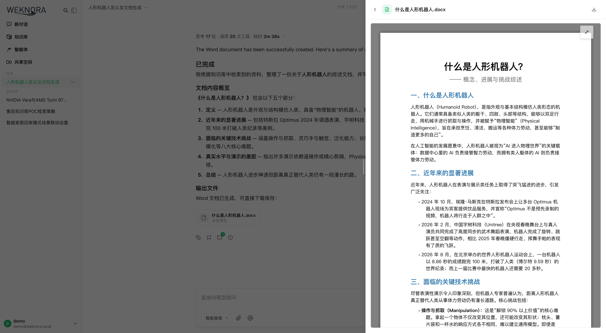
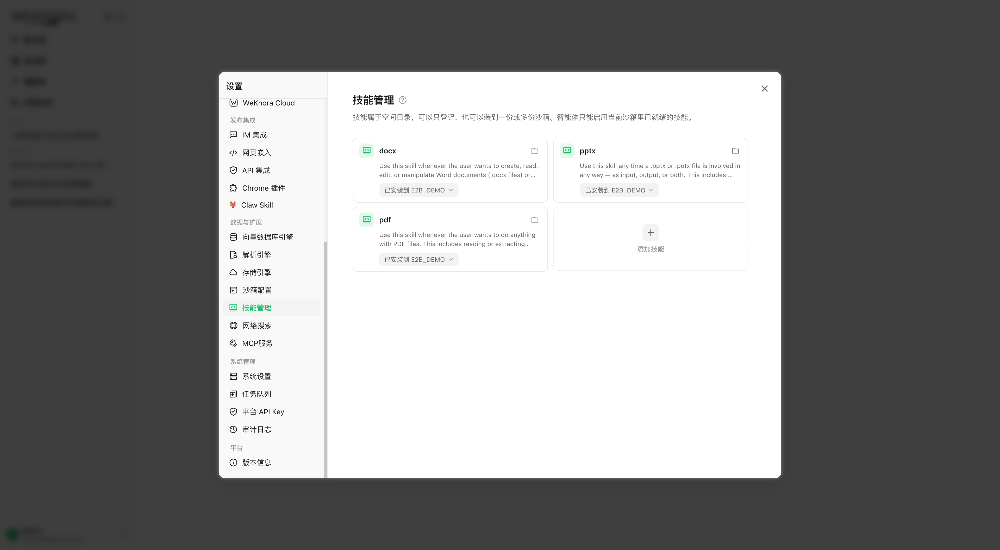

<p align="center">
  <picture>
    
  </picture>
</p>

<p align="center">
  <picture>
    <a href="https://trendshift.io/repositories/15289" target="_blank">
      
    </a>
  </picture>
</p>
<p align="center">
    <a href="https://weknora.weixin.qq.com" target="_blank">
        
    </a>
    <a href="https://chatbot.weixin.qq.com" target="_blank">
        
    </a>
    <a href="https://chromewebstore.google.com/detail/jpemjbopikggjlmikmclgbmkhhopjdgd" target="_blank">
        
    </a>
    <a href="https://clawhub.ai/lyingbug/weknora" target="_blank">
        
    </a>
    <a href="https://www.npmjs.com/package/@wxg-prc-cpg/dsh-weknora" target="_blank">
        
    </a>
    <a href="https://github.com/Tencent/WeKnora/blob/main/LICENSE">
        
    </a>
    <a href="./CHANGELOG.md">
        
    </a>
</p>

<p align="center">
| <a href="./README.md"><b>English</b></a> | <b>简体中文</b> | <a href="./README_JA.md"><b>日本語</b></a> | <a href="./README_KO.md"><b>한국어</b></a> |
</p>

<p align="center">
  <h4 align="center">

  [项目介绍](#-项目介绍) • [架构设计](#-架构设计) • [核心特性](#-核心特性) • [快速开始](#-快速开始) • [文档](#-文档) • [开发指南](#-开发指南)

  </h4>
</p>

# 💡 WeKnora — 让文档活起来：RAG、Agent 推理与自动 Wiki 一体化的知识框架

## 📌 项目介绍

**[WeKnora（维娜拉）](https://weknora.weixin.qq.com)** 是一款开源的、基于大语言模型（LLM）的知识管理框架，专为企业级文档理解、语义检索与智能推理场景打造。

框架围绕三大核心能力构建：**RAG 快速问答**适合日常知识查询，**ReAct Agent 智能推理**自主编排知识检索、MCP 工具、**技能目录**、会话级 **Docker / E2B / Cube 沙箱**与网络搜索完成复杂多步任务，全新的 **Wiki 模式**则让 Agent 从原始文档中自治生成相互链接的 Markdown 知识库与可视化知识图谱，并支持人工编辑、版本历史与一键回滚。**跨会话长期记忆**会记住你是谁、你常问什么。知识加工环节也完全可控：**树形文件夹**保留上传目录结构，**分块编辑与版本历史**让检索片段可以像文档一样被修改、比对与回滚。结合多源数据接入（飞书知识库 / 飞书云盘 / GitLab / 腾讯 IMA / Notion / 语雀 / RSS，更多持续接入中）、**网站嵌入 Widget** 将智能体发布到外部站点、**权限范围 API Key 与 Principal 模型**面向程序化集成、**每空间多实例存储后端**灵活编排数据落地、二十余家主流模型厂商集成（含 LiteLLM）、Langfuse 全链路可观测性与**运行时任务队列面板 + Worker 池治理**、**企业级多空间 RBAC（四级角色矩阵 + 资源归属 + 空间审计日志）**，以及完全可私有化部署的模块化架构，WeKnora 帮助团队把分散文档沉淀为可查询、可推理、可持续演进的专属知识资产。

框架支持从飞书、GitLab、腾讯 IMA、Notion 及语雀等外部平台自动同步知识（更多数据源持续接入中），覆盖 PDF、Word、图片、Excel、XMind 等十余种文档格式，并可通过企业微信、飞书、Slack、Telegram 等 IM 频道直接提供问答服务。模型层面兼容 OpenAI、DeepSeek、Qwen（阿里云）、智谱、混元、Gemini、MiniMax、NVIDIA、LiteLLM、Ollama 等主流厂商。Office 文档可由 **anydoc** 在 Go 进程内解析。全流程模块化设计，大模型、向量数据库、存储等组件均可灵活替换，支持本地与私有云部署，数据完全自主可控。WeKnora 还无缝集成了 **Langfuse**，为 Agent 运行、Token 使用及任务流水线提供了全面的可观测性追踪。

## ✨ 最新更新

- **v0.8.0** —— **技能沙箱运行时**（会话级常驻 Docker / E2B / Cube 后端，按空间配置网络策略；移除 Local 宿主机进程后端；Docker 需显式开启）；**空间技能目录**（从 ClawHub / SkillHub / git / zip 安装，按沙箱快照、实时进度、文件浏览/编辑、个人与空间环境变量）；**跨会话长期记忆**（profile / preference / fact / task / interest，自动抽取需确认，`search_memory`）；进程内 **anydoc** Office 解析；官方 **DeepSeek Harness 插件** `@wxg-prc-cpg/dsh-weknora`；GitLab 与腾讯 IMA 数据源；LiteLLM；Exa 与 Metaso 网络搜索；XMind 解析；对话产物、问题大纲与时间戳；上下文压缩与供应商 Prompt Cache 标记。另有 OIDC JWKS 验签、可选复杂密码、文档自动打标签，以及大范围沙箱/安全加固。详见 [`CHANGELOG.md`](./CHANGELOG.md)。
- **v0.7.2** —— 上线**官方产品文档站**（VitePress，六大板块约 50 篇，覆盖约 360 个 API 端点与约 150 个环境变量，含独立 Docker/Nginx 部署、快速上手样例数据与本地 MCP demo）；**知识库文件夹树**（文件夹路径独立入库，可像文件管理器一样浏览、重命名与重新归档）；**分块编辑与版本历史**（可视化编辑检索分块、逐版本 diff 与回滚、自动重建索引、文档自定义元数据）；**Wiki 页面版本历史**（快照 + 行级 diff + 一键回滚 + 浏览器内手动编辑）；**API 文件直链模式** `resource_urls=public` / `RESOURCE_URL_MODE`（第三方 App 无需二次调用鉴权代理即可加载图片与文件）；**飞书云盘数据源**与 docx blocks 逐类型下钻同步；文档批量打标签；**MCP Server 1.1.x**（迁移到 mcp 2.x 高级 API，官方 PyPI 包 `tencent-weknora-mcp`，新增 `create_knowledge_from_text` 与 `list_shared_knowledge_bases`，共 29 个工具）；AWS S3 默认凭据链（IAM Role / IRSA）；本地 HTML 上传解析；QQBot Markdown 回复；新增 app / frontend / docreader / mcp-server 的 PR CI 检查。另有 router 与 modelcontext 大规模重构、重排与分块质量优化，以及大量稳定性修复。详见 [`CHANGELOG.md`](./CHANGELOG.md)。
- **v0.7.1** —— 新增**云之家 IM 集成**（WebSocket + 图片消息 + Markdown 回复）；**火山引擎 Rerank** 供应商（自动分批请求）与**智谱 AI 网络搜索**供应商；**平台级 API Key**，用于控制面自动化（空间管理、系统设置、运行时队列、审计日志）；**按知识库的活动审计追踪**；FAQ 管理增强（筛选、打标签、导出、导入结果追踪）；**Langfuse OTLP/OTel 追踪**迁移，支持 W3C traceparent 跨服务传播；对话头部操作栏，支持一键 **Markdown 导出**，并在引用抽屉中展示 Wiki 工具结果；Prompt 缓存可观测性；会话渠道治理（IM/嵌入/API 会话按管理员范围隔离）；飞书大型 Wiki 同步韧性增强；移除旧版 Neo4j 会话记忆依赖。另有大范围的 slug 完整性、SSRF 传输与状态同步加固。详见 [`CHANGELOG.md`](./CHANGELOG.md)。
- **v0.7.0** —— 细粒度**权限范围 API Key 与 Principal 模型**（能力级授权 + 按 KB 限制 + API 集成调试台）；**运行时任务队列可观测面板与 Worker 池治理**（分阶段独立池 + 按模型并发治理 + 失败任务排查/重试）；**多实例存储后端**（每空间多存储实例、按 KB 绑定、默认实例）；**会话级临时附件**（图片/文档异步解析 + 合并限额）；推荐问题与追问；稳定资源注册表与 LLM 上下文别名压缩；`@Skill / @MCP` 提及范围化 Agent 运行时；会话内 MCP OAuth 授权；QQBot 与 Lark（飞书国际版）IM 集成；Redis TLS；Requesty 模型厂商 + Keenable 网络搜索；无空间预置与受控自助创建工作区；管理员密码重置；知识库复制流程；`weknora` CLI v0.10。同时完成大范围安全加固（SSRF、密钥脱敏、SQL 校验、越权）。详见 [`CHANGELOG.md`](./CHANGELOG.md)。
- **v0.6.3** —— 网站嵌入 Widget 与发布集成中心（安全模式 Token 交换 + 限流）；对话体验全面革新（引用浮层、RAG 流水线进度、流式 Markdown）；文档多标签与批量重新解析；Wiki 文件夹与层级导航；RSS 数据源；MCP OAuth2；EPUB / MHTML 解析；Agent 模型就绪校验；模型调试器；会话来源筛选；工作区删除 UI。详见 [`CHANGELOG.md`](./CHANGELOG.md)。
- **v0.6.2** —— 按批次解析配置（`process_config`）+ 上传确认对话框；文档重新解析（reparse）支持覆盖配置；`weknora` CLI v0.9（内置 Agent Skills、`session stop`、auth/profile 统一）；知识库框选多选；pgvector 1024 维 HNSW 索引；对话资源 Store 重构；仅保留 Langfuse 追踪（移除 Jaeger）。详见 [`CHANGELOG.md`](./CHANGELOG.md)。
- **v0.6.1** —— 文档解析追踪时间线（Langfuse 风格 Span 树，逐阶段进度展示 + 解析中止）；OpenSearch 向量库驱动；YAML 声明式内置模型配置；系统管理员与统一平台设置 + 审计日志；新用户引导；设置页 UI 重构；`weknora` CLI v0.7 / v0.8（Agent 优先线协议、NDJSON、`--dry-run`）；OpenDataLoader 与 PaddleOCR-VL 解析引擎；MCP Server 多传输（stdio / SSE / HTTP）；按模型的思考模式配置；腾讯云 LKEAP 重排 + 原生 Gemini Embedding + MiniMax-M3。详见 [`CHANGELOG.md`](./CHANGELOG.md)。
- **v0.6.0** —— 空间 RBAC（四级角色矩阵 `Owner` / `Admin` / `Contributor` / `Viewer` + 按 KB 归属 + 每空间审计日志）、空间成员管理与多工作区 UX、自助创建工作区；`weknora` CLI v0.4 正式版 + `mcp serve`；KB 检索跨向量库扇出；MCP / 数据源凭据 AES-256-GCM 加密 + docreader gRPC TLS + Token；新增智谱 Embedding 与华为云 OBS；服务端用户偏好；Go 1.26.0。详见 [`docs/RBAC说明.md`](./docs/RBAC说明.md) 与 [`CHANGELOG.md`](./CHANGELOG.md)。
- **v0.5.2** —— Wiki 入库支撑万级文档知识库（任务队列 + 死信队列）；MCP 工具人机审批；Anthropic / Apache Doris / 腾讯云 VectorDB / 金山云 KS3 / SearXNG 后端；自适应三层分块 + 实时调试面板；全局 ⌘K 命令面板；语雀连接器 + 微信小程序；`weknora` CLI 早期版本。
- **v0.5.1** —— 知识库批量管理；空间级 IM 频道总览；会话搜索 + 用户级置顶；模型 / 网页搜索 / MCP 统一卡片化设置；按 Agent LLM 调用超时；桌面端空间切换。
- **v0.5.0** —— Wiki 模式正式版 —— Agent 从原始文档自治生成结构化、相互链接的 Markdown Wiki 页面及知识图谱；Wiki 浏览器 + 可视化图谱。
- **v0.4.0** —— WeKnora Cloud（托管模型 + 解析）；Chrome 插件；ClawHub Skill；微信 IM；附件处理；Azure OpenAI / 阿里云 OSS；Notion 连接器；百度 + Ollama 网页搜索；VectorStore 管理。
- **v0.3.6** —— ASR 语音；飞书数据源自动同步；OIDC；IM 引用回复 + 线程会话；文档自动摘要；Tavily 搜索；并行工具调用；Agent @提及范围限制。
- **v0.3.5** —— Telegram / 钉钉 / Mattermost IM；IM 斜杠命令 + QA 队列；推荐问题；VLM 自动描述 MCP 返回图片；Novita AI；来源频道标记。
- **v0.3.4** —— 企业微信 / 飞书 / Slack IM；多模态图片；NVIDIA 模型 API；Weaviate；AWS S3；AES-256-GCM API Key 加密；内置 MCP 服务；混合检索优化；`final_answer` 工具。
- **v0.3.3** —— 父子分块；知识库置顶；兜底回复；Rerank 段落清洗；存储桶自动创建；Milvus。
- **v0.3.2** —— 知识搜索入口；按来源配置解析与存储引擎；本地存储图片渲染；文档预览；火山引擎 TOS；Mermaid 渲染；对话批量管理；记忆图谱预览。
- **v0.3.0** —— 共享空间；Agent Skills + 沙盒执行；自定义 Agent；数据分析 Agent；思考模式；Bing / Google 搜索；API Key 认证；Helm Chart；韩语 i18n；Qdrant。
- **v0.2.0** —— Agent 模式（ReACT）；多类型知识库（FAQ + 文档）；对话策略配置；DuckDuckGo 网页搜索；MCP 工具集成；全新 UI + Agent 模式切换；MQ 异步任务管理。


## 📱 功能展示

<table>
  <tr>
    <td colspan="2" align="center"><b>🛠️ 沙箱技能对话 · 生成并预览 Word</b><br/></td>
  </tr>
  <tr>
    <td width="50%" align="center"><b>📦 技能目录 · 安装到 E2B 沙箱</b><br/></td>
    <td width="50%" align="center"><b>🤖 Agent 模式 · 检索、读技能、写入沙箱文件</b><br/></td>
  </tr>
  <tr>
    <td colspan="2" align="center"><b>💬 智能问答对话</b><br/></td>
  </tr>
  <tr>
    <td width="50%" align="center"><b>📖 Wiki 浏览器</b><br/></td>
    <td width="50%" align="center"><b>🕸️ Wiki 知识图谱</b><br/></td>
  </tr>
  <tr>
    <td width="50%" align="center"><b>🕘 Wiki 页面版本历史与回滚</b><br/></td>
    <td width="50%" align="center"><b>✂️ 分块编辑与版本历史</b><br/></td>
  </tr>
  <tr>
    <td width="50%" align="center"><b>📁 文件夹树与批量操作</b><br/></td>
    <td width="50%" align="center"><b>🔭 监控可观测性 · Langfuse Tracing</b><br/></td>
  </tr>
</table>

## 🏗️ 架构设计


从文档解析、向量化、检索到大模型推理，全流程模块化解耦，组件可灵活替换与扩展。支持本地 / 私有云部署，数据完全自主可控，零门槛 Web UI 快速上手。

## 🧩 功能概览

**智能对话**

| 能力 | 详情 |
|------|------|
| 智能推理 | ReACT 渐进式多步推理，自主编排知识检索、MCP 工具、技能沙箱与网络搜索 |
| 快速问答 | 基于知识库的 RAG 问答，快速准确地回答问题 |
| Wiki 模式 | Agent 驱动从原始文档中自动生成并维护结构化、相互链接的 Markdown Wiki 知识页面；支持浏览器内人工编辑、页面版本历史、行级 diff 与一键回滚 |
| 技能目录与沙箱 | 空间技能目录（ClawHub / SkillHub / git / zip）安装到会话级 Docker / E2B / Cube 沙箱；`shell_exec`、文件工具、产物收集、按配置网络策略；已移除 Local 宿主机进程后端 |
| 长期记忆 | 跨会话记忆（profile / preference / fact / task / interest），支持自动抽取、用户确认与按需 `search_memory` |
| 工具调用 | 内置工具、MCP 工具（含 OAuth2 远程服务、会话内 OAuth 授权）、网络搜索；支持 `@Skill / @MCP` 提及以按轮次范围化 Agent 运行时 |
| 对话策略 | 在线 Prompt 编辑、检索阈值调节、多轮上下文感知、按 Agent 引用输出开关 |
| 推荐问题 | 基于知识库内容自动生成推荐问题与答后追问 |
| 临时附件 | 会话级临时上传图片 / 文档，异步解析后用于一次性问答，支持图片与附件合并限额 |
| 引用与 RAG 进度 | 对话内引用浮层与引用抽屉（区分网络 / 知识库来源）、统一 Markdown 渲染、RAG 流水线分阶段进度展示 |
| 会话管理 | 侧边栏按来源（Web / IM / 嵌入）筛选与分组会话，支持会话标题内联重命名 |

**知识管理**

| 能力 | 详情 |
|------|------|
| 知识库类型 | FAQ / 文档 / Wiki，支持文件夹导入、URL 导入、多标签管理、在线录入 |
| 文件夹树 | 文件夹上传保留原始目录结构，侧栏树形浏览、重命名文件夹、把文档重新归档到其他文件夹 |
| 分块编辑与版本历史 | 在界面直接编辑检索分块，保留逐版本快照，支持 diff 与一键回滚，编辑后自动重建索引；生成问题可增删改与重新生成；支持文档自定义元数据 |
| 按批次解析配置 | 上传确认对话框或 `process_config` API 覆盖解析引擎、分块、多模态（VLM / ASR）、图谱抽取与问题生成；支持 reparse 时调整配置 |
| 批量重新解析 | 一次为多篇文档重新排队解析，可携带批次级 `process_config` |
| 数据源导入 | 飞书知识库 / 飞书云盘 / Lark / GitLab / 腾讯 IMA / Notion / 语雀 / RSS 订阅自动同步（更多数据源开发中），支持增量与全量同步 |
| 文档格式 | PDF / Word / Txt / Markdown / HTML / EPUB / MHTML / 图片 / CSV / Excel / PPT / JSON / XMind |
| 自动打标签 | 解析完成后从知识库已有标签中选择匹配项增量关联，不创建新标签、不覆盖人工标签 |
| 检索策略 | BM25 稀疏召回 / Dense 稠密召回 / GraphRAG 图谱增强 / 父子分块 / pgvector HNSW 加速（1024 维）/ 多维度索引 |
| 批量选择与打标签 | 知识库文档列表支持框选（marquee）多选，可批量重新解析、批量打标签（自动预选公共标签） |
| 端到端测试 | 检索+生成全链路可视化，评估召回命中率、BLEU / ROUGE 等指标 |

**集成与扩展**

| 能力 | 详情 |
|------|------|
| 模型厂商 | OpenAI / Azure OpenAI / Anthropic（Claude）/ DeepSeek / Qwen（阿里云）/ 智谱 / 混元 / 豆包（火山引擎）/ Gemini / MiniMax / NVIDIA / Novita AI / SiliconFlow / OpenRouter / Requesty / LiteLLM / Ollama |
| 向量数据库 | PostgreSQL (pgvector) / Elasticsearch / OpenSearch / Milvus / Weaviate / Qdrant / Apache Doris / 腾讯云 VectorDB |
| Embedding | Ollama / BGE / GTE / 智谱 / OpenAI 兼容接口 |
| 对象存储 | 本地 / 腾讯云COS / 火山引擎 TOS / MinIO / AWS S3（支持 IAM Role / IRSA 默认凭据链）/ 阿里云 OSS / 金山云 KS3 / 华为云 OBS；支持**每空间多实例存储后端**，不同知识库可绑定不同实例并设置默认实例 |
| IM 集成 | 企业微信 / 飞书 / Lark（飞书国际版）/ QQBot / Slack / Telegram / 钉钉 / Mattermost / 微信 / 云之家 |
| 网站嵌入 | 通过嵌入 Widget 发布智能体，支持域名白名单、限流与安全模式 Token 交换 |
| 网络搜索 | DuckDuckGo / Bing / Google / Tavily / Baidu / Ollama / SearXNG / Keenable / 智谱 AI / Exa / Metaso |
| API 集成 | 权限范围 API Key（能力级授权 + 按 KB 限制 + 节流的 last_used 追踪）与 API 集成调试台；MCP OAuth 与嵌入会话按 Principal 隔离；`resource_urls=public` 直接返回可加载的文件/图片直链，免去二次鉴权代理调用 |
| MCP Server | 官方 PyPI 包 `tencent-weknora-mcp`，29 个工具，支持 stdio / SSE / HTTP 三种传输 |


**平台能力**

| 能力 | 详情 |
|------|------|
| 部署 | 本地 / Docker / Kubernetes (Helm)，支持私有化离线部署 |
| 界面 | Web UI / RESTful API / 命令行（`weknora`）/ Chrome Extension / 网站嵌入 Widget / 微信小程序 |
| 权限控制 | 空间 RBAC 四级角色矩阵（Owner / Admin / Contributor / Viewer），按知识库的资源归属，每空间审计日志，invite-only 准入，无空间预置与受控自助创建工作区，管理员密码重置（会话吊销），跨空间超级管理员，权限范围 API Key |
| 安全 | API Key 与 MCP / 数据源凭据 AES-256-GCM 静态加密、支持平滑密钥轮换；app ↔ docreader gRPC TLS + Token；Redis TLS；防 SSRF HTTP 客户端（覆盖数据源、URL 导入、重定向链等）；密钥响应脱敏；技能沙箱隔离（Docker 需开启 / E2B / Cube）与按配置网络策略；OIDC ID Token JWKS 验签；可选复杂密码策略 |
| 可观测性 | 集成 Langfuse（唯一追踪后端）以追踪 ReAct 循环、Token 消耗、工具调用和任务流水线；内置 Langfuse 风格的文档解析追踪时间线，逐阶段展示解析进度；系统管理员运行时任务队列面板（队列深度、按模型并发、失败任务排查与手动重试） |
| 任务管理 | MQ 异步任务，分阶段独立 Worker 池治理（core / 后处理 / enrichment / maintenance + 弹性共享池，Wiki 独立池）与按模型后台并发治理；版本升级自动数据库迁移 |
| 模型管理 | 集中配置，YAML 声明式内置模型配置，知识库级别模型选择，按模型思考模式与 Embedding 维度覆盖，交互式模型调试器，多空间共享内置模型，WeKnora Cloud 托管模型与文档解析 |

## 🧩 Chrome 插件

[**WeKnora Chrome 插件**](https://chromewebstore.google.com/detail/jpemjbopikggjlmikmclgbmkhhopjdgd)支持在浏览器中直接将网页内容采集到 WeKnora 知识库。选中文本、图片或整个页面，一键保存为知识条目，无需复制粘贴或手动上传文件。


## 📱 微信小程序

[**WeKnora 微信小程序**](./miniprogram/README.md) 提供轻量移动端客户端，支持配置 WeKnora API、选择知识库、导入 URL，并在微信内向知识库提问。


## 🦞 ClawHub Skill

[**WeKnora ClawHub Skill**](https://clawhub.ai/lyingbug/weknora) 是 WeKnora 发布在 ClawHub 平台上的技能。安装后，可通过 WeKnora REST API 上传文档（文件 / URL / Markdown）、执行混合检索（向量 + 关键词）以及管理知识条目。

- **文档导入** — 通过 Agent 上传文件、导入网页或写入 Markdown 知识
- **混合检索** — 在单个或多个知识库中进行向量 + 关键词混合搜索
- **知识管理** — 以编程方式浏览、编辑和删除知识条目

## 🐋 DeepSeek Harness 插件

[**`@wxg-prc-cpg/dsh-weknora`**](https://www.npmjs.com/package/@wxg-prc-cpg/dsh-weknora) 是官方的 [DeepSeek Harness](https://github.com/deepseek-ai/deepseek-harness)（`dsh`）插件（[说明](./packages/dsh-weknora/README_CN.md)）。harness 自身不带任何检索、向量或知识库能力，这个插件把你的文档接进编码 Agent：`dsh plugin --profile web add @wxg-prc-cpg/dsh-weknora`，指向一个部署，Agent 的工具集里就会出现四个只读工具。

- **`weknora_search`** — 混合检索，返回原文片段，每条都带可复用的 `knowledge_id`
- **`weknora_read_document`** — 把单个文档的分块按序拼回正文，支持翻页
- **`weknora_ask`** — WeKnora 自己带引用的成稿答案，走 RAG 或 ReAct 流水线
- **`weknora_list_knowledge_bases`** — 知识库名称与 id，便于 Agent 自己缩小检索范围

## 🚀 快速开始

### 🛠 环境要求

- [Docker](https://www.docker.com/) & [Docker Compose](https://docs.docker.com/compose/)
- [Git](https://git-scm.com/)

### 📦 安装与启动

```bash
git clone https://github.com/Tencent/WeKnora.git
cd WeKnora
cp .env.example .env   # 按需编辑 .env，详见文件内注释
docker compose pull     # 拉取最新镜像
docker compose up -d    # 启动核心服务
```

启动成功后访问 **http://localhost** 即可使用。

> 如需使用本地 Ollama 模型，请先运行 `ollama serve > /dev/null 2>&1 &`

### 🔄 版本升级

若已有部署并下载了更新的 release：

```bash
# 在 .env 中将 WEKNORA_VERSION 设为目标版本（如 0.7.0），或保持 latest
docker compose pull     # 拉取与 WEKNORA_VERSION 匹配的镜像
docker compose up -d    # 用新镜像重建容器
```

> 仅执行 `docker compose up -d` 会复用本地缓存镜像，可能导致 Web UI 显示版本与下载的 release 不一致。

### 🔧 可选服务（Docker Compose Profile）

按需添加 `--profile` 启动额外组件，多个 profile 可叠加使用：

| Profile | 说明 | 启动命令 |
|---------|------|----------|
| _(默认)_ | 核心服务 | `docker compose pull && docker compose up -d` |
| `full` | 全部功能 | `docker compose --profile full pull && docker compose --profile full up -d` |
| `neo4j` | 知识图谱 (Neo4j) | `docker compose --profile neo4j pull && docker compose --profile neo4j up -d` |
| `minio` | 对象存储 (MinIO) | `docker compose --profile minio pull && docker compose --profile minio up -d` |
| `langfuse` | 链路追踪 (Langfuse) | `docker compose --profile langfuse pull && docker compose --profile langfuse up -d` |

组合示例：`docker compose --profile neo4j --profile minio pull && docker compose --profile neo4j --profile minio up -d`

停止服务：`docker compose down`

### 🌐 服务地址

| 服务 | 地址 |
|------|------|
| Web UI | `http://localhost` |
| 后端 API | `http://localhost:8080` |
| 链路追踪 (Langfuse) | `http://localhost:3000` |

## 文档知识图谱

WeKnora 支持将文档转化为知识图谱，展示文档中不同段落之间的关联关系。开启知识图谱功能后，系统会分析并构建文档内部的语义关联网络，不仅帮助用户理解文档内容，还为索引和检索提供结构化支撑，提升检索结果的相关性和广度。

具体配置请参考 [知识图谱配置说明](./docs/KnowledgeGraph.md) 进行相关配置。

## 配套MCP服务器

请参考 [MCP配置说明](./mcp-server/MCP_CONFIG.md) 进行相关配置。

## 🔌 使用微信对话开放平台

WeKnora 作为[微信对话开放平台](https://chatbot.weixin.qq.com)的核心技术框架，提供更简便的使用方式：

- **零代码部署**：只需上传知识，即可在微信生态中快速部署智能问答服务，实现"即问即答"的体验
- **高效问题管理**：支持高频问题的独立分类管理，提供丰富的数据工具，确保回答精准可靠且易于维护
- **微信生态覆盖**：通过微信对话开放平台，WeKnora 的智能问答能力可无缝集成到公众号、小程序等微信场景中，提升用户交互体验


## 📘 文档

**官方产品文档**：[`website-docs/`](./website-docs/README.md) —— 按「入门 → 架构 → 功能 → API → 客户端 → 开发」六个板块组织的完整文档，覆盖约 360 个 API 端点、约 150 个环境变量与 9 大扩展点。本目录同时是一个 VitePress 站点，`cd website-docs && npm install && npm run dev` 即可本地预览，也可用目录内的 `Dockerfile` 独立部署。

常见问题排查：[常见问题排查](./docs/QA.md)

详细接口说明请参考：[API 文档](./docs/api/README.md)

产品规划与计划：[路线图 (Roadmap)](./docs/ROADMAP.md)

## 🧭 开发指南

### ⚡ 快速开发模式（推荐）

如果你需要频繁修改代码，**不需要每次重新构建 Docker 镜像**！使用快速开发模式：

```bash
# 启动基础设施
make dev-start

# 启动后端（新终端）
make dev-app

# 启动前端（新终端）
make dev-frontend
```

**开发优势：**

- ✅ 前端修改自动热重载（无需重启）
- ✅ 后端修改快速重启（5-10秒，支持 Air 热重载）
- ✅ 无需重新构建 Docker 镜像
- ✅ 支持 IDE 断点调试

**详细文档：** [开发环境快速入门](./docs/开发指南.md)


## 🤝 贡献指南

欢迎通过 [Issue](https://github.com/Tencent/WeKnora/issues) 反馈问题或提交 Pull Request。

**流程：** Fork → 新建分支 → 提交更改 → 创建 PR

**规范：** 使用 `gofmt` 格式化代码，遵循 [Conventional Commits](https://www.conventionalcommits.org/) 提交（`feat:` / `fix:` / `docs:` / `test:` / `refactor:`）

### 验证方式

对于范围集中的 PR，优先验证本次改动涉及的文件和包：

```bash
git fetch origin main
git diff --check origin/main...HEAD
golangci-lint run --new-from-rev=origin/main ./...
go test ./path/to/changed/package -count=1
```

提交前请对改动过的 Go 文件运行 `gofmt`。对于前端改动，请在 `frontend/` 目录运行相关测试；如果改动涉及 TypeScript 或 Vue 组件，还应运行 `npm run type-check`。

维护者使用的全仓验证命令仍然是：

```bash
make fmt
make lint
make test
```

`make fmt` 会格式化整个 Go 仓库，因此请仅在工作区干净时运行，并检查产生的 diff。部分全量测试依赖本地基础设施或服务配置。如果全仓检查因无关的基线问题或环境依赖失败，请在 PR 中写明具体命令和错误，同时提供本次改动范围内通过的定向测试。

## 🔒 安全声明

**重要提示：** 从 v0.1.3 版本开始，WeKnora 提供了登录鉴权功能，以增强系统安全性。在生产环境部署时，我们强烈建议：

- 将 WeKnora 服务部署在内网/私有网络环境中，而非公网环境
- 避免将服务直接暴露在公网上，以防止重要信息泄露风险
- 为部署环境配置适当的防火墙规则和访问控制
- 定期更新到最新版本以获取安全补丁和改进

## 👥 贡献者

感谢以下优秀的贡献者们：

[](https://github.com/Tencent/WeKnora/graphs/contributors)

## 📄 许可证

本项目基于 [MIT](./LICENSE) 协议发布。
你可以自由使用、修改和分发本项目代码，但需保留原始版权声明。
