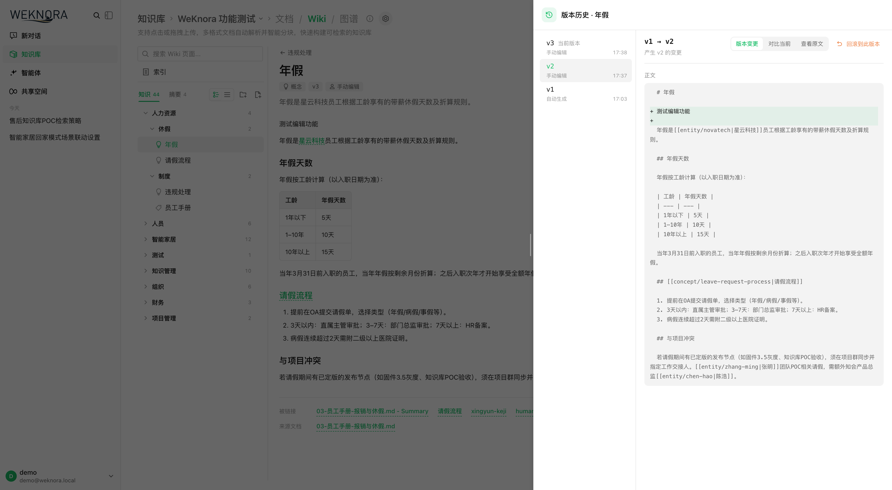
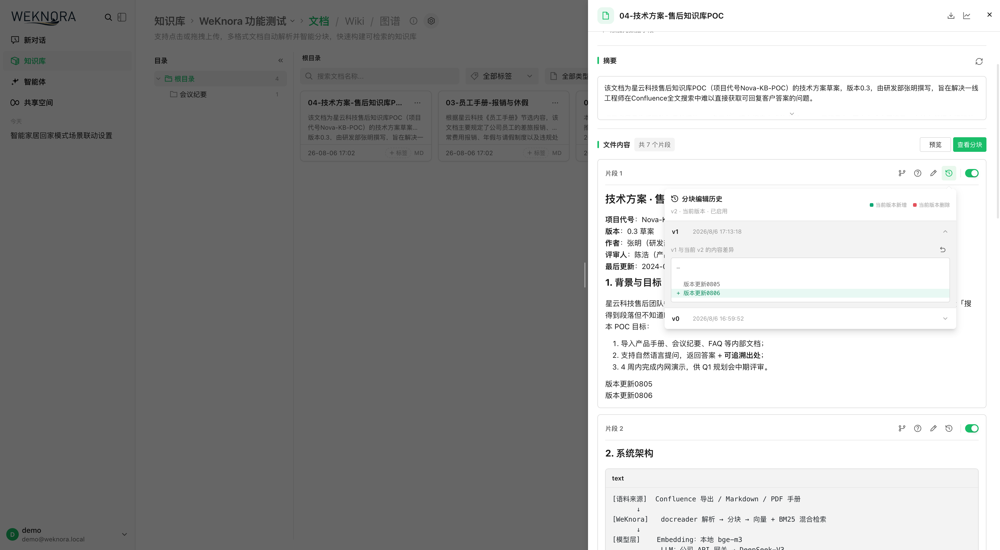
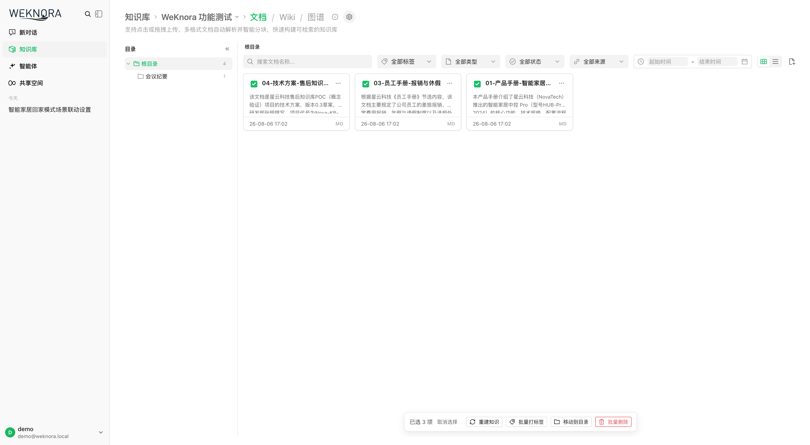
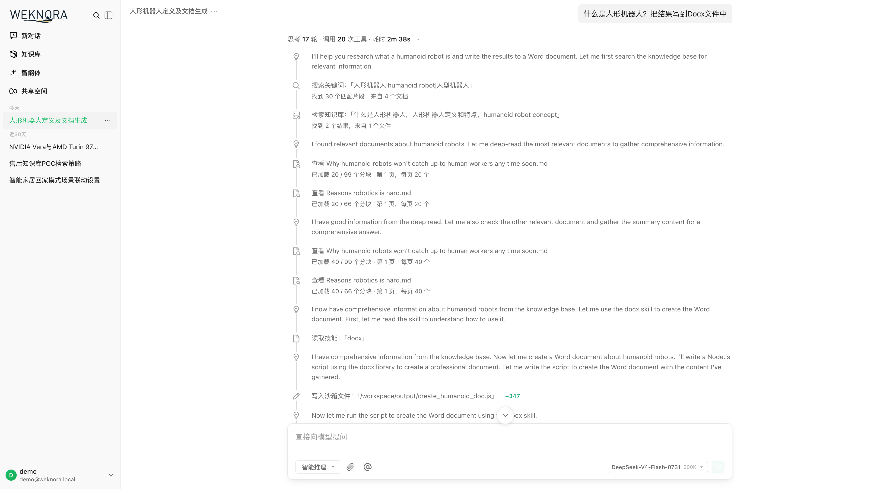
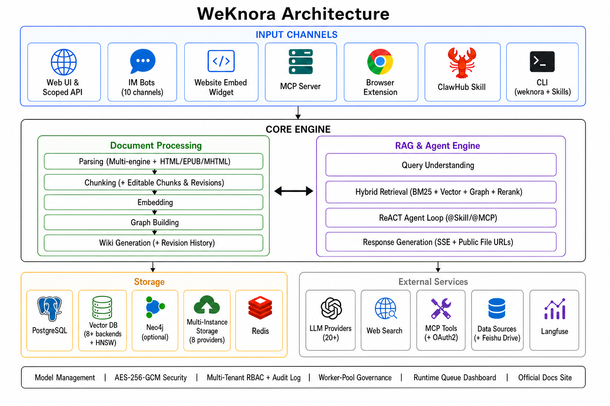

<p align="center">
  <picture>
    
  </picture>
</p>

<p align="center">
  <picture>
    <a href="https://trendshift.io/repositories/15289" target="_blank">
      
    </a>
  </picture>
</p>
<p align="center">
    <a href="https://weknora.weixin.qq.com" target="_blank">
        
    </a>
    <a href="https://chatbot.weixin.qq.com" target="_blank">
        
    </a>
    <a href="https://chromewebstore.google.com/detail/jpemjbopikggjlmikmclgbmkhhopjdgd" target="_blank">
        
    </a>
    <a href="https://clawhub.ai/lyingbug/weknora" target="_blank">
        
    </a>
    <a href="https://github.com/Tencent/WeKnora/blob/main/LICENSE">
        
    </a>
    <a href="./CHANGELOG.md">
        
    </a>
</p>

<p align="center">
| <a href="./README.md"><b>English</b></a> | <a href="./README_CN.md"><b>简体中文</b></a> | <a href="./README_JA.md"><b>日本語</b></a> | <b>한국어</b> |
</p>

<p align="center">
  <h4 align="center">

  [개요](#-개요) • [아키텍처](#️-아키텍처) • [핵심 기능](#-핵심-기능) • [시작하기](#-시작하기) • [API 레퍼런스](#-api-레퍼런스) • [개발자 가이드](#-개발자-가이드)

  </h4>
</p>

# 💡 WeKnora — 문서를 살아있는 지식으로: RAG · Agent 추론 · 자동 Wiki 통합 LLM 지식 프레임워크

## 📌 개요

[**WeKnora**](https://weknora.weixin.qq.com)는 엔터프라이즈급 문서 이해, 시맨틱 검색, 자율 추론 시나리오를 위해 설계된 오픈소스 LLM 기반 지식 프레임워크입니다.

본 프레임워크는 **세 가지 핵심 역량**을 중심으로 구성됩니다. 일상 검색에 최적화된 **RAG 기반 빠른 Q&A**, 지식 검색·MCP 도구·웹 검색을 자율적으로 오케스트레이션하여 복잡한 다단계 작업을 처리하는 **ReAct Agent 추론**, 그리고 Agent가 원본 문서에서 상호 연결된 마크다운 지식베이스와 인터랙티브 지식 그래프를 스스로 생성·유지하는 완전히 새로운 **Wiki 모드**(수동 편집·버전 이력·원클릭 롤백 지원)입니다. 지식 가공 과정도 세밀하게 제어할 수 있습니다. **트리형 폴더**가 업로드 시의 디렉터리 구조를 그대로 유지하고, **청크 편집 및 버전 이력**을 통해 검색 청크를 문서처럼 수정·비교·롤백할 수 있습니다. 다양한 데이터 소스 연동(Feishu 지식베이스 / Feishu 클라우드 드라이브 / Notion / Yuque / RSS, 지속 확장 중), **웹사이트 임베드 Widget**으로 외부 사이트에 에이전트 게시, 프로그램 연동을 위한 **범위 지정 API 키 및 Principal 모델**, 워크스페이스별 **다중 인스턴스 스토리지 백엔드**, 20개 이상의 LLM 프로바이더 통합, Langfuse 기반 풀스택 관측 가능성과 **런타임 작업 큐 대시보드 + Worker 풀 거버넌스**, **엔터프라이즈 멀티 테넌트 RBAC(4단계 역할 매트릭스 + 리소스 소유권 + 테넌트 감사 로그)**, 완전 셀프호스팅이 가능한 모듈형 아키텍처를 결합하여, WeKnora는 흩어진 문서를 검색·추론 가능하며 지속적으로 진화하는 전용 지식 자산으로 탈바꿈시킵니다.

Feishu, Notion, Yuque 등 외부 플랫폼에서 지식 자동 동기화를 지원하며(추가 데이터 소스 개발 중), PDF, Word, 이미지, Excel 등 10가지 이상의 문서 포맷을 처리합니다. WeChat Work, Feishu, Slack, Telegram 등의 IM 채널을 통해 Q&A 서비스를 직접 제공할 수 있습니다. 모델 레이어에서 OpenAI, DeepSeek, Qwen(Alibaba Cloud), Zhipu, Hunyuan, Gemini, MiniMax, NVIDIA, Ollama 등 주요 프로바이더를 지원합니다. 전체 프로세스가 모듈화 설계되어 LLM, 벡터 DB, 스토리지 등 구성 요소를 유연하게 교체 가능하며, 로컬 및 프라이빗 클라우드 배포를 지원하여 데이터 완전 자체 관리가 가능합니다. 또한 WeKnora는 **Langfuse**와 원활하게 통합되어 Agent 추론, 토큰 사용량 및 파이프라인에 대한 포괄적인 관측 가능성(Observability)을 제공합니다.

## ✨ 최신 업데이트

- **v0.7.2** — **공식 제품 문서 사이트** 공개(VitePress, 6개 섹션 약 50편으로 약 360개 API 엔드포인트와 약 150개 환경 변수를 다루며, 독립 Docker/Nginx 배포·빠른 시작 샘플 데이터·로컬 MCP 데모 포함); **지식베이스 폴더 트리**(업로드 경로를 독립 데이터로 저장하여 파일 관리자처럼 탐색·이름 변경·문서 재배치); **청크 편집 및 버전 이력**(UI에서 검색 청크 직접 편집, 버전별 diff와 롤백, 편집 후 인덱스 자동 재구축, 문서 커스텀 메타데이터); **Wiki 페이지 버전 이력**(스냅샷 + 라인 단위 diff + 원클릭 롤백 + 브라우저 내 수동 편집); **파일 직접 링크 모드** `resource_urls=public` / `RESOURCE_URL_MODE`(서드파티 앱이 인증 프록시를 다시 호출하지 않고 이미지와 파일을 렌더링); **Feishu 클라우드 드라이브 데이터 소스** 및 docx blocks API 동기화; 문서 일괄 태깅; **MCP Server 1.1.x**(mcp 2.x 고수준 API로 마이그레이션, 공식 PyPI 패키지 `tencent-weknora-mcp`, `create_knowledge_from_text`와 `list_shared_knowledge_bases` 추가로 총 29개 도구); AWS S3 기본 자격 증명 체인(IAM Role / IRSA); 로컬 HTML 업로드 파싱; QQBot Markdown 응답; app / frontend / docreader / mcp-server PR CI 검사 추가. 또한 router와 `modelcontext` 대규모 리팩터링, 리랭크·청킹 품질 개선 및 광범위한 안정성 수정. 자세한 내용은 [`CHANGELOG.md`](./CHANGELOG.md).
- **v0.7.1** — 새로운 **Yunzhijia(云之家) IM 통합**(WebSocket + 이미지 메시지 + Markdown 응답); **Volcengine Rerank** 제공자(요청 자동 분할)와 **Zhipu AI 웹 검색** 제공자; 컨트롤 플레인 자동화를 위한 **플랫폼 범위 API 키**(테넌트 관리, 시스템 설정, 런타임 큐, 감사 로그); **KB 단위 활동 감사 추적**; FAQ 관리 강화(필터링, 태깅, 내보내기, 가져오기 결과 추적); **Langfuse OTLP/OTel 트레이싱** 마이그레이션 및 W3C traceparent 전파; 채팅 헤더 액션을 통한 원클릭 **Markdown 내보내기** 및 참조 드로어의 Wiki 도구 결과 표시; 프롬프트 캐시 가시성; 세션 채널 거버넌스(IM/임베드/API 세션을 관리자 범위로 분리); Feishu 대규모 Wiki 동기화 견고화; 레거시 Neo4j 대화 메모리 의존성 제거. 또한 광범위한 slug 무결성, SSRF 전송, 상태 동기화 강화. 자세한 내용은 [`CHANGELOG.md`](./CHANGELOG.md).
- **v0.7.0** — 세분화된 **범위 지정 API 키 및 Principal 모델**(능력 단위 권한 + KB 단위 제한 + API 통합 플레이그라운드); **런타임 작업 큐 가시성 대시보드 및 Worker 풀 거버넌스**(단계별 풀 + 모델별 동시성 거버너 + 실패 작업 조사/재시도); **다중 인스턴스 스토리지 백엔드**(워크스페이스당 여러 스토리지 인스턴스, KB 단위 바인딩, 기본 인스턴스); **세션 범위 임시 첨부**(이미지/문서 비동기 파싱 + 통합 한도); 추천 질문 및 후속 질문; 안정적인 리소스 레지스트리 및 LLM 컨텍스트 별칭 압축; `@Skill / @MCP` 멘션 기반 범위 지정 Agent 런타임; 대화 중 MCP OAuth; QQBot 및 Lark(Feishu 국제판) IM 통합; Redis TLS; Requesty 모델 제공자 + Keenable 웹 검색; 테넌트리스 프로비저닝 및 제어된 셀프서비스 워크스페이스; 관리자 비밀번호 재설정; 지식 베이스 복제 플로우; `weknora` CLI v0.10. 또한 대규모 보안 강화(SSRF, 비밀 마스킹, SQL 검증, IDOR). 자세한 내용은 [`CHANGELOG.md`](./CHANGELOG.md).
- **v0.6.3** — 웹사이트 임베드 Widget 및 통합 센터(보안 모드 Token 교환 + 속도 제한); 채팅 경험 전면 개편(인용 팝오버, RAG 파이프라인 진행, 스트리밍 Markdown); 문서 다중 태그 및 일괄 reparse; Wiki 폴더 및 계층 탐색; RSS 데이터 소스; MCP OAuth2; EPUB / MHTML 파싱; Agent 모델 준비 상태 검사; 모델 디버거; 세션 소스 필터; 워크스페이스 삭제 UI. 자세한 내용은 [`CHANGELOG.md`](./CHANGELOG.md).
- **v0.6.2** — 업로드 단위 파싱 설정(`process_config`) + 업로드 확인 대화상자; reparse 시 설정 덮어쓰기; `weknora` CLI v0.9(번들 Agent Skills, `session stop`, auth/profile 통합); KB 마키 선택 다중 선택; pgvector 1024차원 HNSW 인덱스; 채팅 리소스 Store 리팩터; Langfuse 단일 추적(Jaeger 제거). 자세한 내용은 [`CHANGELOG.md`](./CHANGELOG.md).
- **v0.6.1** — 문서 파싱 추적 타임라인(Langfuse 스타일 Span 트리, 단계별 진행 표시 + 파싱 중단); OpenSearch 벡터 저장소 드라이버; YAML 선언형 내장 모델 구성; 시스템 관리자와 통합 플랫폼 설정 + 감사 로그; 신규 사용자 온보딩 가이드; 설정 UI 리디자인; `weknora` CLI v0.7 / v0.8(Agent 우선 와이어 프로토콜, NDJSON, `--dry-run`); OpenDataLoader 및 PaddleOCR-VL 파싱 엔진; MCP 서버 멀티 트랜스포트(stdio / SSE / HTTP); 모델별 사고 모드 설정; Tencent LKEAP 리랭크 + 네이티브 Gemini 임베딩 + MiniMax-M3. 자세한 내용은 [`CHANGELOG.md`](./CHANGELOG.md) 참고.
- **v0.6.0** — 테넌트 RBAC(4단계 역할 매트릭스 `Owner` / `Admin` / `Contributor` / `Viewer` + KB 단위 소유 + 테넌트별 감사 로그), 테넌트 멤버 관리와 멀티 워크스페이스 UX, 셀프 서비스 워크스페이스 생성; `weknora` CLI v0.4 GA + `mcp serve`; 여러 벡터 저장소에 걸친 KB 검색 팬아웃; MCP / 데이터 소스 자격 증명 AES-256-GCM 암호화 + docreader gRPC TLS + Token; Zhipu 임베더와 화웨이 클라우드 OBS 추가; 서버 사이드 사용자 환경설정; Go 1.26.0. 자세한 내용은 [`docs/RBAC说明.md`](./docs/RBAC说明.md)과 [`CHANGELOG.md`](./CHANGELOG.md) 참고.
- **v0.5.2** — Wiki 인제스트가 만 건 규모 KB 지원(작업 큐 + DLQ); MCP 휴먼인더루프 도구 승인; Anthropic / Apache Doris / Tencent VectorDB / Kingsoft Cloud KS3 / SearXNG 백엔드; 적응형 3단계 청킹 + 라이브 미리보기; 글로벌 ⌘K 명령 팔레트; Yuque 커넥터 + WeChat 미니프로그램; `weknora` CLI 프리뷰.
- **v0.5.1** — 지식베이스 일괄 관리; 테넌트 전체 IM 채널 개요; 세션 검색 + 사용자 단위 핀; 모델 / 웹 검색 / MCP 통일 카드 설정; Agent별 LLM 타임아웃; 데스크탑 테넌트 전환.
- **v0.5.0** — Wiki 모드 GA — Agent가 원본 문서에서 구조화·상호 연결된 Markdown Wiki 페이지와 지식 그래프 자동 생성, Wiki 브라우저 및 시각화 그래프를 UI에 탑재.
- **v0.4.0** — WeKnora Cloud(호스팅 LLM + 파싱); Chrome 확장 프로그램; ClawHub Skill; WeChat IM; 첨부 처리; Azure OpenAI / Alibaba OSS; Notion 커넥터; Baidu + Ollama 웹 검색; VectorStore 관리.
- **v0.3.6** — ASR(음성); Feishu 데이터 소스 자동 동기화; OIDC; IM 인용 회신 + 스레드 기반 세션; 문서 자동 요약; Tavily 검색; 병렬 도구 호출; Agent @멘션 범위 제한.
- **v0.3.5** — Telegram / DingTalk / Mattermost IM; IM 슬래시 커맨드 + QA 큐; 추천 질문; VLM에 의한 MCP 도구 이미지 자동 설명; Novita AI; 채널 추적.
- **v0.3.4** — 기업 WeChat / Feishu / Slack IM; 멀티모달 이미지; NVIDIA 모델 API; Weaviate; AWS S3; AES-256-GCM API 키 암호화; 내장 MCP 서비스; 하이브리드 검색 최적화; `final_answer` 도구.
- **v0.3.3** — 부모-자식 청킹; KB 핀; 폴백 응답; Rerank 패시지 클리닝; 스토리지 버킷 자동 생성; Milvus.
- **v0.3.2** — 지식 검색 진입점; 소스별 파서 / 스토리지 엔진 설정; 로컬 스토리지 이미지 렌더링; 문서 미리보기; Volcengine TOS; Mermaid 렌더링; 대화 일괄 관리; 메모리 그래프 미리보기.
- **v0.3.0** — 공유 스페이스; Agent Skills + 샌드박스 실행; 커스텀 Agent; 데이터 분석 Agent; 사고 모드; Bing / Google 검색; API Key 인증; Helm Chart; 한국어 i18n; Qdrant.
- **v0.2.0** — Agent 모드(ReACT); 다중 타입 지식베이스(FAQ + 문서); 대화 전략 설정; DuckDuckGo 웹 검색; MCP 도구 통합; 새 UI + Agent 모드 전환; MQ 비동기 작업 관리.


## 📱 기능 데모

<table>
  <tr>
    <td colspan="2" align="center"><b>💬 지능형 Q&A 대화</b><br/></td>
  </tr>
  <tr>
    <td width="50%" align="center"><b>📖 Wiki 브라우저</b><br/></td>
    <td width="50%" align="center"><b>🕸️ Wiki 지식 그래프</b><br/></td>
  </tr>
  <tr>
    <td width="50%" align="center"><b>🕘 Wiki 페이지 버전 이력 및 롤백</b><br/></td>
    <td width="50%" align="center"><b>✂️ 청크 편집 및 버전 이력</b><br/></td>
  </tr>
  <tr>
    <td width="50%" align="center"><b>📁 폴더 트리 및 일괄 작업</b><br/></td>
    <td width="50%" align="center"><b>🤖 Agent 모드 · 도구 호출 과정</b><br/></td>
  </tr>
  <tr>
    <td colspan="2" align="center"><b>🔭 관측 가능성 · Langfuse Tracing</b><br/></td>
  </tr>
</table>

## 🏗️ 아키텍처



문서 파싱, 벡터화, 검색부터 LLM 추론까지 전체 파이프라인을 모듈화하여 각 구성 요소를 유연하게 교체·확장 가능합니다. 로컬 / 프라이빗 클라우드 배포를 지원하며, 데이터 완전 자체 관리와 진입 장벽 없는 Web UI로 빠르게 시작할 수 있습니다.

## 📊 적용 시나리오

| 시나리오 | 적용 사례 | 핵심 가치 |
|---------|----------|----------|
| **기업 지식 관리** | 내부 문서 검색, 규정 Q&A, 운영 매뉴얼 조회 | 지식 탐색 효율 향상, 교육 비용 절감 |
| **학술 연구 분석** | 논문 검색, 연구 리포트 분석, 학술 자료 정리 | 문헌 조사 가속, 연구 의사결정 지원 |
| **제품 기술 지원** | 제품 매뉴얼 Q&A, 기술 문서 검색, 트러블슈팅 | 고객 지원 품질 향상, 지원 부담 감소 |
| **법무/컴플라이언스 검토** | 계약 조항 검색, 규제 정책 조회, 사례 분석 | 컴플라이언스 효율 향상, 법적 리스크 감소 |
| **의료 지식 지원** | 의학 문헌 검색, 진료 가이드라인 조회, 증례 분석 | 임상 의사결정 지원, 진단 품질 향상 |

## 🧩 기능 개요

**지능형 대화**

| 기능 | 상세 |
|------|------|
| 지능형 추론 | ReACT 점진적 멀티스텝 추론, 지식 검색·MCP 도구·웹 검색을 자율 오케스트레이션 |
| 빠른 Q&A | 지식베이스 기반 RAG Q&A, 빠르고 정확한 답변 |
| Wiki 모드 | Agent가 주도하여 원본 문서에서 구조화된 마크다운 Wiki 페이지를 자동 생성 및 유지 관리; 브라우저 내 수동 편집, 페이지 버전 이력, 라인 단위 diff 및 원클릭 롤백 |
| 도구 호출 | 내장 도구, MCP 도구(OAuth2 원격 서비스·대화 중 OAuth 포함), 웹 검색; `@Skill / @MCP` 멘션으로 턴 단위 Agent 런타임 범위 지정 |
| 대화 전략 | 온라인 프롬프트 편집, 검색 임계값 조정, 멀티턴 문맥 인식, Agent별 인용 출력 토글 |
| 추천 질문 | 지식베이스 콘텐츠 기반 질문 자동 생성 및 답변 후 후속 질문 |
| 임시 첨부 | 세션 범위로 이미지 / 문서를 업로드하고 비동기 파싱하여 일회성 Q&A에 사용(이미지 + 첨부 통합 한도) |
| 인용 및 RAG 진행 | 인라인 인용 팝오버 및 인용 드로어(웹 / KB 소스 구분), 통합 Markdown 렌더링, RAG 파이프라인 단계별 진행 표시 |
| 세션 관리 | 사이드바에서 소스별(Web / IM / 임베드) 세션 필터 및 그룹화, 세션 제목 인라인 이름 변경 지원 |

**지식 관리**

| 기능 | 상세 |
|------|------|
| 지식베이스 타입 | FAQ / 문서 / Wiki, 폴더 임포트·URL 임포트·다중 태그 관리·온라인 입력 |
| 폴더 트리 | 폴더 업로드 시 원본 디렉터리 구조를 유지하고, 사이드바 트리 탐색·폴더 이름 변경·문서를 다른 폴더로 재배치 지원 |
| 청크 편집 및 버전 | UI에서 검색 청크를 직접 편집하고 버전별 스냅샷·diff·원클릭 롤백, 편집 후 인덱스 자동 재구축; 생성 질문 추가·수정·삭제·재생성; 문서 커스텀 메타데이터 지원 |
| 업로드 단위 파싱 설정 | 업로드 확인 대화상자 또는 `process_config` API로 파서·청킹·멀티모달(VLM / ASR)·그래프 추출·질문 생성을 배치 단위로 덮어쓰기; reparse 시 설정 변경 지원 |
| 일괄 reparse | 여러 문서의 파싱을 한 번에 재큐잉, 배치 단위 `process_config` 지원 |
| 데이터 소스 임포트 | Feishu 지식베이스 / Feishu 클라우드 드라이브 / Lark / Notion / Yuque / RSS 피드 자동 동기화(추가 데이터 소스 개발 중), 증분·전체 동기화 지원 |
| 문서 포맷 | PDF / Word / Txt / Markdown / HTML / EPUB / MHTML / 이미지 / CSV / Excel / PPT / JSON |
| 검색 전략 | BM25 희소 / Dense 밀집 / GraphRAG 그래프 강화 / 부모-자식 청킹 / pgvector HNSW 가속(1024차원) / 다차원 인덱싱 |
| 일괄 선택 및 태깅 | KB 목록에서 마키(드래그) 다중 선택으로 일괄 reparse 및 일괄 태깅(공통 태그 자동 선택) |
| E2E 테스트 | 전체 파이프라인 시각화, 리콜 적중률·BLEU / ROUGE 지표 평가 |

**연동 및 확장**

| 기능 | 상세 |
|------|------|
| LLM | OpenAI / Azure OpenAI / Anthropic (Claude) / DeepSeek / Qwen (Alibaba Cloud) / Zhipu / Hunyuan / Doubao (Volcengine) / Gemini / MiniMax / NVIDIA / Novita AI / SiliconFlow / OpenRouter / Requesty / Ollama |
| Embedding | Ollama / BGE / GTE / OpenAI 호환 API |
| 벡터 DB | PostgreSQL (pgvector) / Elasticsearch / OpenSearch / Milvus / Weaviate / Qdrant / Apache Doris / Tencent VectorDB |
| 오브젝트 스토리지 | 로컬 / MinIO / AWS S3(IAM Role / IRSA 기본 자격 증명 체인 지원) / Volcengine TOS / Alibaba Cloud OSS / Kingsoft Cloud KS3 / Huawei Cloud OBS; **워크스페이스당 여러 스토리지 인스턴스**, KB 단위 바인딩 및 기본 인스턴스 |
| IM 통합 | WeChat Work / Feishu / Lark(Feishu 국제판) / QQBot / Slack / Telegram / DingTalk / Mattermost / WeChat / Yunzhijia |
| 웹사이트 임베드 | 임베드 Widget으로 에이전트 게시, 도메인 허용 목록·속도 제한·보안 모드 Token 교환 |
| 웹 검색 | DuckDuckGo / Bing / Google / Tavily / Baidu / Ollama / SearXNG / Keenable / Zhipu AI |
| API 통합 | 범위 지정 API 키(능력 단위 권한 + KB 단위 제한 + 스로틀링된 last_used 추적)와 API 통합 플레이그라운드; MCP OAuth 및 임베드 세션을 Principal 단위로 격리; `resource_urls=public`으로 바로 로드 가능한 파일 / 이미지 URL을 반환하여 인증 프록시 재호출 제거 |
| MCP Server | 공식 PyPI 패키지 `tencent-weknora-mcp`, 29개 도구, stdio / SSE / HTTP 3가지 트랜스포트 지원 |

**플랫폼**

| 기능 | 상세 |
|------|------|
| 배포 | 로컬 / Docker / Kubernetes (Helm), 프라이빗/오프라인 배포 지원 |
| UI | Web UI / RESTful API / CLI (`weknora`) / Chrome Extension / 웹사이트 임베드 Widget / WeChat 미니 프로그램 |
| 관측 가능성 | Langfuse(단일 추적 백엔드)로 ReAct 루프·토큰 소비·도구 호출·파이프라인 추적; Langfuse 스타일의 문서 파싱 추적 타임라인 내장으로 단계별 진행 표시; 시스템 관리자용 런타임 작업 큐 대시보드(큐 깊이·모델별 동시성·실패 작업 조사 및 수동 재시도) |
| 작업 관리 | MQ 비동기 작업, 단계별 Worker 풀 거버넌스(core / 후처리 / enrichment / maintenance + 탄력적 공유 풀, Wiki 독립 풀)와 모델별 백그라운드 동시성 거버너; 버전 업그레이드 시 자동 DB 마이그레이션 |
| 모델 관리 | 중앙 설정, YAML 선언형 내장 모델 구성, 지식베이스별 모델 선택, 모델별 사고 모드·Embedding 차원 덮어쓰기, 대화형 모델 디버거, 멀티테넌트 내장 모델 공유, WeKnora Cloud 호스팅 모델 및 문서 파싱 |

## 🧩 Chrome 확장 프로그램

[**WeKnora Chrome 확장 프로그램**](https://chromewebstore.google.com/detail/jpemjbopikggjlmikmclgbmkhhopjdgd)을 사용하면 브라우저에서 웹 콘텐츠를 WeKnora 지식베이스에 직접 캡처할 수 있습니다. 텍스트, 이미지 또는 전체 페이지를 선택하고 원클릭으로 지식 항목으로 저장 — 복사/붙여넣기나 파일 업로드 불필요.


## 🦞 ClawHub Skill

[**WeKnora ClawHub Skill**](https://clawhub.ai/lyingbug/weknora)은 ClawHub 플랫폼에 게시된 WeKnora 스킬입니다. 설치 후 WeKnora REST API를 통해 문서 업로드(파일 / URL / Markdown), 하이브리드 검색(벡터 + 키워드), 지식 항목 관리가 가능합니다.

- **문서 임포트** — 에이전트를 통한 파일 업로드, 웹페이지 임포트, Markdown 지식 작성
- **하이브리드 검색** — 단일 또는 다중 지식베이스에서 벡터 + 키워드 통합 검색
- **지식 관리** — 프로그래밍 방식으로 지식 항목 조회, 편집, 삭제

## 🐋 DeepSeek Harness 플러그인

[**`@wxg-prc-cpg/dsh-weknora`**](./packages/dsh-weknora/README.md)는 공식 [DeepSeek Harness](https://github.com/deepseek-ai/deepseek-harness)(`dsh`) 플러그인입니다. harness 자체에는 검색·임베딩·지식베이스 기능이 없으므로, 이 플러그인이 코딩 에이전트에 사내 문서를 제공합니다. `dsh plugin --profile web add @wxg-prc-cpg/dsh-weknora`로 설치하고 배포 주소를 지정하면 네 개의 읽기 전용 도구가 에이전트 도구 목록에 나타납니다.

- **`weknora_search`** — 하이브리드 검색. 원문 구절을 그대로 반환하며 각 항목에 재사용 가능한 `knowledge_id` 포함
- **`weknora_read_document`** — 한 문서의 청크를 순서대로 재조합, 페이징 지원
- **`weknora_ask`** — WeKnora가 직접 작성한 인용 포함 답변(RAG 또는 ReAct 파이프라인)
- **`weknora_list_knowledge_bases`** — 지식베이스 이름과 id로 에이전트가 검색 범위를 스스로 좁힘


## 🚀 시작하기

### 🛠 사전 준비

- [Docker](https://www.docker.com/) & [Docker Compose](https://docs.docker.com/compose/)
- [Git](https://git-scm.com/)

### 📦 설치 및 실행

```bash
git clone https://github.com/Tencent/WeKnora.git
cd WeKnora
cp .env.example .env   # 필요에 따라 .env 편집 (파일 내 주석 참고)
docker compose pull     # 최신 이미지 가져오기
docker compose up -d    # 코어 서비스 시작
```

시작 후 **http://localhost** 에 접속하여 바로 사용 가능합니다.

> 로컬 Ollama 모델을 사용하려면 먼저 `ollama serve > /dev/null 2>&1 &` 를 실행하세요.

### 🔄 업그레이드

기존 배포가 있고 새 release를 다운로드한 경우:

```bash
# .env에서 WEKNORA_VERSION을 대상 버전(예: 0.7.0)으로 설정하거나 latest 유지
docker compose pull     # WEKNORA_VERSION에 맞는 이미지 가져오기
docker compose up -d    # 새 이미지로 컨테이너 재생성
```

> `docker compose up -d`만 실행하면 로컬 캐시 이미지가 재사용되어 Web UI 버전이 다운로드한 release와 일치하지 않을 수 있습니다.

### 🔧 선택 서비스 (Docker Compose Profile)

`--profile` 플래그로 추가 컴포넌트를 활성화합니다. 여러 profile 조합 가능:

| Profile | 설명 | 명령어 |
|---------|------|--------|
| _(기본)_ | 코어 서비스 | `docker compose pull && docker compose up -d` |
| `full` | 전체 기능 | `docker compose --profile full pull && docker compose --profile full up -d` |
| `neo4j` | 지식 그래프 (Neo4j) | `docker compose --profile neo4j pull && docker compose --profile neo4j up -d` |
| `minio` | 오브젝트 스토리지 (MinIO) | `docker compose --profile minio pull && docker compose --profile minio up -d` |
| `langfuse` | 트레이싱 (Langfuse) | `docker compose --profile langfuse pull && docker compose --profile langfuse up -d` |

조합 예시: `docker compose --profile neo4j --profile minio pull && docker compose --profile neo4j --profile minio up -d`

서비스 중지: `docker compose down`

### 🌐 서비스 주소

| 서비스 | URL |
|--------|-----|
| Web UI | `http://localhost` |
| 백엔드 API | `http://localhost:8080` |
| Langfuse 트레이싱 | `http://localhost:3000` |

## 문서 지식 그래프

WeKnora는 문서를 지식 그래프로 변환해 문서 내 서로 다른 섹션 간 관계를 시각화할 수 있습니다. 지식 그래프 기능을 활성화하면 문서 내부의 시맨틱 연관 네트워크를 분석/구성하여 문서 이해를 돕고, 인덱싱과 검색에 구조화된 지원을 제공해 검색 결과의 관련성과 폭을 향상시킵니다.

자세한 설정은 [지식 그래프 설정 가이드](./docs/KnowledgeGraph.md)를 참고하세요.

## MCP 서버

필요한 설정은 [MCP 설정 가이드](./mcp-server/MCP_CONFIG.md)를 참고하세요.

## 🔌 WeChat 대화 오픈 플랫폼 사용

WeKnora는 [WeChat 대화 오픈 플랫폼](https://chatbot.weixin.qq.com)의 핵심 기술 프레임워크로 사용되며, 보다 간편한 사용 방식을 제공합니다:

- **노코드 배포**: 지식을 업로드하기만 하면 WeChat 생태계에서 지능형 Q&A 서비스를 빠르게 배포하여 "질문 즉시 응답" 경험을 구현
- **효율적인 질문 관리**: 고빈도 질문의 분류 관리 지원, 풍부한 데이터 도구를 통해 정확하고 신뢰할 수 있으며 유지보수하기 쉬운 답변 제공
- **WeChat 생태계 통합**: WeChat 공식계정, 미니프로그램 등 다양한 시나리오에 WeKnora의 Q&A 역량을 자연스럽게 통합


## 📘 API 레퍼런스

**공식 제품 문서**: [`website-docs/`](./website-docs/README.md) — 「입문 → 아키텍처 → 기능 → API → 클라이언트 → 개발」 6개 섹션으로 구성된 완전한 문서 세트로, 약 360개 API 엔드포인트, 약 150개 환경 변수, 9개 확장 지점을 다룹니다. 이 디렉터리는 VitePress 사이트이기도 하여 `cd website-docs && npm install && npm run dev`로 로컬 미리보기가 가능하며, 디렉터리 내 `Dockerfile`로 단독 배포할 수도 있습니다.

문제 해결 FAQ: [문제 해결 FAQ](./docs/QA.md)

상세 API 문서: [API Docs](./docs/api/README.md)

제품 계획 및 예정 기능: [Roadmap](./docs/ROADMAP.md)

## 🧭 개발자 가이드

### ⚡ 고속 개발 모드(권장)

코드를 자주 수정해야 한다면 **매번 Docker 이미지를 다시 빌드할 필요가 없습니다**. 고속 개발 모드를 사용하세요.

```bash
# 인프라 시작
make dev-start

# 백엔드 시작 (새 터미널)
make dev-app

# 프론트엔드 시작 (새 터미널)
make dev-frontend
```

**개발 장점:**
- ✅ 프론트엔드 변경 자동 핫리로드(재시작 불필요)
- ✅ 백엔드 변경 빠른 재시작(5~10초, Air 핫리로드 지원)
- ✅ Docker 이미지 재빌드 불필요
- ✅ IDE 브레이크포인트 디버깅 지원

**상세 문서:** [개발 환경 빠른 시작](./docs/开发指南.md)

## 🤝 기여하기

[Issue](https://github.com/Tencent/WeKnora/issues) 또는 Pull Request를 환영합니다.

**절차:** Fork → 브랜치 생성 → 변경사항 커밋 → PR 생성

**규칙:** `gofmt`로 코드 포맷팅, [Conventional Commits](https://www.conventionalcommits.org/) 준수 (`feat:` / `fix:` / `docs:` / `test:` / `refactor:`)

## 🔒 보안 공지

**중요:** v0.1.3부터 WeKnora는 시스템 보안 강화를 위해 로그인 인증 기능을 포함합니다. 운영 환경 배포 시 아래 사항을 강력히 권장합니다.

- WeKnora 서비스를 공용 인터넷이 아닌 내부/사설 네트워크 환경에 배포
- 잠재적 정보 유출 방지를 위해 서비스를 공용 네트워크에 직접 노출하지 않기
- 배포 환경에 적절한 방화벽 규칙 및 접근 제어 구성
- 보안 패치와 개선 사항 적용을 위해 최신 버전으로 정기 업데이트

## 👥 기여자

멋진 기여자 여러분께 감사드립니다:

[](https://github.com/Tencent/WeKnora/graphs/contributors)

## 📄 라이선스

이 프로젝트는 [MIT License](./LICENSE)로 배포됩니다.
적절한 저작권 고지를 유지하는 조건으로 코드를 자유롭게 사용, 수정, 배포할 수 있습니다.

## 📈 프로젝트 통계

<a href="https://www.star-history.com/#Tencent/WeKnora&type=date&legend=top-left">
 <picture>
   <source media="(prefers-color-scheme: dark)" srcset="https://api.star-history.com/svg?repos=Tencent/WeKnora&type=date&theme=dark&legend=top-left" />
   <source media="(prefers-color-scheme: light)" srcset="https://api.star-history.com/svg?repos=Tencent/WeKnora&type=date&legend=top-left" />
   
 </picture>
</a>
