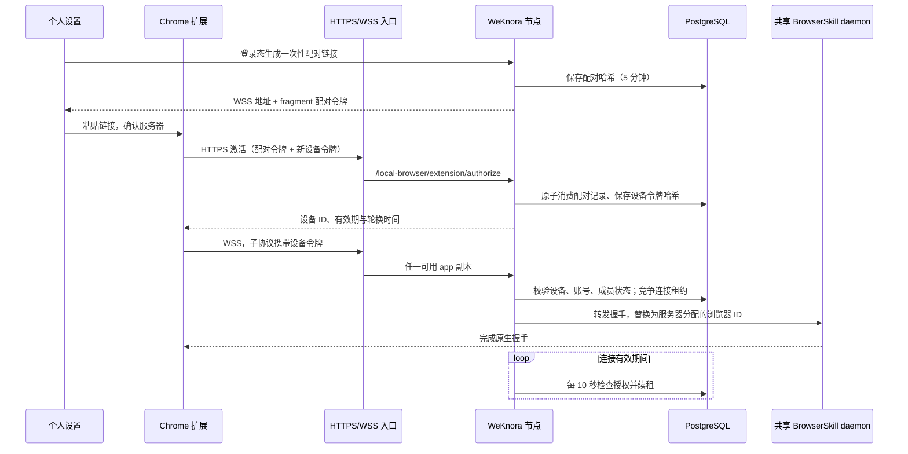
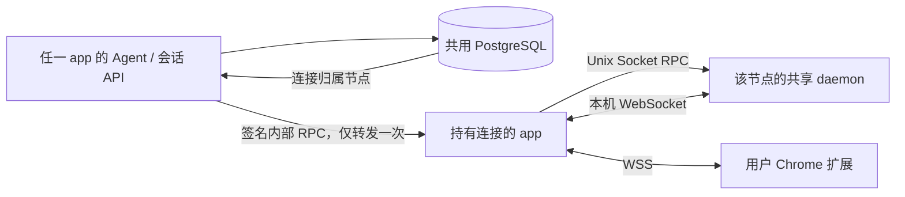

# BrowserSkill 生产部署链路

当前实现支持单实例调试与多个 WeKnora app 副本。浏览器执行、队列、标签借用与归还继续复用官方 BrowserSkill daemon/扩展。每个 app 按需启动一个共享 daemon；设备授权、连接归属和任务中断标记放在共用数据库中。

## 配对与重连



- 配对链接仅供激活，5 分钟有效。生成新链接不会断开现有设备，成功激活新设备后才替换旧授权。
- 当前每个「空间＋用户」保留一个设备授权；更换浏览器会替换旧设备。多个对话共用授权，各自创建任务窗口。
- 扩展生成 256 位随机设备令牌，仅放在可信扩展上下文的本地存储；服务器保存 SHA-256 哈希。设备令牌有效期 90 天，30 天后自动轮换。
- 轮换前扩展先保存候选令牌；响应丢失时使用同一候选重试，不会因客户端或服务器重启丢失新凭据。旧令牌提供 5 分钟连接宽限。相同设备的令牌轮换不重启活动的浏览器任务。
- 首次激活响应丢失时，重新生成配对链接激活即可；一次性配对凭据不能再次创建授权。
- 设备撤销、用户停用、成员资格暂停/移除都会阻止后续调用。活动连接在下一次授权检查时关闭；在途操作的取消不能撤销网页上已经发生的动作。
- 配对与设备令牌不放在 URL 查询参数中，不进入模型。相关接口不采集请求/响应正文日志，避免凭据、页面内容和截图进入日志。

## 多副本控制流



每次操作使用服务端持有的 tenant/user/session 绑定；模型不能覆盖原生 session ID 或浏览器 ID。内部转发需要共同密钥签名，签名覆盖时间戳、随机 nonce、目标节点和请求体。目标节点校验时效、去重并重新检查授权；请求不能被转发第二次，也不会自动重试点击等操作。

数据库连接租约为 45 秒，持有节点每 10 秒续租；每次连接有独立 lease key，旧连接的延迟释放不能清除新连接的租约。正常关闭主动释放节点租约；宕机后需等待旧租约到期，再加扩展的重连退避时间。WebSocket 不要求会话粘性，普通 HTTP 请求通过归属路由到连接节点。

一个节点的 daemon 故障会影响该节点承载的浏览器；其他节点不受进程故障影响。下一次通过认证的扩展连接会按需启动 daemon。节点启动采用合并等待，等待过程不持有全局状态锁。

## 任务恢复语义

设备自动重连与任务继续是两回事。开始原生任务前先写入持久化中断标记；连接或进程丢失后，旧任务一律显示暂停。用户点击对话小预览中的「继续任务」后才允许新调用。恢复后需重新观察页面，不能自动重放原来的点击、付款、发送或提交。

任务标签由 BrowserSkill 管理，断线清理会关闭任务创建的标签并解除借用标签的控制，共用窗口保持打开。当前不承诺恢复之前的页面、DOM 引用、窗口布局或在途命令结果。小预览的「定位到浏览器」仅定位已存在的任务标签，不启动任务、不恢复自动化。这个 UI 操作通过网关传给扩展，复用上游 SessionManager 查找标签；模型不具备该 UI 控制入口。

## 配置

Docker app 镜像已内置匹配目标架构的官方 bsk、配套扩展和许可证，并预设两个文件路径；单实例默认无需额外环境变量，配对地址从用户当前页面的 origin 生成，保留外部域名和端口。`BROWSERSKILL_PUBLIC_URL` 仅作为独立网关域名/路径等特殊部署的优先覆盖项。原生部署各节点需自行安装产物。配置示例如下：

```dotenv
BROWSERSKILL_BINARY=/opt/weknora/browserskill/bsk
# 可选覆盖；省略时从页面自动生成。
# BROWSERSKILL_PUBLIC_URL=wss://weknora.example.com/api/v1/local-browser/extension
BROWSERSKILL_EXTENSION_PATH=/opt/weknora/browserskill/browser-skill-weknora-0.2.1.zip
BROWSERSKILL_MAX_CONNECTIONS=32
```

单实例无需下面两项。多副本必须额外配置：

```dotenv
# 每个节点各不相同，须直达本节点；不能填写负载均衡 Service 地址。
BROWSERSKILL_INTERNAL_URL=http://10.0.0.12:8080
# 所有副本相同，从 Secret 注入至少 32 字符的随机值。
BROWSERSKILL_CLUSTER_SECRET=<shared-random-secret>
```

Kubernetes 可通过 Downward API 获取 Pod IP，再设置节点直连地址。各节点共用 PostgreSQL；不要用多个独立 SQLite 文件部署多副本。签名保护内部 RPC 的认证与完整性；内部 HTTP 仅适用于可信隔离网络，需要传输保密时配置 HTTPS 和受信任证书。

入口代理开放 `/api/v1/local-browser/extension` 的 WebSocket Upgrade，以及其 `/authorize` POST。配套 frontend Nginx 已配置这两条链路，并拒绝 `/api/v1/local-browser/internal`。外层 Ingress/代理也须支持 WebSocket；绕过 frontend 直接暴露 app 时需自行拒绝公共入口的内部接口。通过网络策略仅允许 app 节点互访此内部接口。不要记录 Authorization、Sec-WebSocket-Protocol 或授权请求正文。WSS 可以使用企业 CA，无需公网；远程明文 WS 不受支持。

迁移：PostgreSQL `000093_browser_authorization`，SQLite `000014_browser_authorization`。默认自动迁移；若关闭 `AUTO_MIGRATE`，须先执行迁移。数据库只持久化授权/租约/中断标记，不存浏览器 Cookie 或截图。

扩展必须更新到本次配套构建；旧版把配对令牌直接用于 WSS 的方式不再接受。开发测试可下载 ZIP 后在 Chrome 扩展程序页面加载已解压目录。商店分发尚未发布。

## 容量与验收

32 是单节点活动设备记录的默认保护上限，不是实测吞吐结论。每个用户仍有一条外部 WSS 和一条本机 WebSocket；共享 daemon 减少进程固定开销，不减少连接数。任务上限 64/用户。对话预览每轮完成后间隔 1 秒刷新，JPEG 宽度限制 640 像素；隐藏页面不轮询。截图独立于自动化队列，长命令或人工等待期间仍可更新。自动化请求按任务串行，预览使用短缓存与在途合并限制重复工作。

已提供自动测试：一次性配对、令牌轮换丢响应重试、账号停用检查、并发共享 daemon、跨用户/租户隔离、连接租约竞争及旧租约隔离、服务重启后使用原设备令牌连接且任务保持暂停、双 app 实例路由、内部签名防伪与防重放、真实 Chrome 扩展连接和任务标签定位。

生产上线仍需在目标集群完成 TLS/入口代理/NetworkPolicy 联调及负载测试：关注每节点 RSS、daemon CPU、活动连接数、截图流量、RPC 延迟/失败率和重连耗时。当前测试证明功能和故障隔离，不代表已经取得某个用户规模的容量保证。
