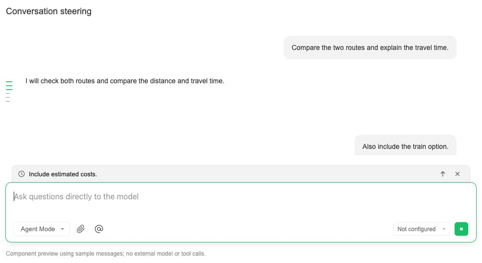
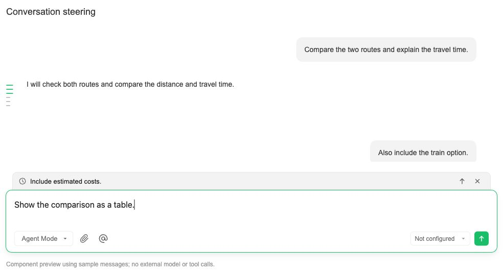

# Steering an active conversation

While an agent is running, you can queue a follow-up or guide the current task.

| Action | Behavior |
| --- | --- |
| Enter or the send button | Queue the draft to send after the current answer finishes. |
| Command+Enter or Alt/Option+Enter | Send the draft as guidance for the active task. With an empty draft, promote the first eligible queued message. |
| Up arrow on a queued message | Send that message as guidance immediately. |
| Remove on a queued message | Remove the queued message. |
| Stop button | Stop generation. This replaces the send button while the agent is running and the draft is empty. |
| Shift+Enter or Ctrl+Enter | Insert a newline. |

Outside an active agent run, Enter sends a normal message. Input methods can
confirm composed text without accidentally sending it. Modes without steering
support keep the stop action during generation.

Queued messages appear in a compact strip immediately above the input's focus
border. Guidance moves into the conversation immediately; delivery failures can
be retried or removed. Earlier work remains visible, and guidance does not mark
the ongoing task as complete. Sending and entering a newly created session keep
the composer ready for further input.

Guidance applies to the task in progress. The agent retains unfinished goals and
constraints unless the user explicitly changes or cancels them. A short tagged
reminder accompanies each guidance message; existing context and tool results
are reused without an additional model call to classify the message. Message IDs
and execution boundaries preserve ordering across live updates and history reloads.

The conversation outline includes both user and assistant messages and highlights
all messages intersecting the visible conversation area.

## Component previews

These previews use sample messages and isolated production components; they do
not contain real conversation data or invoke a model.

Running with an empty draft:

Running with a draft:

