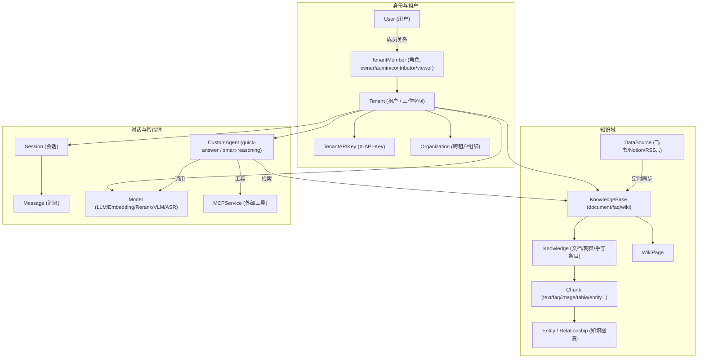
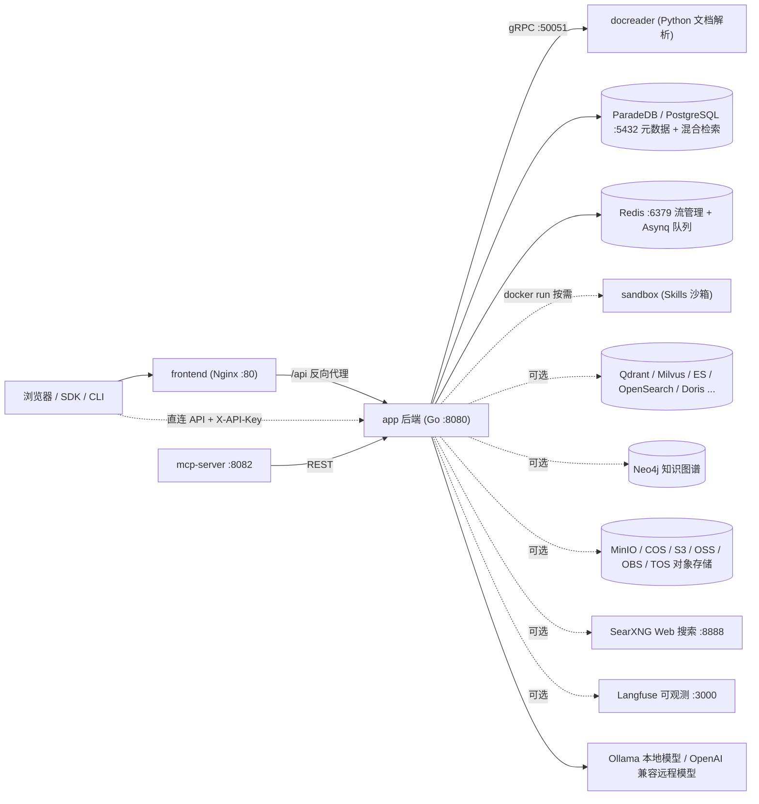

# WeKnora 产品介绍

WeKnora（维娜拉）是腾讯开源的知识库问答系统，支持导入 PDF、Word、网页以及飞书、Notion、语雀等平台的资料。用户可以围绕这些资料提问，并通过回答中的引用查看原文。

系统采用检索增强生成（RAG）：先解析文档并建立索引，再根据问题检索相关片段，由大模型生成回答。

系统由 Go 后端、Vue 3 前端和 Python 文档解析服务 docreader 组成，支持 Docker Compose、Helm、Lite 单二进制和桌面应用等部署方式。

<Screenshot
  src="/screenshots/introduction-overview.png"
  caption="WeKnora 主界面：左侧知识库与会话，右侧问答区"
  hint="展示登录后的主界面全貌：侧边栏（知识库、智能体、设置入口）与一轮带引用的问答。" />

## 适用场景 {#weknora-解决什么问题}

| 需求 | 功能 |
| --- | --- |
| 文档格式繁杂，PDF/扫描件/表格难以结构化 | 文档处理流程支持 PDF 版式分析、扫描件 OCR、Office 转换、网页抓取与图片描述，可选 OpenDataLoader/Docling 混合解析 |
| 单一向量检索召回不稳 | 向量 + 关键词（BM25）混合检索，RRF 融合，Rerank 重排，可选知识图谱（GraphRAG）与 Wiki 导航 |
| 模型绑定单一厂商 | 模型抽象层：Ollama 本地模型与 OpenAI 兼容远程接口均可，LLM / Embedding / Rerank / VLM / ASR 分类管理（见 `internal/types/model.go`） |
| 数据安全与私有化 | 全栈可私有部署；敏感凭证（API Key 等）以 AES-256 落盘加密（`SYSTEM_AES_KEY`）；多租户隔离 + RBAC 角色鉴权 |
| 多步骤任务与工具调用 | 内置 Agent（ReAct 多步推理）、MCP 工具接入、Agent Skills 沙箱执行、Web 搜索（SearXNG 等）、数据分析（对 CSV/Excel 执行 SQL） |
| 团队协作 | 租户（工作空间）+ 成员角色 + 组织（Organization）跨租户知识库共享 + 邀请机制 |

## 核心概念

知识库组织资料，工作空间管理成员与资源权限，智能体决定回答所用的模型和工具。以下术语与界面选项对应，完整类型定义位于 `internal/types/`。

### 租户与身份

| 概念 | 说明 |
| --- | --- |
| 租户 Tenant | 工作空间，管理知识库、模型、智能体、会话和存储配额。详见[空间与权限](../03-features/01-tenant-auth.md) |
| 用户 User | 登录账号，一个用户可以加入多个工作空间 |
| 成员 TenantMember | 用户在某个空间中的成员关系，包含角色和状态 |
| 角色 TenantRole | Owner、Admin、Contributor、Viewer 四级，决定用户可执行的空间操作 |
| API Key（TenantAPIKey） | 程序访问凭证，可授予指定能力并限定知识库范围。空间与平台 Key 的权限分别管理 |
| 组织 Organization | 连接多个工作空间，按组织成员角色共享知识库和智能体 |

### 知识域

| 概念 | 说明 |
| --- | --- |
| 知识库 KnowledgeBase | 组织相关资料，并配置模型、分块和索引策略。支持文档、FAQ 和 Wiki 类型 |
| 知识 Knowledge | 知识库中的一份文件、网页或手写内容，入库后可查看解析状态 |
| 分块 Chunk | 文档解析后的检索单元，可包含文本、图片识别结果、表格或其他索引内容 |
| FAQ | 维护标准问、相似问、反例问和答案的问答条目，详见[FAQ 能力](../03-features/17-faq.md) |
| Wiki 页面 WikiPage | 从文档生成的主题页面，带来源引用和页面链接，支持编辑与版本管理 |
| 知识图谱 Entity / Relationship | 文档中的实体与关系，保存在 Neo4j，用于补充关联内容检索 |
| 数据源 DataSource | 持续同步外部资料的连接。支持飞书、Lark、GitLab、IMA、Notion、语雀和 RSS，详见[数据源导入](../03-features/10-datasource.md) |
| 检索配置 RetrievalConfig | 控制候选数量、匹配阈值、融合权重和重排结果，详见[检索引擎](../03-features/05-retrieval-engines.md) |

### 对话与智能体

| 概念 | 说明 |
| --- | --- |
| 会话 Session | 保存多轮问答及所选智能体、模型、知识范围和工具配置 |
| 消息 Message | 一次提问或回答，可关联图片、附件、引用和工具执行结果 |
| 模型 Model | 提供对话、向量化、重排、视觉或语音能力的模型连接，详见[模型管理](../03-features/06-models.md) |
| Agent（自定义智能体） CustomAgent | 按任务配置模型、资料范围和工具，支持快速问答与智能推理 |
| 内置 Agent | 预配置的快速问答、智能推理、数据分析和 Wiki 智能体，详见[Agent 引擎](../03-features/07-agent.md) |
| 技能与沙箱 | 空间技能目录保存包，按沙箱配置安装，再绑定智能体使用；支持 Docker/Cube/E2B、个人变量与生成文件，见[技能与沙箱](../03-features/22-skills-sandbox.md) |
| 长期记忆 | 按空间和调用者保存资料/偏好/事实/事项/兴趣；默认关闭，开启与个人管理见[长期记忆](../03-features/23-memory.md) |
| MCP 服务 MCPService | 为智能体接入外部工具，支持 SSE 和 Streamable HTTP；认证可选 API Key、Bearer 或 OAuth 2.0 |

### 概念关系图

## 功能清单

- **文档接入**：文件上传（PDF/Word/PPT/Excel/Markdown/HTML/图片/音频等）、URL 抓取、手写 Markdown、整目录上传、飞书 / Lark / Notion / 语雀 / RSS 定时同步。
- **文档理解**：版式分析、扫描件 OCR、表格抽取、图片多模态描述（VLM）、音频转写（ASR）、按文件类型选择解析引擎（`ParserEngineRules`，可接 MinerU / OpenDataLoader）。
- **索引管道**：可配置分块（含父子分块与自适应策略）、向量索引、关键词全文索引、FAQ 索引、Wiki 生成、知识图谱抽取、预生成问题（question generation）。
- **检索**：向量 + BM25 混合检索、RRF 融合、Rerank 重排、查询改写与扩展、意图识别（greeting/chitchat/web_search 等，见 `config/prompt_templates/intent_prompts.yaml`）。
- **问答与 Agent**：流式 SSE 问答、多轮上下文压缩、引用溯源；ReAct Agent（工具：`knowledge_search`、`grep_chunks`、`wiki_search`、`data_analysis` 等）、MCP 外部工具、Agent Skills（Docker、Cube 或 E2B 沙箱执行脚本）、Web 搜索。
- **多租户与安全**：RBAC 角色鉴权（默认开启，`WEKNORA_TENANT_ENABLE_RBAC`）、审计日志（默认保留 90 天）、邀请制注册（`auth.registration_mode=invite_only`，也可用旧变量 `DISABLE_REGISTRATION=true`）、OIDC 单点登录、SSRF 防护、敏感字段 AES-256 加密。
- **可观测性**：Langfuse 全链路追踪（LLM/Embedding/Rerank/VLM/ASR 调用与 token 统计）、健康检查、Swagger API 文档（`GIN_MODE=debug` 时）。
- **生态**：REST API（`/api/v1`）+ API Key、独立 MCP Server（把 WeKnora 作为工具暴露给其他 Agent）、CLI（`cli/`）、微信小程序（`miniprogram/`）、浏览器插件渠道。

## 系统组件一览

| 组件 | 技术栈 | 源码位置 | 默认端口 | 职责 |
| --- | --- | --- | --- | --- |
| app（后端） | Go / Gin | `cmd/server`、`internal/` | 8080 | REST API、检索问答、Agent 引擎、异步任务（Asynq） |
| frontend（前端） | Vue 3 + Nginx | `frontend/` | 80 | Web 控制台，Nginx 反代 `/api` 到 app |
| docreader | Python / gRPC | `docreader/` | 50051（仅容器网络内） | 文件转 Markdown、网页抓取、图片提取 |
| postgres | ParadeDB（PostgreSQL 17 + BM25/向量扩展） | 镜像 `paradedb/paradedb` | 5432 | 主数据库 + 默认混合检索引擎（`RETRIEVE_DRIVER=postgres`） |
| redis | Redis 7 | — | 6379 | 流管理（SSE 恢复）、Asynq 任务队列 |
| sandbox | Python 3.11 + Node 20 | `docker/Dockerfile.sandbox` | — | Agent Skills 的会话沙箱容器镜像 |
| 可选：qdrant / milvus / weaviate / doris | — | `docker-compose.yml` profiles | 6334 / 19530 / 9035 / 9030 | 替代或叠加的向量检索引擎（`RETRIEVE_DRIVER`） |
| 可选：opensearch | — | 仅 `docker-compose.dev.yml` | 9200 | 开发环境用；生产需自备集群 |
| 可选：elasticsearch / tencent_vectordb | — | 不随 compose 提供 | — | 代码支持，但需自行部署后用 `RETRIEVE_DRIVER` 接入 |
| 可选：neo4j | Neo4j | profile `neo4j` | 7474 / 7687 | 知识图谱存储（GraphRAG） |
| 可选：minio | MinIO | profile `minio` | 9000 / 9001 | S3 兼容对象存储（`STORAGE_TYPE=minio`） |
| 可选：searxng | SearXNG | profile `searxng` | 8888 | 自建 Web 搜索引擎 |
| 可选：langfuse 栈 | Langfuse 3 + ClickHouse + MinIO | profile `langfuse` | 3000 | LLM 可观测性 |
| 可选：mcp | Python | `mcp-server/`，profile `full` | 8082 | 将 WeKnora API 封装为 MCP Server |
| 可选：odl-hybrid | Docling | profile `odl-hybrid` | 5002 | OpenDataLoader PDF 混合解析后端 |

## 下一步

- [安装部署](./02-installation.md)：选择部署方式并启动服务。
- [快速上手](./03-quickstart.md)：创建知识库、上传文档并完成首次问答。
- [配置详解](./04-configuration.md)：查询部署参数与配置优先级。
