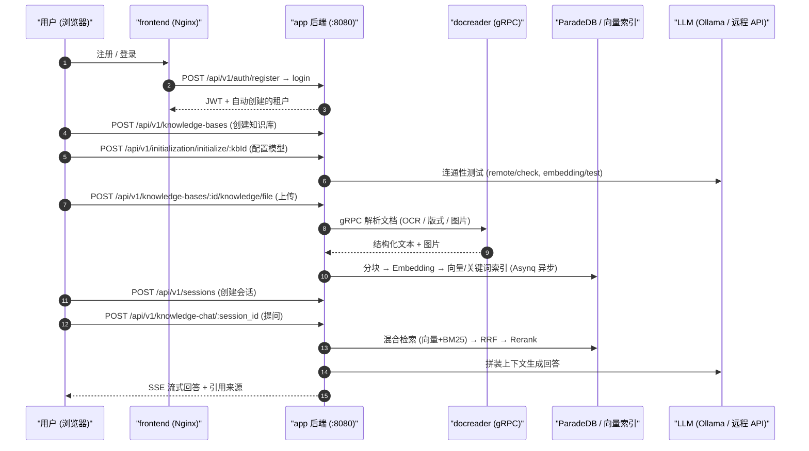

# 快速上手

通过注册账号、创建知识库、配置模型、上传文档和提问，可以完成首次知识库问答，并在回答中查看原文引用。以下步骤使用 Web 界面，文末提供对应的 API 示例。

使用前需先完成[安装部署](02-installation.md)，并准备可用的对话模型和向量模型。

## 开始之前 {#_1-开始之前}

- 启动服务：按[安装部署](./02-installation.md)启动后，前端在 `http://localhost`，后端在 `http://localhost:8080`；
- 准备模型连接信息：本地 Ollama（容器内默认地址 `http://host.docker.internal:11434`），或者任意 OpenAI 兼容服务的 `base_url` + `api_key`。至少需要一个对话模型和一个向量（embedding）模型；
- 检查后端健康状态：`curl http://localhost:8080/health` 返回 `{"status":"ok"}`。

## 注册并登录 {#_2-注册并登录}

首次访问进入登录页。部署允许公开注册（`self_serve`）时，页面显示注册页签；系统没有默认账号。默认配置下，注册会创建个人工作空间，并将新用户设为该空间的 Owner。

<Screenshot
  src="/screenshots/quickstart-register.png"
  caption="首次访问的注册页面"
  hint="展示注册表单（用户名 / 邮箱 / 密码）与登录入口即可。" />

注册要求与部署差异：

- 用户名 2–50 个字符；密码为 8–32 位，至少包含字母和数字。启用复杂密码策略后，还须同时包含大小写字母和特殊字符，界面与 API 使用同一策略；
- 团队部署可关闭公开注册，之后通过邀请链接添加成员。可设置 `DISABLE_REGISTRATION=true`（启动时把注册模式强制为 `invite_only`），或由系统管理员在「设置 → 系统」将 `auth.registration_mode` 改成 `invite_only`（立即生效，不用重启）；
- 如果部署把默认空间策略设成了 `tenantless`（`auth.default_tenant_mode`），注册后**不会**自动建空间，而是被引导到 `/onboarding/workspace`，需要先自建或接受邀请加入一个空间才能继续；
- 桌面版 / Lite 版免注册，启动即自动创建本地账号。

::: tip 空间与平台权限
空间 Owner 管理所在空间的成员、模型和知识库。全局系统设置、平台任务队列及跨空间审计需要系统管理员身份，两类权限独立授予。

首次设置系统管理员时，先注册账号，再为 app 服务配置 `WEKNORA_BOOTSTRAP_SYSTEM_ADMIN_EMAIL=<该账号邮箱>` 并重启。该流程仅在部署尚无系统管理员时生效。完整步骤与限制见[平台管理与系统管理员](../03-features/20-platform-admin.md)。
:::

## 创建知识库并配置模型 {#_3-创建知识库并配置模型}

在「知识库」页创建知识库后，初始化向导会引导配置该库使用的模型。每个知识库分别选择模型。

1. 在「知识库」页点新建，填名称，选类型：`document`（普通文档库）或 `faq`（问答对库）；
2. 在弹出的初始化向导里选模型：
   - **对话模型（LLM）**：生成回答；
   - **向量模型（Embedding）**：将文档转换为向量；更换后需要重建索引；
   - 重排 Rerank、图片理解 VLM、语音转写 ASR、知识图谱抽取和问题生成可按资料类型与使用需求配置；
3. 用向导里的「测试」按钮确认模型连接正常，再保存。

<Screenshot
  src="/screenshots/quickstart-init-wizard.png"
  caption="初始化向导：为知识库选择对话模型与向量模型"
  hint="展示模型来源（Ollama / 远程 API）、模型名、Base URL 输入框，以及连通性测试通过的提示。" />

::: tip 从容器连接 Ollama
后端容器内的 `localhost` 指向容器自身。连接宿主机上的 Ollama 时，使用 `http://host.docker.internal:11434`。
:::

## 上传文档 {#_4-上传文档}

进入知识库后，拖入文件或粘贴网页 URL。在上传确认对话框中，可为本批文件设置标签和解析选项。

支持的格式包括 PDF、Word、Excel、PPT、Markdown、HTML、EPUB、图片和音频等，完整清单见[文档解析服务](../03-features/03-document-parsing.md)。

<Screenshot
  src="/screenshots/quickstart-upload.png"
  caption="上传确认对话框：选择文件、打标签、调整解析选项"
  hint="展示待上传文件列表、标签选择与解析引擎选项。" />

上传后文档会异步解析，状态依次是 `pending → processing → finalizing → completed`。PDF 扫描件、大文件会慢一些，列表页会实时刷新进度。

<Screenshot
  src="/screenshots/quickstart-document-list.png"
  caption="文档列表：三篇文档解析完成"
  hint="展示文档名称、类型、解析状态为「已完成」、分块数等列。" />

## 提问 {#_5-提问}

进入对话页并选择知识库后，即可提问。默认的「快速问答」智能体会检索相关片段并生成回答；点击引用可查看原文。

<Screenshot
  src="/screenshots/quickstart-chat.png"
  caption="知识问答：回答与可点击的引用来源"
  hint="展示一轮问答，回答正文中的引用角标以及展开后的引用来源面板。" />

回答正常显示且引用可打开，表示本次文档入库与问答流程已完成。

## 继续配置 {#_6-再往前一步}

- [配置智能体](../03-features/07-agent.md)：使用智能推理处理多步骤问题，按需启用联网搜索与 MCP 工具。
- [调整分块](../03-features/04-chunking.md)与[检索参数](../03-features/05-retrieval-engines.md)：根据文档结构和检索结果调整配置。
- [连接数据源](../03-features/10-datasource.md)：持续同步飞书、Notion、语雀或 RSS 内容。
- [接入 IM](../03-features/12-im-integration.md)或[网页嵌入](../03-features/13-embed-channel.md)：让用户通过已有渠道提问。

## 通过 API 完成首次问答 {#_7-用-api-走通同样的链路}

以下示例按注册、登录、建库、模型初始化、上传和问答顺序调用 API。路径统一使用 `/api/v1` 前缀。

```bash
BASE=http://localhost:8080/api/v1

# 1) 注册（首次部署时；用户名 2–50 字符；密码 8–32 位且含字母和数字，复杂策略另有要求）
curl -s -X POST $BASE/auth/register -H "Content-Type: application/json" \
  -d '{"username":"admin","email":"admin@example.com","password":"pass123456"}'

# 2) 登录，取 JWT
TOKEN=$(curl -s -X POST $BASE/auth/login -H "Content-Type: application/json" \
  -d '{"email":"admin@example.com","password":"pass123456"}' | jq -r '.token')
AUTH="Authorization: Bearer $TOKEN"

# 3) 创建知识库
KB_ID=$(curl -s -X POST $BASE/knowledge-bases -H "$AUTH" -H "Content-Type: application/json" \
  -d '{"name":"我的知识库","description":"demo","type":"document"}' | jq -r '.data.id')

# 4) 初始化知识库（以本地 Ollama 为例；远程模型改 source/baseUrl/apiKey）
curl -s -X POST $BASE/initialization/initialize/$KB_ID -H "$AUTH" -H "Content-Type: application/json" -d '{
  "llm":       {"source":"local","modelName":"qwen3:8b"},
  "embedding": {"source":"local","modelName":"bge-m3","dimension":1024},
  "rerank":    {"enabled":false},
  "multimodal":{"enabled":false},
  "documentSplitting":{"chunkSize":512,"chunkOverlap":50,"separators":["\n\n","\n","。"]},
  "nodeExtract":{"enabled":false},
  "questionGeneration":{"enabled":false}}'

# 5) 上传文档（multipart，字段名 file）
curl -s -X POST $BASE/knowledge-bases/$KB_ID/knowledge/file -H "$AUTH" \
  -F "file=@./demo.pdf"
# 轮询解析状态：GET /knowledge-bases/$KB_ID/knowledge 直到 parse_status=completed

# 6) 创建会话
SESSION_ID=$(curl -s -X POST $BASE/sessions -H "$AUTH" -H "Content-Type: application/json" \
  -d '{"title":"第一次对话"}' | jq -r '.data.id')

# 7) 知识问答（SSE 流式输出）
curl -N -X POST $BASE/knowledge-chat/$SESSION_ID -H "$AUTH" -H "Content-Type: application/json" \
  -d '{"query":"这份文档讲了什么？","knowledge_base_ids":["'$KB_ID'"]}'

# 7b) Agent 对话（同为 SSE；agent_id 可取内置 builtin-smart-reasoning）
curl -N -X POST $BASE/agent-chat/$SESSION_ID -H "$AUTH" -H "Content-Type: application/json" \
  -d '{"query":"总结文档要点并列出依据","agent_enabled":true,"agent_id":"builtin-smart-reasoning","knowledge_base_ids":["'$KB_ID'"]}'

# 8) 仅检索不生成（结构化 JSON 结果）
curl -s -X POST $BASE/knowledge-search -H "$AUTH" -H "Content-Type: application/json" \
  -d '{"query":"关键字","knowledge_base_ids":["'$KB_ID'"]}'
```

问答请求体还支持 `knowledge_ids`（限定单文档）、`web_search_enabled`、`summary_model_id`、`mcp_service_ids`、`skill_names`、`images` / `attachment_uploads`（多模态附件）等字段，完整说明见 [API 参考：会话与聊天](../04-api/02-api-chat.md)。

### 三种认证方式

| 方式 | 请求头 | 适用 |
| --- | --- | --- |
| JWT | `Authorization: Bearer <token>` | 浏览器 / 交互式调用，登录接口签发 |
| API Key | `X-API-Key: <key>` | 服务端集成；在「空间设置」或 `POST /api/v1/tenants/:id/api-keys` 创建，支持细粒度能力（`retrieve`/`chat`/`ingest`/`manage_kbs` 等） |
| 指定空间 | `X-Tenant-ID: <id>` | 多空间用户切换当前工作空间 |

服务端集成建议用 API Key 而不是 JWT：

```bash
# 以 Owner 身份创建 API Key（TENANT_ID 来自登录响应）
curl -s -X POST $BASE/tenants/$TENANT_ID/api-keys -H "$AUTH" -H "Content-Type: application/json" \
  -d '{"name":"ci-bot","full_access":true}'
# 之后所有请求改用：
curl -s $BASE/knowledge-bases -H "X-API-Key: <创建时返回的 key>"
```

### 初始化向导对应的接口

界面上的每一步向导都有独立端点，自建管理后台时可以直接复用：

| 步骤 | 端点 | 说明 |
| --- | --- | --- |
| 读取当前配置 | `GET /api/v1/initialization/config/:kbId` | 返回 llm / embedding / rerank / multimodal / documentSplitting / nodeExtract / questionGeneration 各段及 `hasFiles`（已有文件时限制修改 embedding） |
| 检测 Ollama | `GET /api/v1/initialization/ollama/status`、`GET /api/v1/initialization/ollama/models` | 检查 Ollama 可用性与已装模型 |
| 下载 Ollama 模型 | `POST /api/v1/initialization/ollama/models/download` → `GET /api/v1/initialization/ollama/download/progress/:taskId` | 异步下载并轮询进度 |
| 测试远程模型 | `POST /api/v1/initialization/remote/check`、`/initialization/embedding/test`、`/initialization/rerank/check`、`/initialization/asr/check`、`/initialization/multimodal/test` | 保存前连通性验证 |
| 知识图谱试抽取 | `POST /api/v1/initialization/extract/text-relation`（配 `fabri-text` / `fabri-tag` 生成示例） | 预览实体/关系抽取效果 |
| 保存配置 | `POST /api/v1/initialization/initialize/:kbId`（首次）/ `PUT /api/v1/initialization/config/:kbId`（更新） | 落库：创建/更新 Model 记录并写入 KnowledgeBase 配置 |

`source` 取 `local`（Ollama）或远程厂商标识（`openai`、`deepseek`、`aliyun`、`zhipu`、`siliconflow` 等）。`chunkSize` 合法范围 100–10000。

### 整条链路发生了什么



## 卡住了看这里 {#_8-卡住了看这里}

| 现象 | 检查点 |
| --- | --- |
| 上传后一直 `processing` | `docker logs WeKnora-docreader`；大文件受 `MAX_FILE_SIZE_MB`（默认 50）与 `WEKNORA_DOCUMENT_PROCESS_TIMEOUT`（默认 2h）约束 |
| 初始化时 Ollama 检测失败 | 容器内默认地址 `http://host.docker.internal:11434`（`OLLAMA_BASE_URL`）；Linux 需确认 `extra_hosts: host.docker.internal:host-gateway` 生效 |
| 问答无引用 / 召回为空 | 确认知识解析 `completed`；调低 `vector_threshold`；检查 embedding 模型与建库时一致 |
| 注册页签消失 | 查 `GET /auth/config` 的 `registration_mode`。值可能来自「设置 → 系统」里的数据库设置，不只是 `DISABLE_REGISTRATION`；邀请链接与 OIDC 首次登录是另外两条通路，不受它影响 |
| API Key 请求 403 | Key 的 capabilities 不含所需能力，或 `knowledge_base_ids` 白名单未包含目标库 |

下一步：想调细节看[配置详解](./04-configuration.md)，想了解系统怎么运转看[总体架构](../02-architecture/01-overview.md)。
