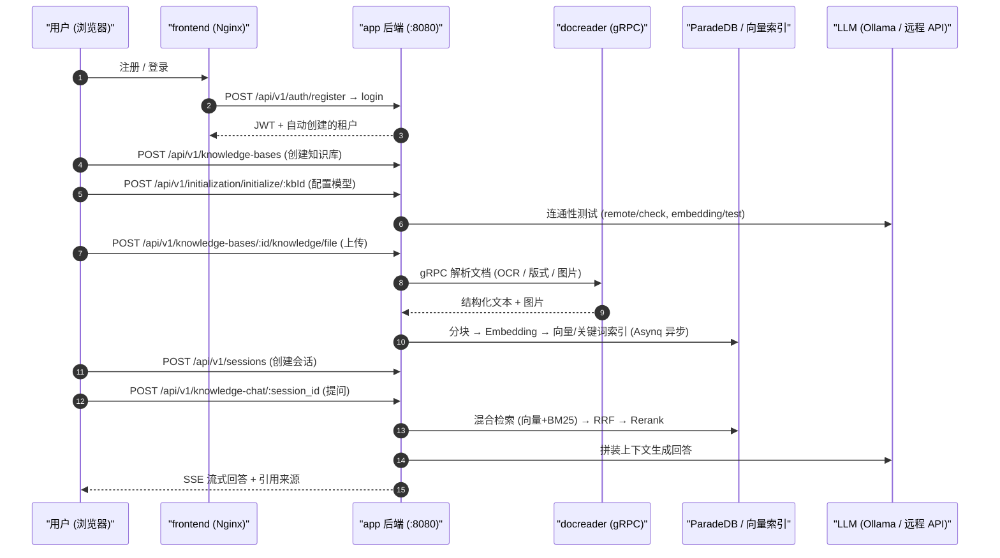

# 快速上手

跟着本文走一遍，你会得到一个能回答自己文档内容的知识库：注册账号 → 建库并选模型 → 上传文档 → 提问并看到带出处的回答。全程在网页界面完成，顺利的话十几分钟，其中大部分时间花在等文档解析上。

想用接口做集成的，跳到本文第 7 节，那里有一段可直接复制运行的 curl 链路。

## 1. 开始之前

- 服务已经跑起来：按[安装部署](./02-installation.md)启动后，前端在 `http://localhost`，后端在 `http://localhost:8080`；
- 手上有一套可用的模型：本地 Ollama（容器内默认地址 `http://host.docker.internal:11434`），或者任意 OpenAI 兼容服务的 `base_url` + `api_key`。至少需要一个对话模型和一个向量（embedding）模型；
- 确认后端活着：`curl http://localhost:8080/health` 返回 `{"status":"ok"}`。

## 2. 注册并登录

首次访问会落到登录页，注册是同一页上的一个页签——只有当注册模式是 `self_serve` 时才显示（前端读 `/auth/config` 决定）。系统没有内置默认账号，注册完成后会自动得到一个属于自己的工作空间，你在这个空间里是 Owner。

<Screenshot
  src="/screenshots/quickstart-register.png"
  caption="首次访问的注册页面"
  hint="展示注册表单（用户名 / 邮箱 / 密码）与登录入口即可。" />

几点值得先知道：

- 用户名 2–50 个字符；密码在注册页要求 8–32 位且含字母和数字（直接调 `POST /auth/register` 接口时后端只校验 ≥6 位，建议仍按 8 位以上来）；
- 团队部署时，注册完第一个账号就可以关闭公开注册，之后通过邀请链接加人。关的方式有两种：设 `DISABLE_REGISTRATION=true`（启动时把注册模式强制为 `invite_only`），或者登录后在「设置 → 系统」里把 `auth.registration_mode` 改成 `invite_only`（立即生效，不用重启）；
- 如果部署把默认空间策略设成了 `tenantless`（`auth.default_tenant_mode`），注册后**不会**自动建空间，而是被引导到 `/onboarding/workspace`，需要先自建或接受邀请加入一个空间才能继续；
- 桌面版 / Lite 版免注册，启动即自动创建本地账号。

::: tip 空间 Owner ≠ 系统管理员
这两个是不同维度的身份，很容易混：

- **空间 Owner**：某一个工作空间内的最高权限，管这个空间的成员、模型、知识库。注册即拥有自己的空间，所以人人都是自己空间的 Owner。
- **系统管理员（System Admin）**：平台级身份，管的是整个部署——全局系统设置、任务队列、平台 API Key、跨空间审计日志、重置用户密码。它不属于任何空间，也不会因为你在某个空间是 Owner 就自动获得。

新部署里**没有任何系统管理员**，需要显式指定第一个。做法：先正常注册账号，然后给 app 服务设 `WEKNORA_BOOTSTRAP_SYSTEM_ADMIN_EMAIL=<该账号邮箱>` 并重启——启动时若检测到「当前部署一个系统管理员都没有」，就把这个邮箱对应的用户提升为系统管理员。已经存在系统管理员时这个变量不再生效（避免界面上刚撤销的权限被下次重启悄悄恢复），用户没注册时也只是打一条 WARN、下次重启再试。之后新增管理员就在界面上操作即可。详见[租户、用户与认证授权](../03-features/01-tenant-auth.md)。
:::

## 3. 创建知识库并配置模型

登录后新建一个知识库。WeKnora 的模型配置是**按知识库**走的：新建之后前端会引导你为这个库选模型，没有全局的一次性初始化。

1. 在「知识库」页点新建，填名称，选类型：`document`（普通文档库）或 `faq`（问答对库）；
2. 在弹出的初始化向导里选模型：
   - **对话模型（LLM）**：生成回答用；
   - **向量模型（Embedding）**：把文档转成向量用，**建库后不要再换**，换了需要重建索引；
   - 其余（重排 Rerank、图片理解 VLM、语音转写 ASR、知识图谱抽取、问题预生成）都可以先不开，之后随时能加；
3. 用向导里的「测试」按钮确认模型连得通，再保存。

<Screenshot
  src="/screenshots/quickstart-init-wizard.png"
  caption="初始化向导：为知识库选择对话模型与向量模型"
  hint="展示模型来源（Ollama / 远程 API）、模型名、Base URL 输入框，以及连通性测试通过的提示。" />

::: tip 用本地 Ollama 时最容易踩的坑
后端跑在容器里，填 `http://localhost:11434` 连不上宿主机的 Ollama，要填 `http://host.docker.internal:11434`。
:::

## 4. 上传文档

进入知识库，把文件拖进上传区，或者粘贴一个网页 URL。上传确认对话框里可以顺手指定标签和这一批文件的解析选项。

支持的格式包括 PDF、Word、Excel、PPT、Markdown、HTML、EPUB、图片和音频等，完整清单见[文档解析服务](../03-features/03-document-parsing.md)。

<Screenshot
  src="/screenshots/quickstart-upload.png"
  caption="上传确认对话框：选择文件、打标签、调整解析选项"
  hint="展示待上传文件列表、标签选择与解析引擎选项。" />

上传后文档会异步解析，状态依次是 `pending → processing → finalizing → completed`。PDF 扫描件、大文件会慢一些，列表页会实时刷新进度。

<Screenshot
  src="/screenshots/quickstart-document-list.png"
  caption="文档列表：三篇文档解析完成"
  hint="展示文档名称、类型、解析状态为「已完成」、分块数等列。" />

## 5. 提问

进入对话页，选择刚才的知识库，直接提问。默认用的是内置的「快速问答」Agent：检索相关片段 → 交给大模型作答 → 回答里带出处，点引用可以跳回原文。

<Screenshot
  src="/screenshots/quickstart-chat.png"
  caption="知识问答：回答与可点击的引用来源"
  hint="展示一轮问答，回答正文中的引用角标以及展开后的引用来源面板。" />

到这一步，最小闭环就跑通了。

## 6. 再往前一步

- **换成会推理的 Agent**：在对话框顶部切换到内置的「智能推理」Agent，它会自己决定检索几轮、要不要联网、要不要调工具，适合需要多步推理的问题。也可以在「智能体」页建自定义 Agent，挂上 MCP 工具与联网搜索，见 [Agent 引擎](../03-features/07-agent.md)；
- **让答案更准**：开启 Rerank 重排、调整分块大小，见[分块机制](../03-features/04-chunking.md)与[检索引擎](../03-features/05-retrieval-engines.md)；
- **让知识自动进来**：接飞书 / Notion / 语雀 / RSS 自动同步，见[数据源导入](../03-features/10-datasource.md)；
- **让别人也能问**：接入企业微信 / 飞书等 IM，或把 Agent 以挂件形式嵌到自己的网站，见 [IM 集成](../03-features/12-im-integration.md)与[网页嵌入](../03-features/13-embed-channel.md)。

## 7. 用 API 走通同样的链路

上面每一步都有对应接口，统一前缀 `/api/v1`。下面这段可以直接跑：

```bash
BASE=http://localhost:8080/api/v1

# 1) 注册（首次部署时；username>=2 字符，password>=6 字符）
curl -s -X POST $BASE/auth/register -H "Content-Type: application/json" \
  -d '{"username":"admin","email":"admin@example.com","password":"pass123456"}'

# 2) 登录，取 JWT
TOKEN=$(curl -s -X POST $BASE/auth/login -H "Content-Type: application/json" \
  -d '{"email":"admin@example.com","password":"pass123456"}' | jq -r '.token')
AUTH="Authorization: Bearer $TOKEN"

# 3) 创建知识库
KB_ID=$(curl -s -X POST $BASE/knowledge-bases -H "$AUTH" -H "Content-Type: application/json" \
  -d '{"name":"我的知识库","description":"demo","type":"document"}' | jq -r '.data.id')

# 4) 初始化知识库（以本地 Ollama 为例；远程模型改 source/baseUrl/apiKey）
curl -s -X POST $BASE/initialization/initialize/$KB_ID -H "$AUTH" -H "Content-Type: application/json" -d '{
  "llm":       {"source":"local","modelName":"qwen3:8b"},
  "embedding": {"source":"local","modelName":"bge-m3","dimension":1024},
  "rerank":    {"enabled":false},
  "multimodal":{"enabled":false},
  "documentSplitting":{"chunkSize":512,"chunkOverlap":50,"separators":["\n\n","\n","。"]},
  "nodeExtract":{"enabled":false},
  "questionGeneration":{"enabled":false}}'

# 5) 上传文档（multipart，字段名 file）
curl -s -X POST $BASE/knowledge-bases/$KB_ID/knowledge/file -H "$AUTH" \
  -F "file=@./demo.pdf"
# 轮询解析状态：GET /knowledge-bases/$KB_ID/knowledge 直到 parse_status=completed

# 6) 创建会话
SESSION_ID=$(curl -s -X POST $BASE/sessions -H "$AUTH" -H "Content-Type: application/json" \
  -d '{"title":"第一次对话"}' | jq -r '.data.id')

# 7) 知识问答（SSE 流式输出）
curl -N -X POST $BASE/knowledge-chat/$SESSION_ID -H "$AUTH" -H "Content-Type: application/json" \
  -d '{"query":"这份文档讲了什么？","knowledge_base_ids":["'$KB_ID'"]}'

# 7b) Agent 对话（同为 SSE；agent_id 可取内置 builtin-smart-reasoning）
curl -N -X POST $BASE/agent-chat/$SESSION_ID -H "$AUTH" -H "Content-Type: application/json" \
  -d '{"query":"总结文档要点并列出依据","agent_enabled":true,"agent_id":"builtin-smart-reasoning","knowledge_base_ids":["'$KB_ID'"]}'

# 8) 仅检索不生成（结构化 JSON 结果）
curl -s -X POST $BASE/knowledge-search -H "$AUTH" -H "Content-Type: application/json" \
  -d '{"query":"关键字","knowledge_base_ids":["'$KB_ID'"]}'
```

问答请求体还支持 `knowledge_ids`（限定单文档）、`web_search_enabled`、`summary_model_id`、`mcp_service_ids`、`skill_names`、`images` / `attachment_uploads`（多模态附件）等字段，完整说明见 [API 参考：会话与聊天](../04-api/02-api-chat.md)。

### 三种认证方式

| 方式 | 请求头 | 适用 |
| --- | --- | --- |
| JWT | `Authorization: Bearer <token>` | 浏览器 / 交互式调用，登录接口签发 |
| API Key | `X-API-Key: <key>` | 服务端集成；在「空间设置」或 `POST /api/v1/tenants/:id/api-keys` 创建，支持细粒度能力（`retrieve`/`chat`/`ingest`/`manage_kbs` 等） |
| 指定空间 | `X-Tenant-ID: <id>` | 多空间用户切换当前工作空间 |

服务端集成建议用 API Key 而不是 JWT：

```bash
# 以 Owner 身份创建 API Key（TENANT_ID 来自登录响应）
curl -s -X POST $BASE/tenants/$TENANT_ID/api-keys -H "$AUTH" -H "Content-Type: application/json" \
  -d '{"name":"ci-bot","full_access":true}'
# 之后所有请求改用：
curl -s $BASE/knowledge-bases -H "X-API-Key: <创建时返回的 key>"
```

### 初始化向导对应的接口

界面上的每一步向导都有独立端点，自建管理后台时可以直接复用：

| 步骤 | 端点 | 说明 |
| --- | --- | --- |
| 读取当前配置 | `GET /api/v1/initialization/config/:kbId` | 返回 llm / embedding / rerank / multimodal / documentSplitting / nodeExtract / questionGeneration 各段及 `hasFiles`（已有文件时限制修改 embedding） |
| 检测 Ollama | `GET /api/v1/initialization/ollama/status`、`GET /api/v1/initialization/ollama/models` | 检查 Ollama 可用性与已装模型 |
| 下载 Ollama 模型 | `POST /api/v1/initialization/ollama/models/download` → `GET /api/v1/initialization/ollama/download/progress/:taskId` | 异步下载并轮询进度 |
| 测试远程模型 | `POST /api/v1/initialization/remote/check`、`/initialization/embedding/test`、`/initialization/rerank/check`、`/initialization/asr/check`、`/initialization/multimodal/test` | 保存前连通性验证 |
| 知识图谱试抽取 | `POST /api/v1/initialization/extract/text-relation`（配 `fabri-text` / `fabri-tag` 生成示例） | 预览实体/关系抽取效果 |
| 保存配置 | `POST /api/v1/initialization/initialize/:kbId`（首次）/ `PUT /api/v1/initialization/config/:kbId`（更新） | 落库：创建/更新 Model 记录并写入 KnowledgeBase 配置 |

`source` 取 `local`（Ollama）或远程厂商标识（`openai`、`deepseek`、`aliyun`、`zhipu`、`siliconflow` 等）。`chunkSize` 合法范围 100–10000。

### 整条链路发生了什么



## 8. 卡住了看这里

| 现象 | 检查点 |
| --- | --- |
| 上传后一直 `processing` | `docker logs WeKnora-docreader`；大文件受 `MAX_FILE_SIZE_MB`（默认 50）与 `WEKNORA_DOCUMENT_PROCESS_TIMEOUT`（默认 2h）约束 |
| 初始化时 Ollama 检测失败 | 容器内默认地址 `http://host.docker.internal:11434`（`OLLAMA_BASE_URL`）；Linux 需确认 `extra_hosts: host.docker.internal:host-gateway` 生效 |
| 问答无引用 / 召回为空 | 确认知识解析 `completed`；调低 `vector_threshold`；检查 embedding 模型与建库时一致 |
| 注册页签消失 | 查 `GET /auth/config` 的 `registration_mode`。值可能来自「设置 → 系统」里的数据库设置，不只是 `DISABLE_REGISTRATION`；邀请链接与 OIDC 首次登录是另外两条通路，不受它影响 |
| API Key 请求 403 | Key 的 capabilities 不含所需能力，或 `knowledge_base_ids` 白名单未包含目标库 |

下一步：想调细节看[配置详解](./04-configuration.md)，想了解系统怎么运转看[总体架构](../02-architecture/01-overview.md)。
