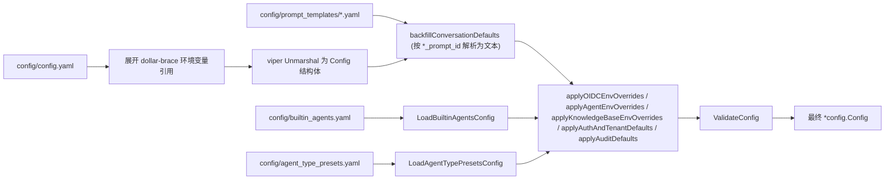

# 配置详解

WeKnora 的配置由四层组成，**优先级从低到高**：

| 层 | 位置 | 什么时候用 |
| --- | --- | --- |
| 主配置文件 | `config/config.yaml` | 结构化的默认值，随镜像分发 |
| 模板 / 预设 | `config/prompt_templates/*.yaml`、`builtin_agents.yaml`、`agent_type_presets.yaml`、`builtin_models.yaml` | 提示词、内置 Agent、内置模型 |
| 环境变量 | `.env` / 容器 environment | 部署级覆盖，改完需重启 |
| 运行时系统设置 | 数据库 `system_settings` 表，界面在「设置 → 系统」 | 一部分开关可以在线改，**盖过环境变量**，绝大多数立即生效 |

最后一层容易被忽略，却是排查「改了 env 没生效」的第一现场：注册模式、空间策略与配额、SSRF 白名单、各 worker pool 并发、模型并发上限这些键一旦在界面上改过，数据库里就留下一行记录，此后环境变量不再起作用；把该项重置（`DELETE /api/v1/system/admin/settings/:key`）才会回落到环境变量或内置默认值。完整键表与语义见[租户、用户与认证授权](../03-features/01-tenant-auth.md)的「运行时可改的系统设置」。

下文对照 `internal/config/config.go` 中的结构体逐段解读，并在末尾汇总环境变量。

## 配置加载机制

`internal/config/config.go` 的 `LoadConfig()` 流程：

1. viper 按顺序查找 `config.yaml`：当前目录 → `./config` → `$HOME/.appname` → `/etc/appname/`；
2. **环境变量展开**：对文件内容做正则替换，`${ENV_VAR}` 会被同名环境变量的值替换；变量未设置时保留字面量 `${ENV_VAR}` 原样（便于暴露配置错误）；
3. viper 开启 `AutomaticEnv()` 且 key 分隔符 `.` 映射为 `_`（即 `server.port` 可被环境变量 `SERVER_PORT` 覆盖）；
4. 从 `config/prompt_templates/*.yaml` 加载提示词模板，并按 `xxx_prompt_id` 字段**回填**到 conversation 配置（`backfillConversationDefaults`）；
5. 加载 `builtin_agents.yaml`（内置 Agent）与 `agent_type_presets.yaml`（Agent 类型预设），并解析其中的 `system_prompt_id` 引用；
6. 应用环境变量覆盖（OIDC、Agent、KnowledgeBase、Auth/Tenant、Audit 各组）并执行 `ValidateConfig` 校验。



## config/config.yaml 逐段解读

### server（`ServerConfig`）

| 名称 | 类型 | 默认值 | 说明 |
| --- | --- | --- | --- |
| `server.port` | int | 8080 | HTTP 监听端口，校验范围 1–65535 |
| `server.host` | string | "0.0.0.0" | 监听地址 |
| `server.log_path` | string | 空 | 日志文件路径（也可用环境变量 `LOG_PATH`） |
| `server.shutdown_timeout` | duration | 30s | 优雅停机超时 |

### conversation（`ConversationConfig`）——检索问答管线

| 名称 | 类型 | 默认值（config.yaml） | 说明 |
| --- | --- | --- | --- |
| `max_rounds` | int | 5 | 携带的多轮历史轮数 |
| `keyword_threshold` | float | 0.3 | 关键词检索最低分 |
| `embedding_top_k` | int | 30 | 向量检索召回条数（>=0） |
| `vector_threshold` | float | 0.2 | 向量相似度阈值（0–1） |
| `rerank_top_k` | int | 30 | 重排后保留条数 |
| `rerank_threshold` | float | 0.3 | 重排最低分（-10–10） |
| `fallback_strategy` | string | "model" | 召回为空时策略：`model`（让模型兜底）或固定回复 |
| `fallback_response` | string | "Sorry, I am unable to answer this question." | 固定兜底文案 |
| `enable_rewrite` | bool | true | 多轮指代消解 / 查询改写 |
| `enable_query_expansion` | bool | true | 查询扩展 |
| `enable_rerank` | bool | true | 启用 Rerank |
| `fallback_prompt_id` | string | "default_fallback_prompt" | 兜底 prompt 模板 ID（`prompt_templates/fallback.yaml`，mode:"model"） |
| `rewrite_prompt_id` | string | "default_rewrite" | 改写模板 ID（含 content 系统侧 + user 用户侧） |
| `generate_summary_prompt_id` | string | "default_summary" | 文档摘要模板 ID |
| `generate_session_title_prompt_id` | string | "default_session_title" | 会话标题生成模板 ID |
| `extract_entities_prompt_id` / `extract_relationships_prompt_id` | string | "default_extract_entities" / "default_extract_relationships" | 图谱抽取模板 ID（`graph_extraction.yaml`） |
| `generate_questions_prompt_id` | string | "default_generate_questions" | 预生成问题模板 ID |

`conversation.summary`（`SummaryConfig`，答案生成参数）：

| 名称 | 类型 | 默认值 | 说明 |
| --- | --- | --- | --- |
| `max_input_chars` | int | 16384 | 送入 LLM 的最大字符数 |
| `temperature` | float | 0.3 | 生成温度 |
| `repeat_penalty` | float | 1.0 | 重复惩罚 |
| `max_completion_tokens` | int | 2048 | 最大生成 token |
| `no_match_prefix` | string | `<think>\n</think>\nNO_MATCH` | 模型输出以此为前缀时判定「未命中」触发 fallback |
| `prompt_id` | string | "default_kb" | 系统 Prompt 模板 ID（`system_prompt.yaml`） |
| `context_template_id` | string | "default_context" | 上下文拼装模板 ID（`context_template.yaml`） |
| `max_tokens` / `top_k` / `top_p` / `frequency_penalty` / `presence_penalty` / `seed` / `thinking` | 多种 | 未设置 | 透传给模型的可选采样参数；`thinking` 为 `*bool` 控制思考模式 |

### knowledge_base（`KnowledgeBaseConfig`）——全局默认分块

| 名称 | 类型 | 默认值 | 说明 |
| --- | --- | --- | --- |
| `chunk_size` | int | 512 | 默认分块大小（>0，且 > overlap） |
| `chunk_overlap` | int | 50 | 分块重叠 |
| `split_markers` | []string | `["\n\n", "\n", "。"]` | 分割标记 |
| `keep_separator` | bool | false | 保留分隔符 |
| `document_process_timeout` | duration | 2h | 单文档处理任务总超时（env `WEKNORA_DOCUMENT_PROCESS_TIMEOUT` 可覆盖） |
| `docreader_call_timeout` | duration | 30m | 单次 DocReader RPC 超时（env `WEKNORA_DOCREADER_CALL_TIMEOUT`），须小于上一项 |
| `image_processing.enable_multimodal` | bool | true | 上传时启用图片多模态处理（OCR/Caption） |

> 每个知识库的 `ChunkingConfig` 会覆盖这里的全局默认值。

### extract（`ExtractManagerConfig`）——知识图谱抽取模板

`extract.extract_graph` / `extract.extract_entity` / `extract.fabri_text` 定义图谱抽取的说明文（`description`）、允许的关系标签（`tags`，默认 `Author`、`Alias`）与 few-shot 示例（`examples`：`text` + `node` + `relation`）。初始化向导中的「试抽取 / 生成示例文本」即使用这些配置（`fabri_text.with_tag` / `with_no_tag` 中的 `%s` 会被标签列表替换）。

### tenant（`TenantConfig`）

| 名称 | 类型 | 默认值 | 说明 |
| --- | --- | --- | --- |
| `enable_cross_tenant_access` | bool | false | 允许具备 `CanAccessAllTenants` 的用户跨空间访问（内网可开） |
| `enable_rbac` | *bool | true | 空间角色强制鉴权；显式 `false` 进入仅记录不拦截的灰度模式（env `WEKNORA_TENANT_ENABLE_RBAC`） |
| `max_owned_per_user` | int | 0（走 handler 默认） | 单个非超管可自建空间数上限；<0 关闭限制（env `WEKNORA_TENANT_MAX_OWNED_PER_USER`） |
| `self_service_creation_enabled` | *bool | true | 普通用户能否自建空间（env `WEKNORA_TENANT_SELF_SERVICE_CREATION_ENABLED`） |
| `default_session_name` / `default_session_title` / `default_session_description` | string | 空 | 新会话默认文案 |

### 结构体支持但默认文件未写出的段

以下段落在 `Config` 结构体中存在，可按需追加到 `config.yaml`（多数也有环境变量入口）：

| 段 | 结构体 | 关键字段与默认值 |
| --- | --- | --- |
| `auth` | `AuthConfig` | `registration_mode`：`self_serve`（默认）/ `invite_only`（`DISABLE_REGISTRATION=true` 时强制）；`default_tenant_mode`：`create_personal`（默认）/ `tenantless` |
| `audit` | `AuditConfig` | `retention_days`：审计日志保留天数，段落省略时默认 90；0 禁用清理；<0 校验报错（env `WEKNORA_AUDIT_RETENTION_DAYS`） |
| `oidc_auth` | `OIDCAuthConfig` | `enable`、`issuer_url`、`discovery_url`（缺省由 issuer 拼 `/.well-known/openid-configuration`）、`client_id`、`client_secret`、`authorization_endpoint`、`token_endpoint`、`user_info_endpoint`、`scopes`（默认 `openid profile email`）、`user_info_mapping.username`（默认 `name`）/`email`（默认 `email`）；全部可用 `OIDC_AUTH_*` 环境变量覆盖 |
| `agent` | `AgentConfig` | `llm_call_timeout`：单次 LLM 调用超时秒数（默认 120，env `WEKNORA_AGENT_LLM_TIMEOUT`）；`tool_approval_timeout_seconds`：MCP 工具人工审批等待（默认 600，env `WEKNORA_AGENT_TOOL_APPROVAL_TIMEOUT`） |
| `im` | `IMConfig` | IM 渠道 QA 并发：`workers`（5）、`global_max_workers`（0=不限，需 Redis）、`max_queue_size`（50）、`max_per_user`（3）、`rate_limit_window`（60s）、`rate_limit_max`（10） |
| `docreader` | `DocReaderConfig` | `addr`（gRPC 地址如 `docreader:50051` 或 HTTP base URL）、`transport`：`grpc`（默认）/ `http`；通常用 env `DOCREADER_ADDR` / `DOCREADER_TRANSPORT` |
| `vector_database` | `VectorDatabaseConfig` | `driver`（通常用 env `RETRIEVE_DRIVER`） |
| `stream_manager` | `StreamManagerConfig` | `type`：`memory` / `redis`；`redis.address/username/password/db/prefix/ttl`；`cleanup_timeout`（通常用 env `STREAM_MANAGER_TYPE`、`REDIS_*`） |
| `web_search` | `WebSearchConfig` | `timeout`：Web 搜索超时秒数 |
| `models` | `[]ModelConfig` | 历史遗留的静态模型清单（`type`/`source`/`model_name`/`parameters`）；现推荐用 `builtin_models.yaml` 或界面配置 |
| `frontend_base_url` | string | 空 | SPA 对外 origin，用于生成邀请等绝对链接（env `FRONTEND_BASE_URL`） |

## 重要环境变量

以下变量来自 `docker-compose.yml` 的 app/docreader `environment` 段、`.env.example` 与代码中的 `os.Getenv`。生产部署至少要改：`DB_USER/DB_PASSWORD/DB_NAME`、`REDIS_PASSWORD`、`JWT_SECRET`、`SYSTEM_AES_KEY`。

### 运行时基础

| 名称 | 默认值 | 说明 |
| --- | --- | --- |
| `GIN_MODE` | release | `debug` 开发模式（启用 Swagger）/ `release` 生产 |
| `LOG_LEVEL` / `LOG_PATH` / `LOG_FORMAT` | debug / 空 / 空 | 日志级别、文件路径（空则仅 stdout）、自定义格式 |
| `LLM_DEBUG_LOG` | false | true 时在 LOG_PATH 同目录写 `llm_debug.log` |
| `TZ` | Asia/Shanghai | 时区 |
| `WEKNORA_LANGUAGE` | 空 | 文档处理语言（问题/摘要生成）。优先级：本变量 > 请求的 `Accept-Language` > 内置 `zh-CN`。**它压过请求头**是刻意的：界面语言与文档处理语言是两件事，允许「英文界面 + 处理韩文文档」 |
| `AUTO_MIGRATE` | true | 启动时自动执行数据库迁移 |
| `AUTO_RECOVER_DIRTY` | true | 自动修复 golang-migrate 的 dirty 状态（上次迁移中断留下的）。手工排查迁移问题时应临时设为 false，否则启动会自动改写迁移版本记录，见[数据库与迁移](../06-development/02-database-schema.md) |
| `WEKNORA_TRUSTED_PROXIES` | 空 | gin 信任代理 CIDR（逗号分隔） |
| `MAX_FILE_SIZE_MB` | 50 | 上传文件大小限制（app/frontend/docreader 三处共用） |
| `CONCURRENCY_POOL_SIZE` | 5 | 通用并发池 |
| `APP_EXTERNAL_URL` / `FRONTEND_BASE_URL` | 空 | IM 渠道图片/文件外链的外部可达 URL / 前端外部 origin |
| `RESOURCE_URL_MODE` | handle | API 响应里文件引用的默认形式：`handle` 返回内部 `resource://`，`public` 返回可直接加载的限时外链。单次请求可用 `?resource_urls=` 覆盖，详见 [API 总览](../04-api/01-api-overview.md) |

`APP_EXTERNAL_URL` 影响 IM 渠道能否渲染知识库图片。IM 平台需要拿到公网 http(s) URL，二选一：

1. 存储后端本身公网可达（对象存储用公网 endpoint，或把 `MINIO_ENDPOINT` 设成公网 host），此时 `resource://` 回退到后端预签名 URL，不需要本变量；
2. 设置 `APP_EXTERNAL_URL`，`resource://` 图片被改写成 `<APP_EXTERNAL_URL>/r/<token>` 走 WeKnora 自身（需要 nginx 代理 `/r/`，官方前端镜像已内置该 location）。

默认的 MinIO 内网部署与 `local` 后端都只能走第二种。IM 渠道已启用但本变量为空时，服务启动会打印一次 WARN；改写结果若不是 http(s) URL 会保留原引用并记录可操作的告警，而不是发出 IM 端无法访问的链接。

四种 URL 形式与各渠道的取法见[图片与文件的对外访问](../03-features/21-file-access.md)。

### 数据库与队列

| 名称 | 默认值 | 说明 |
| --- | --- | --- |
| `DB_DRIVER` | postgres | `postgres` / `sqlite`（Lite） |
| `DB_HOST` / `DB_PORT` / `DB_USER` / `DB_PASSWORD` / `DB_NAME` | postgres / 5432 / 空 / 空 / 空 | PostgreSQL 连接（必填） |
| `DB_PATH` | — | `DB_DRIVER=sqlite` 时的数据库文件路径 |
| `STREAM_MANAGER_TYPE` | 空（compose 实际走 redis） | `redis` / `memory` |
| `REDIS_ADDR` / `REDIS_USERNAME` / `REDIS_PASSWORD` / `REDIS_DB` / `REDIS_PREFIX` | redis:6379 / … | Redis 连接 |
| `REDIS_USE_TLS` | false | **启用 TLS 的总开关**，托管 Redis（如 AWS ElastiCache）需要打开；`REDIS_TLS_SERVER_NAME` 指定校验与 SNI 用的服务器名（地址是 IP 时有用），`REDIS_TLS_INSECURE_SKIP_VERIFY` 跳过证书校验（不安全，仅自签证书的开发环境用） |
| `WEKNORA_REDIS_NAMESPACE` | 空 | 多部署共用 Redis 时的频道命名空间后缀 |
| `WEKNORA_ASYNQ_CORE_CONCURRENCY` 等 | 8 / 2 / 12 / 4 / 6 | Asynq 各队列并发（core/postprocess/enrichment/maintenance/shared），另有 `WEKNORA_WIKI_ASYNQ_CONCURRENCY=8`、`WEKNORA_MODEL_MAX_CONCURRENCY=32` |

### 检索引擎与向量库

| 名称 | 默认值 | 说明 |
| --- | --- | --- |
| `RETRIEVE_DRIVER` | postgres | 检索引擎：`postgres` / `elasticsearch_v7` / `elasticsearch_v8` / `qdrant` / `milvus` / `weaviate` / `opensearch` / `doris` / `tencent_vectordb` / `sqlite`（Lite）；可逗号分隔多引擎并行 |
| `ELASTICSEARCH_ADDR/USERNAME/PASSWORD/INDEX` | 空 | Elasticsearch |
| `QDRANT_HOST/PORT/COLLECTION/API_KEY/USE_TLS` | qdrant / 6334 / weknora_embeddings / 空 / false | Qdrant |
| `MILVUS_ADDRESS/COLLECTION/METRIC_TYPE/...` | milvus:19530 / weknora_embeddings / IP | Milvus |
| `OPENSEARCH_ADDR/USERNAME/PASSWORD/INDEX/INSECURE_SKIP_VERIFY` | 空 | OpenSearch |
| `WEAVIATE_HOST/GRPC_ADDRESS/SCHEME/AUTH_ENABLED/API_KEY` | 空 | Weaviate |
| `DORIS_ADDR/HTTP_PORT/DATABASE/USERNAME/PASSWORD/TABLE_PREFIX/COMPAT_MODE` | 空 | Apache Doris 4.1+ |
| `TENCENT_VECTORDB_ADDR/USERNAME/API_KEY/DATABASE/COLLECTION/REPLICA_NUMBER` | 空 | 腾讯云 VectorDB |
| `MULTI_STORE_RETRIEVE_TIMEOUT_SEC` | 空 | 多引擎并行检索超时 |
| `NEO4J_ENABLE` / `NEO4J_URI` / `NEO4J_USERNAME` / `NEO4J_PASSWORD` | 空 / bolt://neo4j:7687 / neo4j / password | 知识图谱唯一开关（`ENABLE_GRAPH_RAG` 自 v0.1.6 起废弃） |

### 文件存储

| 名称 | 默认值 | 说明 |
| --- | --- | --- |
| `STORAGE_TYPE` | local | `local` / `minio` / `cos` / `tos` / `s3` / `obs` / `oss` |
| `STORAGE_ALLOW_LIST` | 空 | 允许用户选择的存储类型白名单（逗号分隔） |
| `LOCAL_STORAGE_BASE_DIR` | /data/files | 本地存储根目录 |
| `MINIO_ENDPOINT/ACCESS_KEY_ID/SECRET_ACCESS_KEY/BUCKET_NAME/USE_SSL` | minio:9000 / minioadmin / minioadmin / 空 / false | MinIO |
| `COS_SECRET_ID/SECRET_KEY/REGION/BUCKET_NAME/APP_ID/PATH_PREFIX` | 空 | 腾讯云 COS（另有 TEMP_BUCKET/TEMP_REGION） |
| `S3_*` / `OBS_*` / `OSS_*` / `TOS_*` | 见 `.env.example` B4 节 | AWS S3 / 华为 OBS / 阿里 OSS / 火山 TOS，均含 ENDPOINT/REGION/KEY/BUCKET/PATH_PREFIX 等 |

AWS S3 的 `S3_ACCESS_KEY` / `S3_SECRET_KEY` 可以**同时留空**，此时走 AWS SDK 默认凭证链，支持 EC2/ECS/EKS IAM Role、IRSA/Web Identity、环境变量与共享配置文件——在 AWS 上部署时不必再往环境变量里塞长期密钥。两者必须同填或同空。`S3_ENDPOINT` 留空则使用 Region 对应的标准端点。

### 模型与推理

| 名称 | 默认值 | 说明 |
| --- | --- | --- |
| `OLLAMA_BASE_URL` | http://host.docker.internal:11434 | Ollama 地址 |
| `OLLAMA_OPTIONAL` | true | Ollama 不可用时仅告警不阻断启动 |
| `BATCH_EMBED_SIZE` | 空 | 批量 embedding 大小 |
| `VLM_HTTP_TIMEOUT_SECONDS` | 180 | VLM 单次请求超时 |
| `BUILTIN_MODELS_CONFIG` | config/builtin_models.yaml | 内置模型声明文件路径（见下文） |
| `WEKNORA_LLM_STREAM_RAW_DUMP` / `_DIR` | 空 | LLM 流原始转储（排障用） |

### 认证、租户与安全

| 名称 | 默认值 | 说明 |
| --- | --- | --- |
| `JWT_SECRET` | 空 | JWT 签名密钥（必填） |
| `SYSTEM_AES_KEY` | 空 | 敏感字段落盘加密的 AES-256 主密钥，**必须 32 字节**；丢失则已加密数据（租户 API Key、模型 key、向量库凭证等）不可恢复。v0.4.0 起取代 `TENANT_AES_KEY`/`CRYPTO_MASTER_KEY`/`CRYPTO_SALT` |
| `DISABLE_REGISTRATION` | false | true 时强制 `registration_mode=invite_only` |
| `WEKNORA_AUTH_DEFAULT_TENANT_MODE` | create_personal | 注册后建空间策略（`create_personal` / `tenantless`） |
| `WEKNORA_TENANT_ENABLE_RBAC` | （默认 true） | 空间角色强制鉴权开关 |
| `WEKNORA_TENANT_ENABLE_CROSS_TENANT_ACCESS` | false | 跨空间访问 |
| `WEKNORA_TENANT_SELF_SERVICE_CREATION_ENABLED` | true | 普通用户自建空间 |
| `WEKNORA_TENANT_MAX_OWNED_PER_USER` | 空 | 自建空间上限 |
| `WEKNORA_TENANT_AUTO_CREATE_API_KEY` | false | 建空间时自动下发 full_access API Key（兼容旧行为） |
| `WEKNORA_TENANT_DEFAULT_STORAGE_QUOTA_GB` | 10 | 新空间默认存储配额 |
| `WEKNORA_INVITATION_TTL` | 168h | 邀请链接有效期 |
| `WEKNORA_AUDIT_RETENTION_DAYS` | 90 | 审计日志保留天数 |
| `WEKNORA_BOOTSTRAP_SYSTEM_ADMIN_EMAIL` | 空 | 引导第一个系统管理员。**不会创建用户**：该邮箱需先自行注册，下次启动时若部署内还没有任何系统管理员，才把它提升；已有管理员后本变量不再生效。详见[租户、用户与认证授权](../03-features/01-tenant-auth.md) |
| `OIDC_AUTH_ENABLE` 及 `OIDC_AUTH_*` / `OIDC_USER_INFO_MAPPING_*` | false / 空 | OIDC 单点登录全套配置 |
| `SSRF_WHITELIST` / `SSRF_WHITELIST_EXTRA` | 空 / `searxng,qdrant,milvus,weaviate,doris-fe,doris-be` | 出站请求 SSRF 白名单（app 与 docreader 共用） |
| `IMAGE_HOST_KEEP_URL` | 空 | 保留原始 URL 的图片域名白名单 |

### Docreader 解析（docreader 容器）

| 名称 | 默认值 | 说明 |
| --- | --- | --- |
| `DOCREADER_ADDR` / `DOCREADER_TRANSPORT` | docreader:50051 / grpc | app 侧连接地址与传输（`grpc`/`http`） |
| `DOCREADER_GRPC_MAX_WORKERS` / `DOCREADER_GRPC_PORT` / `DOCREADER_GRPC_MAX_FILE_SIZE_MB` | 4 / 50051 / 跟随 MAX_FILE_SIZE_MB | gRPC 服务参数 |
| `GRPC_TLS_ENABLED/CERT/KEY/CA/SERVER_NAME`、`GRPC_MTLS_REQUIRE_CLIENT_CERT`、`GRPC_AUTH_TOKEN` | false / 空 | app↔docreader 链路 TLS/mTLS 与 token 认证 |
| `DOCREADER_PDF_RENDER_DPI` / `DOCREADER_PDF_JPEG_QUALITY` / `DOCREADER_PDF_RENDER_MAX_EDGE` | 200 / 85 / 2000 | PDF 渲染 |
| `DOCREADER_PDF_FORCE_SCANNED` / `DOCREADER_PDF_SCAN_IMAGE_RATIO` / `DOCREADER_PDF_SCAN_MIN_CHARS` | false / 代码默认 | 扫描件判定 |
| `DOCREADER_ODL_HYBRID` / `DOCREADER_ODL_HYBRID_URL` / `DOCREADER_ODL_HYBRID_MODE` / `DOCREADER_ODL_HYBRID_FALLBACK` | off / http://odl-hybrid:5002 / auto / false | OpenDataLoader 混合解析 |
| 其余 `DOCREADER_PDF_*`（词距/边栏/隐藏文本/嵌入图/图表区等 20+ 项） | 见 `docker-compose.yml` docreader 段注释 | PDF 版式与抽取精调 |
| `DOCREADER_EXTERNAL_HTTP_PROXY` / `_HTTPS_PROXY` | 空 | docreader 出站抓取代理 |

### Agent、Skills 与附件

| 名称 | 默认值 | 说明 |
| --- | --- | --- |
| Sandbox 配置 | 设置页按空间维护 | 后端、凭据、模板、超时和私网访问策略按空间保存 |
| `WEKNORA_SANDBOX_DOCKER_ENABLED` | false | Docker 沙箱后端回退开关。系统管理员也可在「设置 → 系统设置」打开（DB 优先，立即生效）。默认关闭，因为本机 `docker.sock` 等同宿主机 root |
| `WEKNORA_AGENT_LLM_TIMEOUT` | 120s | Agent 单次 LLM 调用超时（Go duration 或纯数字秒） |
| `WEKNORA_AGENT_TOOL_APPROVAL_TIMEOUT` / `_FAIL_OPEN` | 600s / fail-close | MCP 工具人工审批等待与失败策略 |
| `WEKNORA_CHAT_ATTACHMENT_TTL_HOURS` / `_WAIT_TIMEOUT_SEC` / `_OCR_CONCURRENCY` / `_OCR_MAX_PAGES` | 24 / 60 / 8 / 8 | 聊天附件解析保留时长、等待超时与 OCR 并发/页数上限 |
| `WEKNORA_HOUSEKEEPING_ENABLED` | 启用 | 回收卡在 processing 的脏数据 |
| `WEKNORA_DOCUMENT_PROCESS_TIMEOUT` / `WEKNORA_DOCREADER_CALL_TIMEOUT` | 2h / 30m | 文档处理任务与单次 RPC 超时 |

### 可观测性（Langfuse）

`LANGFUSE_PUBLIC_KEY` + `LANGFUSE_SECRET_KEY` 同时设置即自动启用；`LANGFUSE_HOST`（默认 `https://cloud.langfuse.com`，自建栈填 `http://langfuse-web:3000`）、`LANGFUSE_ENABLED`、`LANGFUSE_RELEASE`、`LANGFUSE_ENVIRONMENT`、`LANGFUSE_SAMPLE_RATE`、`LANGFUSE_FLUSH_AT/FLUSH_INTERVAL/QUEUE_SIZE/REQUEST_TIMEOUT/DEBUG` 为调优项；`--profile langfuse` 自建栈另有 `LANGFUSE_SALT`、`LANGFUSE_ENCRYPTION_KEY`、`LANGFUSE_NEXTAUTH_SECRET`、`LANGFUSE_INIT_*`（首启自动建组织/项目/管理员）等，见 `.env.example` I1/I2 节。

### 可选服务：SearXNG 与 MCP Server

这两组变量只在启用对应 compose profile 时才需要，独立于主服务。

**SearXNG**（自托管元搜索，`--profile searxng` / `full`）：

| 名称 | 默认值 | 说明 |
| --- | --- | --- |
| `SEARXNG_PORT` | 8888 | 宿主机端口 |
| `SEARXNG_BIND` | 127.0.0.1 | **默认只监听本机**。WeKnora 打包的配置关掉了 SearXNG 自身的限流（否则后端会被节流），所以不应直接暴露到 LAN；确实要开放请显式改成 `0.0.0.0` 并自行加固 |
| `SEARXNG_SECRET` | 空 | 入口脚本用它替换 `settings.yml` 里的 `secret_key`，对外开放时必须设 |

自建 SearXNG 时记得把 `127.0.0.1` 加进 `SSRF_WHITELIST`，否则后端的 SSRF 防护会拦掉本机地址。用法见[网络搜索与网页抓取](../03-features/11-web-search.md)。

**MCP Server**（把 WeKnora 暴露给 Claude Desktop 等 MCP 客户端，`--profile full`）：

| 名称 | 默认值 | 说明 |
| --- | --- | --- |
| `WEKNORA_API_KEY` | 空 | mcp-server 反过来调 WeKnora REST 用的 Key，在「设置 → API Keys」生成 |
| `MCP_SERVER_AUTH_TOKEN` | 空 | **HTTP/SSE 传输必填**，缺失时进程直接拒绝启动；客户端以 `Authorization: Bearer` 携带 |
| `WEKNORA_CHAT_TIMEOUT` | 300 | 调 WeKnora REST 的读超时（秒） |
| `WEKNORA_VERIFY_SSL` | true | 是否校验后端 TLS 证书，自签证书可设 false |
| `MCP_ALLOWED_UPLOAD_DIRS` | 空 | 允许上传的目录白名单（逗号分隔），留空即禁用文件上传工具 |

完整说明见 [MCP 集成](../03-features/08-mcp.md)。

## config/prompt_templates/：提示词模板

每类 Prompt 一个 YAML 文件，统一结构为 `templates:` 列表；单个模板字段（`PromptTemplate` 结构体，`internal/config/config.go`）：

| 字段 | 说明 |
| --- | --- |
| `id` | 唯一 ID，被 config.yaml 的 `*_prompt_id`、内置 Agent 的 `system_prompt_id`、类型预设引用 |
| `name` / `description` | 展示名与说明 |
| `content` | 系统侧 Prompt 正文（所有模板必备） |
| `user` | 用户侧 Prompt（仅 system+user 配对模板使用，如 rewrite、keywords_extraction） |
| `default` | 是否为该类默认模板 |
| `mode` | 子类区分（如 fallback 中 `model` 表示模型兜底 prompt） |
| `has_knowledge_base` / `has_web_search` | 模板适用场景标记 |
| `i18n` | 多语言 name/description（键为 locale，如 `zh-CN`） |

各文件用途与内含模板 ID：

| 文件 | 用途 | 模板 ID |
| --- | --- | --- |
| `system_prompt.yaml` | 问答系统 Prompt（quick-answer / RAG） | `default_kb`（默认）、`expert_assistant`、`customer_service`、`technical_support`、`pure_chat`、`web_search_assistant` |
| `context_template.yaml` | 检索结果拼装为上下文的模板 | `default_context`、`detailed_context`、`simple_context`、`qa_context` |
| `rewrite.yaml` | 多轮查询改写（content+user 成对） | `default_rewrite`、`standard_rewrite`、`strict_rewrite` |
| `fallback.yaml` | 未命中兜底（固定回复 + `mode:"model"` 模型兜底） | `default_fallback`、`polite_fallback`、`brief_fallback`、`model_fallback`、`default_fallback_prompt` |
| `generate_session_title.yaml` | 会话标题生成 | `default_session_title` |
| `generate_summary.yaml` | 文档摘要生成 | `default_summary` |
| `generate_questions.yaml` | 文档预生成问题 | `default_generate_questions` |
| `keywords_extraction.yaml` | 关键词抽取 | `default_keywords_extraction` |
| `graph_extraction.yaml` | 图谱实体/关系抽取 | `default_extract_entities`、`default_extract_relationships` |
| `agent_system_prompt.yaml` | Agent（smart-reasoning）系统 Prompt | `pure_agent`、`progressive_rag_agent`、`data_analyst`、`wiki_researcher`、`wiki_fixer`、`hybrid_rag_wiki_agent` |
| `intent_prompts.yaml` | 意图路由的分意图系统 Prompt（模板 ID = 意图值） | `greeting`、`chitchat`、`follow_up`、`image_only`、`summarize`、`web_search`、`doc_only` |

**可定制点**：直接编辑模板 `content`，或新增模板条目并把 config.yaml 中对应 `*_prompt_id` 改为新 ID；重启（compose 已挂载 `./config/config.yaml`，模板目录随镜像/挂载）即生效。ID 找不到时启动日志会输出 `Warning: xxx_prompt_id not found`。

## config/agent_type_presets.yaml：Agent 类型预设

为 smart-reasoning 模式的自定义 Agent 提供「一键预填」：每个预设（`AgentTypePresetEntry`，`internal/types/agent_type_preset.go`）包含 `id`、`i18n`（label/description 多语言）、`config`（预填值，零值不生效）与可选 `kb_filter`（限定可选知识库的能力谓词 `any_of` / `all_of` / `none_of`，能力名：`vector`、`keyword`、`wiki`、`graph`、`faq`）。前端经 `GET /agents/type-presets` 读取。

内置五种预设：

| id | 系统 Prompt | 工具白名单 | 备注 |
| --- | --- | --- | --- |
| `rag-qa` | `progressive_rag_agent` | knowledge_search、grep_chunks、list_knowledge_chunks、get_document_info | temperature 0.7、max_iterations 30、FAQ 优先 |
| `wiki-qa` | `wiki_researcher` | wiki_search、wiki_read_page、wiki_read_source_doc、wiki_flag_issue | 需 Wiki 已启用的知识库 |
| `hybrid-rag-wiki` | `hybrid_rag_wiki_agent` | Wiki + RAG 工具全集 | max_iterations 40，最灵活的预设 |
| `data-analysis` | `data_analyst` | data_schema、data_analysis | temperature 0.3；`kb_filter: none_of: [faq]`；支持 csv/xlsx |
| `custom` | 无 | 无预填 | 完全手动配置 |

## config/builtin_agents.yaml：内置 Agent

定义随系统分发、对所有租户可见的 Agent（`BuiltinAgentEntry`，`internal/types/builtin_agent_config.go`）。每条含 `id`、`avatar`、`is_builtin: true`、`i18n`（default/zh-CN/zh-TW/ja-JP/ko-KR 的名称与描述）与完整 `config`（`CustomAgentConfig`）。文件内置五个 Agent：

- `builtin-quick-answer`：`agent_mode: quick-answer`，引用 `system_prompt_id: default_kb` 与 `context_template_id: default_context`，带完整检索参数（`embedding_top_k: 10`、`vector_threshold: 0.5`、`rerank_threshold: 0.3`、FAQ 直答阈值 0.9 等）；
- `builtin-smart-reasoning`：`agent_mode: smart-reasoning`、`agent_type: rag-qa`、`max_iterations: 50`；
- `builtin-data-analyst`、`builtin-wiki-researcher`、`builtin-wiki-fixer`：分别面向表格分析与 Wiki 场景。

`config` 中的 `system_prompt_id` 在启动时由 `resolveBuiltinAgentPromptIDs` 解析为 `agent_system_prompt.yaml` 中的实际内容。修改此文件并重启即可调整内置 Agent 行为。

## config/builtin_models.yaml.example：声明式内置模型

复制为 `config/builtin_models.yaml`（或用 `BUILTIN_MODELS_CONFIG` 指定路径）后，其中条目会在**每次启动时**写入 `models` 表并标记 `is_builtin=true`，对所有租户可见（compose 中取消 `- ./config/builtin_models.yaml:/app/config/builtin_models.yaml:ro` 挂载行的注释）。格式：

```yaml
builtin_models:
  - id: builtin-llm-default        # 稳定 ID，重复启动按 ID 幂等更新
    type: KnowledgeQA              # KnowledgeQA | Embedding | Rerank | VLLM | ASR
    source: remote                 # remote（默认）| local
    is_default: true               # 是否设为该类型默认模型
    name: ${LLM_MODEL_NAME}        # 字符串字段均支持 ${ENV} 引用（.env 经 env_file 注入容器）
    parameters:
      base_url: ${LLM_BASE_URL}
      api_key: ${LLM_API_KEY}
      provider: ${LLM_PROVIDER}    # openai | generic | aliyun | moonshot | ...
      embedding_parameters:        # 仅 Embedding 类型
        dimension: 1536
        truncate_prompt_tokens: 0
```

注意：未设置的 `${ENV}` 会保留字面量以便暴露配置错误；非字符串字段（`type`、`source`、`is_default`、`dimension` 等）必须写字面值；从文件删除条目**不会**自动删库，需手动清理。

## 配置优先级速记

对同一语义的配置，生效优先级为：**数据库 `system_settings`（仅注册在表内的键）> 环境变量 > config.yaml > 代码内置默认值**；租户/知识库级配置（`RetrievalConfig`、`ChunkingConfig` 等，存于数据库）在运行时覆盖全局默认。修改 `.env` 后需重启容器（`docker compose up -d app`）；开发模式 air 热重载不会重读 `.env`，需重启 dev 脚本。
