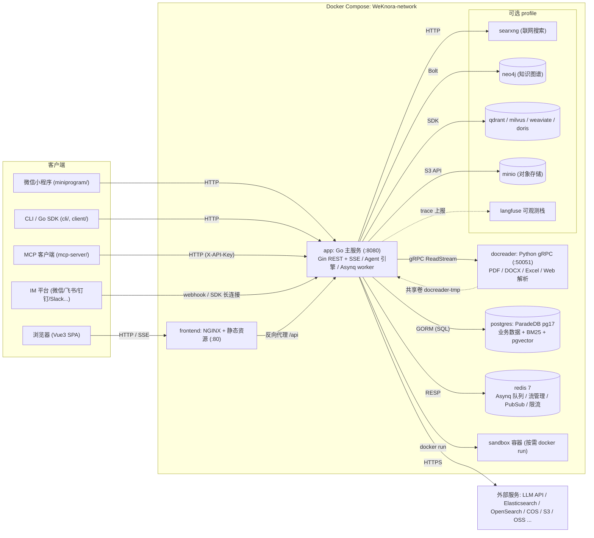
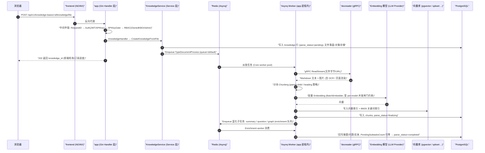

# 总体架构

本章从部署视角与代码视角两个维度介绍 WeKnora 的整体架构：系统由哪些进程/容器组成、各组件之间如何通信、使用了哪些技术栈，以及代码仓库的顶层目录布局。

## 1. 系统组成

WeKnora 采用"主服务 + 前端 + 文档解析微服务"的三进程核心架构，外加 PostgreSQL 与 Redis 两个基础设施依赖；其余组件（向量库、知识图谱、联网搜索等）均为可选，通过 Docker Compose profile 按需启用。

### 1.1 核心服务（默认启动）

| 服务 | 镜像 / 构建 | 端口 | 职责 |
| --- | --- | --- | --- |
| `app` | `wechatopenai/weknora-app`（`docker/Dockerfile.app`，Go） | `8080` | 主后端：REST API、RAG 检索、Agent 引擎、异步任务 worker、IM/Embed 渠道接入。健康检查 `GET /health` |
| `frontend` | `wechatopenai/weknora-ui`（`frontend/`，NGINX + Vue3 静态产物） | `80` | Web UI；NGINX 同时充当反向代理，将 `/api` 转发到 `app`（`APP_HOST`/`APP_BACKEND_PORT`/`APP_SCHEME` 可指向远端后端） |
| `docreader` | `wechatopenai/weknora-docreader`（`docker/Dockerfile.docreader`，Python） | `50051`（仅 compose 网络内 expose，不映射宿主机） | 文档解析微服务：gRPC 服务端，PDF/DOCX/Excel/EPUB/网页等 25+ 格式解析与页面渲染。健康检查 `grpc_health_probe` |
| `postgres` | `paradedb/paradedb:v0.22.2-pg17` | `5432`（网络内） | 主数据库。ParadeDB 发行版自带 BM25 全文检索与 pgvector 向量能力，因此**默认部署无需独立向量库**（`RETRIEVE_DRIVER=postgres`） |
| `redis` | `redis:7.0-alpine`（`appendonly` + `requirepass`） | `6379`（网络内） | Asynq 任务队列、SSE 流管理（跨实例）、system_settings 发布订阅、限流与分布式模型并发闸门 |
| `sandbox` | `wechatopenai/weknora-sandbox`（`docker/Dockerfile.sandbox`） | — | WeKnora 标准运行镜像；可直接用于空间 Docker 后端，接入 CubeSandbox/E2B 时则通过模板 API 自动注册并用于 Agent Skills |

`app` 与 `docreader` 之间还通过共享卷 `docreader-tmp`（挂载于 `/tmp/docreader`）传递解析产物图片；`app` 的本地文件存储卷为 `data-files`（`/data/files`）。

### 1.2 可选组件（Compose profile）

| 服务 | profile | 用途 |
| --- | --- | --- |
| `searxng`（+ 一次性 `searxng-init`） | `searxng` / `full` | 自托管元搜索引擎，为 Agent 提供 Web Search（默认绑定 `127.0.0.1:8888`） |
| `neo4j` | `neo4j` / `full` | 知识图谱存储（GraphRAG），开关为 `NEO4J_ENABLE`，Bolt 协议 `7687` |
| `minio` | `minio` / `full` | 对象存储（`STORAGE_TYPE=minio`） |
| `qdrant` / `milvus` / `weaviate` | 各自同名 profile | 独立向量库（`RETRIEVE_DRIVER` 切换） |
| `doris-fe` + `doris-be` | `doris` | Apache Doris 4.1 检索引擎（FE MySQL 9030 / FE HTTP 8030 Stream Load / BE 8040） |
| `odl-hybrid` | `odl-hybrid` | OpenDataLoader PDF 混合解析后端（docreader 通过 HTTP `:5002` 调用） |
| `dex` | `dex` / `full` | OIDC 测试用 IdP（配合 `OIDC_AUTH_ENABLE`） |
| `langfuse-*`（web/worker/clickhouse/minio/db-init） | `langfuse` | 自建 LLM 可观测栈，复用 WeKnora 的 postgres（新建 `langfuse` 库）与 redis（DB 1） |

此外，Go 后端还可直连未在 compose 内的外部引擎：Elasticsearch v7/v8、OpenSearch、腾讯云 VectorDB、火山 VikingDB，以及 8 种对象存储（local/MinIO/COS/TOS/S3/OSS/KS3/OBS）。

### 1.3 部署形态

除标准 Docker Compose 部署外，仓库还支持：

- **Lite 模式**：`DB_DRIVER=sqlite`（内置 sqlite-vec 向量扩展）+ 不配置 `REDIS_ADDR`（Asynq 退化为进程内 `SyncTaskExecutor`），单二进制运行，前端静态资源内嵌（`handler.Edition == "lite"` 时由 Go 进程直接托管）；
- **桌面版**：`cmd/desktop` 基于 Wails v2 打包为桌面应用；
- **Kubernetes**：`helm/` Chart；**裸机**：`deploy/` systemd 单元；**macOS**：`Formula/` Homebrew 配方。

## 2. 技术栈清单

| 层 | 技术 | 版本/说明 |
| --- | --- | --- |
| 后端语言 | Go | `go.mod` 声明 `go 1.26.0` |
| Web 框架 | `github.com/gin-gonic/gin` | v1.12.0 |
| ORM | `gorm.io/gorm` + postgres/sqlite driver | v1.31.1；SQLite 附带 `sqlite-vec` 向量扩展 |
| 依赖注入 | `go.uber.org/dig` | v1.19.0（构造函数注入，见后端设计篇） |
| 异步任务 | `github.com/hibiken/asynq` | v0.26.0（基于 Redis，6 个 worker 池） |
| 缓存/队列 | `github.com/redis/go-redis/v9` | v9.14.1 |
| 认证 | `github.com/golang-jwt/jwt/v5` + OIDC | JWT Bearer / X-API-Key / OIDC 三态 |
| 数据库迁移 | `github.com/golang-migrate/migrate/v4` | `migrations/versioned/*.up.sql`，启动时 `AUTO_MIGRATE` 自动执行 |
| 日志 | `github.com/sirupsen/logrus` + lumberjack 轮转 | 自研 formatter，request_id 贯穿 |
| 配置 | `github.com/spf13/viper` + `config/config.yaml` + 环境变量 | — |
| 可观测 | OpenTelemetry + Langfuse（`internal/tracing/langfuse`） | LLM 调用级 trace |
| gRPC | `google.golang.org/grpc` v1.81.0 | 调用 docreader |
| LLM 接入 | `sashabaranov/go-openai`、Ollama、腾讯云 LKE 等 | 18+ 模型提供商（OpenAI 兼容 / Ollama / 云厂商 SDK） |
| 向量/检索 | pgvector、ES v7/v8、OpenSearch、Qdrant、Milvus、Weaviate、Doris、腾讯 VectorDB、sqlite-vec | 由 `RETRIEVE_DRIVER` 与 `vector_stores` 表动态装配 |
| 知识图谱 | `neo4j-go-driver/v6` | 可选 |
| 数据分析 | DuckDB（`duckdb-go/v2`）、`pg_query_go` SQL 校验 | Agent 数据分析工具 |
| 协程池 | `panjf2000/ants/v2` | 文档处理并发池（`CONCURRENCY_POOL_SIZE`） |
| MCP | `mark3labs/mcp-go` v0.52.0 | Agent 外接 MCP 工具（含 OAuth） |
| API 文档 | swaggo/gin-swagger | 非 release 模式暴露 `/swagger` |
| 前端框架 | Vue 3（^3.5）+ TypeScript + Vite 7 | `frontend/package.json` |
| 前端 UI/状态 | TDesign Vue Next、Pinia、Vue Router 4、vue-i18n | Marked/KaTeX/Mermaid/highlight.js 渲染富文本 |
| 文档解析服务 | Python + grpcio | `docreader/main.py`；解析器位于 `docreader/parser/`（pdf/docx/excel/epub/web/image/markitdown/opendataloader 等） |
| 桌面端 | Wails v2 | `cmd/desktop` |

## 3. 进程间通信方式

| 链路 | 协议 | 说明 |
| --- | --- | --- |
| 浏览器 → `frontend`(NGINX) → `app` | HTTP/HTTPS（REST + SSE） | NGINX 反代 `/api`；聊天走 SSE 流式响应 |
| `app` → `docreader` | **gRPC**（默认 `docreader:50051`，`DOCREADER_TRANSPORT=grpc`，支持 TLS/mTLS 与 `GRPC_AUTH_TOKEN`） | proto 定义在 `docreader/proto/`；大文件走流式 `ReadStream` |
| `app` → `postgres` | PostgreSQL wire（GORM/pgx） | 业务数据 + BM25 + pgvector |
| `app` ↔ `redis` | RESP（支持 TLS） | ① Asynq 任务队列（文档解析/富化/Wiki 等 19 类任务）；② SSE 流断线续传的 Stream Manager（`STREAM_MANAGER_TYPE`）；③ `system_settings` 变更 Pub/Sub；④ Embed 渠道限流；⑤ 分布式 per-model 并发信号量 |
| `app` → `neo4j` | Bolt（`bolt://neo4j:7687`） | GraphRAG 实体/关系存取 |
| `app` → `searxng` / Web 搜索 provider | HTTP | SSRF 白名单校验（`SSRF_WHITELIST_EXTRA` 默认放行 compose 内 `searxng,qdrant,milvus,weaviate,doris-fe,doris-be`） |
| `app` → 向量库/对象存储/LLM 提供商 | 各自 SDK（HTTP/gRPC/MySQL 协议） | Doris 走 MySQL 协议 + Stream Load HTTP |
| `app` → `sandbox` | 本地 `docker run` | Skills 代码执行隔离 |
| `app` ↔ IM 平台 | HTTP webhook / 长连接 SDK | 微信、企业微信、飞书、钉钉、Slack、Telegram、QQ、Mattermost、云之家（`internal/im/`） |

## 4. 总体架构图

## 5. 典型请求链路：文档上传与解析入库

下图展示一篇文档从上传到可被检索的完整链路，覆盖了绝大多数组件间交互（同步 API、Asynq 异步任务、gRPC 解析、Embedding 与向量写入、富化子任务）：

对话链路（`POST /api/v1/knowledge-chat/:session_id` 或 agent-chat）则为同步 SSE：Handler → `SessionService` → `chat_pipeline` 插件流水线（query 理解 → 并行检索 → rerank → 合并 → Prompt 组装 → LLM 流式补全）→ 通过 Stream Manager（Redis/内存）将 token 流推回客户端，详见后端设计篇。

## 6. 代码仓库顶层目录导览

| 目录 | 职责 |
| --- | --- |
| `cmd/` | 可执行入口。`cmd/server`：主服务（main/bootstrap/listen + 平台信号处理）；`cmd/desktop`：Wails 桌面版；`cmd/download`：模型/资源下载辅助工具 |
| `internal/` | Go 后端全部业务代码（分层结构见后端设计篇）：`handler`、`application/service`、`application/repository`、`container`（DI）、`router`、`middleware`、`types`、`agent`、`im`、`mcp`、`stream`、`sandbox` 等 |
| `frontend/` | Vue3 + Vite + TDesign 的 Web 前端，构建产物由 NGINX 或 Lite 模式内嵌托管 |
| `docreader/` | Python gRPC 文档解析微服务：`main.py` 服务端入口、`parser/` 25+ 解析器、`splitter/` 分割器、`proto/` 协议定义、独立 `Dockerfile.docreader` 构建 |
| `cli/` | `weknora` 命令行工具（约 30 个子命令：部署、日志、备份、诊断等） |
| `client/` | Go SDK：以 HTTP 客户端形式封装 WeKnora API，供二次开发集成 |
| `mcp-server/` | Python 实现的 MCP Server（`weknora_mcp_server.py`），把 WeKnora API 暴露为 MCP 工具给 Claude 等 MCP 客户端 |
| `miniprogram/` | 微信小程序客户端（WXML/WXSS/JS） |
| `migrations/` | golang-migrate 数据库迁移：`versioned/`（Postgres 主线 `NNNNNN_*.up/down.sql`）、`sqlite/`（Lite 模式）、`paradedb/`、`mysql/` |
| `config/` | 运行配置：`config.yaml` 主配置、`builtin_agents.yaml` 内置 Agent、`agent_type_presets.yaml` Agent 预设、`builtin_models.yaml.example` 声明式内置模型、`prompt_templates/` 提示词模板 |
| `docker/` | 各镜像 Dockerfile（app/docreader/sandbox/odl-hybrid）与 searxng 配置 |
| `deploy/` | 裸机部署资源（systemd 服务单元等） |
| `helm/` | Kubernetes Helm Chart（Chart.yaml / values.yaml / templates/） |
| `skills/` | Agent Skills 技能包目录，`skills/preloaded/` 随镜像预装，可通过挂载 + `WEKNORA_SKILLS_DIR` 免重建扩展 |
| `dataset/` | 评估用 QA 数据集及生成脚本 |
| `examples/` | API 使用示例代码 |
| `scripts/` | 构建/启动/迁移辅助脚本（如 `start_all.sh`、`build_frontend_dist.sh`） |
| `tests/`、`testdata/` | 集成测试与测试数据 |
| `Formula/` | Homebrew 安装配方（macOS） |
| `misc/` | 杂项（如 `dex-config.yaml` OIDC 测试配置） |
| `packages/` | 预留的本地包目录 |
| `docs/` | 早期文档，部分内容已过时 |

> 说明：Go 模块路径为 `github.com/Tencent/WeKnora`；根目录还包含 `docker-compose.yml`（生产编排）与 `docker-compose.dev.yml`（开发编排）、`Makefile`、`VERSION` 等。

下一篇《Go 后端设计》将深入 `internal/` 内部：分层架构、dig 依赖注入、启动流程、路由与 RBAC、中间件、领域模型与错误/日志规范。
