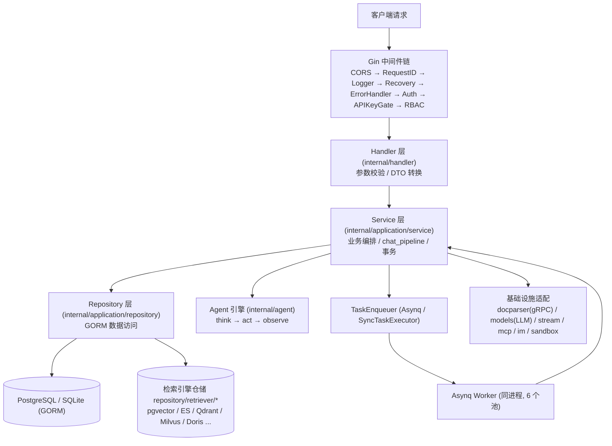
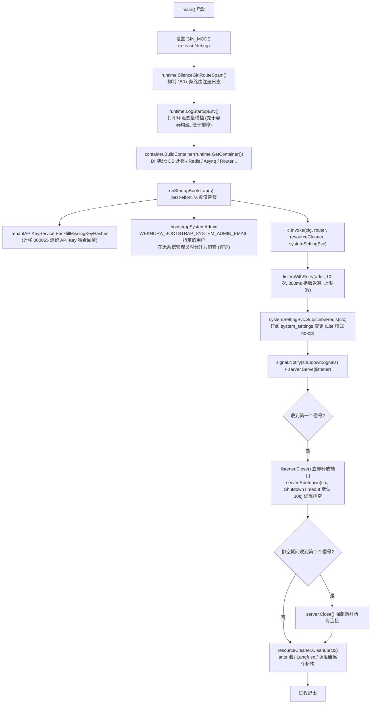
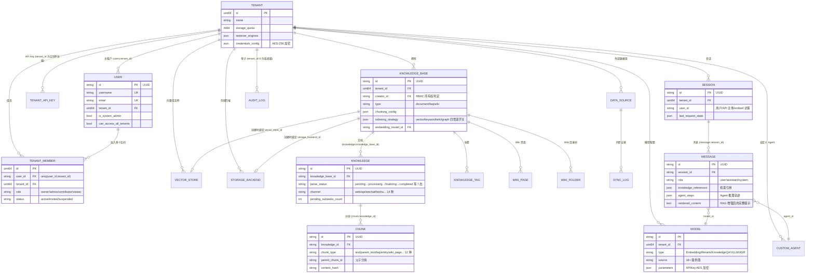

# Go 后端设计

本章深入 WeKnora Go 后端（`internal/` 与 `cmd/server`）的内部设计：分层架构、基于 uber/dig 的依赖注入、启动与优雅退出流程、路由组织与 RBAC 装配、全部 HTTP 中间件、领域模型、错误处理与日志规范，以及公共工具库。

## 1. 分层架构

后端遵循经典的 **Handler → Service → Repository → 数据库** 四层结构，层间依赖全部通过接口（`internal/types/interfaces/`）解耦，由 DI 容器在启动时装配：

| 层 | 位置 | 职责 |
| --- | --- | --- |
| Router / Middleware | `internal/router/`、`internal/middleware/` | 路由注册、认证、RBAC、限流、日志、错误信封 |
| Handler | `internal/handler/`（会话相关在 `internal/handler/session/`） | 解析请求参数（DTO 在 `internal/handler/dto/`）、调用 Service、写响应；不含业务逻辑 |
| Service | `internal/application/service/`（约 160+ 文件） | 业务编排：知识库/知识/分块、会话与 `chat_pipeline/` 流水线、Agent、租户与成员、模型、数据源同步、Wiki、审计等 |
| Repository | `internal/application/repository/`（约 60 文件） | 数据访问，统一使用 **GORM**（`type knowledgeRepository struct { db *gorm.DB }`，操作走 `r.db.WithContext(ctx)`）；检索引擎的仓储实现按引擎分包于 `repository/retriever/{postgres,elasticsearch,qdrant,milvus,weaviate,doris,opensearch,tencentvectordb,sqlite,neo4j}` |
| 领域模型 | `internal/types/` | GORM 实体、枚举、context key、接口定义（`types/interfaces`） |
| 基础设施 | `internal/infrastructure/`（docparser gRPC 客户端、web_search）、`internal/models/`（chat/embedding/rerank 模型适配）、`internal/stream/`、`internal/sandbox/`、`internal/mcp/`、`internal/im/` | 外部系统适配 |



关键约定：

- Handler 只依赖 Service 接口（如 `interfaces.KnowledgeService`），Service 只依赖 Repository 接口与其他 Service 接口；
- 所有接口集中声明在 `internal/types/interfaces/`，实现方通过 dig 绑定；
- Asynq worker 与 HTTP server 运行在**同一个进程**内，任务处理函数复用同一套 Service。

## 2. 依赖注入：internal/container（uber/dig）

WeKnora 使用 **`go.uber.org/dig` v1.19.0**（构造函数注入容器，非代码生成的 wire）。入口是 `internal/container/container.go` 的 `BuildContainer`：

```go
// cmd/server/main.go
c := container.BuildContainer(runtime.GetContainer())

// internal/container/container.go
func BuildContainer(container *dig.Container) *dig.Container {
    must(container.Provide(NewResourceCleaner, dig.As(new(interfaces.ResourceCleaner))))
    must(container.Provide(config.LoadConfig))
    must(container.Provide(initDatabase))     // *gorm.DB
    must(container.Provide(initRedisClient))  // *redis.Client（可为 nil：Lite 模式）
    ...
    must(container.Provide(repository.NewTenantRepository))
    must(container.Provide(service.NewTenantService))
    ...
    must(container.Provide(router.NewRouter)) // 最终产出 *gin.Engine
    return container
}
```

`runtime.GetContainer()`（`internal/runtime/container.go`）持有全局单例 `dig.Container`；`must(err)` 对注册失败直接 panic——DI 装配错误属于启动期致命错误。

### 2.1 用到的 dig 特性

| 特性 | 用法示例 |
| --- | --- |
| `dig.As` | 把具体类型绑定为接口：`container.Provide(NewResourceCleaner, dig.As(new(interfaces.ResourceCleaner)))`；`router.NewAsyncqClient` 绑定为 `interfaces.TaskEnqueuer` |
| `dig.Name` 命名依赖 | 同一接口多实例：4 个抽取服务（`chunkExtractor`/`dataTableSummary`/`imageMultimodal`/`knowledgePostProcess`）、6 个 Asynq server（`coreAsynqServer`/`postProcessAsynqServer`/`enrichmentAsynqServer`/`maintenanceAsynqServer`/`sharedAsynqServer`/`wikiAsynqServer`）、`wikiIngest` |
| `dig.In` 参数结构体 | `router.RouterParams` 内嵌 `dig.In`，一次性注入约 60 个 Handler/Service 依赖，避免超长构造函数签名 |
| `container.Invoke` 执行副作用 | 注册即启动的后台组件：`registerPoolCleanup`、`registerWebSearchProviders`、`startDataSourceScheduler`、`startHousekeepingService`、`startAuditLogRetention`、`startTemporaryDocumentCleanup`、15 个 `chatpipeline.NewPluginXxx`（Search/Rerank/WebFetch/Merge/DataAnalysis/QueryUnderstand/LoadHistory/ChatCompletionStream 等插件自注册到 EventManager）、`router.RunAsynqServer`、`recoverPendingWikiTasks` 等 |
| 适配器 Provide | 用闭包做接口转换：`func(s *service.StorageBackendService) interfaces.StorageBackendService { return s }`；`RetrieveEngineRegistry` 同实例同时暴露为 `StoreRegistry` |

### 2.2 注册顺序与条件装配

`BuildContainer` 的注册分为九个阶段（源码中有对应日志）：① 核心基础设施（config/langfuse/db/file/redis/ants 池）→ ② 检索引擎注册表 → ③ 外部客户端（docreader gRPC、Ollama、Neo4j、StreamManager、DuckDB）→ ④ Repository 层（30+ 个）→ ⑤ Service 层（50+ 个，含 MCP Manager、事件总线、Agent 审批闸门 `approval.Gate`）→ ⑥ **任务执行器条件装配** → ⑦ chat_pipeline 插件 → ⑧ Handler 层（40+ 个）与 IM 适配器 → ⑨ Router 与 Asynq server 启动。

第 ⑥ 步是全仓库最重要的条件分支——**Redis 有无决定运行形态**：

```go
redisAvailable := os.Getenv("REDIS_ADDR") != ""
if redisAvailable {
    must(container.Provide(router.NewAsyncqClient, dig.As(new(interfaces.TaskEnqueuer))))
    must(container.Provide(router.NewCoreAsynqServer, dig.Name("coreAsynqServer")))
    ... // 共 6 个 worker 池 + AsynqInspector
    must(container.Invoke(registerModelConcurrencyLimiter))   // Redis 分布式 per-model 并发闸门
} else {
    syncExec := router.NewSyncTaskExecutor()                  // Lite 模式：进程内同步执行器
    must(container.Provide(func() interfaces.TaskEnqueuer { return syncExec }))
    must(container.Provide(router.NewNoopTaskInspector))
    must(container.Invoke(registerLiteModelConcurrencyLimiter)) // 进程内信号量
}
```

6 个 Asynq worker 池的并发度可经 system settings / 环境变量调整（默认 Core=8、PostProcess=2、Enrichment=12、Maintenance=4、Shared=6、Wiki=8，`WEKNORA_ASYNQ_*_CONCURRENCY`）；队列拓扑定义在 `internal/types/task.go`（default、chat_attachment、postprocess、summary、multimodal、graph、question、sync、low/maintenance、wiki 等，共 19 类任务）。

### 2.3 资源清理与工厂

- `ResourceCleaner`（`internal/container/cleanup.go`）：各组件通过 `RegisterWithName(name, cleanupFunc)` 注册析构（ants 池、Langfuse flush、数据源调度器、Housekeeping 等），退出时统一 `Cleanup(ctx)`；
- `EngineFactory`（`internal/container/engine_factory.go`）：根据 `vector_stores` 表行运行时创建检索引擎实例（`createQdrantEngine` / `createMilvusEngine` / `createDorisEngine` / `createOpenSearchEngine` ...），而非启动期静态绑定单一引擎；
- `initDatabase` 除建连外还负责：golang-migrate 自动迁移（`AUTO_MIGRATE`，失败仅告警不阻断）、`__pending_env__` 存储 provider 回填、遗留 StorageBackend 迁移、序列同步、Lite 模式 pending 任务复位、`config/builtin_models.yaml` 声明式内置模型 UPSERT；SQLite 时强制 `SetMaxOpenConns(1)` 串行化写入。

## 3. cmd/server 启动流程

`cmd/server` 仅三个逻辑文件：`main.go`（入口与 HTTP 生命周期）、`bootstrap.go`（一次性引导钩子）、`listen.go`（端口重试），另有 `signals_unix.go`/`signals_windows.go` 提供平台化 `shutdownSignals`。



要点：

- **引导钩子刻意 best-effort**：`bootstrap.go` 注释明确"配置错误不应 brick 部署"，所有失败路径只 `logger.Warnf`；系统管理员晋升仅当部署中尚无任何超管时生效，UI 撤销不会被重启还原；
- **两段式优雅退出**：第一个 SIGTERM/SIGINT 先关 listener（新进程可立即绑定端口）再 `Shutdown` 排空存量连接；第二个信号强制 `Close`；
- **端口占用重试**：`listenWithRetry` 以 300ms 起步指数退避重试 10 次（滚动重启场景旧进程尚未释放端口时避免直接失败）。

## 4. 路由组织与 RBAC 装配（internal/router）

### 4.1 NewRouter 的装配顺序

`internal/router/router.go` 的 `NewRouter(params RouterParams)`（`RouterParams` 为 `dig.In` 结构体）按以下顺序装配，**顺序即安全语义**：

1. `gin.New()` + `SetTrustedProxies`（`WEKNORA_TRUSTED_PROXIES`，默认仅信任回环与私网段，防止伪造 `X-Forwarded-For` 绕过按 IP 限流）；
2. 全局中间件：`cors` → `RequestID` → `Language` → `Logger` → `Recovery` → `ErrorHandler`；
3. 免认证端点：`GET /health`；非 release 模式挂载 `/swagger/*any`；
4. Embed 页面 `frame-ancestors` CSP 中间件；Lite 版内嵌前端静态资源（`handler.Edition == "lite"`）；
5. **认证之前**注册的公开路由：IM 平台回调（`/api/v1/im`，各平台自带签名验证）、Web Embed 公开路由（`/api/v1/embed/:channel_id`，`middleware.EmbedAuth` publish-token 鉴权 + Redis 限流）、短时效能力 URL（resource grants）；
6. `middleware.Auth(...)` 全局认证；随后是需认证的文件代理路由、免认证但签名校验的 presigned 文件路由、Langfuse trace 中间件、`AuditServiceProvider`；
7. `v1 := r.Group("/api/v1")`：先 `v1.Use(rbacGuards.apiKeyAuthorizer.Middleware())`（API Key 网关，JWT 会话直接放行），再依次调用 30 个 `RegisterXxxRoutes(v1, handler, rbacGuards)`；
8. 收尾自检：`rbacGuards.assertAPIKeyPoliciesMatchRoutes(r)` —— 若声明的 API Key 策略指向不存在的路由模板（路径漂移/拼写错误），**启动即 panic**，避免上线一条永远 403 的死策略。

### 4.2 路由分组一览

| 分组前缀 | Register 函数 | API Key 策略示例 |
| --- | --- | --- |
| `/auth`、`/me` | RegisterAuthRoutes / RegisterMyInvitationRoutes | 多数免 Key |
| `/tenants`、`/tenants/:id/*`（成员/邀请/审计） | RegisterTenantRoutes | `manage_members` / `manage_spaces`；`/:id` 组挂 `PathTenantMatch()` |
| `/knowledge-bases`、`/knowledge-bases/:id/knowledge|faq|tags|shares` | RegisterKnowledgeBaseRoutes 等 | `retrieve` / `ingest`（fallback `full_access`） |
| `/knowledge`、`/chunks` | RegisterKnowledgeRoutes / RegisterChunkRoutes | `ingest` |
| `/sessions`、`/knowledge-chat`、`/agent-chat`、`/knowledge-search`、`/messages` | RegisterSessionRoutes / RegisterChatRoutes 等 | `chat` / `retrieve` |
| `/models`、`/evaluation` | RegisterModelRoutes / RegisterEvaluationRoutes | `manage_models` / `run_evaluations` |
| `/system`、`/system/admin` | RegisterSystemRoutes / RegisterSystemAdminRoutes | admin 组强制 `g.SystemAdmin()` |
| `/mcp-services`、`/agent`、`/web-search`、`/web-search-providers` | 对应 Register 函数 | `manage_mcp_services` / `manage_web_search` |
| `/vector-stores`、`/storage-backends` | RegisterVectorStoreRoutes / RegisterStorageBackendRoutes | `manage_vector_stores` / `manage_storage_backends` |
| `/agents`、`/agents/:id/shares|embed-channels|im-channels` | RegisterCustomAgentRoutes 等 | `full_access` / `manage_channels` |
| `/organizations`、`/user/favorites`、`/skills` | 对应 Register 函数 | `manage_spaces` 等 |
| `/im-channels`、`/embed-channels`、`/wechat` | RegisterIMChannelRoutes / RegisterEmbedChannelRoutes | `manage_channels` |
| `/datasource`、`/knowledgebase/:kb_id/wiki`、`/chunker/preview` | RegisterDataSourceRoutes / RegisterWikiPageRoutes / RegisterChunkerDebugRoutes | `manage_datasources` / `ingest` |

### 4.3 rbacGuards：集中式权限矩阵

`internal/router/rbac.go` 定义 `rbacGuards`，由 `NewRouter` 构造一次后传入每个 Register 函数。守卫分三类，路由行内联使用，一眼可见权限要求：

```go
kb.PUT("/:id", g.OwnedKBOrAdmin(), handler.UpdateKnowledgeBase)
```

- **角色守卫**（问"调用者在租户内是什么角色"）：`Viewer()` / `Contributor()` / `Admin()` / `Owner()` / `AdminOrSystemAdmin()` / `SystemAdmin()`，底层调 `middleware.RequireRole`；
- **所有权守卫**（问"是否为该资源创建者或 Admin+"）：`OwnedKBOrAdmin()`、`OwnedAgentOrAdmin()`、`OwnedKnowledgeKBOrAdmin()`、`OwnedChunkKBOrAdmin()`、`OwnedWikiKBOrAdmin()` 等——子资源（chunk/wiki/FAQ/tag）通过 `KBCreatorLookupFromKnowledgeID` 等闭包沿 URL 参数回溯到所属 KB 的 `creator_id`，与父资源共用同一条规则；
- **知识库访问守卫**（三层解析：自有 KB / 跨组织共享 KB / 共享 Agent 可见 KB）：`KBAccessRead|Write(param)` 及 `...FromKnowledgeIDParam` / `...FromChunkIDParam` 变体，底层为 `middleware.RequireKBAccess`；
- **租户边界守卫**：`CrossTenant()`（平台级操作需 `EnableCrossTenantAccess` + `CanAccessAllTenants`）、`PathTenantMatch()`（`/tenants/:id` 必须与上下文租户一致）。

源码注释给出了选择守卫的决策树（有 creator 的资源用 OwnedXxxOrAdmin；租户级基础设施用 Admin；创建入口用 Contributor），并明确所有守卫尊重 `cfg.Tenant.EnableRBAC` 开关——关闭时仅记录"本应拒绝"日志后放行（灰度迁移期行为）。

**API Key 策略**与角色守卫正交：`apiKeyGroup(grp, policy)` 包装 gin RouterGroup，在注册路由的同时把 `(method, fullPath) → APIKeyRoutePolicy` 写入 `APIKeyRouteAuthorizer` 策略表；策略构造器有 `apiKeyFullAccess()`、`apiKeyPlatform(...)` 及 17 种能力包装器（`apiKeyRetrieve` / `apiKeyChat` / `apiKeyIngest` / `apiKeyManageModels` ...）。未注册策略的路由对 API Key 主体默认 **fail-closed 拒绝**。

## 5. 中间件清单（internal/middleware）

按请求经过的先后顺序：

| 中间件 | 文件 | 职责与关键逻辑 |
| --- | --- | --- |
| `cors.New`（gin-contrib） | router.go | 允许 `Authorization`、`X-API-Key`、`X-Tenant-ID`、`X-Embed-Session` 等头；MaxAge 12h |
| `RequestID()` | logger.go | 复用请求头 `X-Request-ID` 或生成 UUID，写入 gin context 与 `Request.Context()`，贯穿日志/追踪 |
| `Language()` | language.go | 决定文档处理语言：`WEKNORA_LANGUAGE` 环境变量 > `Accept-Language` 首个标签 > 默认 `zh-CN` |
| `Logger()` | logger.go | 请求/响应全量日志；正则脱敏密码/令牌字段、截断 base64 图片 data URL、SSE 响应标记跳过、单条上限 10KB |
| `Recovery()` | recovery.go | panic 捕获 + 堆栈记录 + 500 响应 |
| `ErrorHandler()` | error_handler.go | 读取 `c.Errors` 末位错误：`*errors.AppError` 按其 `HTTPCode` 返回 `{success:false, error:{code,message,details}}` 统一信封；其余 500 |
| `EmbedAuth(...)` | embed_auth.go | 仅挂在 `/api/v1/embed/:channel_id` 公开组：校验 publish token，注入 Embed 渠道上下文；Redis 三级限流（每 IP/分钟、渠道全局/分钟、渠道/日） |
| `PublicAuthRateLimit()` | auth_public_ratelimit.go | 免认证的邀请查询/受邀注册路由：**进程内存**滑动窗口，60s/30 次/IP，后台每 2 分钟清理过期桶，超限返回 429 |
| `Auth(...)` | auth.go | 核心认证，三态：① JWT（`Authorization: Bearer`，`userService.ValidateToken`）；② API Key（`X-API-Key`，`AuthenticateAPIKey`）；③ `noAuthAPI` 白名单。支持 `X-Tenant-ID` 切换租户（`IsTenantAccessible` 三层校验：自有租户/跨租户超管/active membership），`resolveTenantRole` 解析租户内角色。写入 context：`TenantIDContextKey`、`TenantInfoContextKey`、`UserContextKey`、`UserIDContextKey`、`TenantRoleContextKey`、`SystemAdminContextKey`、`PrincipalContextKey` 等 |
| `langfuse.GinMiddleware()` | tracing/langfuse | LLM 可观测 trace；未配置 LANGFUSE_* 时为 no-op |
| `AuditServiceProvider()` | audit_provider.go | 把 `AuditLogService` 注入 gin context，供 RBAC 拒绝路径记审计；服务为 nil 时优雅降级 |
| `APIKeyRouteAuthorizer.Middleware()` | api_key_gate.go | API Key 主体的路由级网关：查 `(method, fullPath)` 策略表，校验 `PlatformOnly` / `RequireFullAccess` / `Capabilities`；未声明路由默认拒绝；JWT 用户直接透传 |
| `RequireRole(min)` 等 | rbac.go | 租户内角色下限校验（owner=40 > admin=30 > contributor=20 > viewer=10）；`RequireOwnershipOrRole(min, creatorLookup)` 允许资源创建者越过角色下限；API Key 主体短路（其授权归 APIKeyGate）；跨租户超管临时获得 Admin；拒绝时调用 `AuditService.LogDenied` |
| `RequireCrossTenantAccess()` / `RequirePathTenantMatch()` | access.go | 平台级操作网关与 URL 租户一致性校验 |
| `RequireKBAccess(resolver, perm, ...)` | kb_access.go | KB 三层访问解析（自有 → 组织共享 → 共享 Agent 只读），并**改写** `Request.Context()` 中的 `TenantIDContextKey` 为 KB 源租户，使下游检索自动落到正确租户的数据 |
| `asynqdl.Middleware()` | asynqdl/ | 非 HTTP：Asynq 任务重试预算耗尽时写入 `task_dead_letters` 表，可挂 `OnDeadLetter` 回调联动业务状态（如标记知识解析失败） |

## 6. 领域模型总览（internal/types）

`internal/types/` 含约 26 个 GORM 持久化实体。核心关系：



设计要点：

- **多租户隔离**：几乎所有实体带 `TenantID`；`tenant_id=0` 表示系统级（如系统审计）；
- **敏感字段静态加密**：`Model.Parameters`、`VectorStore.ConnectionConfig`、`StorageBackend.Config`、`DataSource.Config`、`TenantAPIKey.APIKey` 等在 GORM `Value()` 时以 `SYSTEM_AES_KEY`（32 字节）做 AES-256-GCM 加密、`Scan()` 时宽松解密（解密失败视为未配置而非报错）；
- **创建时绑定不可变**：KB 的 `VectorStoreID`（gorm tag `<-:create`）与 `StorageBackendID` 一经创建不可修改，保证索引/文件一致性；
- **异步状态机**：`Knowledge.ParseStatus` 七态 + `PendingSubtasksCount` 追踪 finalizing 阶段并行富化子任务（summary/question/graph）；
- **审计 append-only**：`AuditLog` 无更新/软删字段，覆盖 50+ 种 `AuditAction`；
- 非实体的重要类型：`SearchResult` 检索结果、`Pagination`、`Task`/队列拓扑（`task.go`）、各类 JSONB 配置结构（`ChunkingConfig`、`IndexingStrategy`、`CustomAgentConfig` 等）、context key 与取值助手（`context_helpers.go`）。

## 7. 错误处理规范（internal/errors）

统一错误载体是 `AppError`：

```go
// internal/errors/errors.go
type AppError struct {
    Code     ErrorCode // 业务错误码
    Message  string
    Details  any
    HTTPCode int       // HTTP 状态映射
}
```

- **错误码分段**：1000–1999 通用 HTTP 语义（`ErrBadRequest=1000`、`ErrUnauthorized=1001`、`ErrForbidden=1002`、`ErrNotFound=1003`、`ErrTooManyRequests=1006`、`ErrServiceUnavailable=1008`）；2000–2099 租户；2100–2199 Agent；2200–2299 向量库；
- **构造函数**：`NewBadRequestError` / `NewUnauthorizedError` / `NewForbiddenError` / `NewNotFoundError` / `NewValidationError` / `NewConflictError` / `NewTooManyRequestsError` / `NewServiceUnavailableError` 等；
- **配合方式**：Handler/中间件用 `c.Error(appErr)` 挂错，`ErrorHandler` 中间件末端统一渲染 `{success:false, error:{code,message,details}}` 信封，前端据 `error.code` 做 i18n；非 `AppError` 一律 500；
- `session.go` 提供会话域哨兵错误（`ErrSessionNotFound` 等）；`parse_error_codes.go` 定义文档解析阶段的字符串错误码（`DOCREADER_TIMEOUT`、`EMBEDDING_RATE_LIMIT`、`VECTORSTORE_WRITE_FAILED`、`TASK_TIMEOUT` 等），落在 `Knowledge.ErrorMessage` 供前端翻译展示。

## 8. 日志体系（internal/logger）

- 基于 **logrus**，私有 `appLogger` 单例 + 自定义 Formatter（彩色终端输出；`LOG_FORMAT` 可用 `%d` `%level` `%traceId` `%msg` 等占位符自定义模板；`LOG_PATH` 设置后经 lumberjack 轮转写文件并剥离 ANSI 颜色码）；
- **request_id 贯穿**：`middleware.RequestID` 写入 context → `logger.GetLogger(ctx)` 自动提取并注入 `request_id` 字段；常用出口为 `logger.Infof/Warnf/Errorf(ctx, format, ...)` 与 `ErrorWithFields`；
- **LLM 调试日志**（`llm_logger.go`）：`LLM_DEBUG_LOG=true` 时启用，按 request_id 分文件记录每次 LLM 调用（`LLMCallRecord`：CallType Chat/Embedding/Rerank/VLM、模型、耗时、完整消息与工具调用、错误），7 天自动清理——排查 Prompt/上下文问题的第一工具。

## 9. 关键工具库（internal/common、internal/utils）

| 位置 | 工具 | 用途 |
| --- | --- | --- |
| `common/tools.go` | `Deduplicate` / `DeduplicateWithScore`、`ParseLLMJsonResponse`、`CleanInvalidUTF8`、`PipelineLog` 系列 | 泛型去重（检索合并保最高分）、解析 LLM 返回的 ```json 代码块、清洗非法 UTF-8、RAG 管道阶段日志 |
| `common/db_retry.go` | `WithDeadlockRetry(ctx, fn)` | 数据库死锁检测重试（最多 3 次，50→100→200ms 退避） |
| `common/redis_tls.go` | `RedisTLSConfig()` | 按 `REDIS_USE_TLS` 等环境变量生成 Redis TLS 配置 |
| `utils/crypto.go` | `EncryptAESGCM` / `DecryptAESGCM`（`enc:v1:` 前缀，幂等） | 上文所有敏感字段静态加密的底层实现 |
| `utils/security.go` | `SanitizeHTML`、`ValidateFilePath`、`SanitizeForLog` | XSS 清洗、目录穿越防护、日志脱敏 |
| `utils/inject.go` | `ValidateSQL`（基于 `pganalyze/pg_query_go`） | Agent 数据分析生成 SQL 的白名单表校验与注入模式检测 |
| `utils/presign.go` | `GeneratePresignURL` / `ValidatePresignURL` | HMAC-SHA256 预签名文件 URL（默认 2h，IM 内嵌图片使用） |
| `utils/oidc_state.go` | `GenerateState` / `ValidateState` | OIDC 授权 state 的 HMAC 签名与 10 分钟 TTL（防 CSRF） |
| `utils/log_sanitize.go` | `CompactImageDataURLForLog` | 截断超长图片 data URL，防日志爆炸 |
| `utils/storage_error.go` | `SanitizeStorageConnectivityError` | 把存储连接错误转为用户友好提示并隐藏内部主机名 |
| 其余 | `taskid.go` / `fileutil.go` / `filesize.go` / `httputil.go` / `json.go` | 任务 ID、文件与大小格式化、HTTP 下载、JSON Schema 生成等 |

---

至此，后端从进程启动、依赖装配、请求进入到数据落库的全链路已经闭环。后续章节将分别展开 RAG 检索流水线（`chat_pipeline`）、Agent 引擎（`internal/agent`）与文档解析服务（`docreader`）的内部实现。
