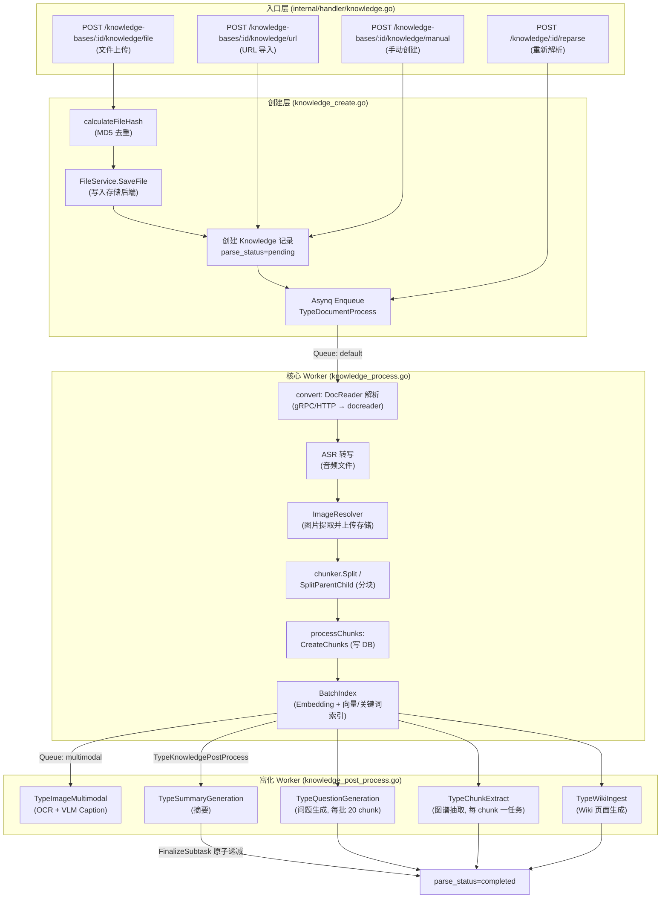
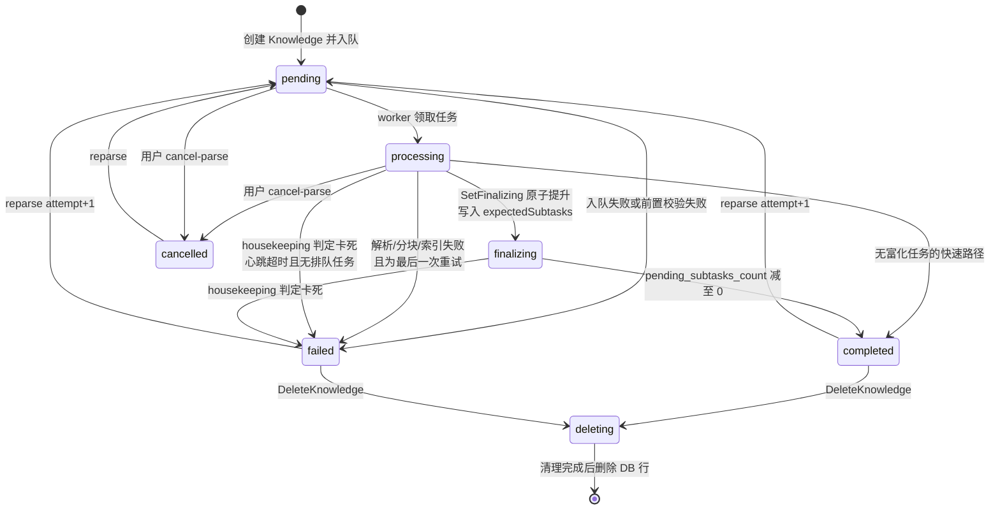

# 文档入库流程（Document Ingestion Pipeline）

本文完整描述 WeKnora 中一篇文档从"上传"到"可检索"的全链路：入口 API → 文件存储 → 异步任务 → 解析（docreader）→ 分块 → 向量化 → 索引写入 → 后处理富化（摘要 / 问题生成 / 图谱 / Wiki / 图片多模态）→ 状态机与进度追踪，以及失败重试、Housekeeping 自愈、删除清理、FAQ 导入与知识克隆/移动等配套链路。

各环节对应的源码位置：

| 环节 | 源码位置 |
|------|----------|
| HTTP 入口 | `internal/handler/knowledge.go`、`internal/router/router.go` |
| 创建与入队 | `internal/application/service/knowledge_create.go`、`knowledge_task_options.go` |
| 文件存储 | `internal/application/service/file/`（`factory.go`、各后端实现） |
| 解析基础设施 | `internal/infrastructure/docparser/`、`docreader/`（Python 服务） |
| 主处理管线 | `internal/application/service/knowledge_process.go` |
| 处理配置合并 | `internal/application/service/knowledge_process_config.go` |
| 后处理 | `internal/application/service/knowledge_post_process.go`、`image_multimodal.go` |
| 进度追踪 | `internal/application/service/knowledge_span_tracker.go`、`internal/types/knowledge_span.go` |
| 自愈 | `internal/application/service/knowledge_housekeeping.go` |
| 删除 | `internal/application/service/knowledge_delete.go` |
| FAQ | `internal/application/service/knowledge_faq.go`、`knowledge_faq_import.go` |
| 克隆/移动 | `internal/application/service/knowledge_clone_move.go` |

## 1. 总体架构

WeKnora 的入库链路是一条**基于 Asynq（Redis）的分布式异步管道**。HTTP Handler 只负责落库与入队，所有耗时工作（解析、向量化、LLM 富化）都由独立的 Worker 池消费队列完成。



## 2. 入口层：三种创建方式

路由注册在 `internal/router/routes_knowledge.go`：

```go
kb.POST("/file",   g.OwnedKBOrAdmin(), g.KBAccessWrite("id"), handler.CreateKnowledgeFromFile)
kb.POST("/url",    g.OwnedKBOrAdmin(), g.KBAccessWrite("id"), handler.CreateKnowledgeFromURL)
kb.POST("/manual", g.OwnedKBOrAdmin(), g.KBAccessWrite("id"), handler.CreateManualKnowledge)
```

配套的管理端点：`POST /knowledge/:id/reparse`（重新解析）、`POST /knowledge/:id/cancel-parse`（取消解析）、`POST /knowledge/batch-reparse`、`POST /knowledge/batch-delete`、`POST /knowledge/move`（跨库移动）。

### 2.1 文件上传（CreateKnowledgeFromFile）

- 表单参数：`file`、`fileName`、`metadata`、`enable_multimodel`、`tag_ids`、`process_config`（每次上传可覆盖 KB 级处理配置，见 §5）。
- 流程：扩展名校验 → MD5 去重 → `FileService.SaveFile` 存储 → 创建 `Knowledge` 记录 → 入队。

### 2.1.1 统一的扩展名闸门

`internal/application/service/knowledge_util.go` 里的 `supportedImportFileExtensions` 是**所有导入路径的唯一事实来源**——直接上传、文件 URL 下载、以及 worker 下载完成后的复检都查同一张表：

```
pdf txt docx doc epub html htm mhtml md markdown
png jpg jpeg gif csv xlsx xls pptx ppt json
mp3 wav m4a flac ogg
```

此前 URL 导入维护着一份更短的独立白名单，导致「直接上传 xlsx 可以、URL 导入 xlsx 被拒」这类不一致（#2447）；现在统一由 `isSupportedImportExtension()` / `validateImportFileType()` 判定，视频类型会给出「暂不支持上传视频文件」的明确提示。

表格类扩展名（`csv` / `xlsx` / `xls`，`dataTableFileExtensions`）在文档处理任务之后额外挂一个表摘要任务（`enqueueDataTableSummaryIfNeeded`）。

图片、音频类文件的额外前置校验（对象存储配置是否完整、VLM / ASR 模型是否配置）与 `process_config` 校验一起收敛到 `resolveFileImportProcessConfig()`，上传与 URL 导入共用。

### 2.2 URL 导入（CreateKnowledgeFromURL）

- JSON Body：`{url, file_name?, file_type?, enable_multimodel?, title?, tag_ids?, channel?, process_config?}`。
- `isFileURL()` 按上面的统一扩展名集合判断这是「下载文件」还是「抓取网页」。
- Handler 与 Service 双层做 SSRF 防护（`internal/handler/knowledge.go` 与 `knowledge_create.go` 均调用）：

```go
if err := secutils.ValidateURLForSSRF(req.URL); err != nil {
    c.Error(errors.NewBadRequestError(secutils.FormatSSRFError("URL", req.URL, err)))
    return
}
```

Worker 侧在真正抓取前会再次校验（`knowledge_process.go` 的 `convert()`），三重防线防止 TOCTOU。

### 2.3 手动创建（CreateManualKnowledge）

- JSON Body 为 `types.ManualKnowledgePayload{Title, Content, Status, TagIDs, Channel, ProcessConfig}`，支持草稿（Draft）状态；发布时走 `triggerManualProcessing()` 进入与文件相同的分块/索引管线（跳过 DocReader 阶段）。

### 2.4 去重机制

`knowledge_create.go` 对上传文件计算 MD5，并按四元组查库：

```go
hash, err := calculateFileHash(file) // MD5
exists, existingKnowledge, err := s.repo.CheckKnowledgeExists(ctx, tenantID, kbID,
    &types.KnowledgeCheckParams{
        Type:     "file",
        FileName: fileName,
        FileType: getFileType(fileName),
        FileSize: file.Size,
        FileHash: hash,
    })
if exists {
    return existingKnowledge, types.NewDuplicateFileError(existingKnowledge)
}
```

命中时不重复入库，返回已有 Knowledge 并附带 `DuplicateFileError`（前端据此提示"文件已存在"）。`FileType` 参与判定：重复只在**同一文件类型内**成立，因此内容完全相同的 `notes.md` 与 `notes.txt` 会作为两条独立知识共存（`CheckKnowledgeExists` 在哈希与「文件名 + 大小」两条分支上都追加了 `LOWER(file_type)` 条件）。

### 2.5 初始状态

新建 Knowledge 记录的关键初始字段（`knowledge_create.go`）：

```go
knowledge := &types.Knowledge{
    ID:           uuid.New().String(),
    Type:         "file",        // 或 "url" / "manual"
    ParseStatus:  "pending",     // 初始解析状态
    EnableStatus: "disabled",    // 索引完成前不可检索
    FileHash:     hash,
    ...
}
```

对 CSV/Excel 数据表类知识，创建后还会额外入队 `TypeDataTableSummary`（`datatable:summary`）任务，生成 `table_summary` / `table_column` 类型的 Chunk 用于表格问答。

## 3. 文件存储层（FileService 与存储后端）

### 3.1 接口定义

`internal/types/interfaces/file.go`：

```go
type FileService interface {
    CheckConnectivity(ctx context.Context) error
    SaveFile(ctx context.Context, file *multipart.FileHeader, tenantID uint64, knowledgeID string) (string, error)
    SaveBytes(ctx context.Context, data []byte, tenantID uint64, fileName string, temp bool) (string, error)
    GetFile(ctx context.Context, filePath string) (io.ReadCloser, error)
    GetFileURL(ctx context.Context, filePath string) (string, error)
    DeleteFile(ctx context.Context, filePath string) error
    CopyFile(ctx context.Context, srcPath string, tenantID uint64, knowledgeID string) (string, error)
}
```

### 3.2 支持的存储后端

工厂函数 `NewFileServiceFromStorageConfig()`（`internal/application/service/file/factory.go`）根据 `types.StorageEngineConfig.DefaultProvider` 选择后端。实际支持的后端清单：

| Provider | 路径前缀 | 实现文件 | 说明 | 关键配置 |
|----------|----------|----------|------|----------|
| `local` | `local://` | `file/local.go` | 单机本地磁盘 | `LocalEngineConfig.PathPrefix`，基目录取 `LOCAL_STORAGE_BASE_DIR`，外链签名取 `APP_EXTERNAL_URL` |
| `minio` | `minio://` | `file/minio.go` | MinIO / S3 兼容 | `MinIOEngineConfig`（`mode: docker` 时读环境变量 `MINIO_ENDPOINT` / `MINIO_ACCESS_KEY_ID` / `MINIO_SECRET_ACCESS_KEY` / `MINIO_BUCKET_NAME`；`mode: remote` 时读配置字段） |
| `cos` | `cos://` | `file/cos.go` | 腾讯云 COS | `SecretID/SecretKey/Region/BucketName/AppID`，支持独立临时桶 `TempBucketName/TempRegion` |
| `oss` | `oss://` | `file/oss.go` | 阿里云 OSS | `Endpoint/Region/AccessKey/SecretKey/BucketName`，支持临时桶 |
| `s3` | `s3://` | `file/s3.go` | AWS S3 / 兼容协议 | `Endpoint/Region/AccessKey/SecretKey/BucketName/UseSSL/ForcePathStyle` |
| `tos` | `tos://` | `file/tos.go` | 火山引擎 TOS | 同上，支持临时桶 |
| `obs` | `obs://` | `file/obs.go` | 华为云 OBS | `Endpoint/Region/AccessKey/SecretKey/BucketName/UseSSL` |
| `ks3` | `ks3://` | `file/ks3.go` | 金山云 KS3 | `Endpoint/Region/AccessKey/SecretKey/BucketName` |
| `dummy` | `dummy://` | `file/dummy.go` | 测试用空实现 | 无 |

### 3.3 对象 Key 组织规则

- 正式文件：`{tenantID}/{knowledgeID}/{uuid或纳秒时间戳}{ext}`，例如 `local://12345/kb-001/1722045600000000000.pdf`。
- 导出/临时/克隆产物：`{tenantID}/exports/{fileName}_{timestamp}{ext}`。
- 路径安全：`secutils.SafePathUnderBase`（防目录穿越）、`secutils.SafeFileName`、对象存储侧 `utils.SafeObjectKey`。

### 3.4 两个包装层

- **`backend_scoped.go`**：多存储后端部署时给路径加实例前缀，形如 `storage://{backendID}/{innerPath}`，`wrap/unwrap` 编解码并拒绝跨后端操作。KB 可通过 `StorageBackendID` 绑定到具体后端实例。
- **`resource_catalog.go`**：把物理路径注册为稳定的 `resource://{uuid}` 引用，支持 `Bind`（资源与 knowledge 等 owner 关联）、`MarkDeleted`、`CreateAccessGrant`（生成临时访问令牌，产出 `/r/{token}` 形式的 URL）。应用层持有 `resource://` 引用即可无感迁移底层存储。

## 4. 异步任务机制（Asynq + Redis）

### 4.1 入队

`knowledge_create.go` 组装 `types.DocumentProcessPayload`（含 `TenantID/KnowledgeID/KnowledgeBaseID/FilePath/FileName/FileType/EnableMultimodel/EnableQuestionGeneration/QuestionCount/Language/Attempt` 等），任务选项来自 `knowledge_task_options.go`：

```go
opts := []asynq.Option{
    asynq.Queue(types.QueueDefault),
    asynq.Timeout(config.DocumentProcessTimeout(cfg)), // 默认 30 分钟
    asynq.MaxRetry(3),                                  // 失败最多重试 3 次
}
task := asynq.NewTask(types.TypeDocumentProcess, payloadBytes, opts...)
info, err := s.task.Enqueue(task)
```

入队失败时会将 `ParseStatus` 置为 `failed`（文件已保存，可通过 reparse 重新触发）。

### 4.2 队列拓扑与 Worker 池

`internal/types/task.go` 定义的队列：

| 队列常量 | 名称 | 用途 |
|----------|------|------|
| `QueueDefault` | `default` | 核心文档处理（解析/分块/嵌入/索引） |
| `QueuePostProcess` | `postprocess` | 后处理编排任务 |
| `QueueSummary` | `summary` | 摘要 / 问题生成类 LLM 任务 |
| `QueueMultimodal` | `multimodal` | 图片 OCR / VLM Caption |
| `QueueMaintenance` | `low` | 维护类任务（FAQ 批量导入等） |

默认并发数（`internal/types/task.go`）：核心池 `DefaultCoreWorkerConcurrency = 8`、后处理池 `2`、富化池 `12`、维护池 `4`。

### 4.3 失败重试语义

- `TypeDocumentProcess`：`MaxRetry(3)` → 初始 + 3 次重试共 4 次尝试；每次尝试受 `DocumentProcessTimeout`（默认 30 分钟）约束。
- Payload 携带 `Attempt`（重新解析时取历史最大 attempt+1）；Span Tracker 用 attempt 隔离每轮处理的进度树，新 attempt 会"取代"（supersede）旧任务的收尾动作。
- 处理函数区分"是否最后一次 asynq 尝试"（`isLastRetry`）：非最后一次的失败直接返回错误让 asynq 重试，最后一次才把 `ParseStatus` 落为 `failed` 并写 `ErrorMessage`。

## 5. 处理配置：KB 默认值 + 单次上传覆盖

`knowledge_process_config.go` 的 `ResolveProcessConfig(kb, overrides)` 把 KB 默认配置与上传时携带的 `process_config`（`types.KnowledgeProcessOverrides`）合并为 `types.EffectiveProcessConfig`：

- 可覆盖项：`ChunkingConfig`（chunk 大小/重叠/策略/父子分块等）、`EnableMultimodel`、`VLMConfig`、`ASRConfig`、`QuestionGenerationConfig`、`GraphEnabled`、`ExtractConfig`、`ParserEngineRules`。
- 约束：`eff.GraphEnabled = eff.GraphEnabled && eff.ExtractConfig.Enabled`（图谱依赖抽取配置开启）。
- `ValidateProcessOverrides` 会按文件类型前置校验：上传图片必须配 VLM 模型，上传音频必须配 ASR 模型，多模态还要求对象存储配置完整（`validateImageMultimodalConfig`）。
- 覆盖配置通过 `knowledge.SetProcessOverrides` 持久化在 Knowledge 行上，reparse 时沿用。

哪些管线会跑由 KB 的 `IndexingStrategy`（`internal/types/indexing_strategy.go`）决定：

```go
type IndexingStrategy struct {
    VectorEnabled  bool // 语义向量索引
    KeywordEnabled bool // BM25 关键词索引
    WikiEnabled    bool // 自动 Wiki 页面生成
    GraphEnabled   bool // 知识图谱抽取
}
```

`NeedsEmbedding() = Vector || Keyword`，`NeedsChunks() = 任一开启`。默认值为 vector+keyword 开启。

## 6. 核心处理管线（knowledge_process.go）

Worker 消费 `TypeDocumentProcess` 后按五个规范化阶段推进，每个阶段对应一个 Span（见 §8）：

`docreader → chunking → embedding → multimodal → postprocess`

### 6.1 解析（convert，Stage: docreader）

1. `beginStage(StageDocReader)` 记录输入（file_name/file_type/is_url）。
2. URL 模式再次 `ValidateURLForSSRF`，失败即 `failStage` + `ParseStatus=failed`。
3. 引擎选择：`eff.ChunkingConfig.ResolveParserEngine(fileType)`（URL 用虚拟类型 `"url"`），按 KB 配置的 `ParserEngineRules`（文件类型 → 引擎）路由；`MergeParserEngineOverrides` 合并租户级与上传级引擎参数覆盖。
4. `resolveDocReader` 返回 `interfaces.DocReader`：
   - **builtin**：通过 gRPC（`docparser/grpc_parser.go`）或 HTTP（`http_parser.go`）调用 Python **docreader** 服务；
   - **simple**：Go 原生解析 md/txt/csv/json/图片/音频（`builtin_converter.go`，CSV→Markdown 表格、JSON→递归分割的代码块，图片/音频转占位引用）；
   - **anydoc**：Go 进程内解析 docx/doc/pptx/ppt/xlsx/xls/odf/rtf/epub/csv/pdf（`anydoc_reader.go`），底层是通过 cgo 链接的 anydoc Rust 库。office 文档的嵌入图按文档模型插回 Markdown 原位；无文字层的扫描件 PDF 在 DocReader 可用时回退到 builtin 整页渲染。仅在带 `anydoc` 构建标签的二进制中可用，其余构建里该引擎在引擎列表中显示为不可用；
   - **weknoracloud / mineru / mineru_cloud / paddleocr_vl / paddleocr_vl_cloud**：HTTP 转换器（`engines.go` 注册，按 `mineru_endpoint`、`mineru_api_key`、`paddleocr_vl_endpoint` 等配置判定可用性）。

引擎目录集中在 `internal/infrastructure/docparser/engines.go`：每个引擎同时声明元数据（名称、描述、文件类型、可用性探针）与 `NewReader` 工厂，`docparser.NewReader` 按名字分发，未注册的名字（如只存在于 docreader 的 `markitdown`）落到 docreader 客户端。
5. 文件模式：从 `FileService.GetFile(payload.FilePath)` 读回字节填入 `ReadRequest.FileContent`。

**docreader 服务侧**（`docreader/`，Python gRPC）：proto 定义 `docreader/proto/docreader.proto`，服务方法 `Read` / `ReadStream`（流式：首帧 meta + 每图一帧，避免大扫描件 PDF 触发 gRPC 消息上限）/ `ListEngines`。内置 parser 覆盖 docx/doc/pdf/md/xlsx/xls/epub/html/htm/mhtml/图片/网页（`WebParser` 处理 URL），并可选注册 `markitdown`（微软 MarkItDown）与 `opendataloader`（PDF 版面分析，需 Java 11+）引擎，Go 侧通过 `ListEngines` 自发现远程引擎。返回统一为 `ReadResult{MarkdownContent, ImageRefs, Metadata, IsAudio, AudioData}` —— **解析产物统一是 Markdown 文本 + 图片字节**，图片持久化由 Go 侧负责。

### 6.2 ASR 转写（音频文件）

`convertResult.IsAudio` 为真时（音频文件解析为占位符 + 原始字节）：

```go
asrModel, err := s.modelService.GetASRModel(ctx, eff.ASRConfig.ModelID)
transcriptionResult, err := asrModel.Transcribe(ctx, convertResult.AudioData, knowledge.FileName)
```

转写文本替换 MarkdownContent 后继续走普通文本管线；未配置 ASR 则直接失败。

### 6.3 图片提取与上传

`docparser/image_resolver.go` 的 `ImageResolver.ResolveAndStore`：

1. 依次处理 `<!link>` 包装图、`data:` URI、HTML 内联 base64、裸 base64、docreader 返回的 `ImageRefs` 内联字节；
2. 过滤图标级小图（宽高 < 64px 或 < 512 字节，`IsOriginal=true` 的原始上传件除外）；
3. `SaveBytes` 上传到当前 KB 的存储后端，`savedRefs` 缓存去重；
4. 把 Markdown 中的引用重写为存储 URL（`markdown_image_scanner.go` 精确定位 `` 位置）。

随后 `ResolveRemoteImages` 再把 Markdown 里的外部 `http(s)` 图片下载转存（同样受 SSRF 防护）。产出 `storedImages []docparser.StoredImage` 供多模态阶段使用。

### 6.4 分块（Stage: chunking）

分块在 **Go 侧**完成（`internal/infrastructure/chunker`，详见《分块机制》一章）：

```go
chunkCfg := buildSplitterConfigFromChunking(eff.ChunkingConfig)
if eff.ChunkingConfig.EnableParentChild {
    parentCfg, childCfg := buildParentChildConfigs(eff.ChunkingConfig, chunkCfg)
    pcResult := chunker.SplitParentChild(convertResult.MarkdownContent, parentCfg, childCfg)
    // children → types.ParsedChunk（含 ParentIndex）；parents → ParsedParentChunk
} else {
    splitChunks := chunker.Split(convertResult.MarkdownContent, chunkCfg)
}
```

### 6.5 写库与索引（processChunks，Stage: chunking + embedding）

`processChunks` 是核心装配函数：

1. **父块**（父子分块模式）：为每个 parent 建 `ChunkTypeParentText` 记录，串好 `PreChunkID/NextChunkID` 链表；父块**只入 DB、不进向量索引**（检索命中子块后回捞父块内容）。
2. **文本块**：每个 `ParsedChunk` 建 `ChunkTypeText` 记录，携带 `StartAt/EndAt`（原文 rune 偏移，可用于还原/高亮）与内存态 `ContextHeader`（标题面包屑，不落库）；父子模式下写 `ParentChunkID`。
3. `chunkService.CreateChunks(ctx, insertChunks)` 批量写库；失败则 `ParseStatus=failed` + `failStage(StageChunking)`。
4. **向量化与索引**（`kb.NeedsEmbeddingModel()` 时）：

```go
indexContent := titlePrefix + chunk.EmbeddingContent() // 标题 + 面包屑 + 内容
indexInfoList = append(indexInfoList, &types.IndexInfo{
    Content: indexContent, SourceID: chunk.ID, SourceType: types.ChunkSourceType,
    ChunkID: chunk.ID, KnowledgeID: knowledge.ID, KnowledgeBaseID: ..., IsEnabled: true,
})
err = retrieveEngine.BatchIndex(ctx, embeddingModel, indexInfoList)
```

   索引失败时执行**补偿回滚**：删除已写入的 chunks（`DeleteChunksByKnowledgeID`）并清向量索引（`DeleteByKnowledgeIDList`），置 `failed`，保证不留半成品。
5. **图片多模态任务扇出**：`enableMultimodel && len(storedImages) > 0` 时，`enqueueImageMultimodalTasks` 为**每张图片**入队一个 `TypeImageMultimodal` 任务（`QueueMultimodal`），payload 含 `ImageURL/EnableOCR/EnableCaption/Attempt/ImageIndex`。
6. `finalizeIndexedKnowledgeState`：若还有多模态/后处理要跑则保持 `processing`，否则直接 `completed`；同时置 `EnableStatus="enabled"`（此刻文档即可被检索）并累计租户存储用量。

### 6.6 后处理编排（knowledge_post_process.go，Stage: postprocess）

多模态全部完成（或无多模态）后入队 `TypeKnowledgePostProcess`。该任务是**富化子任务的编排器**，用原子计数器保证终态收敛：

```go
willSpawnSummary  := len(textChunks) > 0
willSpawnQuestion := willSpawnSummary && kb.NeedsEmbeddingModel() && eff.QuestionGenerationConfig.Enabled
willSpawnWiki     := kb.IndexingStrategy.WikiEnabled && len(textChunks) > 0
willSpawnGraph    := eff.GraphEnabled && len(textChunks) > 0
// questionGenChunkBatchSize = 20：问题生成按每 20 个 chunk 一批
expectedSubtasks = summary(0/1) + questionBatchCount + wiki(0/1) + graphChunkCount

// 原子地把 parse_status 从 processing 提升为 finalizing，并写入 pending_subtasks_count
promoted, err := s.knowledgeRepo.SetFinalizing(ctx, payload.KnowledgeID, expectedSubtasks)
```

- `expectedSubtasks == 0` 走快速路径直接 `completed`。
- 每个子任务终态退出时调用 `FinalizeSubtask` 原子递减 `pending_subtasks_count`，减到 0 时自动升级为 `completed`。
- **短缺协调**：若实际入队数少于计划数（如某队列入队失败），立即补偿递减差额，防止永远卡在 `finalizing`。
- `finalizeSubtaskDetached`（`knowledge.go`）：递减动作使用 `context.WithoutCancel` + 10 秒超时的**脱离上下文**执行，避免 worker 优雅退出时 ctx 取消导致计数丢失、知识永久滞留 `finalizing`。

四类富化子任务：

| 任务 | 队列 | 粒度 | 说明 |
|------|------|------|------|
| `TypeSummaryGeneration` | `summary` | 每知识 1 个 | 生成文档摘要，`summary_status` 独立状态机 |
| `TypeQuestionGeneration` | question 队列 | 每 20 个 chunk 一批 | 为 chunk 生成检索问题 |
| `TypeChunkExtract` | graph 队列 | 每 chunk 1 个 | 实体/关系抽取写入图引擎 |
| `TypeWikiIngest` | wiki 队列 | 防抖批量 | 生成/更新 Wiki 页面 |

#### 摘要刷新（knowledge_summary_refresh.go）

首次入库之外，分块内容编辑、分块启停、自定义元数据变更都会让已有摘要过期，此时入队一次**摘要刷新**（也可由 `POST /knowledge/:id/regenerate-summary` 手动触发）：

- 任务开始时记录输入快照：各源分块的 `content_revision` / `is_enabled`，以及 `custom_metadata` 的版本；
- 生成完成后用 `summarySourceChanged()` 复核快照。若期间又被编辑，返回 `ErrSummaryRefreshStale`，**丢弃本次结果且不改动 `summary_status`**，让更新的那次刷新收尾——否则旧摘要会覆盖新摘要；
- 数据库读取失败与「输入已变更」分开处理，避免把瞬时读错误当成过期任务静默丢弃；
- 刷新跑在 Asynq worker 里，没有 HTTP 中间件注入的租户上下文，因此 `restoreSummaryRefreshTenantInfo()` 会重建完整租户配置——检索引擎工厂需要它。

### 6.7 图片多模态（image_multimodal.go）

`ImageMultimodalService.Handle` 消费单图任务：

1. `readImageBytes` 从存储/URL 取图；`resolveVLM` 取 KB 的 VLM 配置；
2. 生成 Caption（VLM，prompt 由 `buildVLMCaptionPrompt` 按 `DescriptionLanguage/CustomInstructions` 组装）与 OCR 文本；
3. 结果写回所属文本 Chunk 的 `ImageInfo`（JSON），并创建/更新两个**子 Chunk**：`ChunkTypeImageCaption` 与 `ChunkTypeImageOCR`，`ParentChunkID` 指向文本块，随后单独 `indexChunks` 入向量索引 —— 使"搜图片描述也能召回原文块"；
4. `shouldDropOrphanedMultimodal` 检查父块是否已被删除/取代，孤儿任务直接丢弃；
5. `checkAndFinalizeAllImages`：全部图片处理完毕后，`enqueueKnowledgePostProcessTask` 触发 §6.6 的后处理编排。

## 7. 状态机

### 7.1 Knowledge 主状态（ParseStatus）

`internal/types/knowledge.go` 定义的完整取值：

| 值 | 含义 |
|----|------|
| `pending` | 已创建，等待 worker 领取 |
| `processing` | 解析/分块/嵌入/多模态执行中 |
| `finalizing` | 主流程完成，等待富化子任务（`pending_subtasks_count > 0`） |
| `completed` | 全部完成 |
| `failed` | 处理失败（`ErrorMessage` 记录原因） |
| `deleting` | 删除中（防并发标记） |
| `cancelled` | 用户取消解析 |

辅助状态：`EnableStatus ∈ {enabled, disabled}`（是否可检索，索引成功即 enabled，不等富化）；`SummaryStatus ∈ {none, pending, processing, completed, failed}`。



### 7.2 阶段级进度（Span Tracker）

`knowledge_span_tracker.go` + `internal/types/knowledge_span.go` 提供逐阶段进度树（前端时间线即由此渲染）：

- 五个规范阶段：`StageDocReader / StageChunking / StageEmbedding / StageMultimodal / StagePostProcess`（`types.AllStages`）。
- Span 状态：`pending / running / done / failed / skipped / cancelled`。`skipped` 用于主动跳过（如未开启多模态），`cancelled` 用于上游失败连带取消。
- 每轮处理有独立 `Attempt`（`repo.NextAttempt`），根 Span `name="knowledge_processing"`、`Kind=SpanKindRoot`；阶段以 `beginStage / endStage / failStage / skipStage` 打点，输入输出记录在 `JSONMap`（如 `chunks_planned` / `chunks_written` / `total_text_chars`）。
- 每次打点同时 `touchKnowledgeHeartbeat` 刷新心跳 —— Housekeeping 用它区分"慢但活着"与"真的卡死"。

## 8. Housekeeping 自愈（knowledge_housekeeping.go）

后台每 **5 分钟**一轮（`WEKNORA_HOUSEKEEPING_ENABLED` 可关闭），修复因 worker 崩溃 / Redis 丢任务导致的僵尸状态：

**Sweep A —— 卡死知识恢复**，三阶段过滤：

1. 粗筛：`parse_status IN (pending, processing, finalizing) AND updated_at < cutoff`；
2. `filterByLastSpanActivity`：查 `knowledge_processing_spans` 的 `MAX(updated_at)` 心跳，心跳仍在阈值内的保留（仍在处理），无任何 span 的也判为卡死；
3. `filterOutQueued`：通过 asynq TaskInspector 检查是否仍有排队任务，有则保留（只是在排队）。

判定卡死的知识被更新为：

```sql
UPDATE knowledge SET parse_status = 'failed',
    error_message = 'task stuck in processing > [threshold], recovered by housekeeping',
    pending_subtasks_count = 0
WHERE id IN (stuck_ids)
```

阈值 `staleThreshold() = max(1h, DocumentProcessTimeout) + 10min`。

**Sweep B —— 摘要卡死恢复**：`summary_status = 'processing' AND updated_at < 1 小时前` → 置 `failed`。

## 9. 删除清理链路（knowledge_delete.go）

`DeleteKnowledge(ctx, id)` 的顺序经过精心设计（**先删行、后删文件**，失败可重试）：

1. 标记 `ParseStatus = deleting`（阻止并发任务写入）；
2. 对 `pending/processing` 状态的知识执行 `dequeueKnowledgeTasks()` 取消队列中的下游任务；
3. **errgroup 并行清理**四类资源：
   - 向量/关键词索引：`retrieveEngine.DeleteByKnowledgeIDList`（按 embedding 维度与 KB 类型路由）；
   - Wiki：`cleanupWikiOnKnowledgeDelete`（写 Redis tombstone → 清 pending ingest → reconcile 现有页面 → 入队 WikiRetract）；
   - Chunks：`chunkService.DeleteChunksByKnowledgeID`；
   - 图谱：`graphEngine.DelGraph`；
4. 删除 Tag 关联 → 删除 Knowledge 数据库行；
5. **最后 best-effort 清理物理文件**：源文件 + 从 `chunk_image_info` 收集的所有提取图片（`collectImageURLs` + `deleteExtractedImages`），并回冲租户存储统计。

批量版 `DeleteKnowledgeList` 预加载各 KB 的 FileService、按 KB 分组图片 URL、按 embedding 模型分组删索引，避免 goroutine 内重复查询。

## 10. FAQ 类知识导入（knowledge_faq.go / knowledge_faq_import.go）

FAQ 知识库不走文档解析管线：每个 FAQ KB 只有**一个** Knowledge 实例（`ensureFAQKnowledge`），每条问答对是一个 `ChunkTypeFAQ` 的 Chunk，元数据存于 `Chunk.Metadata`：

```go
type FAQChunkMetadata struct {
    StandardQuestion  string   // 标准问
    SimilarQuestions  []string // 相似问
    NegativeQuestions []string // 反例问（负例过滤, 不参与索引）
    Answers           []string
    AnswerStrategy    AnswerStrategy // "all" | "random"
    ...
}
```

- **单条创建** `CreateFAQEntry`：清洗校验 → 查重（`checkFAQQuestionDuplicate`）→ 构建 Chunk（`buildFAQChunkContent` 按 `FAQIndexMode` 决定是否把答案写进 Content）→ `indexFAQChunks` 同步索引 → `ChunkStatusIndexed`。
- **索引模式**（KB 级配置）：`FAQIndexModeQuestionOnly`（`question_only`，仅索引问题）/ `FAQIndexModeQuestionAnswer`（`question_answer`，问题+答案）；问题索引又分 `FAQQuestionIndexModeCombined`（标准问+相似问合并一个向量）与 `FAQQuestionIndexModeSeparate`（每个相似问独立向量，source_id 形如 `{chunkID}-{index}`，支持增量索引 `incrementalIndexFAQEntry`）。
- **批量导入** `UpsertFAQEntries`：
  - 模式 `append`（追加/合并）或 `replace`（全量替换），支持 `DryRun` 仅校验；
  - 超过 200 条或 50KB 时条目先 `SaveBytes` 上传对象存储，payload 只带 `EntriesURL`；
  - 入队 `TypeFAQImport` → `QueueMaintenance`，`MaxRetry 5`（dry-run 3），Timeout 2 小时；同一 KB 同时只允许一个导入任务（Redis 锁）；
  - 去重基于 `CalculateFAQContentHash`：对标准问/相似问/反例/答案**归一化**（去 URL、转小写、繁转简、全角转半角、智能空格）后 SHA256；
  - append 模式做四阶段校验（标准问冲突→整条失败；相似问/反例冲突→部分失败仅剔除冲突项；标准问已存在→合并并集）；
  - 进度写 Redis（`FAQImportProgress`：`pending/processing/completed/failed`、成功/失败/部分失败/跳过计数），失败条目导出为带 UTF-8 BOM 的 CSV 供下载。

## 11. 知识克隆与移动（knowledge_clone_move.go）

### 11.1 克隆（CloneKnowledgeBase / CloneChunk）

- KB 级克隆先复制 KB 配置，再按集合差（`AminusB`）增删 Knowledge，并行处理（删除批 10、克隆逐个）。
- Chunk 级克隆（批量 100）复制 `Text/ParentText/Summary/ImageCaption/ImageOCR` 五类 chunk：
  - **图片深拷贝**：`cloneChunkImageInfo` 从源存储读字节 → 写入目标租户 `exports/` 命名空间，`urlCache` 去重；`rewriteContentImageURLs` 将 Content 中旧 URL 全部替换（最长 URL 优先避免部分匹配）；
  - 标签映射 `getOrCreateTagInTarget`（同名复用，否则新建）；
  - 重建 `PreChunkID/NextChunkID/ParentChunkID` 映射后批量插入；
  - 向量索引通过 `retrieveEngine.CopyIndices()` 直接复制，不重算 embedding。
- FAQ KB 克隆走差量同步：`chunkRepo.FAQChunkDiff` 按 `content_hash` 算出增/删/匹配三组，匹配对仅同步状态（`IsEnabled/Flags/TagID/AnswerStrategy`）。
- 进度写 Redis（`KBCloneProgress`）。

### 11.2 移动（ProcessKnowledgeMove）

门槛检查：源/目标 KB **类型必须相同**且 **EmbeddingModelID 必须相同**。两种模式：

- `reuse_vectors`：要求 `sourceKB.SharesStoreWith(targetKB)`（同一向量存储实例），`CopyIndices` 复制索引 → 删源索引 → `MoveChunksByKnowledgeID` 改 chunk 归属 → 清 Tag 关联 → 更新 Knowledge 的 KB ID；
- `reparse`：跨向量存储时使用。`cleanupKnowledgeResources`（删索引/chunks/图谱/回冲存储统计）→ Knowledge 重置为 `pending` 挂到目标 KB → 重新入队 `TypeDocumentProcess`（manual 类型走 `triggerManualProcessing`）。

## 12. 端到端时序小结

一篇启用了多模态、问题生成与图谱的 PDF，完整旅程是：

1. `POST /knowledge-bases/:id/knowledge/file` → MD5 去重 → `cos://tenant/kb/uuid.pdf` → Knowledge(`pending`) → asynq `document:process`；
2. Worker：Span attempt=1 开根 → `docreader` 阶段 gRPC 调 Python 服务拿 Markdown+图片字节 → 图片上传存储并重写 URL → `chunking` 阶段 Go chunker 切块 → 写 chunks → `embedding` 阶段 BatchIndex → `EnableStatus=enabled`（此刻已可检索）→ 每图入队 multimodal 任务；
3. 多模态 worker 逐图 OCR+Caption，生成 image_caption/image_ocr 子 chunk 并索引；全部完成后触发 post-process；
4. 编排器计算 `expectedSubtasks`（1 摘要 + N/20 问题批 + M 图谱 + 0/1 Wiki）→ `SetFinalizing` → 扇出；每个子任务终态 `FinalizeSubtask` 递减，减到 0 → `completed`；
5. 期间任一环节僵死，Housekeeping 5 分钟一轮按"updated_at + span 心跳 + 队列检查"三重判据回收为 `failed`，用户可 reparse（attempt+1）重来。
