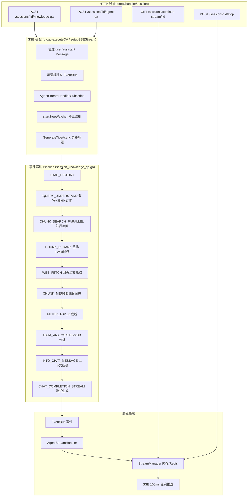
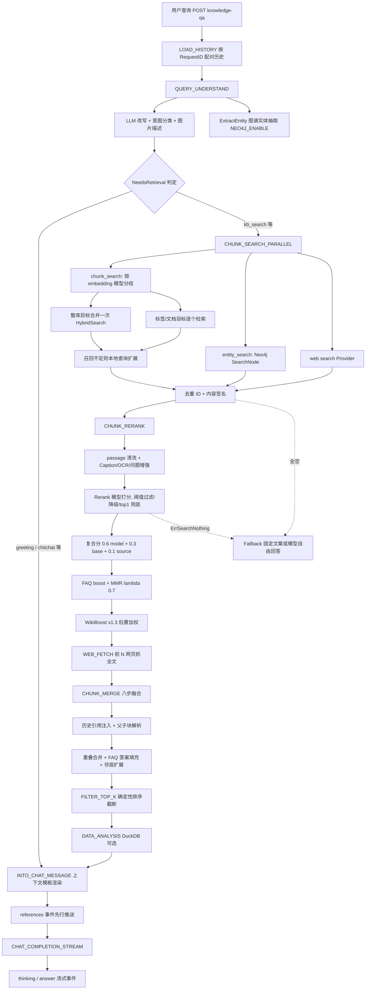
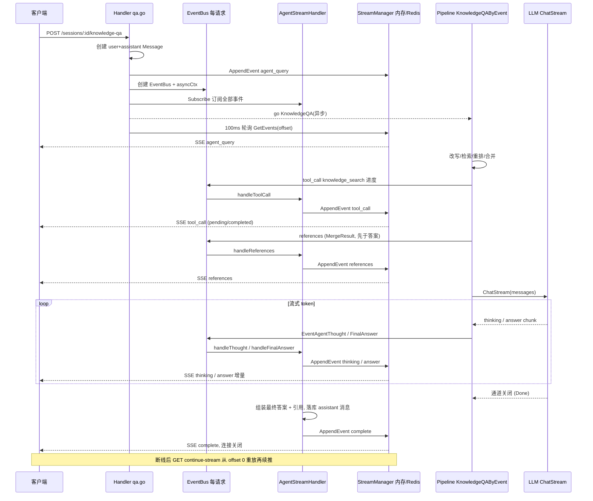

# 检索问答全流程（RAG Pipeline）

本文完整描述 WeKnora 中一次"知识问答"请求从 HTTP 入口到流式回答落盘的全链路：SSE 会话装配 → 事件驱动 Pipeline（意图识别 / 查询改写 / 并行检索 / 重排 / 融合合并 / 过滤 / 数据分析 / 上下文组装 / 流式生成）→ 引用（citation）展开 → 流式输出与断线续传。

各环节对应的源码位置：

| 环节 | 源码位置 |
|------|----------|
| HTTP 入口 / SSE 装配 | `internal/handler/session/qa.go`、`helpers.go`、`stream.go` |
| EventBus → 流事件桥接 | `internal/handler/session/agent_stream_handler.go` |
| Pipeline 编排 | `internal/application/service/session_knowledge_qa.go` |
| 插件框架与全部阶段插件 | `internal/application/service/chat_pipeline/` |
| 插件注册（DI 容器） | `internal/container/container.go` |
| 事件/状态类型 | `internal/types/chat_manage.go`、`internal/types/chat.go`、`internal/event/event.go` |
| 跨库混合检索 | `internal/application/service/knowledgebase_search*.go` |
| 流管理器（断线续传） | `internal/stream/`（`factory.go`、`memory_manager.go`、`redis_manager.go`） |
| 会话 / 消息管理 | `internal/application/service/session.go`、`message.go` |
| 引用别名与展开 | `internal/llmreference/`、`internal/llmresource/` |
| 文本工具 | `internal/searchutil/` |
| Prompt 模板 | `config/prompt_templates/`、`internal/config/config.go` |

## 1. 总体架构

WeKnora 的问答链路是一条**事件驱动的插件管线（Event-Driven Plugin Pipeline）**：每个阶段是一个实现了 `Plugin` 接口的插件，注册到 `EventManager` 上；编排器（`KnowledgeQAByEvent`）按动态组装的 `EventType` 列表逐个触发事件，插件通过责任链（`next()`）串联。生成结果不直接写 HTTP 响应，而是通过每请求独立的 `EventBus` 发布事件，由 `AgentStreamHandler` 落入共享 `StreamManager`（内存或 Redis），HTTP 层以 100ms 轮询将事件推给 SSE 客户端——这一设计天然支持**断线重连续传**与**分布式多副本部署**。



## 2. 事件驱动的插件框架

### 2.1 Plugin 接口与责任链

`internal/application/service/chat_pipeline/chat_pipeline.go` 定义了核心抽象：

```go
type Plugin interface {
    OnEvent(ctx context.Context, eventType types.EventType,
        chatManage *types.ChatManage, next func() *PluginError) *PluginError
    ActivationEvents() []types.EventType
}
```

`EventManager` 维护 `eventType → []Plugin` 映射。`Register` 时按注册顺序追加，并用 `buildHandler` 从后往前构造嵌套闭包责任链：**同一事件上先注册的插件在链外层，后注册的在内层**，外层插件在 `OnEvent` 内调用 `next()` 才会进入内层。插件可以在 `next()` 之前做前置处理（多数插件），也可以先 `next()` 再做后置处理（如 `PluginWikiBoost` 在重排之后加权）。

错误通过 `*PluginError` 传播，预定义错误包括 `ErrSearchNothing`（检索无结果，触发兜底回复而非失败）、`ErrRerank`、`ErrGetChatModel`、`ErrModelCall` 等（`chat_pipeline.go`）。

### 2.2 注册顺序（container.go）

所有插件在 DI 容器中通过 `container.Invoke` 构造并自注册（`internal/container/container.go`），注册顺序即同事件链上的执行顺序：

```go
must(container.Provide(chatpipeline.NewEventManager))
must(container.Invoke(chatpipeline.NewPluginSearch))               // CHUNK_SEARCH
must(container.Invoke(chatpipeline.NewPluginRerank))               // CHUNK_RERANK（链外层）
must(container.Invoke(chatpipeline.NewPluginWebFetch))             // WEB_FETCH
must(container.Invoke(chatpipeline.NewPluginMerge))                // CHUNK_MERGE
must(container.Invoke(chatpipeline.NewPluginDataAnalysis))         // DATA_ANALYSIS
must(container.Invoke(chatpipeline.NewPluginIntoChatMessage))      // INTO_CHAT_MESSAGE
must(container.Invoke(chatpipeline.NewPluginChatCompletion))       // CHAT_COMPLETION
must(container.Invoke(chatpipeline.NewPluginChatCompletionStream)) // CHAT_COMPLETION_STREAM
must(container.Invoke(chatpipeline.NewPluginFilterTopK))           // FILTER_TOP_K
must(container.Invoke(chatpipeline.NewPluginQueryUnderstand))      // QUERY_UNDERSTAND（链外层）
must(container.Invoke(chatpipeline.NewPluginLoadHistory))          // LOAD_HISTORY
must(container.Invoke(chatpipeline.NewPluginExtractEntity))        // QUERY_UNDERSTAND（链内层）
must(container.Invoke(chatpipeline.NewPluginSearchEntity))         // ENTITY_SEARCH
must(container.Invoke(chatpipeline.NewPluginSearchParallel))       // CHUNK_SEARCH_PARALLEL
must(container.Invoke(chatpipeline.NewPluginWikiBoost))            // CHUNK_RERANK（链内层）
```

事件与插件的完整映射（含同事件链序）：

| EventType | 插件（按链序） | 源文件 |
|-----------|---------------|--------|
| `load_history` | PluginLoadHistory | `load_history.go` |
| `query_understand` | PluginQueryUnderstand → PluginExtractEntity | `query_understand.go`、`extract_entity.go` |
| `chunk_search` | PluginSearch | `search.go`、`query_expansion.go` |
| `chunk_search_parallel` | PluginSearchParallel（内部组合 PluginSearch + PluginSearchEntity） | `search_parallel.go` |
| `entity_search` | PluginSearchEntity | `search_entity.go` |
| `chunk_rerank` | PluginRerank → PluginWikiBoost | `rerank.go`、`wiki_boost.go` |
| `web_fetch` | PluginWebFetch | `web_fetch.go` |
| `chunk_merge` | PluginMerge | `merge.go`、`merge_overlap.go`、`merge_expand.go`、`merge_faq.go`、`merge_history.go` |
| `data_analysis` | PluginDataAnalysis | `data_analysis.go` |
| `into_chat_message` | PluginIntoChatMessage | `into_chat_message.go` |
| `chat_completion` | PluginChatCompletion | `chat_completion.go` |
| `chat_completion_stream` | PluginChatCompletionStream | `chat_completion_stream.go` |
| `filter_top_k` | PluginFilterTopK | `filter_top_k.go` |

### 2.3 ChatManage：贯穿全程的状态对象

`internal/types/chat_manage.go` 中的 `ChatManage` 由三部分嵌入组成：

- **PipelineRequest**（不可变请求配置）：`Query`、`KnowledgeBaseIDs`/`KnowledgeIDs`/`SearchTargets`、`VectorThreshold`/`KeywordThreshold`/`EmbeddingTopK`、`RerankModelID`/`RerankTopK`/`RerankThreshold`、`ChatModelID`/`SummaryConfig`、`FallbackStrategy`、`CitationEnabled`、`EnableRewrite`/`EnableQueryExpansion`、FAQ 策略（`FAQPriorityEnabled`/`FAQDirectAnswerThreshold`/`FAQScoreBoost`）、`DataAnalysisEnabled`、多模态（`Images`/`VLMModelID`/`ChatModelSupportsVision`）、Web 搜索（`WebSearchEnabled`/`WebFetchEnabled`/`WebFetchTopN`）等。
- **PipelineState**（插件间读写的中间态）：`RewriteQuery`、`Intent`、`History`、`SearchResult` → `RerankResult` → `MergeResult` 三级结果、`Entity`/`EntityKBIDs`/`GraphResult`、`UserContent`、`RenderedContexts`、`SystemPromptOverride` 等。
- **PipelineContext**（运行时句柄）：`EventBus`、`MessageID`（assistant 消息 ID）、`UserMessageID`。

`ChatManage.Clone()` 提供深拷贝（并行检索时避免共享 slice 的并发读写），但**不**拷贝 `PipelineContext`。

### 2.4 动态管线组装（PipelineBuilder）

`session_knowledge_qa.go` 的 `KnowledgeQA` 按请求特征动态组装事件列表：

```go
// 纯聊天（无 KB 且未开 Web 搜索）
pipeline = types.NewPipelineBuilder().
    AddIf(hasHistory, types.LOAD_HISTORY).
    Add(types.CHAT_COMPLETION_STREAM).Build()

// RAG
pipeline = types.NewPipelineBuilder().
    AddIf(hasHistory, types.LOAD_HISTORY).
    Add(types.QUERY_UNDERSTAND).
    Add(types.CHUNK_SEARCH_PARALLEL).
    Add(types.CHUNK_RERANK).
    AddIf(req.WebSearchEnabled, types.WEB_FETCH).
    Add(types.CHUNK_MERGE).
    Add(types.FILTER_TOP_K).
    AddIf(chatManage.DataAnalysisEnabled, types.DATA_ANALYSIS).
    Add(types.INTO_CHAT_MESSAGE).
    Add(types.CHAT_COMPLETION_STREAM).Build()
```

`types.Pipeline` map 中还保留了 `chat` / `chat_stream` / `chat_history_stream` / `rag` / `rag_stream` 等静态预设，供不需要动态组装的调用方使用。

### 2.5 编排器 KnowledgeQAByEvent

`KnowledgeQAByEvent`（`session_knowledge_qa.go`）逐个 `eventManager.Trigger`，并做了大量周边工作：

- 每个阶段包一个 Langfuse span（`pipeline.<event_type>`）；`CHAT_COMPLETION_STREAM` 例外（其 OnEvent 立即返回，span 会早于流结束）。
- **进度事件**：`progress.go` 把 `CHUNK_SEARCH_PARALLEL → CHUNK_RERANK → CHUNK_MERGE → FILTER_TOP_K`（含条件性的 `WEB_FETCH`/`DATA_ANALYSIS`）合并为一个前端可见的 `knowledge_search` tool_call 进度窗口；`QUERY_UNDERSTAND` 单独一个 `query_understand` 窗口。错误/短路路径也会关闭窗口，避免前端"正在检索知识库"一直转圈。
- **引用先行**：在触发 `CHAT_COMPLETION_STREAM` 之前调用 `emitKnowledgeReferencesEvent` 把 `MergeResult` 以 `references` 事件发出——保证 SSE 连接关闭前客户端已拿到引用列表。
- **取消优先**：每阶段结束先检查 `ctx.Err()`（用户 stop 会取消上下文），必须先于 `ErrSearchNothing` 判断，否则停止会被误判为"检索无结果"而写入兜底回复。
- **兜底**：`ErrSearchNothing` → `handleFallbackResponse`：`FallbackStrategyFixed` 直接发固定文案 `FallbackResponse`；`FallbackStrategyModel` 用 `FallbackPrompt` 让模型自由回答。

## 3. 各阶段插件详解

### 3.1 LOAD_HISTORY — 加载会话历史

`load_history.go`。`MaxRounds <= 0` 表示 Agent 显式关闭多轮（`MultiTurnEnabled=false`），直接跳过，**不**回退全局默认。否则调用 `loadAndProcessHistory`（`common.go`）：

1. `messageService.GetRecentMessagesBySession` 取最近 `maxRounds*2+10` 条消息；
2. 按 `RequestID` 把 user/assistant 配对成 `types.History`（user 侧附加图片 Caption 与附件 prompt；assistant 侧用正则 `regThinkTags` 剥掉思考标签，并携带 `KnowledgeReferences`）；
3. 按时间倒序截取 `maxRounds` 轮后再反转为时间正序，写入 `chatManage.History`。

注意：历史 user 消息回放的是原始 `Content` 而非 `RenderedContent`（避免旧版上下文封套混入当前协议），历史引用单独经 `merge_history.go` 注入。

### 3.2 QUERY_UNDERSTAND — 查询改写 + 意图识别（+ 实体抽取）

同一事件上串联两个插件：

**PluginQueryUnderstand**（`query_understand.go`）负责改写与意图分类：

- 输入组合分三种：纯文本（chat model）、文本+图片、纯图片（优先用支持视觉的 chat model，否则 `VLMModelID`）。
- Prompt 来自 `config/prompt_templates/rewrite.yaml`（system + user 对），可被 Agent 级 `RewritePromptSystem`/`RewritePromptUser` 覆盖；占位符 `{conversation}` / `{query}` / `{language}` 由 `types.RenderPromptPlaceholders` 渲染。
- 模型要求输出 JSON：`{"rewrite_query":"...","intent":"kb_search","image_description":"..."}`；解析容错（markdown 包裹、字段别名、OCR 字段合并），JSON 完全解析失败时把原文当作改写结果并默认 `kb_search`。
- 意图枚举（`types.QueryIntent`）：`kb_search`、`web_search`、`greeting`、`chitchat`、`follow_up`、`image_only`、`doc_only`、`summarize`、`clarification`。`NeedsKBRetrieval()` 仅对 `kb_search`/`clarification`/`summarize`/空值返回 true；`ChatManage.NeedsRetrieval()` 对 `web_search` 额外看 `WebSearchEnabled`。**后续所有检索类插件都以 `NeedsRetrieval()` 作为跳过条件**。
- 非检索意图时 `applyIntentPromptOverride` 用 `config/prompt_templates/intent_prompts.yaml`（模板 id 与意图值一一对应，如 `greeting`）或 Agent 覆盖设置 `SystemPromptOverride`。
- 图片描述异步回写到 user 消息的 `Images[0].Caption`（供下一轮历史使用）。
- 可用 `QueryUnderstandModelID` 为该阶段单独指定小模型，失败回退 `ChatModelID`。

**PluginExtractEntity**（`extract_entity.go`）在链内层执行：仅当 `NEO4J_ENABLE=true` 且检索范围内存在 `ExtractConfig.Enabled` 的知识库时，用 `config.ExtractManager.ExtractEntity` 模板（`graph_extraction.yaml`）调用 LLM 抽取查询实体，写入 `chatManage.Entity` / `EntityKBIDs` / `EntityKnowledge`，供 `ENTITY_SEARCH` 使用。

### 3.3 CHUNK_SEARCH_PARALLEL — 并行检索（chunk + 图谱实体）

`search_parallel.go`。`NeedsRetrieval()` 为假直接跳过。否则将 `chatManage` `Clone()` 两份，用 `RunParallel` 并发执行：

- `chunk_search`：内部（未注册的）`PluginSearch.OnEvent(CHUNK_SEARCH, ...)`；
- `entity_search`：有实体时执行 `PluginSearchEntity.OnEvent(ENTITY_SEARCH, ...)`，在 Neo4j 中按 `NameSpace{KnowledgeBase, Knowledge}` 并行 `SearchNode`，将命中的图节点/关系转换为 SearchResult 并组装 `GraphResult`。

两路结果合并后 `removeDuplicateResults` 去重（按 chunk ID + 内容签名 `searchutil.BuildContentSignature`）。两路都空时返回 `ErrSearchNothing`。

**PluginSearch**（`search.go`）内部又是两路并发：

1. **KB 检索** `searchByTargets`：
   - 按"embedding 模型身份（`model.Name + BaseURL`，跨租户可共享）"对 `SearchTargets` 分组（`ResolveEmbeddingModelKeys`），每组只算一次查询向量（`GetQueryEmbedding`）；
   - 组内无标签/文档约束的整库目标合并为**一次** `HybridSearch` 调用（`params.KnowledgeBaseIDs` 携带多库），带约束的目标逐个 `searchSingleTarget`（携带 `KnowledgeIDs`/`TagIDs`/`ScopeTagIDs`，且显式圈定范围的目标可 `DisableRecallThresholds` 关闭召回阈值）；
2. **Web 搜索** `searchWebIfEnabled`：`WebSearchEnabled` 时用租户/Agent 解析出的 `WebSearchProviderID` 调用 `webSearchService.Search`，结果经 `searchutil.ConvertWebSearchResults` 转为 SearchResult（URL 作为 ID，`KnowledgeSource="web_search"`）。

**查询扩展**（`query_expansion.go`）：`EnableQueryExpansion` 且初次召回数少于 `EmbeddingTopK` 时触发。不调用 LLM，本地生成查询变体（去停用词、词序调整、关键短语抽取等）。中文分词走 `types.Jieba.CutForSearch`：连续汉字段落整体交给 jieba 切成词，中英文/数字混排按脚本切换分段处理，不再退化成「一个汉字一个 token」；停用词与长度过滤按 rune 计数，避免多字节字符被误判为单字符，对每个（变体 × SearchTarget）组合并发（信号量上限 16）执行 `HybridSearch`，关键词阈值放宽为原值的 0.8，TopK 放大为 `max(EmbeddingTopK, RerankTopK) * 2`。

### 3.4 CHUNK_RERANK — 重排、复合打分、MMR、Wiki 加权

**PluginRerank**（`rerank.go`，720 行）：

1. **Passage 清洗** `cleanPassageForRerank`：重排模型做的是语义相似度，Markdown 结构语法是噪声。代码块与 `$$...$$` 公式块**只脱掉围栏、保留内部正文**（早期实现整块删除，纯代码或纯公式的候选会被清成空串而丢分）；HTML 标签、图片引用、链接标记（保留文字）、裸 URL、表格分隔行（数据行转逗号拼接）、标题/引用/加粗/列表标记按序剥离，最后压缩多余空行。
2. **Passage 增强** `getEnrichedPassage`：拼入 `ImageInfo` 的 Caption/OCR 文本与 `ChunkMetadata` 中的生成问题（GeneratedQuestions）。
3. 调用 `rerankModel.Rerank(ctx, RewriteQuery, passages)`，按 `RerankThreshold` 过滤：
   - 全部低于阈值且 top1 ≥ `rerankFallbackMinScore`（默认 0.15；用户显式圈定标签/文档范围时为 0，保留权威范围的最佳候选）→ 保留 top1 兜底；
   - 无结果且阈值 > 0.3 → **阈值降级**重试一次（`threshold * 0.7`，下限 0.3）；
   - Rerank API 失败 → 回退原始检索结果继续管线。
4. **复合打分** `compositeScore`：`0.6*模型分 + 0.3*检索基础分 + 0.1*来源权重`（web_search 来源权重 0.95，其余 1.0），clamp 到 [0,1]。基础分/模型分记录在 `Metadata["base_score"]` / `["model_score"]`。早期版本还会乘一个「越靠文档前部越高」的位置先验（±0.05），因为它与分块编辑后的偏移变化耦合且收益不明确，已被移除。
5. **FAQ 加权**：`FAQPriorityEnabled` 且 `FAQScoreBoost > 1.0` 时，FAQ chunk 分数乘以 boost（上限 1.0），记 `Metadata["faq_boosted"]`。
6. **MMR 多样性选择** `applyMMR`（λ=0.7，k=`RerankTopK`）：`mmr = 0.7*relevance - 0.3*max_jaccard_redundancy`，用 `searchutil.TokenizeSimple` + `Jaccard` 并行预计算 token 集合，迭代贪心选出 `RerankResult`。

**PluginWikiBoost**（`wiki_boost.go`）注册在同事件链内层，OnEvent 先 `next()`（等重排完成）再后置处理：若 `RerankResult` 中存在 `wiki_page` 类型 chunk 且检索目标中确有开启 Wiki 的 KB，则分数乘 `wikiBoostFactor = 1.3` 并稳定重排序——Wiki 页面是 LLM 预综合的知识，优先于原始 chunk。

### 3.5 WEB_FETCH — 网页全文抓取

`web_fetch.go`。仅当 `WebFetchEnabled && WebSearchEnabled`。取 `RerankResult` 中前 `WebFetchTopN`（默认 3）个 web 结果，并行 `web_fetch.FetchURLContent(ctx, url)` 抓取正文，替换摘要 snippet（截断至 8000 字节）。位于重排之后、合并之前——只为进入上下文的高分网页付出抓取成本。

### 3.6 CHUNK_MERGE — 八步融合合并

`merge.go` 的 `OnEvent` 注释即流程说明：

1. **选择输入**：优先 `RerankResult`，为空则回退 `SearchResult`（按分排序）；
2. **去重**：ID + 内容签名；
3. **注入历史引用**（`merge_history.go`）：从最近一轮带引用的历史取 `KnowledgeReferences`，与当前查询做 Jaccard 相似度过滤（阈值 0.15），分数打 0.6 折，最多注入 3 条，标记 `MatchTypeHistory`；
4. **父子块解析** `resolveParentChunks`：text 子块与 image_ocr/image_caption 子块都用**当前** parent_text 内容补齐上下文；图片 Markdown 的收窄靠稳定的图片 URL（`PruneMarkdownImagesByImageInfo`）而不是解析器坐标；ImageInfo 严格限定在命中的 text 子块，避免图片密集的父块把兄弟页面的 OCR 全部灌进上下文。image → text → parent_text 这条链只在确实命中图片结果时才多查一次祖父块；
5. **分组顺序合并** `groupAndMergeCurrentContent`：按 `KnowledgeID + ChunkType` 分组，组内按 `ChunkIndex` 排序后 `mergeSequentialChunks`——序号连续、或一方内容包含另一方时用 `searchutil.JoinChunkContent` 拼接，保留最高分，`SubChunkID` 记录被合并块，`mergeImageInfo` 按 URL 去重合并图片信息；
6. **FAQ 答案填充**（`merge_faq.go`）：FAQ 类型 chunk 批量回表读 `FAQMetadata`，重写 Content 为 `Q: 标准问题 + Answer: 答案列表`；
7. **短上下文邻居扩展**（`merge_expand.go`）：text 块内容不足 350 字符时，批量取 `PreChunkID`/`NextChunkID` 邻居拼接至最长 850 字符；
8. 扩展引入的新重复**再合并一次**，最终去重 + `removePartialOverlaps`（归一化包含判断 / token 重合率 ≥ 0.85 的跨库近重复删除，低分者被删）。

结果写入 `chatManage.MergeResult`。

::: tip 为什么不再用字符偏移
分块支持手工编辑后，`StartAt` / `EndAt` 这些解析器坐标不再能可靠地表示「当前内容在原文中的位置」——一次编辑就可能让区间长度与正文长度对不上。因此合并阶段全面改用**当前正文 + `ChunkIndex` 序号**判断相邻与包含关系（`JoinChunkContent` / `ContainsChunkContent` 做文本级去重拼接），源坐标只保留给引用定位使用。`FILTER_TOP_K` 的平局决胜键也从 `StartAt`/`EndAt` 换成了 `ChunkIndex`。
:::

### 3.7 FILTER_TOP_K — 确定性排序与截断

`filter_top_k.go`。对 `MergeResult`（缺省依次回退 `RerankResult`/`SearchResult`）执行 `sortSearchResultsDeterministically`——分数降序，并以 `KnowledgeID`/`ChunkType`/`ChunkIndex`/`ID` 作稳定平局决胜（merge 阶段的 map 遍历会打乱顺序，此处恢复全局可复现排序），然后截断至 `RerankTopK`。

### 3.8 DATA_ANALYSIS — DuckDB 表格数据分析

`data_analysis.go`。默认关闭（`DataAnalysisEnabled` 来自 Agent 配置）。若 `MergeResult` 命中 CSV/Excel 文件：先滤掉 `table_column`/`table_summary` 类型 chunk，取第一个数据文件，用 `tools.NewDataAnalysisTool` 将文件载入 DuckDB 取得 schema，让 LLM 判断是否需要数据分析并生成 DuckDB SQL（结构化输出 `DataAnalysisInput`），执行后把结果作为 `MatchTypeDataAnalysis`、score=1.0 的合成 SearchResult 追加进 `MergeResult`。

### 3.9 INTO_CHAT_MESSAGE — 上下文组装

`into_chat_message.go`：

- `utils.ValidateInput` 校验查询安全性（注入防护）；
- 非检索意图路径：仍走 `ContextTemplate` 渲染（`contexts` 为空），以注入 `current_time` 等运行时元数据；
- **FAQ 优先策略**：`FAQPriorityEnabled` 时把 FAQ 与文档结果分为 `source type="faq" priority="high"` 与 `source type="document" priority="supplementary"` 两个分节；最高分 FAQ ≥ `FAQDirectAnswerThreshold` 时其 context 标记 `match="exact"`（提示模型可直接采纳该答案）；
- 普通路径按 `context id="N"` 顺序编号包裹每个增强后的 passage（`getEnrichedPassageForChat` 会把 ImageInfo 以 Markdown 图片+描述内联进内容）；
- 头部 `buildDocumentHeader` 输出去重后的文档元信息（title/description）；
- 渲染 `SummaryConfig.ContextTemplate`（来自 `config/prompt_templates/context_template.yaml`），占位符 `{query}` / `{contexts}` / `{language}`；追加图片描述（非视觉模型）、引用上下文 `QuotedContext`、附件 prompt；
- 组装后的 `UserContent` **异步回写**到 user 消息的 `RenderedContent`（`persistRenderedContent`），供审计与调试；`RenderedContexts` 保存纯 contexts 串供引用替换用。

### 3.10 CHAT_COMPLETION / CHAT_COMPLETION_STREAM — 生成

两个插件共享 `common.go` 的辅助函数：

- `prepareChatModel`：取 chat model 并从 `SummaryConfig` 装配 `ChatOptions`（Temperature/TopP/Seed/MaxTokens/Thinking 等）；
- `prepareMessagesWithHistory`：system prompt = `SystemPromptOverride`（意图覆盖）或 `SummaryConfig.Prompt`（`system_prompt.yaml`），渲染占位符后若检索上下文含 Markdown 图片则追加"检索图片输出要求"段落（`appendRetrievedImageOutputRequirement`）；随后按时间序追加历史 Q/A 对，最后是当前 user 消息（视觉模型附带 `Images`）。

`references.go` 的 `prepareMessagesWithReferences` 在此之上做**引用别名替换**（详见 §7）：把 `RenderedContexts` 中的位置编号上下文替换为 `llmreference.Registry` 生成的按请求隔离的 chunk 别名视图，并在 system prompt 末尾追加引用协议。

**流式版**（`chat_completion_stream.go`）要求 `EventBus` 必须存在，调用 `chatModel.ChatStream` 后启动 goroutine 消费响应通道：

- `ResponseTypeThinking` → 经 `llmresource.StreamDecoder`（还原 res:// 资源别名）与 `llmreference.StreamExpander`（展开 ref 引用标签）后以 `EventAgentThought` 发出；
- `ResponseTypeAnswer` → 同样双解码后以 `EventAgentFinalAnswer` 发出。带 `Done` 的终态回答**只转发一次**：部分厂商会先按 `finish_reason` 发一次完成、再按流结束哨兵发一次，重复转发会让答案事件排到会话 complete 事件之后；
- `ResponseTypeError` → `EventError`；
- 通道关闭或 ctx 取消时 `flushDecoders` 冲刷解码器缓存的尾部字节（跨 chunk 的别名不丢失）再关闭 thinking 流。

**非流式版**（`chat_completion.go`）直接 `Chat`，然后 `resourceRefs.DecodeResponse` + `sourceRefs.ExpandResponse` 还原全文，结果写 `chatManage.ChatResponse`。

## 4. 完整 RAG 流程图



## 5. 会话与消息管理

### 5.1 Session Service（`session.go`）

- CRUD 全套：`CreateSession` / `GetSession`（租户+共享范围）/ `GetOwnedSession`（严格属主，用于 stop 等破坏性操作）/ 分页列表 / `SetSessionPinned` / `UpdateSessionLastRequestState`（记忆输入栏状态：Agent/模型/KB/Web 搜索选择，纯 UI 用）/ 单删、批删、清空。
- **标题生成**：`GenerateTitleAsync` 在 SSE 装配阶段异步触发（会话无标题时），用 `generate_session_title.yaml` 模板调用对话同款模型，结果经 `EventSessionTitle` 事件流出（SSE `response_type=session_title`），HTTP 层在 complete 后最多再等 3 秒接收标题事件。

### 5.2 Message Service（`message.go`）

- user 与 assistant 消息以相同 `RequestID` 关联成一轮；user 消息随请求即 `IsCompleted=true`，assistant 消息在流式结束（或 stop）后由 `completeAssistantMessage` 补全内容与引用。
- `UpdateMessageRenderedContent` / `UpdateMessageImages` 分别被 `INTO_CHAT_MESSAGE` 与 `QUERY_UNDERSTAND` 异步调用回写。
- `GetRecentMessagesBySession` 是历史加载的数据源。
- 附加能力：`IndexMessageToKB`（把问答对写入"聊天历史知识库"供跨会话搜索）、`SearchMessages`（向量+rerank 的消息搜索）。

## 6. 流式输出机制

### 6.1 StreamManager：append-only 事件流

`internal/stream/factory.go` 按 `STREAM_MANAGER_TYPE` 环境变量选择实现：

| 实现 | 存储 | 关键点 |
|------|------|--------|
| `memory`（默认） | 进程内 `map[sessionID]map[messageID]*events` + RWMutex | 单机部署；`GetEvents` 返回事件副本避免竞态 |
| `redis` | Redis List，key = `{REDIS_PREFIX 或 stream:events}:{sessionID}:{messageID}` | `AppendEvent` = RPUSH + 刷新 TTL（工厂传 1 小时）；`GetEvents` = LRANGE offset..-1；多副本部署共享，stop 事件也经它跨节点传递 |

接口只有两个方法：`AppendEvent(ctx, sessionID, messageID, StreamEvent)` 与 `GetEvents(ctx, sessionID, messageID, fromOffset) (events, nextOffset, error)`——**生产者只追加，消费者按 offset 拉取**，这使得任意时刻、任意节点都能从头重放。

### 6.2 事件流转：EventBus → AgentStreamHandler → StreamManager → SSE

1. `setupSSEStream`（`qa.go`）为每个请求创建**独立** `event.EventBus` 和可取消的 `asyncCtx`；
2. `AgentStreamHandler.Subscribe()`（`agent_stream_handler.go`）订阅 `thought` / `tool_call` / `tool_result` / `references` / `final_answer` / `reflection` / `error` / `session_title` / `agent.complete` / 工具审批 / MCP OAuth 等事件，将其转换为 `StreamEvent` 追加进 StreamManager。它同时在内存中累积 `answerSegments`（按 answer 事件 ID 分段，非终局轮的"开场白"在后续 tool_call 出现时标记 superseded，不落入持久化答案）与 `knowledgeRefs`，流结束时组装 assistant 消息落库；
3. HTTP 层 `handleAgentEventsForSSE`（`stream.go`）以 100ms ticker 轮询 `GetEvents`，把每个 `StreamEvent` 经 `buildStreamResponse` 包装为 `types.StreamResponse` 后 `c.SSEvent("message", response)` 推送；收到 `complete` 事件结束（新会话可再等 3s 标题事件）。

### 6.3 SSE 协议与 response_type 事件类型

SSE 头由 `setSSEHeaders` 设置（`text/event-stream`、`no-cache`、`keep-alive`、`X-Accel-Buffering: no`）。每条 SSE `message` 是一个 JSON `StreamResponse`（`internal/types/chat.go`）：

```go
type StreamResponse struct {
    ID                  string       `json:"id"`            // request_id
    ResponseType        ResponseType `json:"response_type"`
    Content             string       `json:"content"`       // 增量 chunk，前端负责累积
    Done                bool         `json:"done"`
    KnowledgeReferences References   `json:"knowledge_references,omitempty"`
    SessionID           string       `json:"session_id,omitempty"`
    AssistantMessageID  string       `json:"assistant_message_id,omitempty"`
    Data                map[string]interface{} `json:"data,omitempty"`
    ...
}
```

`response_type` 完整清单（`internal/types/chat.go`，另有 handler 层使用的 `stop`）：

| response_type | 含义 |
|---------------|------|
| `agent_query` | 查询已受理，携带 `session_id` / `assistant_message_id`（客户端由此拿到续传所需的 message_id） |
| `thinking` | 思考过程增量（reasoning_content） |
| `answer` | 回答文本增量 |
| `references` | 知识引用列表（`knowledge_references` 字段） |
| `tool_call` / `tool_result` | Agent/进度工具调用与结果（RAG 管线的 `knowledge_search`、`query_understand` 进度也走这两类） |
| `reflection` | Agent 反思 |
| `session_title` | 异步生成的会话标题 |
| `error` | 错误（`Done=true` 表示终局错误） |
| `complete` | 流结束标记（前端以此收尾，不再依赖空 answer+done） |
| `tool_approval_required` / `tool_approval_resolved` | 危险 MCP 工具审批请求/结果 |
| `mcp_oauth_required` / `mcp_oauth_resolved` | MCP OAuth 授权请求/结果 |
| `stop` | 用户停止通知（handler 层构造） |

### 6.4 断线续传（continue-stream）与停止

**续传**：`GET /sessions/continue-stream/:session_id?message_id=...`（`stream.go` ContinueStream）。校验会话与消息后，从 offset 0 `GetEvents` **重放全部历史事件**；若已含 `complete` 直接收尾，否则继续 100ms 轮询推送新事件直到 complete——由于生成 goroutine 与 SSE 连接完全解耦（事件写在 StreamManager），刷新页面/网络闪断都不会中断生成。

**停止**：`POST /sessions/:id/stop`（严格属主校验）向 StreamManager 追加 `stop` 事件；两条路径消费它：SSE 轮询循环检测到即向 EventBus 发 `EventStop`；独立的 `startStopWatcher`（300ms 轮询，与客户端连接无关，2 小时兜底超时）保证客户端已断开时 stop 依然能取消生成。`setupStopEventHandler` 收到 `EventStop` 后 `cancel()` asyncCtx，并用 `context.WithoutCancel` 保存已流出的部分内容。

### 6.5 流式问答时序图



## 7. 引用（Citation）生成机制

### 7.1 llmreference：请求级来源别名与 ref 展开

`internal/llmreference/registry.go`。目标：**内部 ID 不进模型上下文、模型输出的引用可安全展开**。

- `Registry`（每次回答一个实例，含 Agent 的所有工具轮次，绝不跨请求持久化）为来源分配低熵别名：`cN`=知识 chunk、`wN`=网页、`dN`=文档、`bN`=知识库。
- `ProtocolPrompt(citationsEnabled)` 追加到 system prompt：启用引用时要求模型用 `ref id="cN"` 形式的自闭合标签内联引用（禁止自造 kb/web 标签）；禁用时（`PipelineRequest.CitationEnabled=false`，默认为启用）禁止任何引用输出。
- `references.go` 的 `prepareMessagesWithReferences` 把 `MergeResult` 按 FAQ 优先序 `RegisterSearchResults` 注册，用 `ModelOutput`（`model_output.go`）把知识/网页结果渲染为面向模型的紧凑 XML 视图（`display_type=search_results` / `web_search_results`），并**替换**消息中原来的 `RenderedContexts`。
- 模型输出中的 `ref` 标签由 `ExpandText` / `StreamExpander`（流式，处理跨 chunk 分裂的标签）展开为公开标签：chunk → `kb` 标签（携带 chunk_id、knowledge_id 等属性），网页 → `web url title` 标签；未知别名 fail-closed 直接删除。前端据此渲染角标引用。
- 独立于内联引用，`MergeResult` 始终以 `references` SSE 事件整体推送（驱动"召回结果"面板），即使内联引用被禁用。

### 7.2 llmresource：存储资源句柄别名

`internal/llmresource/registry.go` 解决另一类问题：`resource://`、`minio://`、`cos://` 等高熵存储句柄以及 wiki `summary/<uuid>` slug 进入模型上下文后，模型复述时容易篡改 URL。`EncodeMessages` 把它们替换为 `res://0001` 形态的低熵别名；流式输出经 `StreamDecoder` 还原（`Flush` 保证跨 chunk 别名不截断丢失），工具调用参数在解码后同样回填真实句柄。

## 8. 跨库并发检索与融合（HybridSearch）

`internal/application/service/knowledgebase_search.go` 是所有检索的汇聚点（chat pipeline、Agent 工具、搜索 API 共用）：

1. **授权与校验**：批量加载 KB（含跨租户 Organization 共享库），逐库 `authorizeKBAccess`；`validateSameEmbeddingModel` 拒绝跨 embedding 空间的多库检索（wiki/graph 无向量库有豁免）。
2. **入参归一化 + 过召回**：`MatchCount <= 0`（调用方未传时 JSON 反序列化即为 0）先经 `normalizedMatchCount` 归一化为 `types.DefaultRetrievalTopK`（50），使过召回下限、FAQ 迭代触发条件、末尾截断三处读到同一个值——否则截断会把结果集切成 `[:0]`，负数还会越界 panic；随后 `matchCount = max(MatchCount*5, 50) * len(KBs)`，上限 `maxRetrievalPoolSize`（500）。
3. **查询向量只算一次**，随 `params.QueryEmbedding` 传播到所有 store 组。
4. **storeGroup 分组**（`knowledgebase_search_storegroup.go`）：按 `(VectorStoreID, 属主租户)` 分组；每组经 `retriever.CreateRetrieveEngineForKB` 解析出 `CompositeRetrieveEngine`。`buildRetrievalParams` 按组内每个 KB 的类型路由：FAQ 库走 FAQ 向量索引（`KnowledgeType=faq`，无关键词索引），文档库走默认向量索引 + 关键词索引。
5. **fan-out**（`knowledgebase_search_fanout.go`）：单组直查零开销；多组用 `errgroup` 并发（上限 4），每组超时 `MULTI_STORE_RETRIEVE_TIMEOUT_SEC`（默认 30s），all-or-nothing 失败策略；结果跨引擎类型时用 `EngineAwareNormalizer` 把向量分归一化到 [0,1]（详见检索引擎文档）。
6. **融合**（`knowledgebase_search_fusion.go`）：
   - 仅向量或仅关键词 → `deduplicateByScore`（按 chunk 保留最高分）；
   - 混合 → **加权 RRF**：`score = vectorWeight/(k+vectorRank) + keywordWeight/(k+keywordRank)`，`k` 与权重来自租户 `RetrievalConfig`（有缺省值），rank 基于各自检索器返回顺序（1-indexed），对分数尺度免疫。
7. **FAQ 命中策略**（`knowledgebase_search_faq.go`，仅 FAQ 类型 KB）：
   - **迭代检索**：去重后不足 `MatchCount` 且首轮已打满 → 从 `TopK*3` 起最多 5 轮翻倍扩大 TopK 重检索，跨 store 组统一生效，chunk 数据缓存避免重复回表；种子与每轮增长均封顶 `maxRetrievalPoolSize`，触顶即停（再迭代只会重发同一个查询）；
   - **负例问题过滤**：查询与 FAQ 的 `NegativeQuestions` 精确匹配（小写去空格）即剔除该条——支持"这个问题不要用这条 FAQ 答"的运营配置。
8. 截断到 `MatchCount` 后 `processSearchResults` 补全 chunk 元数据（管线场景 `SkipContextEnrichment=true`，上下文组装留给 merge 阶段）。

FAQ 在管线侧的配套策略（Agent 配置 `FAQPriorityEnabled` / `FAQScoreBoost` / `FAQDirectAnswerThreshold`）见 §3.4 与 §3.9。

## 9. 关键词提取与 searchutil

`config/prompt_templates/keywords_extraction.yaml` 提供"从问题中提取至多 5 个关键词"的 system+user 模板对，经 `internal/config/config.go` 的 `prompt_templates` 加载器载入并通过租户模板 API（`internal/handler/tenant.go`）暴露给前端配置。管线内的查询扩展（§3.3）则采用无 LLM 的本地启发式生成关键词变体。

`internal/searchutil/` 是检索/合并共用的纯函数库：

| 文件 | 关键函数 | 用途 |
|------|----------|------|
| `textutil.go` | `BuildContentSignature` / `NormalizeContent` / `IsContentContained` / `ContentOverlapRatio` | 内容签名去重、归一化、包含/重合率判定（merge 去重） |
| `textutil.go` | `TokenizeSimple` / `Jaccard` | 简易分词（中文按字、英文按词）与 Jaccard 相似度（MMR、历史引用过滤） |
| `chunkmerge.go` | `AppendWithOverlap` / `MergeTextChunks` | 按文本匹配拼接重叠 chunk |
| `imageinfo.go` / `imageinfo_match.go` | `CollectImageInfoByChunkIDs`、`EnrichContentWithImageInfoForChat`、`FilterImageInfoByMatchRange`、`PruneMarkdownImagesOutsideRange`、`SliceContentByDocumentRange` | 图片信息收集、按命中窗口过滤、内容富化 |
| `conversion.go` | `ConvertWebSearchResults` | Web 搜索结果转 SearchResult |
| `normalize.go` | `NormalizeKeywordScores` | 关键词分数归一化工具 |

## 10. Prompt 模板与代码对应

模板由 `internal/config/config.go` 的 `loadPromptTemplates` 从 `config/prompt_templates/` 目录加载进 `PromptTemplatesConfig`，每个 yaml 为一组带 `id`/`i18n`/`default` 的模板列表；`system_prompt_id` / `context_template_id` 等配置项按 id 解析出默认模板文本。

| 模板文件 | 配置字段 | 使用位置 |
|----------|----------|----------|
| `rewrite.yaml` | `Conversation.RewritePromptSystem/User` | `query_understand.go` 改写+意图分类（含 `{conversation}`/`{query}`/`{language}` 占位符） |
| `intent_prompts.yaml` | `Conversation.IntentSystemPrompts` | 非检索意图的 system prompt 覆盖（模板 id = intent 值） |
| `system_prompt.yaml` | `Conversation.Summary.Prompt` | RAG 回答 system prompt（`common.go prepareMessagesWithHistory`） |
| `context_template.yaml` | `Conversation.Summary.ContextTemplate` | 检索上下文渲染（`into_chat_message.go`） |
| `fallback.yaml` | `Conversation.FallbackPrompt/Response` | 检索无结果兜底（`handleFallbackResponse`） |
| `generate_session_title.yaml` | — | 会话标题异步生成（`session.go GenerateTitle`） |
| `keywords_extraction.yaml` | `PromptTemplates.KeywordsExtraction` | 关键词提取模板（租户模板 API 暴露） |
| `generate_questions.yaml` / `generate_summary.yaml` | — | 入库富化（问题生成/摘要，见文档入库文档） |
| `graph_extraction.yaml` | `ExtractManager.ExtractEntity/ExtractGraph` | 查询实体抽取（`extract_entity.go`）与图谱构建 |
| `agent_system_prompt.yaml` | — | Agent 模式 system prompt（见 Agent 文档） |

占位符统一用 `types.RenderPromptPlaceholders` 渲染（`{query}`、`{contexts}`、`{conversation}`、`{language}` 等）。引用协议（§7.1）是系统级追加，**不在**任何用户可编辑模板中。
