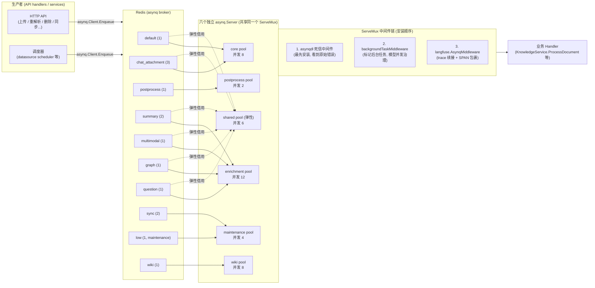
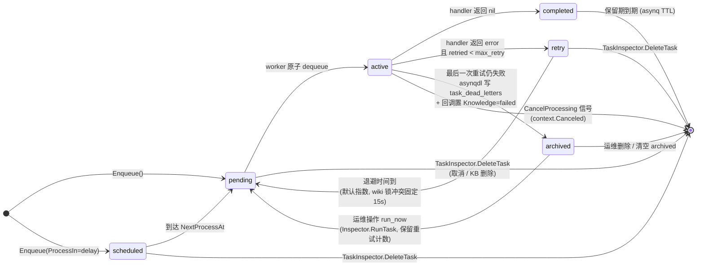
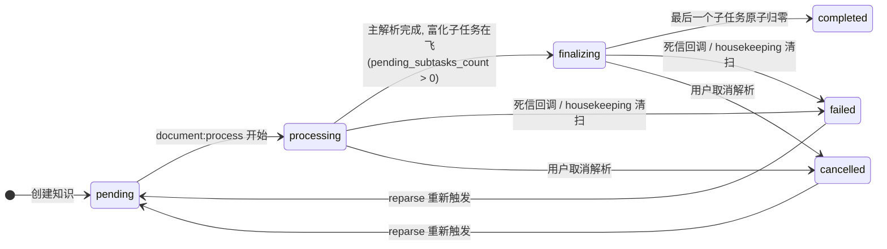

# 异步任务系统

WeKnora 的文档解析、索引构建、富化（摘要 / 问题生成 / 图谱抽取 / 多模态）、Wiki 生成、数据源同步、批量删除与重解析等所有耗时操作，都通过基于 [asynq](https://github.com/hibiken/asynq)（Redis 作为 broker）的异步任务系统执行。涉及的主要源码：

| 模块 | 源码路径 |
| --- | --- |
| 任务注册与 worker pool 构建 | `internal/router/task.go` |
| Lite 模式同步执行器（无 Redis） | `internal/router/sync_task.go` |
| 任务巡检 / 取消 / 运维面板 | `internal/router/task_inspector.go`、`internal/router/task_inspector_errors.go` |
| 队列拓扑与任务类型定义 | `internal/types/task.go` |
| 死信中间件 | `internal/middleware/asynqdl/asynqdl.go` |
| 持久化任务队列 / 死信仓储 | `internal/application/repository/task_queue.go` |
| 死信 / 待处理操作模型 | `internal/types/task_dead_letter.go`、`internal/types/task_pending_op.go` |
| 事件总线 | `internal/event/`（`event.go`、`event_data.go`、`global.go`、`middleware.go`、`adapter.go`） |
| 运行时辅助（DI 容器、启动横幅、uptime） | `internal/runtime/`（`container.go`、`server.go`、`startup.go`） |
| 卡死任务兜底清扫 | `internal/application/service/knowledge_housekeeping.go` |

## 1. 总体架构：双执行模式

WeKnora 有两种任务执行模式，通过部署形态选择：

- **asynq 模式（标准部署）**：任务经 `asynq.Client` 序列化为 JSON payload 写入 Redis 队列，由多个独立的 `asynq.Server`（worker pool）消费。`internal/router/task.go` 中 `RunAsynqServer()` 构建统一的 `asynq.ServeMux` 并在 6 个 pool 上运行。
- **Lite 模式（单机 / macOS App，无 Redis）**：`internal/router/sync_task.go` 的 `SyncTaskExecutor` 实现同一个 `interfaces.TaskEnqueuer` 接口，`Enqueue` 直接把任务派发到 goroutine 执行，支持 `ProcessIn`（延迟）与 `MaxRetry` 选项；重试为线性退避（`attempt * 5s`，上限 30s）。

```go
// internal/router/sync_task.go
// SyncTaskExecutor executes tasks synchronously (in a goroutine) without Redis.
// Used in Lite mode as a drop-in replacement for *asynq.Client.
```

两种模式注册的 handler 集合完全一致（对比 `RunAsynqServer` 与 `RegisterSyncHandlers`），保证任务语义不因部署形态漂移。

## 2. Redis 在系统中的角色

| 角色 | 说明 | 源码位置 |
| --- | --- | --- |
| asynq broker | 所有任务队列（pending list、scheduled/retry ZSET、archived ZSET）都存储在 Redis 中；dequeue 原子（`BRPOPLPUSH`），保证一个任务只被一个 worker 执行 | `internal/router/task.go` `getAsynqRedisClientOpt()` |
| 任务巡检数据源 | `asynq.Inspector` + 直接的 `LPos`/`ZRank`/`ZRevRank` 分页读取 | `internal/router/task_inspector.go` |
| Wiki ingest 互斥锁 | `wiki:active:<kbID>`、finalize 锁、slug 锁均为 `SetNX` + TTL | `internal/application/service/wiki_ingest.go`、`wiki_ingest_batch.go` |
| 多模态子任务计数器 | 图片子任务完成计数（DECR），最后一个 attempt 触发 finalize | `image_multimodal` 相关服务 |
| 限流 | 滑动窗口限流 ZSET（见可观测性文档） | `internal/ratelimit/limiter.go` |

Redis 连接参数来自环境变量 `REDIS_ADDR` / `REDIS_USERNAME` / `REDIS_PASSWORD` / `REDIS_DB` / TLS 配置。读写超时由 `WEKNORA_REDIS_OP_TIMEOUT_MS` 控制，默认 500ms（写超时为其 2 倍以吸收队头阻塞）：

```go
// internal/router/task.go
const defaultRedisOpTimeoutMs = 500
opt := &asynq.RedisClientOpt{
    Addr:        os.Getenv("REDIS_ADDR"),
    ReadTimeout: time.Duration(timeoutMs) * time.Millisecond,
    WriteTimeout: time.Duration(timeoutMs*2) * time.Millisecond,
    ...
}
```

## 3. 任务类型清单

任务类型常量定义在 `internal/types/task.go`：

| 任务类型 | 常量 | 用途 | 队列 |
| --- | --- | --- | --- |
| `document:process` | `TypeDocumentProcess` | 文档解析入口（DocReader / 切分 / 向量化） | `default` |
| `manual:process` | `TypeManualProcess` | 手工知识更新（cleanup + 重新索引） | `default` |
| `temporary_document:process` | `TypeTemporaryDocumentProcess` | 会话临时文档（聊天附件）解析 | `chat_attachment` |
| `knowledge:post_process` | `TypeKnowledgePostProcess` | 知识后处理统一调度（fan-out 富化子任务） | `postprocess` |
| `summary:generation` | `TypeSummaryGeneration` | 摘要生成 | `summary` |
| `datatable:summary` | `TypeDataTableSummary` | 表格摘要 | `summary` |
| `image:multimodal` | `TypeImageMultimodal` | 图片 OCR + VLM Caption | `multimodal` |
| `chunk:extract` | `TypeChunkExtract` | 图谱实体/关系抽取（按 chunk） | `graph` |
| `question:generation` | `TypeQuestionGeneration` | 问题生成（按 chunk 批次 fan-out） | `question` |
| `datasource:sync` | `TypeDataSourceSync` | 数据源同步 | `sync` |
| `faq:import` | `TypeFAQImport` | FAQ 导入（含 dry run） | `low`（maintenance） |
| `kb:clone` | `TypeKBClone` | 知识库复制 | `low` |
| `kb:delete` | `TypeKBDelete` | 知识库删除 | `low` |
| `index:delete` | `TypeIndexDelete` | 索引删除 | `low` |
| `knowledge:list_delete` | `TypeKnowledgeListDelete` | 批量删除知识 | `low` |
| `knowledge:list_reparse` | `TypeKnowledgeListReparse` | 批量重解析 | `low` |
| `knowledge:move` | `TypeKnowledgeMove` | 知识移动 | `low` |
| `wiki:ingest` | `TypeWikiIngest` | Wiki 页面生成/同步 | `wiki` |
| `wiki:finalize` | `TypeWikiFinalize` | Wiki KB 级收尾（防抖：索引重建/死链清理/交叉链接） | `wiki` |

所有 payload 结构体（如 `DocumentProcessPayload`、`ImageMultimodalPayload`）都内嵌 `types.TracingContext`，用于跨进程传递 Langfuse/W3C traceparent（见可观测性文档），并统一携带 `tenant_id` / `knowledge_id` / `knowledge_base_id` 等路由字段，供死信归档与取消匹配使用。

## 4. Worker Pool 拓扑与治理策略

`internal/types/task.go` 中的 `queueDefinitions` 是队列拓扑的**唯一事实来源**（single source of truth），worker server 构建（`QueueWeightsForPool`）与运维面板展示（`QueueStats`）共用该注册表，防止权重漂移。

### 4.1 六个独立 worker pool

每个 pool 是一个独立的 `asynq.Server`，并发度**硬隔离**（不是权重偏好）。默认并发与配置键（system_settings 键 / 环境变量，见 `types.ResolveWorkerPoolConcurrency`）：

| Pool | 默认并发 | 消费队列（权重） | 配置键 / 环境变量 |
| --- | --- | --- | --- |
| `core` | 8 | `default`(1)、`chat_attachment`(3) | `asynq.core_concurrency` / `WEKNORA_ASYNQ_CORE_CONCURRENCY` |
| `postprocess` | 2 | `postprocess`(1) | `asynq.postprocess_concurrency` / `WEKNORA_ASYNQ_POSTPROCESS_CONCURRENCY` |
| `enrichment` | 12 | `summary`(2)、`multimodal`(1)、`graph`(1)、`question`(1) | `asynq.enrichment_concurrency` / `WEKNORA_ASYNQ_ENRICHMENT_CONCURRENCY` |
| `maintenance` | 4 | `sync`(2)、`low`(1) | `asynq.maintenance_concurrency` / `WEKNORA_ASYNQ_MAINTENANCE_CONCURRENCY` |
| `shared`（弹性层） | 6 | core + enrichment 中 `SharedWeight > 0` 的队列 | `asynq.shared_concurrency` / `WEKNORA_ASYNQ_SHARED_CONCURRENCY` |
| `wiki` | 8 | `wiki`(1) | `asynq.wiki_concurrency` / `WEKNORA_WIKI_ASYNQ_CONCURRENCY` |

设计要点（源码注释均可佐证）：

- **保障容量 + 弹性借用**：core/postprocess/enrichment/maintenance 提供最低保障容量；`shared` pool 同时订阅 core 与 enrichment 的队列，闲置容量可被任一阶段借用（`NewSharedAsynqServer`：Redis dequeue 原子，多 server 订阅同一队列每个任务仍只执行一次）。post-process 与 maintenance 被刻意排除在 shared 之外（`QueueWeightsForSharedPool` 注释：post-process 需要延迟保证，长 maintenance 任务不应占用面向用户的突发容量）。
- **Wiki 硬隔离**：`wiki` pool 只拉取 `wiki` 队列，防止解析流水线与 Wiki 生成互相饿死（`NewWikiAsynqServer` 注释）。
- **聊天附件优先**：`chat_attachment` 在 core pool 权重 3 高于 `default` 的 1，大批量 KB 导入不会让交互式聊天上传排队。
- **滚动升级兼容**：`QueueMaintenance` 常量的物理 Redis 队列名保持旧版的 `"low"`，旧版本入队的任务在滚动部署期间仍可被消费。

### 4.2 Worker Pool 架构图



### 4.3 中间件治理

`RunAsynqServer`（`internal/router/task.go`）在同一个 mux 上按顺序安装三个中间件：

1. **`asynqdl.MiddlewareWithCallback`（死信）** — 必须最先安装，以便看到 handler 返回的原始错误（后续中间件可能转换错误）。见第 7 节。
2. **`backgroundTaskMiddleware`** — 对每个任务 context 打 `types.WithBackgroundTask` 标记，使 per-model 聊天并发治理器（chat concurrency governor）对 ingestion/enrichment 的 LLM 调用限流，但不影响交互式用户聊天。
3. **`langfuse.AsynqMiddleware`** — Langfuse 关闭时为直通；开启时续接上游 HTTP trace 或新开独立 trace，将 handler 执行包成 SPAN。

### 4.4 重试退避策略

默认使用 asynq 的指数退避（约 10s、40s、90s、2.5m…），但对 Wiki ingest 锁冲突做了定制（`asynqRetryDelayFunc`）：

```go
// internal/router/task.go
func asynqRetryDelayFunc(n int, e error, t *asynq.Task) time.Duration {
    if errors.Is(e, service.ErrWikiIngestConcurrent) {
        return wikiIngestRetryDelay // 固定 15s
    }
    return asynq.DefaultRetryDelayFunc(n, e, t)
}
```

原因：孤儿锁 TTL ≤ 60s，固定 15s 重试几乎必然成功；指数退避反而会让崩溃重启后的 KB 卡 7–10 分钟。

## 5. 任务生命周期状态机

asynq 侧的运行时状态（`internal/router/task_inspector.go` 中 `runtimeTaskState` 映射为 `types.RuntimeTaskState`）：`pending`、`active`、`scheduled`、`retry`、`archived`、`completed`。业务侧知识行的 `parse_status`（`internal/types/knowledge.go`）：`pending` → `processing` → `finalizing` → `completed`，以及 `failed` / `deleting` / `cancelled`。



对应的知识行状态（由任务驱动）：



## 6. 任务巡检、取消与运维面板（TaskInspector）

`internal/router/task_inspector.go` 实现 `interfaces.TaskInspector`，asynq 模式下由 `asynq.Inspector` + 原生 Redis client 支撑；Lite 模式为 `noopTaskInspector`（goroutine 无法在启动前被摘除，checkpoint 式中止是唯一停止信号）。

### 6.1 按知识 / 知识库取消

- `CancelTasksForKnowledge(ctx, knowledgeID)`：扫描全部注册队列（`queuesScanned` 来自 `types.QueueDefinitions()`）的 pending/scheduled/retry/active 四个状态，payload 中 `knowledge_id` 匹配即处理。可取消的任务类型白名单 `taskTypesForKnowledgeCancel`：`document:process`、`manual:process`、`image:multimodal`、`knowledge:post_process`、`question:generation`、`summary:generation`、`chunk:extract`（刻意不含 FAQ 导入 / KB 级任务）。
- 取消流程分三阶段（`cancelMatchingTasks`）：① 先删干净排队态；② 快照 active 任务后调用 `Inspector.CancelProcessing` 发信号，并在 1s 的 settle 窗口内轮询（25ms 间隔）删除因 `context.Canceled` 转入 retry 的记录（`deleteCancelledTransitions`）；③ 再扫一遍排队态，兜住取消期间新入队的下游任务。
- `CancelTasksForKnowledgeBase`：KB 删除后的孤儿任务清理；`kb:delete` 与 `index:delete` 明确排除（它们携带快照、负责真正的存储清理，删掉会泄漏资源）。clone/move 的语义 KB 字段（`source_id`/`target_id`/`source_kb_id`/`target_kb_id`）也参与匹配。
- 一切均为 best-effort：Redis 抖动时记 Warn 日志并吞掉，取消 API 依然返回成功。
- `HasQueuedTasksForKnowledge`：只读探测，housekeeping 清扫用它区分"积压但未孤儿"的行，避免误标 failed。

### 6.2 运维面板（SystemAdmin Runtime Dashboard）

- `QueueStats()`：逐队列 `GetQueueInfo`，输出 `types.QueueStat`（size/pending/active/scheduled/retry/archived/completed、当日 processed/failed、paused、`latency_ms`（最老 pending 任务年龄）、内存占用），并附上静态 pool/weight 元数据。从未创建过的队列返回零值行（`isAsynqQueueNotFound` 同时兼容 asynq v0.26 泄漏的内部 `NOT_FOUND` 错误串，见 `task_inspector_errors.go`）。
- `ListRuntimeTasks()`：基于 Redis 键 `asynq:{<queue>}:<state>` 直接分页 —— pending/active 是 LIST（最新在前），scheduled/retry 是按 `NextProcessAt` 升序的 ZSET，archived/completed 按分数倒序。游标为 base64 编码的锚点窗口（最多 32 个锚点，`runtimeTaskCursorMaxAnchors`），锚点消失（任务完成/重试/删除）时可继续分页。payload 只投影白名单路由元数据（tenant/kb/knowledge/task/sync 等 ID），**绝不暴露文档内容或密钥**。
- 任务动作由 `runtimeTaskActions` 状态检查约束：`cancel`（pending/active/scheduled/retry 且可取消类型）、`run_now`（scheduled/retry/archived，asynq 保留重试计数）、`delete`（仅 archived）；另有 `PurgeArchivedRuntimeTasks` 一键清空单队列 archived 集合。
- `WorkerServerStats()`：读取 asynq server 心跳（并发、活跃 worker 数、状态、队列权重），跨副本聚合后区分"配置的单实例容量"与"实际集群容量"。

对应 HTTP API（`internal/router/router.go`，SystemAdmin + 平台 API Key capability 门控）：

| 方法 | 路径 | 说明 |
| --- | --- | --- |
| GET | `/api/v1/system/admin/runtime/queues` | 队列深度快照 + worker 心跳 |
| GET | `/api/v1/system/admin/runtime/queues/:queue/tasks` | 按状态游标分页任务列表 |
| POST | `/api/v1/system/admin/runtime/queues/:queue/tasks/:task_id/actions/:action` | `cancel` / `run_now` / `delete`（写平台审计） |
| DELETE | `/api/v1/system/admin/runtime/queues/:queue/archived` | 清空 archived（写平台审计 `system.queue_archived_purged`） |

## 7. 失败重试与死信处理

### 7.1 asynq 死信中间件（`internal/middleware/asynqdl/asynqdl.go`）

- 只在**最后一次尝试**失败时（`isFinalAttempt`：`retried >= max_retry`）写一行 `task_dead_letters`，避免瞬时抖动每次都产生一行。
- `buildDeadLetter` 用宽容的 `payloadProbe` 从任意 payload 提取 `tenant_id` / `knowledge_base_id` / `kb_id` / `knowledge_id` / `source_kb_id`，`inferScope` 按"爆炸半径"推断 scope（`knowledge_base` > `knowledge` > `tenant` > `unknown`）。payload 原样保留（可用于将来重放），`last_error` 截断到 8KB。
- 插入是 best-effort：DB 失败只记日志，原始任务错误始终原样向 asynq 上抛（进入 archived）。
- `OnDeadLetter` 回调（`internal/router/task.go` 的 `newDeadLetterKnowledgeFailer`）：`document:process` / `knowledge:post_process` / `manual:process` 耗尽重试时，单条 UPDATE 把知识行 `parse_status=failed` + `error_message` 一并写入（避免半更新），并调用 `SpanTracker.FinalizeAttempt` 关闭对应 attempt 的根 span，让时间线不再显示"进行中"。`knowledge:list_delete` 有专门分支 `markKnowledgeListDeleteFailed`。`image:multimodal` 刻意**不**标记父知识失败（finalize-on-last-attempt 已保证进度）。回调用 `context.Background()` 执行且 panic 被捕获，绝不改变原始任务错误。

### 7.2 持久化任务队列与服务级死信（`internal/application/repository/task_queue.go`）

`task_pending_ops` 表是 Redis list 队列的持久化替代（重启不丢、无 TTL 驱逐），队列身份是 `(task_type, scope, scope_id)` 三元组，目前主要消费者是 Wiki ingest：

- `Enqueue` / `EnqueueIfKnowledgeBaseActive`：后者在事务中用 Postgres `SHARE` 行锁校验 KB 仍存活，防止 KB 软删后仍写入新的持久化工作。
- `ClaimBatch`：按 `dedup_key`（=文档）**整组**原子认领。核心不变量：同一文档的多个 op（如 ingest 后跟 retract）绝不拆到两个并发批次；有新鲜 claim（`claimed_at >= staleBefore`）的 key 整体跳过，晚到的兄弟 op 等待持有者完成或 claim 过期。Postgres 上用每个 key 的 anchor 行 `FOR UPDATE SKIP LOCKED` 保证并发认领者拿到**不相交**的 key 集；SQLite（Lite/测试）依赖单写者引擎。
- `IncrFailCount`（`UPDATE ... RETURNING` 单往返原子自增）配合服务侧上限（wiki 的 `wikiMaxFailRetries`）：超限后该 op 从 `task_pending_ops` 移入 `task_dead_letters`（`internal/application/service/wiki_ingest.go` 直接 `deadLetterRepo.Insert`）。
- `ReleaseByIDs` / `DeleteByIDs` / `DeleteByScope` / `DeleteByDedupKey` / `PendingCount` 提供释放、消费确认、KB 生命周期清理与积压观测。

死信仓储 `taskDeadLetterRepository` 提供 `ListByScope` / `ListByTaskType`（id 倒序游标分页，limit 1–200）与 `DeleteByID`；运维可直接 SQL 按任务类型 / scope / 租户查询失败，无需翻日志。

### 7.3 兜底：housekeeping 清扫

`internal/application/service/knowledge_housekeeping.go`：cron 每 5 分钟（`0 */5 * * * *`）扫描卡在 `pending`/`processing`/`finalizing` 超过 stale 阈值的知识行并标记 failed。这是 asynq 重试、死信回调、multimodal finalize 之外的最后防线（worker 被 kill 在 handler 中间、defer 没跑到等场景）。清扫结合 span 心跳、`updated_at` 与 `TaskInspector.HasQueuedTasksForKnowledge`，避免误杀"积压但未孤儿"的行。可用 `WEKNORA_HOUSEKEEPING_ENABLED=false` 关闭。

## 8. 事件总线（`internal/event`）

事件总线用于**进程内**的会话/Agent 流式事件分发（如 SSE 推送、IM 回调），与 asynq（跨进程持久任务）互补。

### 8.1 结构与投递保证

```go
// internal/event/event.go
type Event struct {
    ID        string                 // 事件ID (自动生成UUID，用于流式更新追踪)
    Type      EventType
    SessionID string
    Data      interface{}
    Metadata  map[string]interface{}
    RequestID string
}
```

- `EventBus.On(type, handler)` 注册（同类型可多 handler），`Off` / `Clear` 移除；`HasHandlers` / `GetHandlerCount` 查询。
- **同步模式**（`NewEventBus`，默认）：`Emit` 顺序执行 handler，任一 handler 出错立即返回错误（at-most-once，出错中断后续 handler）。
- **异步模式**（`NewAsyncEventBus`）：`Emit` 对每个 handler 起 goroutine，fire-and-forget，错误被丢弃，panic 被 recover 记日志。
- `EmitAndWait`：两种模式下都并行执行全部 handler 并等待完成，收集错误与 panic。
- **投递保证为进程内、非持久化**：无注册 handler 时事件被静默丢弃（返回 nil）；进程崩溃丢失在飞事件。持久化诉求应走 asynq 或 `task_pending_ops`。
- `global.go` 提供全局单例（`event.On` / `event.Emit`）；实践中会话级流式处理使用**独立的 bus 实例**（见订阅者）。
- `middleware.go` 提供 handler 中间件：`WithLogging`（触发/失败日志）、`WithTiming`（耗时写入 metadata）、`WithRecovery`（panic 转 `PanicError`），`Chain` / `ApplyMiddleware` 组合。
- `adapter.go` 的 `EventBusAdapter` 把 `*EventBus` 适配为 `types.EventBusInterface`，避免循环依赖。

### 8.2 事件类型清单（`internal/event/event.go`）

| 分组 | 事件类型 |
| --- | --- |
| 查询处理 | `query.received`、`query.validated`、`query.preprocess`、`query.rewrite`、`query.rewritten` |
| 检索 | `retrieval.start`、`retrieval.vector`、`retrieval.keyword`、`retrieval.entity`、`retrieval.complete` |
| 重排 | `rerank.start`、`rerank.complete` |
| 合并 | `merge.start`、`merge.complete` |
| 聊天生成 | `chat.start`、`chat.complete`、`chat.stream` |
| Agent 生命周期 | `agent.query`、`agent.plan`、`agent.step`、`agent.tool`、`agent.complete` |
| Agent 流式（实时反馈） | `thought`、`tool_call`、`tool_result`、`reflection`、`references`、`final_answer` |
| MCP 工具人工审批 | `tool_approval_required`、`tool_approval_resolved` |
| MCP OAuth 会话内授权 | `mcp_oauth_required`、`mcp_oauth_resolved` |
| 错误 / 会话 / 控制 | `error`、`session_title`、`stop` |

每类事件的数据结构定义在 `internal/event/event_data.go`（如 `AgentToolCallData` 携带 `tool_call_id`/`tool_name`/`arguments`/`hint`，`AgentFinalAnswerData` 携带 `content`/`done`/`is_fallback` 等）。

### 8.3 主要订阅者

| 订阅者 | 源码 | 订阅内容 |
| --- | --- | --- |
| SSE Agent 流式 handler | `internal/handler/session/agent_stream_handler.go` | `thought`、`tool_call`、`tool_result`、`references`、`final_answer`、`reflection`、`error`、`session_title`、`agent.complete`、tool approval 与 MCP OAuth 四类 |
| 知识问答 handler | `internal/handler/session/qa.go`、`helpers.go` | `thought`、`final_answer`、`stop` |
| IM 集成（企微等） | `internal/im/service.go` | `final_answer`、`error`、`references`、`agent.complete`、`thought`、`tool_call`、`tool_result`、`mcp_oauth_required` 等，转译为各 IM 平台消息 |

## 9. `internal/runtime` 包

该包很小，是运行时基础设施而非 worker 逻辑：

- `container.go`：`init()` 创建全局 `*dig.Container`（uber dig），`GetContainer()` 供各包注册/解析依赖。所有 asynq server、handler、repository 都经它装配（实际大规模装配在 `internal/container/container.go`）。
- `server.go`：`MarkServerStarted()` / `ServerStartedAt()` / `ServerUptime()` —— 进程启动时刻记录，供运维面板显示 uptime。
- `startup.go`：`SilenceGinRouteSpam()` 抑制约 150 行 Gin 路由注册日志并汇总为一行（`LogGinRouteCount`）；`LogStartupEnv()` 打印精选环境变量横幅（敏感值只显示 `set (N chars)`），并对典型 footgun 发出显式警告（如 `SYSTEM_AES_KEY` 长度不等于 32 时加密实际被禁用、`REDIS_TLS_INSECURE_SKIP_VERIFY=true`）。

## 10. 如何监控任务

1. **运维面板 / Runtime API**（第 6.2 节）：队列深度、最老 pending 延迟（`latency_ms`）、当日 processed/failed、worker 心跳；按状态浏览任务、查看 `last_error`、`retried/max_retry`、执行 `run_now`/`cancel`/`delete`。
2. **死信表 SQL**：`SELECT * FROM task_dead_letters WHERE scope='knowledge_base' AND scope_id='<kbID>' ORDER BY id DESC;` 或按 `task_type` 聚合失败率；`task_pending_ops` 的 `PendingCount` / `enqueued_at` 可发现从未排空的积压。
3. **日志**：worker 侧统一走 `internal/logger`，关键前缀有 `[TaskInspector]`（取消/巡检）、`asynq dead-letter`、`[SyncTask]`（Lite 模式）、`[Housekeeping]`；启动时每个 pool 打印 `asynq <pool> server starting with concurrency=...`。
4. **Langfuse trace**：开启后每个 asynq 任务是一个 `asynq.<task_type>` SPAN（含 queue、retry、payload 大小元数据），与触发它的 HTTP 请求同 trace（见可观测性文档）。
5. **平台审计**：对 archived 任务的 `run_now`/`delete`/purge 操作写入 `audit_logs`（`system.queue_task_*` 动作），可追责。
