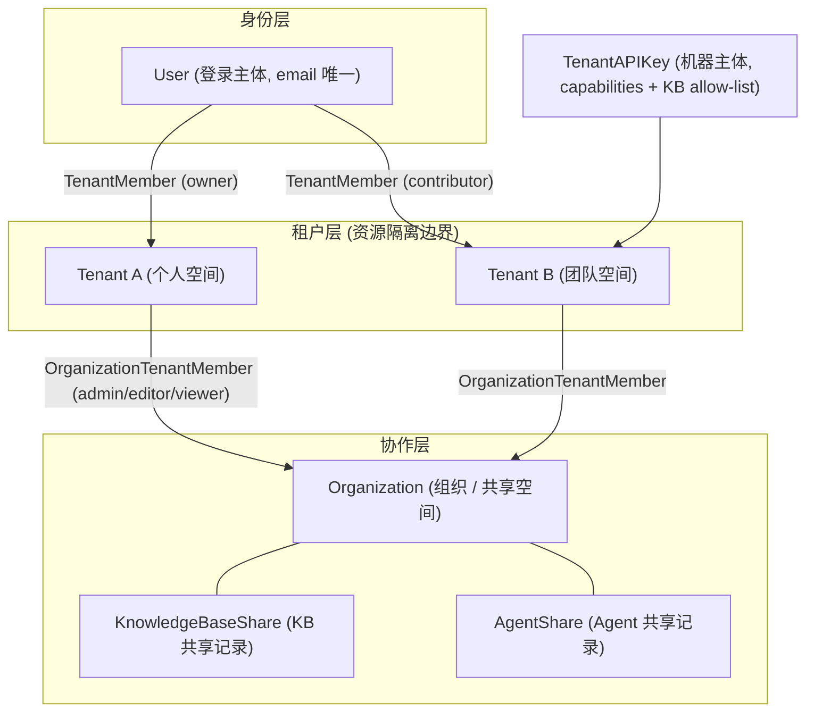
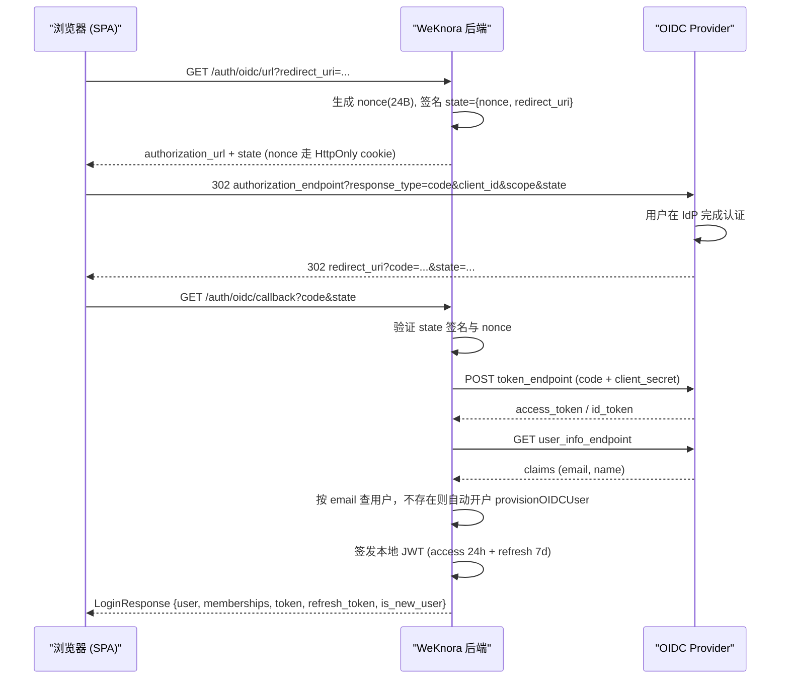
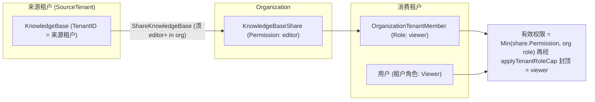

# 租户、用户与认证授权

在 WeKnora 里，一个人（**用户**）可以属于多个**空间**（后端叫租户 Tenant，界面上叫工作空间）。空间是隔离边界：知识库、模型、Agent、会话都归属某个空间，配额也按空间算。想让两个空间之间共享知识库或 Agent，就把它们放进同一个**组织**（共享空间）。

日常最常问的三件事：

| 想做什么 | 怎么做 |
| --- | --- |
| 拉同事进来一起用 | 空间设置 → 成员 → 邀请，并给对方一个角色（Owner / Admin / Contributor / Viewer） |
| 把知识库共享给另一个团队 | 建组织 → 把两个空间都加进去 → 在知识库上「共享到组织」 |
| 让程序调接口 | 空间设置 → API Key，按需勾选能力（检索 / 问答 / 入库 / 管理），必要时限定可访问的知识库 |
| 管理整个部署（全局设置、任务队列、跨空间审计） | 需要**系统管理员**身份，与空间 Owner 是两回事，见[平台管理与系统管理员](20-platform-admin.md) |
| 删除整个空间 | 空间设置里由 **Owner** 触发（`DELETE /tenants/:id`）；会连带清掉该空间的知识库、Agent、会话与成员关系，不可撤销 |

<Screenshot
  src="/screenshots/settings-members.png"
  caption="空间成员管理：成员角色与邀请入口"
  hint="展示成员列表、角色下拉与「邀请成员」按钮，最好含一条 pending 邀请。" />

四个角色能做什么，一句话版本：Viewer 只能看和问，Contributor 可以建库和传文档，Admin 管成员和空间设置，Owner 额外能删空间和转让。完整矩阵见下文 RBAC 章节。

技术上，认证支持密码登录、OIDC 单点登录与 API Key 三种主体；授权由空间内 RBAC 角色阶梯 + 资源所有权（ownership）+ API Key 能力（capability）三套正交机制共同实现，下面逐层展开。

## 概念总览



关键点：

- 一个 User 可以通过 `tenant_members` 表同时属于多个 Tenant，每个成员关系有独立角色。
- 组织成员关系是**租户级**的（Plan 3 迁移之后 `OrganizationTenantMember` 以 `tenant_id` 为单位，而非 user），共享也是"某个租户把 KB 共享给某个组织"。
- API Key 是与 JWT 用户完全独立的机器主体，不复用租户角色阶梯。

## 1. 数据模型

### 1.1 Tenant（租户 / 工作空间）

`internal/types/tenant.go`：

```go
type Tenant struct {
    ID                      uint64               `json:"id" gorm:"primaryKey"`
    Name                    string               `json:"name"`
    Description             string               `json:"description"`
    Status                  string               `json:"status" gorm:"default:'active'"`
    RetrieverEngines        RetrieverEngines     `json:"retriever_engines" gorm:"type:json"`
    Business                string               `json:"business"`
    StorageQuota            int64                `json:"storage_quota" gorm:"default:10737418240"` // 默认 10GB
    StorageUsed             int64                `json:"storage_used"  gorm:"default:0"`
    ContextConfig           *ContextConfig       `json:"context_config" gorm:"type:jsonb"`
    WebSearchConfig         *WebSearchConfig     `json:"web_search_config" gorm:"type:jsonb"`
    ParserEngineConfig      *ParserEngineConfig  `json:"parser_engine_config" gorm:"type:jsonb"`
    Credentials             *CredentialsConfig   `json:"credentials" gorm:"type:jsonb"`
    StorageEngineConfig     *StorageEngineConfig `json:"storage_engine_config" gorm:"type:jsonb"`
    DefaultStorageBackendID *string              `json:"default_storage_backend_id,omitempty"`
    ChatHistoryConfig       *ChatHistoryConfig   `json:"chat_history_config" gorm:"type:jsonb"`
    RetrievalConfig         *RetrievalConfig     `json:"retrieval_config" gorm:"type:jsonb"`
    APIPrincipalConfig      *APIPrincipalConfig  `json:"-" gorm:"type:jsonb"`
    // CreatedAt / UpdatedAt / DeletedAt（软删除）
}
```

租户是配额（`StorageQuota` / `StorageUsed`，默认 10GB）与各类租户级配置（检索引擎、Web 搜索、解析引擎、凭证、存储引擎、聊天历史等）的挂载点。

### 1.2 User（用户）

`internal/types/user.go`：

```go
type User struct {
    ID                  string          `json:"id" gorm:"type:varchar(36);primaryKey"`
    Username            string          `json:"username" gorm:"uniqueIndex;not null"`
    Email               string          `json:"email" gorm:"uniqueIndex;not null"`
    PasswordHash        string          `json:"-" gorm:"not null"`
    Avatar              string          `json:"avatar"`
    TenantID            uint64          `json:"tenant_id" gorm:"index"` // 首选/默认租户
    IsActive            bool            `json:"is_active" gorm:"default:true"`
    CanAccessAllTenants bool            `json:"can_access_all_tenants" gorm:"default:false"` // 跨租户超级用户
    IsSystemAdmin       bool            `json:"is_system_admin" gorm:"default:false;index"`  // 平台管理员
    Preferences         UserPreferences `json:"preferences" gorm:"type:jsonb"`
}

type UserPreferences struct {
    // 上次活跃的租户 ID，登录时用于恢复上下文
    LastActiveTenantID *uint64 `json:"last_active_tenant_id,omitempty"`
}
```

两个特殊标志：

- `CanAccessAllTenants`：跨空间超级用户。**必须两个开关同时为真**才生效——用户行上的 `CanAccessAllTenants`，以及部署级的 `tenant.enable_cross_tenant_access` / `WEKNORA_TENANT_ENABLE_CROSS_TENANT_ACCESS`（`middleware/access.go` 的 `IsCrossTenantSuperuser()` 先查配置再查用户；配置关掉时登录响应里这个字段也会被抹成 false）。生效后可绕过空间角色检查，访问 `/tenants/all`、`/tenants/search` 等跨空间端点。注意 `POST /tenants`（新建空间）**不属于**跨空间端点，任何已登录用户都能调（受自助创建策略与配额限制）。
- `IsSystemAdmin`：平台级管理员（system admin），独立于任何租户角色，用于 `/system/admin/*` 控制面。它管的是整个部署而不是某个空间，怎么产生第一个、能做什么见[平台管理与系统管理员](20-platform-admin.md)。

### 1.3 TenantMember 与租户角色

`internal/types/tenant_member.go`：

```go
type TenantRole string

const (
    TenantRoleOwner       TenantRole = "owner"       // 完全控制：删除租户、转移所有权、管理 API Key、成员
    TenantRoleAdmin       TenantRole = "admin"       // 管理成员、模型、向量库、MCP、IM 等租户基础设施
    TenantRoleContributor TenantRole = "contributor" // 创建 KB / Agent，编辑自己创建的资源
    TenantRoleViewer      TenantRole = "viewer"      // 只读
)

var tenantRoleLevel = map[TenantRole]int{
    TenantRoleOwner: 40, TenantRoleAdmin: 30,
    TenantRoleContributor: 20, TenantRoleViewer: 10,
}

func (r TenantRole) HasPermission(required TenantRole) bool {
    return r.Level() >= required.Level()
}
```

```go
type TenantMember struct {
    ID        uint64
    UserID    string
    TenantID  uint64
    Role      TenantRole         // 默认 contributor
    Status    TenantMemberStatus // active / invited / suspended
    InvitedBy *string
    JoinedAt  time.Time
}
```

登录响应里返回 `Membership{TenantID, TenantName, Role}` 投影列表，前端据此渲染工作空间切换器。

### 1.4 TenantAPIKey（API Key）

`internal/types/tenant_api_key.go`：

```go
type TenantAPIKey struct {
    ID               uint64
    TenantID         *uint64         // platform key 为 NULL
    ScopeType        APIKeyScopeType // "tenant" | "platform"
    Name             string
    KeyHash          string      `json:"-" gorm:"uniqueIndex"` // 查表用哈希
    APIKey           string      // 明文（落库前 AES-256-GCM 加密，见 BeforeSave/AfterFind）
    FullAccess       bool        // 全量访问（不受 capabilities 限制）
    KnowledgeBaseIDs StringArray // KB allow-list（空 = 不限制）
    Capabilities     StringArray // 能力列表
    LastUsedAt / ExpiresAt / RevokedAt *time.Time
}
```

- **落库加密**：配置了 `SYSTEM_AES_KEY` 时，`BeforeSave` 钩子将 `api_key` 列以 AES-GCM 加密存储，`AfterFind` 自动解密；查表始终走不可逆的 `KeyHash`。
- **校验流程**：请求携带 `X-API-Key` → 计算哈希 → 按 `KeyHash` 查表 → 检查 `RevokedAt` / `ExpiresAt` → 将 `TenantAPIKeyScope{KeyID, ScopeType, FullAccess, KnowledgeBaseIDs, Capabilities}` 注入 context，后续用 `types.TenantAPIKeyScopeFromContext` 读取。

### 1.5 Organization（组织 / 共享空间）

`internal/types/organization.go`：

```go
type Organization struct {
    ID                     string
    Name / Description / Avatar string
    OwnerID                string  // 创建者用户
    OwnerTenantID          uint64  // 拥有组织的租户
    InviteCode             string  `gorm:"uniqueIndex"` // 组织邀请码
    InviteCodeExpiresAt    *time.Time
    InviteCodeValidityDays int     // 允许 0(永久)/1/7/30，默认 7
    RequireApproval        bool    // 加入需审批
    Searchable             bool    // 是否可被搜索发现
    MemberLimit            int     // 默认 50
}

type OrganizationTenantMember struct { // 成员单位是"租户"
    OrganizationID       string
    TenantID             uint64
    Role                 OrgMemberRole // admin / editor / viewer，默认 viewer
    RepresentativeUserID string        // 代表用户（信息性字段）
}

const (
    OrgRoleAdmin  OrgMemberRole = "admin"  // 完全控制组织与共享资源
    OrgRoleEditor OrgMemberRole = "editor" // 可编辑共享 KB 内容，不能改组织设置
    OrgRoleViewer OrgMemberRole = "viewer" // 只读
)
```

## 2. 注册与登录

### 2.1 注册模式（invite-only）

`internal/handler/auth.go` + `internal/config/config.go`：

```go
type AuthConfig struct {
    RegistrationMode  string // "self_serve"（默认，公开注册） | "invite_only"（仅邀请）
    DefaultTenantMode string // "create_personal"（默认，自动建个人租户） | "tenantless"（无租户等待邀请）
}

func (c *AuthConfig) IsInviteOnly() bool {
    return c != nil && c.RegistrationMode == AuthRegistrationModeInviteOnly
}
```

判定分两层，理解这一点才能解释「改了 env 没生效」：

**启动时**（`applyAuthAndTenantDefaults()`）合成 `cfg.Auth.RegistrationMode`：`DISABLE_REGISTRATION=true` 会直接把它改写成 `invite_only`，**盖过 YAML** 里的值。之所以让 env 盖 YAML，是为了让「接口拒绝注册」和「前端隐藏注册入口」（前端读 `/auth/config`）两道闸门一致，否则会出现按钮还在、点了报 403。

**每次请求时**（`resolveRegistrationMode()`）只比较两个来源：数据库 `system_settings` 的 `auth.registration_mode` 行 > 上面合成的 cfg 值 > 硬编码兜底 `self_serve`。`DISABLE_REGISTRATION` **不会**被逐请求重新读取。

后果是：系统管理员在界面上把 `auth.registration_mode` 设成 `self_serve` 后，即使部署里仍写着 `DISABLE_REGISTRATION=true`，公开注册也是开着的。要彻底关掉，得把数据库里那一行重置（`DELETE /system/admin/settings/auth.registration_mode`）。

`invite_only` 模式下 `POST /auth/register` 返回 403，但它只挡住**密码自助注册**这一条路，以下两条不受影响：

- **邀请注册端点** `POST /auth/register-by-invite`（设计如此，见 §2.3）；
- **OIDC 首次登录**：`LoginWithOIDC()` 查不到邮箱时直接 `provisionOIDCUser()` 建号，全程不读注册模式。也就是说开了 OIDC 之后，`invite_only` 挡不住 IdP 里的任何人——要限制范围得在 IdP 侧做（应用可见性 / 用户组），或干脆关掉 OIDC。

### 2.2 密码注册 / 登录

- `POST /auth/register`：`{username(2-50), email, password}`；按 `DefaultTenantMode` 决定是否自动创建个人租户（`TenantProvisioningCreatePersonal` / `TenantProvisioningTenantless`）。
- `POST /auth/login`：`{email, password}`，返回 `LoginResponse{user, active_tenant, memberships[], token, refresh_token}`；激活租户按 `Preferences.LastActiveTenantID` 恢复。
- 密码要求分三处，**强度并不一致**，集成时要按最严的来：
  - **注册页（前端表单）**：8–32 字符，且至少含 1 个字母 + 1 个数字；
  - **`POST /auth/register`（后端）**：只有 binding 的 `min=6`——`Register()` **不调用** `ValidatePasswordPolicy`，所以直接打接口能设出 6 位纯数字密码；
  - **`ValidatePasswordPolicy`（8–32 + 字母 + 数字）**：只用于**修改密码**（`user.go` 的改密路径）与**系统管理员重置他人密码**（`handler/system.go`）。

  也就是说走界面注册受 8 位强校验，走 API 注册只受 6 位下限约束。

### 2.3 邀请注册（register-by-invite）

`internal/handler/auth_register_by_invite.go`。租户 Owner 生成的**共享邀请链接**（share link，见 §7.2）持有 token，注册页凭 token 完成注册，即使系统处于 `invite_only` 模式：

```go
// POST /auth/register-by-invite
type registerByInviteRequest struct {
    Token    string `binding:"required"`
    Email    string `binding:"required,email"` // 注册者自填，与 token 不绑定
    Username string `binding:"required"`
    Password string `binding:"required,min=6"`
}
```

流程：校验 token（`LookupByToken`）→ 检查邮箱未注册（已注册返回 409）→ 以 `tenantless` 模式创建用户 → 将邀请租户设为用户首租户 → `AcceptByToken` 创建 `tenant_members` 行（状态 `active`，角色取邀请中指定的角色）。

配套端点 `POST /auth/invitations/lookup`（无需认证）返回邀请上下文 `{tenant_id, tenant_name, role, expires_at}` 供注册页展示；**故意使用 POST + body 而非 GET + path，避免 token 落入访问日志**；token 无效/被撤销返回 410。

## 3. JWT 机制

实现于 `internal/application/service/user.go`，使用 `github.com/golang-jwt/jwt`（HMAC-SHA256）。

### 3.1 密钥来源

```go
func getJwtSecret() string {
    // 1) 环境变量 JWT_SECRET
    // 2) 否则启动时生成 32 字节安全随机密钥（Base64），进程重启后旧 token 失效
}
```

### 3.2 签发（Access + Refresh 双 token）

```go
accessClaims := jwt.MapClaims{
    "user_id":   user.ID,
    "email":     user.Email,
    "tenant_id": activeTenantID, // 请求的租户作用域写死在 token 里
    "exp":       time.Now().Add(24 * time.Hour).Unix(),
    "iat":       time.Now().Unix(),
    "type":      "access",
}
refreshClaims := jwt.MapClaims{
    "user_id": user.ID,
    "exp":     time.Now().Add(7 * 24 * time.Hour).Unix(),
    "type":    "refresh",
}
```

| Token | 有效期 | Claims 要点 |
| --- | --- | --- |
| Access Token | 24 小时 | `user_id` / `email` / `tenant_id` / `type=access` |
| Refresh Token | 7 天 | `user_id` / `type=refresh`（不含 tenant_id） |

两个 token 都会写入 `auth_tokens` 表，用于**服务端撤销**。

### 3.3 校验与刷新

`ValidateToken` 的检查链：

1. 签名算法必须是 HMAC 族（防算法混淆攻击）；
2. `type=refresh` 的 token **不能**当 access token 用（`isRefreshTokenClaims`）；
3. 查 `auth_tokens` 表检查 `IsRevoked`（登出 = 撤销记录）；
4. 从 claims 提取 `user_id` 加载用户、`tenant_id` 作为激活租户。

**租户切换即换发 token**：`SwitchTenant` 校验目标租户的 active 成员资格（跨租户超级用户除外）后，签发携带新 `tenant_id` claim 的新 token 对，并尽力撤销旧 refresh token。

## 4. API Key 体系

### 4.1 能力（Capabilities）清单

`internal/types/tenant_api_key.go`。API Key **不复用租户角色**：一把 key 要么 `FullAccess`，要么携带显式能力集合；未声明策略的路由对 API Key 默认拒绝（default-deny）。

| 能力 | 说明 |
| --- | --- |
| `retrieve` | 读取 / 搜索知识库数据（KB 列表、知识详情、hybrid-search 等） |
| `chat` | 会话流：创建 session、knowledge-chat / agent-chat、加载与删除消息 |
| `read_agents` | 列出与查看 Agent（不含创建修改） |
| `ingest` | 写内容：上传文档、编辑 chunk / FAQ / 标签 / Wiki、批量删除与移动知识 |
| `manage_kbs` | KB 生命周期：创建 / 复制 / 副本 / 更新 / 删除 / 初始化配置 |
| `manage_agents` | Agent 增删改与复制 |
| `message_history` | 搜索与查看租户级聊天历史（`POST /messages/search` 等，独立于 chat） |
| `manage_models` | 管理模型定义与凭证 |
| `manage_mcp_services` | 管理 MCP 服务与凭证 |
| `manage_datasources` | 管理数据源连接器与同步任务 |
| `manage_channels` | 管理 Embed / IM 渠道集成 |
| `manage_vector_stores` | 管理向量库与解析器 |
| `manage_storage_backends` | 管理对象存储后端 |
| `manage_web_search` | 管理 Web 搜索配置 |
| `run_evaluations` | 运行与查看评估任务 |
| `manage_members` | 管理租户成员与邀请 |
| `manage_spaces` | 管理组织 / 共享空间成员关系 |
| `manage_tenant_settings` | 读写租户整合设置 |
| `system_tenants_read` / `system_tenants_manage` | 平台级：租户管理（仅 platform key） |
| `system_settings_read` / `system_settings_manage` | 平台级：系统设置 |
| `system_runtime_read` / `system_runtime_manage` | 平台级：运行时队列 / 任务 |
| `system_audit_read` | 平台级：审计日志 |

### 4.2 路由声明机制

`internal/router/rbac.go` 中每条 API-Key-可访问的路由都通过 `apiKeyGroup` / `apiKeyRoute` 显式登记一条 `APIKeyRoutePolicy`（`middleware.APIKeyRouteAuthorizer` 是唯一事实来源）：

```go
// 策略构造器
apiKeyAny()                    // 任何有效 key
apiKeyFullAccess()             // 仅 FullAccess key
apiKeyPlatform(caps...)        // 仅 platform key + 指定能力
apiKeyRetrieve(base) / apiKeyChat(base) / apiKeyIngest(base) / ...
```

启动时 `assertAPIKeyPoliciesMatchRoutes` 校验每条声明的策略都对应真实注册的路由，配置漂移直接 panic。`router_api_key_capabilities_test.go` 佐证的典型映射：

| 路由 | 要求能力 |
| --- | --- |
| `POST /sessions`、`POST /knowledge-chat/:session_id`、`POST /agent-chat/:session_id`、`GET /messages/:session_id/load` | `chat` |
| `GET /agents`、`GET /agents/:id`、`GET /agents/:id/suggested-questions` | `read_agents` |
| `POST/PUT/DELETE /agents`、`POST /agents/:id/copy` | `manage_agents` |
| `PUT/DELETE /knowledge-bases/:id`、`POST /initialization/initialize/:kbId` | `manage_kbs` |
| `POST /messages/search`、`GET /messages/chat-history-stats` | `message_history`（不是 chat） |
| `GET /system/admin/settings` | platform key + `system_settings_read` |
| `POST /system/admin/runtime/queues/:queue/tasks/:task_id/actions/:action` | platform key + `system_runtime_manage` |

### 4.3 KB Allow-list

`KnowledgeBaseIDs` 非空时 key 只能触达清单内的 KB（`knowledge_api_key_scope_test.go` 佐证）：

```go
// 越界单个 KB → 403
requireTenantAPIKeyKnowledgeBase(ctx, "kb-2") // scope 只含 kb-1 → forbidden
// 批量操作中任一 KB 越界 → 整体 403（拒绝部分重叠）
requireTenantAPIKeyKnowledgeBases(ctx, "kb-1", "kb-2") // → forbidden
```

其他硬限制：platform key 不能创建其他 platform key；API Key 主体不参与 ownership 判定（见 §6）。

## 5. OIDC 单点登录

### 5.1 配置

`internal/config/config.go` 的 `OIDCAuthConfig`：

| 配置项 | 说明 |
| --- | --- |
| `enable` | 是否启用 OIDC |
| `issuer_url` | Issuer 地址 |
| `discovery_url` | OpenID Connect Discovery 地址（`.well-known/openid-configuration`） |
| `provider_display_name` | 登录按钮展示名 |
| `client_id` / `client_secret` | 客户端凭证（secret 序列化为 `json:"-"`，不下发前端） |
| `authorization_endpoint` / `token_endpoint` / `user_info_endpoint` | 手动指定端点 |
| `scopes` | 请求的 scope（如 `openid email profile`） |
| `user_info_mapping.username` / `.email` | claims 字段映射（默认 `name` / `email`） |

端点解析顺序：若 `authorization_endpoint` 与 `token_endpoint` 均已配置则直接使用；否则从 `discovery_url` 动态发现；两者都缺失则报错。

路由（`internal/router/router.go`）：

```go
r.GET("/auth/oidc/config",   handler.GetOIDCConfig)           // 前端探测是否启用
r.GET("/auth/oidc/url",      handler.GetOIDCAuthorizationURL) // 获取授权 URL
r.GET("/auth/oidc/callback", handler.OIDCRedirectCallback)    // 授权码回调
```

### 5.2 流程与安全设计

`internal/application/service/user.go`：

- `GetOIDCAuthorizationURL`：生成 24 字节随机 `nonce`，用 `secutils.SignOIDCState` 把 `{nonce, redirect_uri}` **签名进 state**（防 CSRF / 重放 / 回调地址篡改）；nonce 通过 HttpOnly cookie 下发（响应 JSON 中 `json:"-"` 省略）。
- `LoginWithOIDC`：授权码换 token → UserInfo 端点取用户信息（按 `user_info_mapping` 映射）→ **按 email 匹配本地用户**；未找到则 `provisionOIDCUser` 自动开户 → 签发与密码登录完全相同的本地 JWT 对。

自动开户细节：

- 租户模式取自 `auth.default_tenant_mode`（`create_personal` 自动建个人租户 / `tenantless` 等待邀请）；
- 用户名候选：OIDC username → email 前缀 → `oidc-user`，冲突时追加 `-1..-20` 数字后缀，仍冲突则用 Unix 时间戳；
- 生成 32 字符随机密码写入（用户不知晓，只能走 OIDC 登录）；
- 响应带 `is_new_user` 供 SPA 做首登引导；`IsActive=false` 的账户拒绝登录。



## 6. RBAC：角色、所有权与守卫矩阵

授权由三套正交机制组成，全部汇聚在 `internal/router/rbac.go` 的 `rbacGuards` 中：

1. **角色守卫**（role-only）：`Viewer()` / `Contributor()` / `Admin()` / `Owner()` / `SystemAdmin()`，问"调用者在本租户的角色是什么"。
2. **所有权守卫**（ownership-or-role）：`OwnedKBOrAdmin()` 等，问"调用者是否是**这个资源**的创建者，或至少 Admin+"。
3. **KB 访问守卫**（KB-access）：`KBAccessRead()` / `KBAccessWrite()`，问"调用者的租户能否触达这个 KB"（自有 / 组织共享 / 经共享 Agent 可见）。

### 6.1 角色能力矩阵

| 能力 | Owner (40) | Admin (30) | Contributor (20) | Viewer (10) |
| --- | --- | --- | --- | --- |
| 删除租户 / 转移所有权 / 管理 API Key | ✓ | ✗ | ✗ | ✗ |
| 添加 / 移除成员、改角色、发邀请 | ✓ | ✗（handler 限 Owner） | ✗ | ✗ |
| 配置租户基础设施（模型 / 向量库 / IM / MCP / Web 搜索 / 存储后端 / 数据源） | ✓ | ✓ | ✗ | ✗ |
| 清空知识库内容（`DELETE /knowledge-bases/:id/knowledge`） | ✓ | ✓ | ✗ | ✗ |
| 修改 / 删除**他人**创建的 KB / Agent / 知识 / chunk / Wiki / 标签 | ✓ | ✓ | ✗ | ✗ |
| 创建 KB / Agent；复制 Agent 给自己 | ✓ | ✓ | ✓ | ✗ |
| 修改 / 删除**自己创建**的 KB 及其子资源 | ✓ | ✓ | ✓ | ✗ |
| 创建/管理自己的会话、发起问答（`/sessions`、`/knowledge-chat`、`/agent-chat` 均为 Viewer+） | ✓ | ✓ | ✓ | ✓ |
| 查看成员列表 / 邀请列表 / KB 列表 / 知识 / 检索 / 预览 | ✓ | ✓ | ✓ | ✓ |

`internal/router/rbac.go` 顶部的设计注释总结了产品语义：

> - Owner / Admin：管理租户内一切；
> - Contributor：管理自己创建的资源，他人资源等同只读；
> - Viewer：全部只读；
> - 创建新资源至少需要 Contributor；配置租户基础设施需要 Admin+。

两处容易踩空的例外：**成员增删改角色与发邀请是 Owner 独有**，Admin 也不行（`routes_auth_tenant.go` 上挂的是 `g.Owner()`，成员列表才是 Viewer+）；**Viewer 并非「什么都不能建」**——会话属于自己的工作数据，Viewer 也能建会话、提问，只是建不了知识库和 Agent。

### 6.2 守卫选择规则（Q1 / Q2）

`rbac.go` 明文规定了新增路由的守卫选择方法：

- **Q1：资源有 creator 吗？** 有（KB、Agent、知识文档、Chunk、WikiPage、FAQ 条目、KB 标签）→ 变更路由用 `OwnedXxxOrAdmin`；没有（Model、VectorStore、IM 渠道、WebSearchProvider、DataSource、MCPService 等租户级基础设施）→ 用 `Admin()`；创建入口（资源尚不存在）→ `Contributor()`。
- **Q2：副作用私有还是公开？** 私有（如 `POST /agents/:id/copy` 只给自己复制）→ `Contributor()` 足够；公开（共享 KB 到组织、禁用全租户 Agent、转移所有权）→ `OwnedXxxOrAdmin` 或 `Admin`。

### 6.3 所有权守卫清单

| 守卫 | 解析路径 | 适用路由 |
| --- | --- | --- |
| `OwnedKBOrAdmin` | `:id` → KB.CreatorID | KB 更新 / 删除 / pin / 上传知识 / 标签 CRUD |
| `OwnedKBOrAdminFromKbIDParam` | `:kbId` → KB.CreatorID | `/initialization/*` KB 配置路由 |
| `OwnedAgentOrAdmin` | `:id` → Agent.CreatorID（内置 Agent creator 为空，仅 Admin+ 可改） | Agent 变更 |
| `OwnedKnowledgeKBOrAdmin` | knowledge `:id` → 所属 KB.CreatorID | 知识更新 / 删除 / 重解析 / 图片编辑 |
| `OwnedChunkKBOrAdmin` / `...FromChunkID` | `:knowledge_id` 或 chunk `:id` → KB.CreatorID | chunk 变更 |
| `OwnedWikiKBOrAdmin` | `:kb_id` → KB.CreatorID | Wiki 页面 CRUD |

子资源必须继承父 KB 的门禁（注释明确点名曾修复过 FAQ/Tag、agent share、KB share 接错轴的 bug）。

### 6.4 中间件语义（`internal/middleware/rbac.go`）

`RequireRole` / `RequireOwnershipOrRole` 的判定顺序：

1. API Key 主体直接放行（其授权走 §4.2 的 APIKeyGate，且合成系统用户不可能匹配 `creator_id`）；
2. 角色满足 → 放行；
3. 跨租户超级用户（`IsCrossTenantSuperuser`）→ 放行；
4. RBAC 未强制执行（`tenant.enable_rbac=false`，灰度模式）→ 仅记日志放行；
5. ownership 守卫执行 creator 查询：资源不存在 → 放行让 handler 返回 404；查询失败 → 503；creator == 当前用户 → 放行；
6. 否则 403 + 审计日志（`AuditActionAccessDenied = "rbac.access_denied"`）。

强制执行开关 `TenantConfig.EnableRBAC`：`nil` 或 `true` = 强制（当前默认），`false` = 只记日志不拒绝（发布过渡用）；可用环境变量 `WEKNORA_TENANT_ENABLE_RBAC` 覆盖。

`RequireSystemAdmin`：JWT 用户须 `IsSystemAdmin=true`；API Key 须为 platform key（tenant key 一律 403）。

### 6.5 KB 访问守卫（跨租户共享通道）

`middleware/kb_access.go`（由 `rbac.go` 的 `KBAccess*` 系列包装）统一了三条访问路径：

```text
1. 自有 KB                    → 等效 Admin 级完全访问
2. 组织共享 KB (Plan 3)       → 受共享权限封顶
3. 经共享 Agent 可见          → 仅只读（只在 KBAccessRead 层激活）
```

守卫成功后把 `(KB, 有效租户 ID, 权限)` 存入 context 并**改写请求的租户 ID 为有效租户**，下游 handler 无需感知 KB 是自有还是共享。变体 `KBAccessReadFromKnowledgeIDParam` / `...FromChunkIDParam` 支持从 knowledge / chunk ID 反查 KB。读路由最低 `OrgRoleViewer`，写路由最低 `OrgRoleEditor`。

## 7. 租户成员、邀请与邀请链接

### 7.1 成员管理与定向邀请

Handler：`internal/handler/tenant_member.go`、`tenant_invitation.go`。`/tenants/:id` 组统一挂 `PathTenantMatch()`（URL 租户必须等于 token 中的激活租户，超级用户除外）。

| 端点 | 最低角色 | 说明 |
| --- | --- | --- |
| `GET /tenants/:id/members` | Viewer | 分页列出 active 成员，`q` 按邮箱/用户名模糊过滤 |
| `POST /tenants/:id/members` | Owner | 直接添加现有用户 `{email, role}` |
| `PUT /tenants/:id/members/:user_id` | Owner | 修改角色 |
| `DELETE /tenants/:id/members/:user_id` | Owner | 移除成员 |
| `POST /tenants/:id/invitations` | Owner | 定向邀请现有用户 `{email, role, message}` |
| `GET /tenants/:id/invitations` | Viewer | 列出邀请 |
| `DELETE /tenants/:id/invitations/:inv_id` | Owner | 撤销邀请 |
| `GET /me/invitations` | 本人 | 邀请收件箱 |
| `POST /me/invitations/:inv_id/accept` / `.../decline` | 本人 | 接受 / 拒绝 |

`TenantInvitation` 状态机：`pending → accepted / declined / revoked / expired`（过期由惰性清扫转移并审计 `rbac.invitation_expired`）。成员与邀请全生命周期都有审计事件：`rbac.member_added` / `member_removed` / `member_role_changed` / `member_left` / `invitation_sent` / `invitation_accepted` / `invitation_declined` / `invitation_revoked`（`internal/types/audit_log.go`）。

### 7.2 共享邀请链接（invite link）

`internal/handler/tenant_invite_link.go`。与定向邀请同表存储：`InviteeUserID` 为空即共享链接（多人可用，`AcceptedCount` 计数），非空即定向邀请。

- `POST /tenants/:id/invite-links`（Owner）：`{role, message}` → 返回 `invite_url`（`{FrontendBaseURL}/register?token=...`，`FrontendBaseURL` 取 YAML `frontend_base_url` → 环境变量 `FRONTEND_BASE_URL` → 相对路径兜底）；
- `GET /tenants/:id/invite-links`（Viewer）列出；`DELETE /tenants/:id/invite-links/:inv_id`（Owner）撤销。

链接持续有效直到过期或撤销，配合 §2.3 的 `register-by-invite` 打通 invite-only 模式下的开户闭环。

## 8. 组织与共享空间

### 8.1 组织生命周期

`internal/application/service/organization.go`：

- 创建组织时生成唯一 `InviteCode`，有效期 `invite_code_validity_days ∈ {0(永久), 1, 7, 30}`，默认 7 天（`ValidInviteCodeValidityDays` 白名单，非法值报 `ErrInvalidValidityDays`）；
- `GetOrganizationByInviteCode` 按邀请码入组（区分 `ErrInviteCodeNotFound` / `ErrInviteCodeExpired`）；`RequireApproval=true` 时产生待审批的 join request；
- `Searchable=true` 的组织可被 `SearchSearchableOrganizations` 发现；
- 邀请码与待审批数仅对"组织 admin 或 owner 租户"可见（`internal/handler/organization.go` 中 `isAdmin || isOwner` 判定）。

### 8.2 邀请搜索：按空间（租户）而非按用户

Plan 3 之后成员单位是租户，一个用户可能属于多个空间，按用户名/邮箱搜索会产生"管理员到底想邀请哪个空间"的歧义。因此 `GET /organizations/:id/search-tenants`（仅组织 admin 可调）**严格按空间名匹配**：

```go
// SearchTenantsForInvite：
// 1. 校验调用者租户是组织 admin
// 2. 排除已在组织内的租户 (existingTenantIDs)
// 3. tenantService.SearchTenants 按名称搜索（pageSize = limit*2，limit 上限 50）
// 4. 插入序去重，丢弃解析不到名称的 defunct 租户，截断到 limit
```

旧端点 `GET /organizations/:id/search-users` 保留为兼容 shim，直接委托给 `SearchTenantsForInvite`（响应已是新的 tenant-candidate 形状，标记 `@Deprecated`）。

`POST /organizations/:id/invite`（仅组织 admin）直接添加成员：优先走 `tenant_id`（可选 `representative_user_id`，若代表用户不属于目标租户则告警并丢弃该字段，不硬失败）；兼容旧 SDK 的 `user_id` 路径（反查该用户租户）。

### 8.3 KB 共享模型与权限计算

`internal/types/organization.go` + `internal/application/service/kbshare.go`：

```go
type KnowledgeBaseShare struct {
    ID              string
    KnowledgeBaseID string
    OrganizationID  string
    SharedByUserID  string
    SourceTenantID  uint64        // 共享来源租户
    Permission      OrgMemberRole // 共享授予的最高权限（viewer/editor/admin）
}
// AgentShare 结构同形，面向 Agent。
```

**共享的前置条件**（`ShareKnowledgeBase`）：调用者租户必须**拥有**该 KB（`kb.TenantID == tenantID`），且在目标组织中角色为 **editor+**。重复共享转为更新权限。

**管理共享的三条豁免路径**（`callerCanManageShare`，用于改权限 / 撤销共享）：

1. 调用者就是原共享人（同 user id）；
2. 调用者租户是来源租户且调用者是租户 Admin+（所有权是租户级的，原共享人离开后租户 Admin 仍可管理）；
3. 调用者租户是目标组织的 admin（org admin 可在原共享人离开后修复共享）。

**有效权限 = 多层交集（取最小）**：

```go
// 最终权限 = Min(共享记录的 Permission, 调用者租户在组织中的 OrgMemberRole)
// 再叠加租户角色封顶：
func applyTenantRoleCap(p types.OrgMemberRole, callerTenantRole types.TenantRole) types.OrgMemberRole {
    // 租户内只是 Viewer 的用户，即使共享侧给到 editor+，也被压到 viewer
    if callerTenantRole == types.TenantRoleViewer && p.HasPermission(types.OrgRoleEditor) {
        return types.OrgRoleViewer
    }
    return p
}
```

共享相关操作会写入 KB 活动流：`kb.share_added` / `kb.share_permission_changed` / `kb.share_removed`。



## 9. 配置速查

| 配置项 | 取值 | 默认 | 作用 |
| --- | --- | --- | --- |
| `auth.registration_mode` | `self_serve` / `invite_only` | `self_serve` | 公开注册开关（DB system_settings 可热改） |
| `auth.default_tenant_mode` | `create_personal` / `tenantless` | `create_personal` | 新用户是否自动建个人租户 |
| `tenant.enable_rbac` | `true` / `false` | `true` | RBAC 强制执行 / 仅日志模式 |
| `JWT_SECRET`（环境变量） | 任意字符串 | 随机 32 字节 | JWT HMAC 密钥 |
| `SYSTEM_AES_KEY`（环境变量） | AES 密钥 | 未设置 | API Key 明文落库加密 |
| `oidc.*` | 见 §5.1 | 关闭 | OIDC 单点登录 |
| `frontend_base_url` / `FRONTEND_BASE_URL` | URL | 相对路径 | 邀请链接注册页地址 |
| `Tenant.StorageQuota` | 字节 | 10737418240（10GB） | 租户存储配额 |

## 实现参考

想读源码时按下表定位（路径相对仓库根目录）：

| 层 | 文件 |
| --- | --- |
| 租户模型 | `internal/types/tenant.go` |
| 用户模型 | `internal/types/user.go` |
| 租户成员与角色 | `internal/types/tenant_member.go` |
| 租户邀请 | `internal/types/tenant_invitation.go` |
| API Key 模型与能力 | `internal/types/tenant_api_key.go` |
| 组织 / 共享模型 | `internal/types/organization.go` |
| 注册 / 登录 Handler | `internal/handler/auth.go` |
| 邀请注册 Handler | `internal/handler/auth_register_by_invite.go` |
| 成员 / 邀请 / 邀请链接 Handler | `internal/handler/tenant_member.go`、`tenant_invitation.go`、`tenant_invite_link.go` |
| 组织 Handler | `internal/handler/organization.go` |
| JWT / OIDC / 用户服务 | `internal/application/service/user.go` |
| 组织 / KB 共享服务 | `internal/application/service/organization.go`、`kbshare.go` |
| RBAC 中间件 | `internal/middleware/rbac.go` |
| RBAC 路由守卫矩阵 | `internal/router/rbac.go` |
| 认证配置 | `internal/config/config.go`（`AuthConfig` / `OIDCAuthConfig` / `TenantConfig`） |
