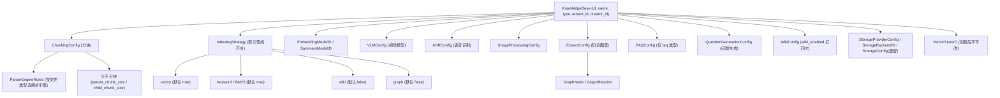
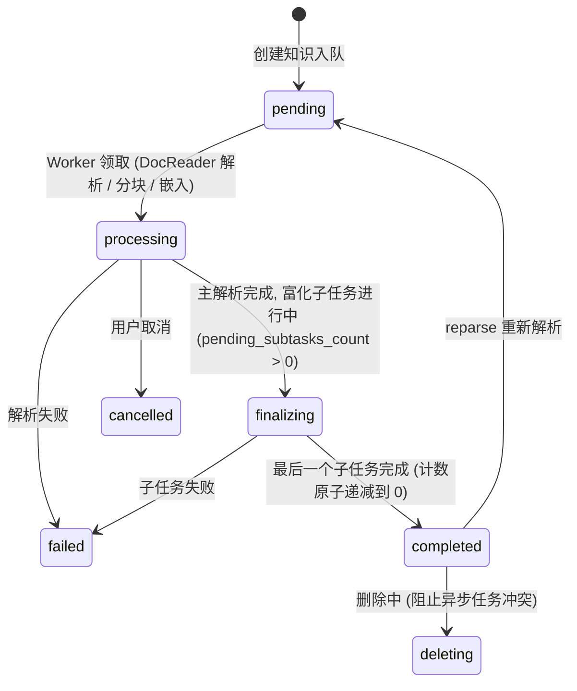

# 知识库与知识管理

知识库用于组织相关资料，并统一配置分块、向量模型、检索索引、Wiki 和知识图谱。文件、网页、手写 Markdown 和 FAQ 等内容作为知识条目管理，入库后按配置解析和建立索引。

不同知识库可以使用独立的处理配置。提问时可限定检索范围，成员访问与组织共享也按知识库授权。

<Screenshot
  src="/screenshots/kb-document-list.png"
  caption="知识库文档列表：解析状态、标签与批量操作"
  hint="展示文档列表页，包含解析状态列、标签列、顶部筛选栏与勾选后出现的批量操作栏。" />

## 管理操作入口 {#_0-日常会用到的操作}

| 操作 | 界面入口 |
| --- | --- |
| 建库、改分块大小与索引开关 | 知识库编辑弹窗的「分块」「索引策略」页签 |
| 上传文件、导入网页或编写 Markdown | 文档列表页的上传区，或「新建」下拉 |
| 用文件夹整理文档 | 文档列表左侧的文件夹树；上传整个目录会保留目录结构（见 [文件夹树](#_3-4-文件夹树)） |
| 给文档打标签（一篇可多个） | 单篇在详情里改；多篇勾选后用批量操作栏的「标签」（见 [标签（KnowledgeTag）](#_3-5-标签-knowledgetag)） |
| 检查解析结果、改错字 | 打开文档 → 分块列表 → 直接编辑分块（见 [分块编辑与版本历史](#_3-6-分块编辑与版本历史)） |
| 补充部门、密级等自定义字段 | 文档详情里的自定义元数据（见 [模型要点](#_3-1-模型要点)） |
| 查看操作记录 | 知识库设置 → 活动（见 [知识库活动流（KB Activity）](#_6-知识库活动流-kb-activity)） |
| 复制知识库或跨库移动文档 | 知识库列表的复制，或文档批量操作里的移动（见 [知识库复制与知识移动](#_4-知识库复制与知识移动)） |

<Screenshot
  src="/screenshots/kb-settings.png"
  caption="知识库设置：分块参数与索引策略开关"
  hint="展示分块大小/重叠/父子分块设置，以及向量、关键词、Wiki、图谱四个索引开关。" />

## 创建知识库并导入资料

创建知识库时选择内容类型、模型与索引方式，再上传文件、导入网页或编写 Markdown。普通资料使用文档库，标准问答使用 [FAQ 库](17-faq.md)。向量存储创建后不可更改，应在建库前确定。

上传确认页可设置标签和本批文件的解析选项。单次处理选项优先于知识库配置，知识库配置再优先于空间默认值。上传后可在列表查看解析进度；已有文档需要重新解析才能使用修改后的分块参数。

## 整理文件夹与标签

文件夹用于按目录归档，一篇文档只属于一个文件夹。上传整个目录可保留层级结构；在文件夹树中重命名或移动时，子目录路径会一并更新，目标目录已存在时合并内容。文档在同一知识库内移动文件夹只调整归类，不重新解析。

标签用于交叉分类，一篇文档可关联多个标签。上传时可以预设标签，也可勾选文档后批量修改；批量对话框预选所选文档共有的标签。按多个标签筛选时，匹配任一标签的文档即可返回。

开启自动标签后，系统在解析完成时从已有候选标签中选择匹配项。默认每篇最多关联 3 个，已有标签时跳过。配置只影响后续解析，不自动补齐历史文档，模型失败也不会阻塞文档完成。

<Screenshot
  src="/screenshots/kb-folder-tree.png"
  caption="文档列表的文件夹树：按目录浏览与重新归类"
  hint="展示左侧文件夹树、当前目录下的文档列表，以及重命名/移动文件夹的操作入口。" />

<Screenshot
  src="/screenshots/kb-batch-tag.png"
  caption="批量打标签：已选文档的共有标签会被预选中"
  hint="展示勾选多篇文档后打开的标签对话框，含已选标签区、搜索框与可选标签列表。" />

## 编辑分块与补充元数据

在文档详情中编辑文本分块，可修正解析错误并重建索引。每次编辑或回滚都会生成新版本；若其他用户已更新同一分块，界面会提示刷新后重试。索引更新失败时会保留编辑内容并显示失败状态，再次提交可重试。

自定义元数据用于补充部门、密级或版本号等信息，最多 20 项。修改元数据会触发摘要刷新；详细的字段长度和支持类型见参考部分。

<Screenshot
  src="/screenshots/kb-chunk-edit.png"
  caption="分块编辑：修改正文、查看版本历史与回滚"
  hint="展示某个分块的编辑态、版本历史列表（含编辑者与时间）以及回滚入口。" />

## 复制与移动内容

复制知识库可复用已有配置与内容。跨库移动时，可选择复用向量或重新解析：复用要求两库绑定同一向量存储，重新解析允许使用目标库的存储和处理配置。移动为异步任务，可查询进度。

## 查看活动与用量

知识库设置的「活动」记录配置、文档、分块、共享和 Wiki 变更。该入口面向符合资源管理权限的登录用户，API Key 不可访问。

存储配额按工作空间计算，涵盖文件、文本、向量和索引。创建知识库与上传前会检查配额，删除内容后回收对应用量。

<Screenshot
  src="/screenshots/kb-activity.png"
  caption="知识库活动流：按时间倒序的操作记录"
  hint="展示活动列表（操作人、动作、目标文档、时间）与展开后的详情抽屉。" />

## 配置与接口参考

### 知识库模型与配置项 {#_1-知识库模型与配置项}

#### KB 类型 {#_1-1-kb-类型}

`internal/types/knowledgebase.go`：

```go
const (
    KnowledgeBaseTypeDocument = "document" // 文档类
    KnowledgeBaseTypeFAQ      = "faq"      // FAQ 类
    KnowledgeBaseTypeWiki     = "wiki"     // Wiki 类
)
```

更新 KB 时会清除与其类型不匹配的配置（如非 FAQ 库的 `FAQConfig`）。`VectorStoreID` 使用 GORM `<-:create` 标签，**创建后不可修改**（防止索引与存储错位）。

#### 配置结构总览 {#_1-2-配置结构总览}



#### ChunkingConfig（分块配置） {#_1-3-chunkingconfig-分块配置}

| 字段 | 类型 | 默认 | 说明 |
| --- | --- | --- | --- |
| `chunk_size` | int | 必填 | 分块大小（字符数） |
| `chunk_overlap` | int | - | 相邻分块重叠 |
| `separators` | []string | - | 分隔符列表 |
| `parser_engine_rules` | []ParserEngineRule | - | 按文件类型指定解析引擎：`{file_types, engine, xlsx_first_row_as_header?}` |
| `enable_parent_child` | bool | false | 启用父子分块策略 |
| `parent_chunk_size` | int | 4096 | 父分块大小（用于返回上下文） |
| `child_chunk_size` | int | 384 | 子分块大小（用于嵌入检索） |
| `strategy` | string | 空（= `legacy`） | 分块策略：`legacy`（历史递归切分）/ `auto`（画像器自动选层）/ `heading` / `heuristic` / `recursive`（固定某一层），详见[分块机制](04-chunking.md) |
| `token_limit` | int | 0 | 令牌上限（0 = 不限） |
| `languages` | []string | 自动检测 | 语言提示 |
| `table_metadata_instructions` | string | - | 表格元数据生成指令 |

#### IndexingStrategy（索引管线开关） {#_1-4-indexingstrategy-索引管线开关}

| 字段 | 默认 | 说明 |
| --- | --- | --- |
| `vector_enabled` | true | 语义向量检索 |
| `keyword_enabled` | true | 关键词（BM25）检索 |
| `wiki_enabled` | false | Wiki 页面生成 |
| `graph_enabled` | false | 知识图谱提取 |

#### 多模态与富化配置 {#_1-5-多模态与富化配置}

**VLMConfig（视觉语言模型）**：

| 字段 | 说明 |
| --- | --- |
| `enabled` / `model_id` | 新版：启用开关 + 模型 ID |
| `description_language` | 图片描述语言（空 = 跟随文档语言） |
| `custom_instructions` | KB 级图片解释指导 |
| `model_name` / `base_url` / `api_key` / `interface_type` | 旧版兼容字段（ollama / openai） |

启用判定：`Enabled && ModelID != ""`，或旧版 `ModelName != "" && BaseURL != ""`。

**ASRConfig**：`enabled` / `model_id` / `language`（语言提示，可选）。

**ImageProcessingConfig**：`model_id`。

**QuestionGenerationConfig（问题生成）**：`enabled`；`question_count` 每分块生成问题数（默认 3，上限 10）；`custom_instructions` 目标受众 / 风格说明。

**ExtractConfig（知识图谱）**：`enabled`、`text`、`tags`、`nodes []*GraphNode{name, chunks, attributes}`、`relations []*GraphRelation{node1, node2, type}`、`custom_instructions`（领域提取指导）。

**FAQConfig（仅 FAQ 库）**：`index_mode`（`question_only` / `question_answer`，默认后者）、`question_index_mode`（`combined` / `separate`，默认 combined），详见 FAQ 篇。

**WikiConfig（打开 `indexing_strategy.wiki_enabled` 的知识库）**——注意它不是 `type = "wiki"` 专属：普通文档库打开 Wiki 索引后，`UpdateKnowledgeBase` 会自动给它建一份空的 `WikiConfig` 承载这些可调项：

| 字段 | 默认 | 说明 |
| --- | --- | --- |
| `synthesis_model_id` | - | Wiki 生成 LLM |
| `max_pages_per_ingest` | 0（不限） | 单次摄入最多创建/更新页面数 |
| `extraction_granularity` | `standard` | `focused`（仅主要主题）/ `standard` / `exhaustive`（全部实体概念） |
| `content_instructions` / `extraction_instructions` | - | 生成与提取风格指导 |
| `ingest_batch_size` / `ingest_map_parallel` / `ingest_reduce_parallel` / `ingest_max_inflight` | 5 / 10 / 10 / 4 | 摄入并发参数 |

所有 `custom_instructions` 类字段在更新时经 `validateKnowledgeBasePromptInstructions` 校验长度与合法性（`internal/handler/knowledgebase.go`）。

#### 存储配置 {#_1-6-存储配置}

- **StorageProviderConfig**（新）：`provider ∈ {local, minio, cos, tos, s3, oss, ks3, obs}`；
- **StorageBackendID**：绑定具体存储后端实例；
- **StorageConfig**（遗留 `cos_config` 列）：`secret_id / secret_key / region / bucket_name / app_id / path_prefix / provider / endpoint / use_ssl / force_path_style`。

#### KB 计算字段 {#_1-7-kb-计算字段}

列表 / 详情响应附带：`knowledge_count`、`chunk_count`、`is_processing`（FAQ 库）、`processing_count`（文档库处理中知识数）、`share_count`（共享到的组织数）、`creator_name`、`is_pinned` / `pinned_at`（当前用户置顶状态）。

另有一个存储字段 `is_temporary`：标记**临时（ephemeral）知识库**，正常的知识库列表里不展示。它由系统内部使用，典型场景是联网搜索把抓回来的网页缓存成可检索内容。手工建库不会产生临时库。

#### 自动标签

在文档知识库的标签相关设置中开启自动标签，先准备好候选标签，再选择聊天模型。解析完成后，系统异步从已有标签里挑选匹配项，不创建新标签。`auto_tag_config` 仅适用于 document 类型：

| 字段 | 默认 | 说明 |
| --- | --- | --- |
| enabled | false | 开启自动标签 |
| model_id | 空 | 为空使用知识库 summary_model_id |
| max_tags | 3 | 每篇最多自动关联的数量，上限 10 |
| skip_if_tagged | true | 已有标签时跳过，包括人工或数据源添加的标签；false 则增量追加 |

配置仅对之后新解析或重新解析的文档生效，不自动回填历史文档。模型失败不阻塞文档完成，异步任务按队列策略重试。候选标签取知识库排序前 500 个；自动关联不删除人工标签。数据源按来源名称添加标签是另一条机制。

### 知识（Knowledge）管理 {#_3-知识-knowledge-管理}

#### 模型要点 {#_3-1-模型要点}

`internal/types/knowledge.go`。关键字段：`type`（`manual` 手动 Markdown / `faq` / 文件类型）、`source` / `channel`（摄入渠道）、`parse_status`、`summary_status`、`enable_status`、`file_name/type/size/hash/path`、`storage_size`、`metadata`（JSON，手动知识存 `ManualKnowledgeMetadata{content, format, status(draft/publish), version}`）、`custom_metadata`（JSON，用户自填元数据）、`last_faq_import_result`。

`custom_metadata` 保存用户维护的部门、密级、版本号等描述性字段；`metadata` 保存处理流程的内部状态与 ID。自定义元数据最多 20 项，键为 1–64 字符，值支持字符串、数字、布尔值或 null，长度不超过 1000 字符。修改后会自动刷新摘要。

实现中，`Knowledge.CustomMetadataText()` 按键排序生成 `键: 值` 文本，供摘要生成和文档级模型上下文使用。字段由迁移 `000078` 引入。

摄入渠道常量：`web`、`api`、`browser_extension`、`wechat`、`wecom`、`feishu`、`dingtalk`、`slack`、`im`、`notion`、`yuque`、`rss`。

解析状态机：



摘要独立状态：`summary_status ∈ {none, pending, processing, completed, failed}`。

#### 知识路由 {#_3-2-知识路由}

| 方法 | 路径 | 说明 | 门禁 |
| --- | --- | --- | --- |
| POST | `/knowledge-bases/:id/knowledge/file` | 上传文件 | OwnedKBOrAdmin + KBAccessWrite |
| POST | `/knowledge-bases/:id/knowledge/url` | URL 导入 | 同上 |
| POST | `/knowledge-bases/:id/knowledge/manual` | 手动 Markdown 知识 | 同上 |
| GET | `/knowledge-bases/:id/knowledge` | 列表（分页 + 过滤） | Viewer+ + KBAccessRead |
| DELETE | `/knowledge-bases/:id/knowledge` | 清空 KB 内容 | Admin + KBAccessWrite |
| GET | `/knowledge/:id`、`/knowledge/batch` | 详情 / 批量获取 | Viewer+ |
| GET | `/knowledge/:id/stages`、`/knowledge/:id/spans` | 处理阶段 / 跨度 | Viewer+ |
| PUT / DELETE | `/knowledge/:id`、`/knowledge/manual/:id` | 更新（含 `custom_metadata`）/ 删除 | OwnedKnowledgeKBOrAdmin + KBAccessWrite |
| POST | `/knowledge/:id/reparse`、`/knowledge/:id/cancel-parse` | 重解析 / 取消解析 | 同上 |
| POST | `/knowledge/:id/regenerate-summary` | 重新生成文档摘要 | 同上 |
| GET | `/knowledge/:id/download` | 下载原始文件 | Contributor+ + KBAccessWrite |
| GET | `/knowledge/:id/preview` | 预览文件 | Viewer+ + KBAccessRead |
| PUT | `/knowledge/tags` | 批量更新标签 | Contributor+ / `ingest` |
| POST | `/knowledge/batch-reparse`、`/knowledge/batch-delete` | 批量重解析 / 删除 | Contributor+ / `ingest` |
| POST | `/knowledge/move` | 移动知识 | Contributor+ / `ingest` |
| GET | `/knowledge/move/progress/:task_id` | 移动进度 | Viewer+ |

#### 列表过滤参数 {#_3-3-列表过滤参数}

`internal/types/knowledge.go` 的 `KnowledgeListFilter` + `internal/handler/knowledge.go`：

| 参数 | 说明 |
| --- | --- |
| `page` / `page_size` | 分页（默认按 `updated_at DESC` 排序） |
| `keyword` | 按文件名 / 标题搜索 |
| `file_type` | 文件类型过滤（`pdf` / `manual` / `url` …） |
| `parse_status` | 解析状态过滤 |
| `source` | 摄入渠道过滤（`api` / `web` / `feishu` …） |
| `tag_id` | 标签过滤，逗号分隔多个（**OR 语义**） |
| `updated_from` / `updated_to` | 更新时间范围（RFC3339） |
| `folder_path` | 按文件夹筛选。**是否传这个参数决定列表模式**：不传是全库扁平视图，传空字符串是知识库根目录（不含子目录） |
| `folder_recursive` | 配合 `folder_path` 使用，为 `true` 时连子目录里的文档一起返回 |

#### 文件夹树 {#_3-4-文件夹树}

文件夹用于按项目、来源或目录层级组织文档，支持上传时保留目录结构，以及入库后的重命名和移动。

文件夹操作：

- **上传整个目录**：目录结构会被原样保留，不需要事后手工建文件夹；
- **新建 / 重命名 / 移动文件夹**：文档列表左侧的文件夹树上操作。重命名会连子目录一起改路径；目标路径已存在时两个文件夹合并；不允许把文件夹移到自己的子目录下；
- **重新归类文档**：勾选文档后移动到指定文件夹（也可以移回根目录）。这只改归类，不重新解析、不影响索引；
- **按目录浏览**：列表接口的 `folder_path` 决定视图模式——不传是全库平铺，传空字符串是根目录（不含子目录），配 `folder_recursive=true` 则连子目录一起列。

文件夹与标签解决的是不同问题，可以叠加使用：**文件夹是唯一归属**（一篇文档只在一个目录下，适合按项目/来源归档），**标签是多对多**（一篇文档可带多个标签，适合按主题、密级、状态交叉筛选）。检索时两者都能作为范围限定条件。

目录路径保存在 `knowledges.folder_path`，`file_name` 仅保存文件名。迁移 `000079` 已从历史文件名中回填目录路径。

文件夹接口为 `GET/PUT /knowledge-bases/:id/knowledge/folders` 与 `POST /knowledge/folder`，详见[知识库 API](../04-api/02-api-knowledge.md)。

#### 标签（KnowledgeTag） {#_3-5-标签-knowledgetag}

`internal/types/tag.go` + `internal/handler/tag.go`：

```go
type KnowledgeTag struct {
    ID              string // UUID
    SeqID           int64  // 自增整数 ID（API 使用）
    TenantID        uint64
    KnowledgeBaseID string
    Name            string // KB 内唯一
    Color           string
    SortOrder       int
}
type KnowledgeTagRelation struct { KnowledgeID, TagID string } // 多对多
```

**一篇文档可以带多个标签。** 早期是单标签（`knowledges.tag_id` 一列），migration `000063` 换成了关联表 `knowledge_tag_relations`：建表时把原有的单标签数据迁进去，然后**删掉了 `knowledges.tag_id` 列**。所以现在：

- 读：`Knowledge.Tags` 是查询时按 `knowledge_id` 批量 JOIN 出来的（`gorm:"-"`，不落在 knowledges 表上）；
- 写：整体替换语义——`PUT /knowledge/tags` 传 `{knowledge_id: [tag_ids]}`，实现先删该文档的全部关联再写入新集合；
- 过滤：`tag_ids` 是 **OR 语义**（命中任一标签即返回），SQL 走 `knowledges.id IN (SELECT knowledge_id FROM knowledge_tag_relations WHERE tag_id IN (...))`；
- FAQ 条目是另一套：它本身是 chunk，标签存在 `chunks.tag_id` 上（**单标签**），与文档的多标签关联表不是同一条路径。

标签本身的管理路由：`GET /knowledge-bases/:id/tags`（Viewer+）、`POST`（OwnedKBOrAdmin）、`PUT/DELETE /knowledge-bases/:id/tags/:tag_id`（OwnedKBOrAdmin）；`tag_id` 路径参数同时接受 UUID 与整数 `seq_id`。

前端两个入口：

- **批量打标签**：文档列表勾选若干文档后，批量操作栏的「标签」按钮打开 `BatchTagDialog.vue`。对话框会把所选文档**共有**的标签预选中，支持搜索、直接跳转标签管理，提交后刷新列表；
- **上传时设置标签**：上传确认对话框（`UploadConfirmDialog.vue`）可在文件入库前直接指定标签与解析选项，省去先传后改。

#### 分块编辑与版本历史 {#_3-6-分块编辑与版本历史}

在文档详情中可以编辑分块正文，修正 OCR、表格或公式的解析错误。保存后会重建索引，并保留历史版本供查看和回滚。

实现上（`internal/application/service/chunk.go`，migration `000078`）：

数据模型：

| 字段 / 表 | 作用 |
| --- | --- |
| `chunks.source_content` | 解析器原始输出，**不可变**。历史行在首次手工编辑时从 `content` 惰性回填 |
| `chunks.content` | 当前生效内容（检索、引用展示都用它） |
| `chunks.content_revision` | 每次编辑或回滚 +1，用作乐观锁 |
| `chunks.index_status` | `ready` / `processing` / `failed`，标识当前内容是否已反映到检索存储 |
| `chunks.last_editor_id` | 产生当前版本的操作者 |
| `chunk_revisions` 表 | 被覆盖的历史版本快照（内容、启停、编辑者、来源、时间） |

行为要点：

- **只有 `text` 类型分块可编辑**；内容去空白后不能为空，上限 200000 字节；
- **乐观并发**：请求可带 `expected_revision`，与当前版本不符返回 409，前端提示刷新后重试；
- **不能新增图片**：编辑内容中出现源内容里没有的图片 URL 会被拒绝；删除某张图片的 Markdown 引用时，对应的 OCR / caption 子分块被**停用**而非硬删除，这样回滚历史版本可以把它们重新启用；
- **父子分块一致性**：编辑子块后按偏移量把改动叠加回父块（父块的 `source_content` 保持不可变，替换按倒序应用，长度变化不会打乱坐标系）；
- **索引失败处理**：重建索引失败时行照常保存，但 `index_status = failed`，界面据此提示；再次提交相同内容会触发重试；
- **保留生成问题**：内容编辑后原有的检索问题保留，只是被标记为「与当前正文版本不匹配」，可以单条改写（`PUT /chunks/by-id/:id/questions`）或整体重新生成（`POST /chunks/by-id/:id/questions/regenerate`）；
- **摘要联动**：内容或启停状态变化会入队一次文档摘要刷新，`summary_status` 转为 `pending`；也可以用 `POST /knowledge/:id/regenerate-summary` 手动触发。

回滚（`POST /chunks/:knowledge_id/:id/revert`）本身也是一次新编辑：目标历史版本的内容被写为当前内容，版本号继续递增，原内容进入历史列表，因此「回滚的回滚」同样可行。

接口清单见 [API 参考：分块与标签](../04-api/02-api-chunks.md)。

#### 手工编辑摘要与分块浏览

在文档内容预览中可编辑摘要并保存，用于修正自动摘要。`PUT /knowledge/:id` 的 description 省略时保持原摘要，显式空字符串清空；更新摘要不会等同于修改原始文档内容。需要重新生成时使用「重新生成摘要」，内容/元数据变化也可能触发摘要刷新。

文档分块按页加载，切换文档和检索跳转会更新分页状态。完整字段见[知识 API](../04-api/02-api-knowledge.md)与[分块 API](../04-api/02-api-chunks.md)。

#### 下载与预览安全 {#_3-7-下载与预览安全}

`GET /knowledge/:id/preview` 的安全机制由 `internal/handler/knowledge_preview_security_test.go` 固化验证：

| 控制 | 实现 | 目的 |
| --- | --- | --- |
| 强制 `Content-Type: application/octet-stream` | 响应头固定 | 阻止浏览器把 HTML/SVG 当页面执行（防存储型 XSS） |
| `X-Content-Type-Options: nosniff` | 响应头 | 禁止 MIME 嗅探绕过 |
| `Content-Disposition: attachment; filename=...` | 响应头 | 强制下载而非内联渲染 |
| 路径校验 | `ValidateKBScopedStoragePath()` | 文件路径必须落在该 KB 的授权存储范围内（防路径穿越 / 越权读取） |
| 大小限制 | GetFile 响应体限制 | 防止超大文件拖垮预览 |

测试用例明确验证：即使文件内容是 `<script>alert(1)</script>`，也只会作为二进制附件传输。下载端点（`/knowledge/:id/download`）要求更高的 Contributor+ 且走 KBAccessWrite 门禁。

### 知识库复制与知识移动 {#_4-知识库复制与知识移动}

#### 复制（Copy / Duplicate）与 Preflight {#_4-1-复制-copy-duplicate-与-preflight}

`internal/application/service/knowledge_clone_move.go`，preflight 规则由 `internal/handler/knowledgebase_copy_preflight_test.go` 固化：

- `POST /knowledge-bases/copy`：整库复制（配置 + 内容），body 传 `source_id`；异步任务，进度查 `GET /knowledge-bases/copy/progress/:task_id`（活动流记 `kb.clone_started` / `kb.clone_completed` / `kb.clone_failed`）。
- `POST /knowledge-bases/:id/duplicate`：**仅复制配置**（不复制内容 / 索引 / 共享记录），活动流记 `kb.duplicated`。

Preflight（复制前校验，直接同步拒绝）：

1. 源 / 目标 KB 的租户隔离（跨租户拒绝）；
2. 源 KB 存在性；
3. **VectorStore 兼容性**：`reuse_vectors` 模式不支持跨向量库的 KB（向量不可直接搬移）；
4. **StorageBackend 兼容性**：跨存储后端复制不支持；
5. API Key 调用时源 / 目标 KB 均须在 allow-list 内。

#### 知识移动门禁（move gate） {#_4-2-知识移动门禁-move-gate}

`POST /knowledge/move` 支持两种模式，约束在 **handler 与 service 双层**校验（`internal/handler/knowledge_move_gate_test.go` 与 `internal/application/service/knowledge_move_gate_test.go` 双重佐证）：

- **`reuse_vectors` 模式**：直接复用既有向量，**要求源 KB 与目标 KB 绑定同一 VectorStore**；
- **`reparse` 模式**：目标库重新解析生成向量，允许跨向量库移动。

同库判定 `SharesStoreWith()` 的规范化语义（空字符串归一化为 nil，nil 表示环境默认 store）：

```text
nil & nil               → true   (同为 env-store)
"" & nil                → true   (空串规范化为 nil)
"store-a" & "store-a"   → true
"store-a" & "store-b"   → false
"store-a" & nil         → false  (显式绑定 vs env-store 不视为同库)
```

`GET /knowledge-bases/:id/move-targets` 返回符合门禁的候选目标库；移动为异步任务，进度查 `GET /knowledge/move/progress/:task_id`。

### 存储配额与用量 {#_7-存储配额与用量}

配额挂在租户上（`internal/types/tenant.go`）：

| 字段 | 默认 | 说明 |
| --- | --- | --- |
| `storage_quota` | 10737418240（10GB） | 租户总配额 |
| `storage_used` | 0 | 已用量（涵盖原始文件、文本、向量与索引占用） |

创建 KB 与上传知识前都会执行配额检查（`internal/handler/knowledgebase.go` 创建校验链），超限拒绝写入；每条知识记录自身 `file_size` 与 `storage_size`，删除时回收用量。

### KB 路由与权限 {#_2-kb-路由与权限}

（门禁语义见《租户、用户与认证授权》篇；`KBAccessRead/Write` 会解析组织共享路径。）

| 方法 | 路径 | Handler | 门禁 |
| --- | --- | --- | --- |
| POST | `/knowledge-bases` | CreateKnowledgeBase | Contributor+ / API Key `manage_kbs` |
| GET | `/knowledge-bases` | ListKnowledgeBases | Viewer+ / `retrieve` |
| GET | `/knowledge-bases/:id` | GetKnowledgeBase | Viewer+ + KBAccessRead |
| PUT | `/knowledge-bases/:id` | UpdateKnowledgeBase | OwnedKBOrAdmin + KBAccessWrite |
| DELETE | `/knowledge-bases/:id` | DeleteKnowledgeBase | OwnedKBOrAdmin + KBAccessWrite |
| PUT | `/knowledge-bases/:id/pin` | TogglePinKnowledgeBase | Viewer+ + KBAccessRead |
| POST/GET | `/knowledge-bases/:id/hybrid-search` | HybridSearch | Viewer+ + KBAccessRead |
| POST | `/knowledge-bases/copy` | CopyKnowledgeBase | Contributor+ / `manage_kbs` |
| POST | `/knowledge-bases/:id/duplicate` | DuplicateKnowledgeBase | Contributor+ / `manage_kbs` + KBAccessRead |
| GET | `/knowledge-bases/copy/progress/:task_id` | GetKBCloneProgress | Viewer+ / `retrieve` 或 `manage_kbs` |
| GET | `/knowledge-bases/:id/move-targets` | ListMoveTargets | Viewer+ + KBAccessRead |
| GET | `/knowledge-bases/:id/activity` | ListKnowledgeBaseActivity | OwnedKBOrAdmin + KBAccessRead（仅 JWT） |

**创建流程**（`internal/handler/knowledgebase.go`）：Contributor 校验 → 租户存储配额检查 → `EmbeddingModelID` 校验 → `VectorStoreID` 绑定校验 → 创建 → 返回 KB + `vector_store_display`。

**删除级联**：删除 KB 下全部 Knowledge → Chunk → 向量索引 → 关键词索引 → Wiki 页面 → 标签 → 存储文件 → 软删除 KB 本身。共享侧的 editor 无法删除源 KB（删除要求 owner 租户 + Admin 侧权限）。

### 混合检索（Hybrid Search） {#_8-混合检索-hybrid-search}

`POST /knowledge-bases/:id/hybrid-search`（`internal/handler/knowledgebase.go` + `internal/application/service/knowledgebase_search*.go`）按 KB 的 `IndexingStrategy` 组合召回：向量（vector_enabled）+ 关键词 BM25（keyword_enabled），经 rank fusion 融合与重排（rerank），可叠加知识图谱增强（graph_enabled）；多 KB 场景由 `knowledgebase_search_fanout.go` 并发扇出、`knowledgebase_search_fusion.go` 融合；共享 KB 检索路径见 `knowledgebase_search_shared.go`。FAQ 库检索有专门的命中策略（负例过滤 / 迭代召回），见 FAQ 篇。

### 知识处理管线 {#_5-知识处理管线}

`internal/application/service/knowledge_create.go` / `knowledge_process.go` / `knowledge_process_config.go`：

```text
上传 (file/url/manual)
  → 创建 Knowledge (parse_status=pending) → Asynq 入队
  → Worker: DocReader 解析 → 分块 (ChunkingConfig)
      → 向量嵌入        (indexing_strategy.vector_enabled)
      → 关键词索引       (keyword_enabled)
      → 图谱提取        (graph_enabled + ExtractConfig)
      → Wiki 生成       (wiki_enabled + WikiConfig)
      → 问题生成        (QuestionGenerationConfig.enabled)
  → parse_status=finalizing, pending_subtasks_count=N
  → 每个富化子任务完成后原子递减；归零 → parse_status=completed
```

**配置合并优先级**（`EffectiveProcessConfig`）：`Knowledge.ProcessOverrides`（单次上传覆盖，存于知识 metadata 的 `KnowledgeProcessOverrides`，可覆盖 parser 规则 / 分块 / VLM / ASR / 问题生成 / 图谱开关等）> KB 配置 > 租户默认。

Chunk 类型（`internal/types/chunk.go`）：`text`、`parent_text`、`image_ocr`、`image_caption`、`summary`、`entity`、`relationship`、`faq`、`web_search`、`table_summary`、`table_column`、`wiki_page`；chunk 支持 `is_enabled` 开关与 `flags` 位标志（bit0 = 可推荐）。

### 知识库活动流（KB Activity） {#_6-知识库活动流-kb-activity}

知识库设置的「活动」页签记录配置修改、文档上传与删除、分块编辑、共享变更和 Wiki 更新，包含操作人、时间与结果。

`internal/application/service/kb_activity.go` 复用审计日志体系（`AuditLog`，scope 为 knowledge_base），通过 `recordKBActivity(ctx, audit, tenantID, kbID, action, targetType, targetID, outcome, details)` 记录：

- **活动动作**（`internal/types/audit_log.go`）：`kb.created` / `kb.updated` / `kb.deleted` / `kb.duplicated` / `kb.clone_started` / `kb.clone_completed` / `kb.clone_failed`、`kb.share_added` / `kb.share_permission_changed` / `kb.share_removed`，以及知识 / chunk 级的增删改动作；
- **触发源**：context 中的 `kbActivityTaskMetadata{TaskID, Trigger}`（`user` 用户操作 / `system` 后台任务）自动并入 details；根据 outcome 自动补 `processing_status`（accepted→pending、success→completed、partial→partial、failed/denied→failed、canceled→canceled）；
- **批量操作样本标题**：`kbActivityAppendSampleTitles` 为批量操作附带最多 5 个去重标题（第一个作为 `title`，其余进 `titles` 数组），保证活动流可读且有界；
- **抑制机制**：`withKBActivitySuppressed(ctx)` 可让内部级联操作不产生重复活动记录。

查询端点：`GET /knowledge-bases/:id/activity`（OwnedKBOrAdmin，仅 JWT 用户，API Key 不可访问）。

## 实现参考

以下路径均相对仓库根目录：

| 层 | 文件 |
| --- | --- |
| KB 模型与配置结构 | `internal/types/knowledgebase.go`、`indexing_strategy.go` |
| 知识 / Chunk / 标签模型 | `internal/types/knowledge.go`、`chunk.go`、`tag.go` |
| 处理配置覆盖 | `internal/types/knowledge_process.go` |
| KB Handler | `internal/handler/knowledgebase.go` |
| 知识 Handler | `internal/handler/knowledge.go` |
| 标签 Handler | `internal/handler/tag.go` |
| KB 服务 | `internal/application/service/knowledgebase.go` |
| 知识创建 / 处理管线 | `internal/application/service/knowledge_create.go`、`knowledge_process.go`、`knowledge_process_config.go` |
| 复制与移动 | `internal/application/service/knowledge_clone_move.go` |
| 活动流 | `internal/application/service/kb_activity.go` |
| 路由与门禁 | `internal/router/router.go`、`internal/router/rbac.go` |
| 关键测试佐证 | `internal/handler/knowledge_preview_security_test.go`、`knowledge_move_gate_test.go`、`knowledgebase_copy_preflight_test.go` |
