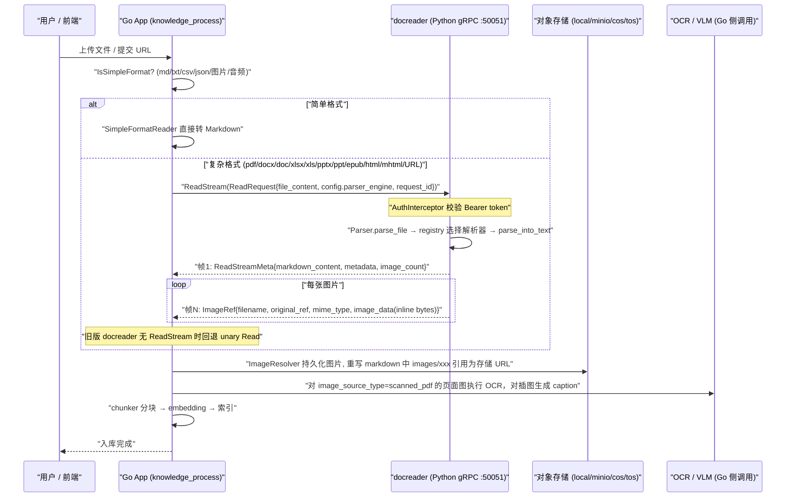
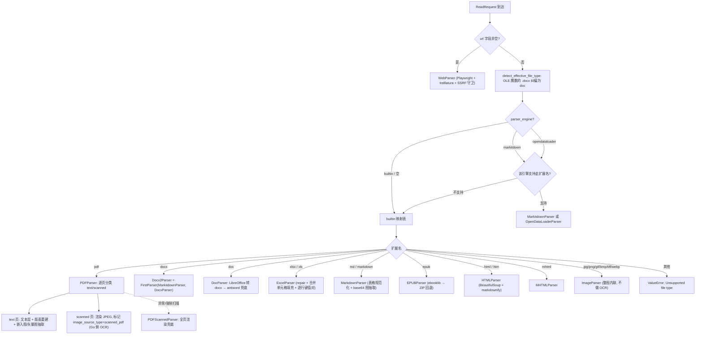

# 文档解析服务 docreader

上传一个 PDF 之后，系统要先把它变成能被切分和索引的文本——这件事由独立的解析服务 docreader 完成。作为使用者，你通常只需要知道两件事：**支持哪些格式**，以及**解析不理想时能调什么**。

支持的格式：

| 类别 | 格式 |
| --- | --- |
| 文档 | PDF、Word（doc/docx）、PPT（ppt/pptx）、Excel（xls/xlsx）、EPUB |
| 文本 | txt、Markdown、CSV、JSON |
| 网页 | 在线 URL 抓取、本地 HTML / MHTML 归档 |
| 图片 | jpg、png、gif、bmp、tiff、webp（需配置视觉模型才能理解内容） |
| 音频 | mp3、wav、m4a、flac、ogg（需配置语音识别模型） |

解析结果不理想时可以调整：

- **PDF 版式还原差、表格错位**：在知识库的解析设置里为 `pdf` 指定其他解析引擎（MarkItDown / OpenDataLoader / MinerU）；
- **扫描件没识别出文字**：确认已配置视觉模型，必要时强制走扫描件模式；
- **Excel 首行是列名却被当成数据**：为 `xlsx`/`xls` 打开「首行作为表头」；
- **个别段落切错**：不必重传整个文档，直接在分块列表里改，见[知识库与知识管理](02-knowledge-base.md)的分块编辑一节。

以下是 docreader 的完整实现说明，供二次开发与排障参考。

`docreader/` 是 WeKnora 中独立的 Python 文档解析微服务（gRPC sidecar）。它的唯一职责是：**把各种格式的文件 / URL 转换为 Markdown 文本 + 原始图片引用**，供 Go 主服务（App）完成后续的分块（chunking）、图片持久化、OCR、VLM caption、向量化等流程。

经过"轻量化重构"后，docreader 本身**不做 OCR、不做 VLM caption、不做分块、不做对象存储上传**——这些全部在 Go 侧完成。`docreader/parser/base_parser.py` 里的接口说明：

```python
class BaseParser(ABC):
    """Base parser interface.

    After the lightweight refactoring, BaseParser only extracts markdown text
    and raw image references from documents. Chunking, image storage, OCR,
    and VLM caption are handled by the Go App module.
    """
```

---

## 1. 服务定位与对外接口

### 1.1 接口协议：纯 gRPC（无 HTTP）

服务入口是 `docreader/main.py`，只启动一个 gRPC server（`grpc.server` + `ThreadPoolExecutor`），默认监听 `50051` 端口，同时注册标准的 gRPC Health 服务（`grpc_health.v1`）供 K8s / Docker 探活（配合镜像内的 `grpc_health_probe` 二进制）。**没有任何 HTTP 接口**。

Proto 定义在 `docreader/proto/docreader.proto`，共 3 个 RPC：

```protobuf
service DocReader {
  rpc Read(ReadRequest) returns (ReadResponse) {}
  // 流式版本：先发 1 帧 meta（markdown/metadata/error），之后每帧 1 张图片。
  // 避免大扫描件 PDF（数百页图片）撞上 unary 消息大小上限（RESOURCE_EXHAUSTED）。
  rpc ReadStream(ReadRequest) returns (stream ReadStreamResponse) {}
  rpc ListEngines(ListEnginesRequest) returns (ListEnginesResponse) {}
}
```

`ReadRequest` 是统一请求：设置 `file_content`/`file_name`/`file_type` 为文件模式，设置 `url`/`title` 为 URL 模式；`config.parser_engine` 指定引擎（`builtin` / `markitdown` / `opendataloader`），`config.parser_engine_overrides` 传递引擎级覆盖参数（如 `pdf_force_scanned`、`odl_hybrid`）。

`ReadResponse` 返回 `markdown_content` + `repeated ImageRef image_refs`（图片以 **inline bytes** 内联返回，`image_dir_path` 恒为空字符串——图片持久化完全由 Go App 负责，proto 中原来的 `image_storage` 字段 3 已 `reserved`）。

`ReadStream` 的价值（见 `main.py::ReadStream` 与 `_iter_image_refs`）：每帧独立、体积小；服务端边解码 base64 边 `images.pop(ref_path)` 释放源数据，双方都不必同时持有全部图片，解决大扫描件 PDF 的峰值内存和消息尺寸问题。Go 侧 `internal/infrastructure/docparser/grpc_parser.go` 优先调用 `ReadStream`，遇到旧版本 docreader 返回 `Unimplemented` 时自动回退 unary `Read`。

`ListEngines` 保留用于向后兼容——注释明确说明引擎列表现在由 Go 侧 `internal/infrastructure/docparser/engine_registry.go`（`docparser.ListAllEngines`）管理，Go App 已不再调用该 RPC，MinerU 等远程引擎由 Go 原生处理。

### 1.2 认证与 TLS（auth.py）

`docreader/auth.py` 提供两层安全机制，均通过环境变量开启：

**Token 认证（`AuthInterceptor`）**：设置 `GRPC_AUTH_TOKEN` 后启用。客户端需在 metadata 里携带 `authorization: Bearer <token>`（或裸 token）。校验用 `hmac.compare_digest` 防时序攻击；token 短于 16 字节会打警告。两个健康检查方法（`/grpc.health.v1.Health/Check`、`/Watch`）在鉴权前放行，保证探活不受影响。鉴权失败时通过 `_make_abort_handler` 构造与原 RPC kind（unary/stream）匹配的 abort handler，返回 `UNAUTHENTICATED` 而不是让框架抛 `INTERNAL`。

**TLS / mTLS（`load_tls_credentials`）**：`GRPC_TLS_ENABLED=true` 时必须提供 `GRPC_TLS_CERT` / `GRPC_TLS_KEY`，可选 `GRPC_TLS_CA`；`GRPC_MTLS_REQUIRE_CLIENT_CERT=true` 强制客户端证书（未设置时按 `GRPC_TLS_CA` 是否存在自动判断）。任何 TLS 配置缺失/加载失败都抛 `TLSConfigError`，`main()` 捕获后 `sys.exit(1)` **fail-fast，拒绝静默降级到明文**。

Go 侧客户端在 `docreader/client/auth.go`（`LoadAuthConfigFromEnv` 读取同名环境变量 `GRPC_TLS_ENABLED/CERT/KEY/CA/SERVER_NAME` 与 `GRPC_AUTH_TOKEN`），`docreader/client/client.go` 的 `NewClient` 构建带 round_robin 负载均衡与 `MAX_FILE_SIZE_MB` 消息上限的连接。

### 1.3 与主服务的交互时序

Go App 中 `internal/application/service/knowledge_process.go` 在文档入库流水线的 docreader stage 调用解析（超时由 `docreader_call_timeout` 配置控制，防止挂死的 docreader 长时间占用 worker）。注意：**md/markdown/txt/csv/json/图片/音频由 Go 侧 `SimpleFormatReader` 原生处理，不经过 docreader**（见 `internal/infrastructure/docparser/builtin_converter.go` 的 `simpleFormats`）。



---

## 2. 解析器注册与调度机制

### 2.1 引擎注册表（parser/registry.py）

`ParserEngineRegistry` 维护 `引擎名 → {文件扩展名 → 解析器类}` 的两级映射，并支持每个引擎注册 `check_available` 探针（用于 `ListEngines` 汇报可用性与不可用原因）。

`_build_default_registry()` 注册三个引擎：

| 引擎 | 文件类型 | 说明 |
| --- | --- | --- |
| `builtin` | `docx`(Docx2Parser)、`doc`(DocParser)、`pdf`(PDFParser)、`md`/`markdown`(MarkdownParser)、`xlsx`/`xls`(ExcelParser)、`epub`(EPUBParser)、`html`/`htm`(HTMLParser)、`mhtml`(MHTMLParser)、`jpg`/`jpeg`/`png`/`gif`/`bmp`/`tiff`/`webp`(ImageParser) | 内置解析引擎 |
| `markitdown` | `md`、`markdown`、`pdf`、`docx`、`doc`、`pptx`、`ppt`、`xlsx`、`xls`、`csv`（全部 MarkitdownParser） | 微软 MarkItDown 库。**PPT/PPTX 只有该引擎支持** |
| `opendataloader` | `pdf`(OpenDataLoaderParser) | OpenDataLoader PDF 版面分析，需 Java 11+；`check_available` 探测 java、Python 包及 hybrid 服务健康 |

调度规则（`get_parser_class`）：请求指定的引擎若不支持该文件类型，**自动回退 `builtin` 引擎**；builtin 也没有则抛 `ValueError("Unsupported file type")`。

### 2.2 门面与文件魔数纠偏（parser/parser.py）

`Parser` 是门面类：`parse_file()` 走注册表，`parse_url()` 固定使用 `WebParser`。其中一个重要防御是 `detect_effective_file_type()`——OOXML `.docx` 实为 ZIP 容器，而老式 `.doc` 是 OLE Compound File；WPS/Word 容忍把 `.doc` 改名成 `.docx`，因此检测到 OLE 魔数（`b"\xd0\xcf\x11\xe0\xa1\xb1\x1a\xe1"`）开头的 "docx" 会被强制路由到 DOC 解析器，避免把二进制 OLE 数据喂给 DOCX 解析器。

引擎覆盖参数 `engine_overrides`（来自 proto 的 `parser_engine_overrides`）作为 `**kwargs` 传入解析器构造函数，例如 `pdf_force_scanned` 由 `PDFParser.__init__` 捕获。

### 2.3 链式解析器（parser/chain_parser.py）

两种"责任链"组合器，均通过类工厂 `create(*parser_classes)` 动态生成子类：

- **`FirstParser`**：按顺序尝试多个解析器，第一个产出 `document.is_valid()`（即 `content != ""`）的结果即返回；异常被捕获后继续尝试下一个。典型用例：`Docx2Parser = FirstParser.create(MarkitdownParser, DocxParser)`。
- **`PipelineParser`**：流水线，每个解析器的输出文本（重新编码为 bytes）作为下一个的输入，各阶段产生的 `images`/`metadata` 累积合并。典型用例：`MarkdownParser = PipelineParser.create(MarkdownTableFormatter, MarkdownImageBase64)`、`WebParser = PipelineParser.create(StdWebParser, MarkdownParser)`、`MarkitdownParser = PipelineParser.create(StdMarkitdownParser, MarkdownParser)`。

### 2.4 并发模型（parser/concurrency.py 及各处）

并发控制分四层：

1. **gRPC 线程池**：`ThreadPoolExecutor(max_workers=CONFIG.grpc_max_workers)`（默认 4），即同时最多处理 4 个请求。
2. **命名信号量限流**（`parser_worker_limit(name, max_workers)`）：进程级 `threading.BoundedSemaphore` 按名字复用，限制重型后端并发。当前的限流点：`"markitdown"`（默认 1）、`"opendataloader"`（默认 1，每次 convert 会拉起一个 JVM）、`"pdf_render"`（默认 1）。`max_workers <= 0` 时不限流。
3. **pdfium 全局锁**（`pdf_parser.py::_PDFIUM_LOCK`）：pdfium C 库是进程全局且**非线程安全**的，两个 gRPC worker 同时解析 PDF 会破坏共享状态甚至死锁整个进程（曾观测到请求永久卡在 "Parsing document with PDFParser"）。因此**所有 pdfium 操作（文本抽取、页面渲染、图片抽取）都串行化在这把全局锁后**，并发 PDF 上传排队处理；非 PDF 解析器不受影响。
4. **进程级并行**：
   - PDF 扫描页渲染：`_render_pages_parallel` 用 `ProcessPoolExecutor`（优先 `forkserver` 启动方式，规避多线程进程 fork 的风险）把单个 PDF 的扫描页分片给多个 worker 进程渲染（每个进程从临时文件独立打开 `PdfDocument`），并行度 `DOCREADER_PDF_RENDER_PARALLELISM`（默认 `min(4, cpu)`）。这是把 CPU 受限容器上"大扫描件渲染 1 小时+"压下来的主要手段；失败时透明回退串行。
   - DOCX 按页并行：`docx_parser.py::Docx` 把页面任务分发给 `ProcessPoolExecutor` + `Manager` 共享列表，图片通过 `/tmp/docx_img_*` 临时文件跨进程传递，最后在主进程统一编码上传。
   - LibreOffice 转换（doc→docx、ppt→pptx、xls→xlsx）：`subprocess` 调用 `soffice --headless`，每次尝试用独立的 `-env:UserInstallation=<临时 profile>` 规避并发 soffice 争抢用户 profile 锁导致的静默失败，失败重试 3 次退避。

---

## 3. 解析器逐一详解

### 3.1 pdf_parser.py — PDFParser / PDFScannedParser（builtin 引擎的 PDF）

**依赖**：`pypdfium2`（+ Pillow）。无需任何外部服务（MinerU / Docling 等），docreader 自身不做 OCR。

**核心设计：逐页路由（per-page routing）**。对每页独立分类为 `"text"` 或 `"scanned"`（`_classify_page`）：主信号是**图片面积覆盖率**（页面上 image 对象包围盒面积 / 页面面积，阈值 `DOCREADER_PDF_SCAN_IMAGE_RATIO=0.5`）——扫描页本质是一整张覆盖全页的大图，即使带有（往往低质量的）嵌入 OCR 文本层；次信号是文本层字符数 < `DOCREADER_PDF_SCAN_MIN_CHARS`（10）且存在一定图片内容。这一设计对齐 MinerU / Docling / DeepDoc 的路由思路，避免信任劣质文本层产生乱码 RAG 内容。

处理流程（`_route_locked`，三个 Pass）：

1. **Pass 1 文本抽取 + 分类**：text 页走文本层。若 `DOCREADER_PDF_LAYOUT_ORDERING=true`（默认）且 pdfium 纯文本不"良构"（`_plain_is_well_formed`），则做**几何版面重建**：glyph 级抽取（过滤隐藏文本 render-mode 3、页外字形——防隐藏文本 prompt injection）、XY-cut 递归切列（多栏按列线性化）、边栏/竖排水印列剔除（arXiv 侧栏）、按字间距推断词间空格（`WORD_GAP_WIDTH_RATIO`）、按行高相对页面中位数把大字号行升级为 Markdown 标题（`DETECT_HEADINGS`）。若重建结果看起来破碎（`_should_prefer_plain` 一系列启发式）回退纯文本。随后 `_postprocess_pdf_text` 清理：U+FFFE 等占位符、arXiv 水印行、页码行、矢量图表泄漏进文本层的坐标轴/图例碎屑（`STRIP_CHART_TEXT_DEBRIS`）。text 页上检测到 `Figure N` caption 时，还会把 caption 上方的**矢量图区域渲染成 JPEG**（`RENDER_VECTOR_FIGURES`）并以 `` 注入 caption 前。
2. **Pass 2 扫描页渲染**：仅渲染 scanned 页为 JPEG（DPI `DOCREADER_PDF_RENDER_DPI=200`，质量 `DOCREADER_PDF_JPEG_QUALITY=85`，长边钳制 `DOCREADER_PDF_RENDER_MAX_EDGE=2000` px——防止声明超大页框的 PDF 渲染出 100+ MP 图撞 gRPC 上限），markdown 中以 `` 占位，metadata 标记 `image_source_type=scanned_pdf`，**由 Go App 对这些页面图执行 OCR**（Go 侧 `image_multimodal.go` 对 `scanned_pdf` 来源使用专门的 `ocr_prompt`）。
3. **Pass 3 嵌入图抽取**：从 text 页抽取嵌入的插图/图表（`EXTRACT_EMBEDDED_IMAGES`），按最小像素（80）、最小页面积占比（1%）、跨页重复率（同一 MD5 出现在 ≥50% text 页视为 logo/水印剔除）、每文档上限（50 张）过滤，按页内自上而下顺序插入 markdown。

另有 `_strip_repeating_lines` 保守剔除跨页重复的页眉页脚（候选仅每页首尾行、须短、须出现在 ≥60% text 页）。

任何异常都会回退到 **`PDFScannedParser`**：把每一页渲染成 JPEG 的兜底解析器（也用于 `pdf_force_scanned` 强制扫描模式，可通过 per-upload override 或 `DOCREADER_PDF_FORCE_SCANNED` 开启）。

**产物**：Markdown（text 页文本 + 图片占位）、`images` dict、metadata（`page_count`/`scanned_page_count`/`text_page_count`/`embedded_image_count`/`vector_figure_count`/`image_source_type`）。

**局限**：不做表格结构识别（文本层表格按行输出）；标题识别是字号启发式；扫描页文本完全依赖 Go 侧 OCR。

### 3.2 doc_parser.py — DocParser（.doc 老式 Word）

继承 `Docx2Parser`，处理链（依次尝试）：

1. `_parse_with_docx`：用 LibreOffice（`soffice --headless --convert-to docx`，独立 profile + 3 次重试）把 DOC 转成 DOCX，再用父类 DOCX 链解析（**唯一能提取图片的路径**）；
2. `_parse_with_antiword`：`antiword` 命令行纯文本提取（通过 `SandboxExecutor` 执行，强制注入代理环境变量，默认 `http://128.0.0.1:1` 的"黑洞代理"阻断子进程意外外联）；
3. `_parse_with_textract`：**已禁用**（textract 存在 SSRF 漏洞，代码保留但注释掉）。

**依赖**：LibreOffice（soffice）、antiword（镜像内已装）；查找路径支持 `LIBREOFFICE_PATH`/`ANTIWORD_PATH` 环境变量。**局限**：无 LibreOffice 时退化为 antiword 纯文本（无图片、无表格结构）。

### 3.3 docx2_parser.py 与 docx_parser.py 的区别

- **`Docx2Parser`（注册表中 docx 的实际入口）**只有 3 行核心代码：`FirstParser.create(MarkitdownParser, DocxParser)`——**先试 MarkItDown**（快、表格转 Markdown 质量好），失败或产出空内容再回退自研 `DocxParser`。
- **`DocxParser`（docx_parser.py，1500+ 行）** 是自研的 python-docx 解析器：
  - 打了 python-docx 的补丁 `load_from_xml_v2`（跳过 `target_ref` 为 `../NULL` 的损坏关系，来自 python-docx issue #1105）；
  - `Docx` 处理类识别分页（`lastRenderedPageBreak` / `w:br type="page"` / `sectPr`；>1000 段落的大文档改用"每页约 25 段"启发式映射），**按页多进程并行**处理；
  - 逐段提取文本 + 内嵌图片（`a:blip/@r:embed` → related_part blob → PIL，跳过 <50px 装饰图，>1920px 缩放），保持文本/图片的原始顺序（`content_sequence`），图片经 `_inline_upload` 回调 base64 内联为 `images/<uuid>.<ext>`；
  - 表格转为 HTML `<table>`（相邻同文本单元格合并为 colspan）；
  - 整体失败时回退 `_parse_using_simple_method`（纯 python-docx 顺序提取段落 + 表格行，无图片）。
  - 页数上限 `DOCREADER_DOCX_MAX_PAGES`（默认 0 = 不限制）。

### 3.4 excel_parser.py 及三个辅助模块（.xlsx / .xls）

**`ExcelParser`** 基于 pandas：逐 sheet 读取 DataFrame，删掉全空行，**每行转成 `列名: 值,列名: 值` 的键值对文本**，每行一个 `Chunk`（携带 start/end 位置）。会剔除 WPS `=DISPIMG("ID",mode)` 和 Office 365 `=_xlfn.IMAGE(...)` 这类内嵌图片函数串（`_IMAGE_FUNC_RE`）。不提取图片。

**表头模式**：XLSX 与老式 XLS 行为已统一——默认第 1 行按数据处理，列名用 `A`/`B`/`C` 字母（避免把数据行误当表头丢掉）。若表格确实是「首行是列名」的平铺表，可通过解析引擎规则打开 `xlsx_first_row_as_header`：此时首行升为列标签，键值对文本变成 `姓名: 张三,部门: 研发` 这种带语义的形式。空单元格或图片函数值回落到列字母，重名标签自动加 `_2`、`_3` 后缀保证唯一。

该开关通过 KB 的 `parser_engine_rules[].xlsx_first_row_as_header` 配置（也可在上传确认对话框中按次覆盖），后端 `applyParserRuleOverrides()` 只对 `xlsx`/`xls` 且引擎为 `builtin`（或留空）的规则生效，最终作为 `parser_engine_overrides` 传给 docreader。字段类型是 `*bool`：`null` 表示沿用解析器默认值，显式 `false` 表示关闭。

三个辅助模块解决现实中的脏文件：

- **`excel_convert.py`**：魔数/`inspect_excel_format` 检测真实格式（xlsx/xls/xlsb/ods），为每种格式选 pandas engine（`xlrd`/`openpyxl`/`odf`）；无法识别时（如 WPS `.et`、被改名的 csv）用 LibreOffice `convert-to xlsx` 归一化（`normalize_excel_bytes` 依次尝试 `.xlsx/.xls/.et/.csv` 后缀）。
- **`xlsx_merge.py`**：`fill_merged_cells_xlsx` 解除合并单元格并把左上角主值**复制到覆盖区域的每个单元格**——openpyxl 只在左上角存值，pandas 会把其余读成 NaN，填充后按行分块的 RAG chunk 才能保留上下文。
- **`xlsx_repair.py`**：修复常见 XLSX 打包问题——`sharedStrings.xml` 路径大小写/位置不规范时重命名归位；manifest 引用了 sharedStrings 但包内缺失且工作表只用 inline string 时，从 `[Content_Types].xml` 与 workbook rels 中剥掉引用，使 openpyxl 能读。

XLSX 读取前统一走 `repair → fill_merged_cells` 预处理，并用 `header=None` + A/B/C 列字母作为稳定列名（xls 则先尝试首行做表头，遇 `Unnamed:` 列回退列字母）。

### 3.5 ppt_convert.py / pptx_media.py（.ppt / .pptx，服务于 markitdown 引擎）

PPT 系列**没有独立解析器**，由 `MarkitdownParser` 处理，这两个模块是它的前后置助手：

- **`ppt_convert.py`**：`normalize_ppt_bytes` 按魔数判断（ZIP=pptx 直通；OLE=老式 ppt 则 LibreOffice `convert-to pptx`，独立 profile + 3 次重试）。无 LibreOffice 时对 .ppt 直接抛错并提示安装。
- **`pptx_media.py`**：MarkItDown 无法内联的 PPTX 媒体（尤其 WMF/EMF/SVG 矢量图）的补救——解包 `ppt/media/` 下所有资源，按顺序用 Pillow（位图）或 ImageMagick `convert`（矢量，兜底一切格式）栅格化为 PNG，然后把 markdown 里未解析的 `` 引用按顺序替换为 `images/<uuid>.png` 并内联图片数据。

### 3.6 image_parser.py — ImageParser（独立图片文件）

最简单的解析器（29 行）：**不做任何 OCR**。把整张图 base64 内联进 `Document.images`，正文只有一行 ``。**OCR 引擎在 Go 侧**——docreader 的 Dockerfile 注释明确"已移除 OCR/PaddleOCR 相关依赖"，Go 侧通过 `internal/infrastructure/docparser/paddleocr_vl_converter.go` / `paddleocr_vl_cloud_converter.go`（PaddleOCR-VL）及 `image_multimodal.go` 完成 OCR 与 caption。另外注意：Go 的 `simpleFormats` 已把图片格式收编为 Go 原生处理，docreader 的 ImageParser 主要服务于直接调用 gRPC 的 SDK 场景。

### 3.7 markdown_parser.py — MarkdownParser（.md / .markdown）

`PipelineParser.create(MarkdownTableFormatter, MarkdownImageBase64)`：

- **`MarkdownTableFormatter`**：编码自动检测（`endecode.decode_bytes`：utf-8 → gb18030 → gb2312 → gbk → big5 → ascii → latin-1）后规范化表格——统一 `| cell |` 间距与对齐标记，`normalize_spurious_table_prefixes` 修 MarkItDown 产出的假空行/分隔行前缀，并给无表头的 Word 表格补 `| --- |` GFM 分隔行。
- **`MarkdownImageBase64`**：把 `` 内嵌图抽出为 `images/<uuid>.<ext>` 引用 + `Document.images` 数据（MIME 子类型支持 `x-emf` 这类带连字符的格式）。

该解析器也是 MarkitdownParser / WebParser 流水线的公共后处理阶段。

### 3.8 web_parser.py — WebParser（URL 模式）

`PipelineParser.create(StdWebParser, MarkdownParser)`。`StdWebParser` 用 **Playwright（WebKit 内核）** 渲染页面 + **trafilatura** 抽正文转 Markdown：

- **SSRF 双重防护**：导航前 `is_ssrf_safe_url(url)` 校验；再通过 `page.route("**/*")` 安装路由守卫，对**每个子请求与重定向目标**做同样校验（`utils/ssrf.py` 镜像 Go 侧 `internal/utils/security.go` 策略：内网/环回/link-local/云 metadata 域名、`.local`/`.internal` 等后缀、直连 IP、IP-like 主机名、DNS 解析出的受限 IP、危险端口全部拦截；`SSRF_WHITELIST` / `SSRF_WHITELIST_EXTRA` 环境变量放行）。
- **SPA 支持**：`domcontentloaded` 后等 networkidle（10s）+ 等 `#app`/`main`/body 可见文本 ≥80 字符（15s），适配 JS 渲染页面。
- **微信公众号适配**：monkey-patch trafilatura 内部 `utils.IMAGE_EXTENSION`（识别 `mmbiz.qpic.cn/...wx_fmt=` 无扩展名图片）与 `xpaths.BODY_XPATH`（优先 `#js_content` / `.rich_media_content`）。
- **回退**：trafilatura 抽不出正文时用 Playwright 可见文本（≥50 字符）+ 页面 title 兜底。
- 代理走 `DOCREADER_EXTERNAL_HTTPS_PROXY`。metadata 提取 `title`。

### 3.9 mhtml_parser.py — MHTMLParser（.mhtml 网页归档）

用标准库 `email` 解析 MIME 结构：收集全部 `text/html` part，**选最大的非广告 part** 作为正文（按 `googleads`/`doubleclick` 等域名黑名单过滤）；`image/*` part 抽出为 `images/...`（优先用 Content-Location 文件名，冲突加 `_2` 后缀），并按 `Content-Location`/`Content-ID`(`cid:`)/`X-Attachment-Id` 的多种拼写（HTML 转义、URL 编码、basename、相对路径 urljoin）建立别名表回写 ``。HTML → Markdown 用 BeautifulSoup（去 script/style/noscript/iframe、unwrap 站内链接）+ `markdownify`，再做代码围栏感知的空行规范化。全部失败时退化为 ```` ```html ```` 代码块。metadata：`source_format=mhtml`、`file_size`、`image_count`。

### 3.10 html_parser.py — HTMLParser（.html / .htm 静态网页文件）

用户直接上传的 HTML 文件走这条链路，与 `parse_url()` 的在线抓取分开：`HTMLParser = PipelineParser.create(HTMLToMarkdownParser, MarkdownParser)`。

- `HTMLToMarkdownParser` 先用 `BeautifulSoup(content, "lxml")` 解码原始字节——先看 BOM 与 HTML 内的 charset 声明，再交给统一的 Markdown 转换；
- HTML → Markdown 复用 `MHTMLParser.html_to_markdown()`，但传入 `extract_images=False`（本地 HTML 文件没有 MIME 附件可抽）、`strip_internal_links=False`（保留站内链接）、`fallback_to_raw_html=False`（转换不出内容时返回空而不是塞一整块 ```` ```html ````）；
- 正文中通过 `` 引用的远程图片由 Go 侧补齐：`internal/infrastructure/docparser/image_resolver.go` 会带 SSRF 校验下载这些远程图片并转存到对象存储，再重写引用，使其与本地上传的图片走同一套 OCR / caption 流程。

### 3.11 epub_parser.py — EPUBParser（.epub 电子书）

主路径用 **ebooklib**（经临时文件读入）：提取 DC 元数据（title/author/publisher/language/description/date/isbn），优先按 TOC 顺序逐章处理（每章取首个 h1/h2 作章题，输出 `## 章题` + markdownify 转换的正文），`ITEM_IMAGE` 全部抽为 `images/<uuid>.<ext>` 并按路径多变体别名回写 ``；EPUB 内部链接（章节间跳转、`#fragment`）unwrap 只留文本。ebooklib 失败时回退 **ZIP 直读**：按 `chapter(\d+)` 排序 html/xhtml 文件逐个转换。metadata 含 `chapter_count`/`image_count`。

### 3.12 markitdown_parser.py — MarkitdownParser（markitdown 引擎）

`PipelineParser.create(StdMarkitdownParser, MarkdownParser)`。`StdMarkitdownParser` 包装微软 **MarkItDown** 库（`markitdown[docx,pdf,xls,xlsx]`）：ppt/pptx 先经 `normalize_ppt_bytes` 归一化；先以 `keep_data_uris=True` 转换（图片留 data URI，交给下游 `MarkdownImageBase64` 抽取），失败再退 `keep_data_uris=False`；pptx 转换后若 markdown 里仍有未解析图片引用则调用 `attach_pptx_media_to_markdown` 补图。整体受 `parser_worker_limit("markitdown", DOCREADER_MARKITDOWN_MAX_WORKERS=1)` 限流。**局限**：MarkItDown 的 PDF 走 pdfminer 文本抽取，对扫描件无能为力（`parse_local.py --scanned` 注释还提到 pdfminer 可能卡死）；表格/版面还原弱于 builtin PDF 路由。

### 3.13 opendataloader_parser.py — OpenDataLoaderParser（opendataloader 引擎，仅 PDF）

包装 Apache-2.0 的 **opendataloader-pdf**（Java 实现的版面分析）：每次 `convert()` 拉起一个 JVM（`parser_worker_limit("opendataloader", 1)` 限流），输出 markdown + 外置图片目录；随后收集输出树下所有图片、构建别名表（尖括号包裹 `<images/foo.png>`、HTML 实体、basename、`imageFileN` 编号对齐）重写 markdown 图片引用。支持 **hybrid 模式**（`DOCREADER_ODL_HYBRID=docling-fast` 等）：调用独立部署的 `opendataloader-pdf-hybrid` HTTP 服务（`DOCREADER_ODL_HYBRID_URL`，默认 `http://127.0.0.1:5002`，Docker 侧对应 `docker/Dockerfile.odl-hybrid`），可用性探针带重试（快速探测 2s×1 次；解析前探测 5s×6 次容忍服务冷启动）。产出文本 <20 字符时判定失败，**回退 builtin 的 `PDFScannedParser`**。可用性检查：`java` 在 PATH（需 Java 11+，镜像装的是 openjdk-17-jre-headless）+ Python 包已装 + hybrid 健康。

### 3.14 解析器选择决策流程



---

## 4. 图片处理与多模态分工

docreader 侧的图片契约非常简单：每个解析器把图片以 `Document.images = {"images/<文件名>": "<base64>"}` 返回，markdown 正文中以 `` 相对引用。

`main.py` 的两条回传路径：

- unary `Read`：`_resolve_images()` 把全部图片 base64 解码为 `ImageRef.image_data` **内联字节**一次性返回（`image_dir_path` 恒为空——历史上"写共享卷目录"的模式已废弃，注释明确 *"The Go App is solely responsible for persisting images to the configured storage backend (local/minio/cos/tos)"*）；
- streaming `ReadStream`：`_iter_image_refs()` 逐张 yield，边发边 `pop` 释放内存。

Go 侧接手后（`internal/infrastructure/docparser/image_resolver.go`）：将 inline bytes 上传对象存储、把 markdown 中的 `images/...` 引用重写为存储 URL；随后 `internal/application/service/image_multimodal.go` 依据 metadata 的 `image_source_type` 决策——`scanned_pdf` 的整页图走 OCR（带专用 `ocr_prompt`），普通插图走 VLM caption。**docreader 内没有任何 VLM 调用**；`models/read_config.py` 中的 `vlm_config`/`storage_config` 字段只是为了老构造函数签名兼容而保留的空壳（"Legacy config kept for backward compatibility"）。

---

## 5. splitter/ 分块器与 Go 侧 chunker 的关系

`docreader/splitter/splitter.py` 的 `TextSplitter` 是一个带保护模式的递归分块器：

- 默认 `chunk_size=512`、`chunk_overlap=80`，代码注释明确 **"Aligned with internal/infrastructure/chunker/splitter.go (DefaultChunkOverlap = 80, DefaultChunkSize = 512). The Go splitter is now the production path; this Python splitter is kept for the docreader sidecar where it's still used."** —— 即**生产链路的分块在 Go 侧**（`internal/infrastructure/chunker/`，含 heading_splitter、heuristic_splitter、header_tracker 等），Python 版仅供 sidecar 场景/本地调试保留，且两侧算法/默认值保持对齐。
- 分割流程：按分隔符优先级（`\n`、`。`、空格，字符级兜底）递归切分 → 用 `protected_regex` 提取不可切断片段（`$$...$$` 数学公式、`` 图片、`[](...)` 链接、Markdown 表头+表体行、代码块头）→ `_join` 保证保护片段完整 → `_merge` 按 chunk_size/overlap 合并并产出 `(start, end, text)` 三元组（可由 `restore_text` 无损还原原文）。
- `splitter/header_hook.py` 的 `HeaderTracker` 在合并时跟踪 Markdown 表格表头：新 chunk 若从表体中间开始，自动把表头（含分隔行）前置补进 chunk（列数不匹配时不补，`header_column_mismatch`；空表头行用首个数据行补全列名，与 Go 侧 header_tracker 行为一致），保证 RAG 检索到的表格分块自带列名上下文。

gRPC 响应中不再返回 chunks（`ReadResponse` 没有 chunk 字段）；`ExcelParser` 虽然在 `Document.chunks` 里放了逐行 chunk，但主链路只消费 `content`。

---

## 6. 配置项全表

### 6.1 config.py（`DocReaderConfig`，启动时打印生效值）

| 环境变量（别名） | 默认值 | 说明 |
| --- | --- | --- |
| `DOCREADER_GRPC_MAX_WORKERS`（`GRPC_MAX_WORKERS`） | 4 | gRPC 线程池并发数 |
| `DOCREADER_GRPC_MAX_FILE_SIZE_MB`（`MAX_FILE_SIZE_MB`） | 50（MB） | gRPC 收发消息上限（换算为字节） |
| `DOCREADER_GRPC_PORT`（`PORT`） | 50051 | gRPC 监听端口 |
| `DOCREADER_DOCX_MAX_PAGES` | 0（不限） | DOCX 最大处理页数 |
| `DOCREADER_MARKITDOWN_MAX_WORKERS` | 1 | MarkItDown 并发限流（≤0 关闭限流） |
| `DOCREADER_ODL_MAX_WORKERS` | 1 | OpenDataLoader（JVM）并发限流 |
| `DOCREADER_ODL_HYBRID` | `off` | ODL hybrid 模式（如 `docling-fast`） |
| `DOCREADER_ODL_HYBRID_URL` | `http://127.0.0.1:5002` | hybrid 服务地址 |
| `DOCREADER_ODL_HYBRID_MODE` | `auto` | hybrid 模式参数 |
| `DOCREADER_ODL_HYBRID_FALLBACK` | false | hybrid 失败是否回退 |
| `DOCREADER_ODL_MARKDOWN_WITH_HTML` | false | ODL markdown 允许 HTML |
| `DOCREADER_PDF_RENDER_MAX_WORKERS` | 1 | PDF 渲染阶段限流（跨请求） |
| `DOCREADER_PDF_RENDER_PARALLELISM` | `min(4, cpu)` | 单个 PDF 内扫描页渲染的 worker 进程数 |
| `DOCREADER_PDF_RENDER_DPI` | 200 | 扫描页渲染 DPI |
| `DOCREADER_PDF_JPEG_QUALITY` | 85 | 页面图 JPEG 质量 |
| `DOCREADER_PDF_RENDER_MAX_EDGE` | 2000 | 渲染/抽取图片长边像素上限（0 不限） |
| `DOCREADER_EXTERNAL_HTTP_PROXY` / `DOCREADER_EXTERNAL_HTTPS_PROXY`（`EXTERNAL_HTTP_PROXY`/`EXTERNAL_HTTPS_PROXY`） | 空 | 外网代理（WebParser、DOC 转换子进程） |
| `DOCREADER_IMAGE_OUTPUT_DIR`（`IMAGE_OUTPUT_DIR`） | `/tmp/docreader` | 临时图片目录（local 模式回退用，当前主链路不写盘） |

### 6.2 PDF 路由细节（pdf_parser.py 模块级环境变量，节选常用项）

| 环境变量 | 默认值 | 说明 |
| --- | --- | --- |
| `DOCREADER_PDF_SCAN_IMAGE_RATIO` | 0.5 | 图片面积覆盖率 ≥ 此值判定扫描页 |
| `DOCREADER_PDF_SCAN_MIN_CHARS` | 10 | 低于此字符数视为无可用文本层 |
| `DOCREADER_PDF_FORCE_SCANNED` | false | 全部页按扫描处理（也可 per-upload override `pdf_force_scanned`） |
| `DOCREADER_PDF_EXTRACT_EMBEDDED_IMAGES` | true | 从 text 页抽取嵌入插图 |
| `DOCREADER_PDF_EMBED_MIN_PIXELS` / `_EMBED_MIN_AREA_RATIO` / `_EMBED_REPEAT_PAGE_FRAC` / `_EMBED_MAX_IMAGES` | 80 / 0.01 / 0.5 / 50 | 嵌入图过滤：最小边长 / 页面积占比 / logo 判定重复率 / 每文档上限 |
| `DOCREADER_PDF_LAYOUT_ORDERING` | true | 几何版面重建（多栏阅读顺序） |
| `DOCREADER_PDF_DETECT_HEADINGS` | true | 字号启发式标题识别 |
| `DOCREADER_PDF_FILTER_HIDDEN_TEXT` | true | 过滤不可见/页外文本（防 prompt injection） |
| `DOCREADER_PDF_SANITIZE_TEXT` / `_STRIP_CHART_DEBRIS` | true | 清理占位字符 / 图表碎屑行 |
| `DOCREADER_PDF_RENDER_VECTOR_FIGURES` | true | 将矢量图表区域渲染为 JPEG |
| `DOCREADER_PDF_WORD_GAP_WIDTH_RATIO` / `_MARGIN_COL_WIDTH_RATIO` / `_MIN_HEADING_LINE_CHARS` 等 | 0.4 / 0.12 / 8 | 版面重建微调参数（详见源码常量区） |

### 6.3 安全与其他

| 环境变量 | 说明 |
| --- | --- |
| `GRPC_AUTH_TOKEN` | 设置后启用 token 认证（metadata `authorization: Bearer <token>`） |
| `GRPC_TLS_ENABLED` / `GRPC_TLS_CERT` / `GRPC_TLS_KEY` / `GRPC_TLS_CA` / `GRPC_MTLS_REQUIRE_CLIENT_CERT` | TLS / mTLS，配置无效时拒绝启动 |
| `SSRF_WHITELIST` / `SSRF_WHITELIST_EXTRA` | SSRF 白名单（逗号分隔，支持 `*.suffix` 与 CIDR） |
| `LOG_LEVEL` | 日志级别（默认 INFO；日志格式含 request_id 与耗时，见 `utils/request.py`） |
| `LIBREOFFICE_PATH` / `ANTIWORD_PATH` | soffice / antiword 可执行文件路径覆盖 |

---

## 7. 部署与扩容建议

### 7.1 镜像与系统依赖（docker/Dockerfile.docreader）

基础镜像 `python:3.10.18-bookworm`，双阶段构建（builder 用 `uv sync --locked` 装依赖 + `scripts/generate_proto.sh` 生成 pb 代码；runner 拷贝 venv），`EXPOSE 50051`，`CMD ["uv", "run", "-m", "docreader.main"]`。运行阶段系统依赖：

- **LibreOffice**（doc→docx、ppt→pptx、异常表格→xlsx 转换）+ 一串 X/字体库（libxinerama1、libfontconfig1、libcairo2、libcups2 等）；
- **antiword**（.doc 纯文本兜底）；
- **openjdk-17-jre-headless**（OpenDataLoader PDF 需要 Java 11+）；
- **Playwright WebKit**：`python -m playwright install webkit` + `install-deps webkit`——这是镜像里唯一的"模型/浏览器二进制下载"步骤（轻量化后**没有 OCR 模型下载**，Dockerfile 注释明确"已移除 OCR/PaddleOCR 相关依赖"）；
- **grpc_health_probe**（gRPC 健康检查探针，供容器编排探活）；
- ImageMagick `convert` 若存在会被 `pptx_media.py` 用于 WMF/EMF 栅格化（属可选增强）。

`scripts/` 下另有两个工具：`generate_proto.sh`（grpc_tools.protoc 生成 Python/Go 代码并修复 import 路径）与 `parse_local.py`（本地直接调 Parser 调试解析结果，不经 gRPC，支持 `--engine`、`--scanned`、`--out` 导出 markdown 与图片）。

Python 依赖（`pyproject.toml` + `uv.lock` 锁定）：`grpcio`、`pypdfium2`、`markitdown[docx,pdf,xls,xlsx]`、`opendataloader-pdf`、`python-docx`、`pandas`/`openpyxl`/`xlrd`、`playwright`、`trafilatura`、`beautifulsoup4`/`markdownify`/`lxml`、`ebooklib`、`pillow`、`pydantic`、`textract`（已禁用路径）等。

### 7.2 扩容与调优

- **水平扩展优先**：pdfium 全局锁使**单实例内 PDF 解析串行**，PDF 吞吐主要靠多副本扩展。Go 客户端 dial `dns:///` + `round_robin`，K8s 下用 headless service 即可让多副本均衡分流。
- **单实例纵向调优**：CPU 富余时调大 `DOCREADER_PDF_RENDER_PARALLELISM`（单文档渲染提速近线性）与 `DOCREADER_GRPC_MAX_WORKERS`（非 PDF 格式可真并发）；内存受限时优先保证 Go 侧走 `ReadStream`（默认行为）。
- **大文件**：`MAX_FILE_SIZE_MB` 需 Go 客户端与 docreader **两端同步调整**；扫描件页图大小受 `DOCREADER_PDF_RENDER_MAX_EDGE`/`_DPI`/`_JPEG_QUALITY` 三个旋钮控制。
- **JVM/浏览器类负载隔离**：OpenDataLoader 每次解析拉起 JVM、WebParser 每次拉起 WebKit，均为重进程；`DOCREADER_ODL_MAX_WORKERS`、`DOCREADER_MARKITDOWN_MAX_WORKERS` 默认 1 是保守值，资源充足可放宽或设 ≤0 关闭限流。ODL hybrid 服务（`Dockerfile.odl-hybrid`）应独立部署并配置 `DOCREADER_ODL_HYBRID_URL`。
- **超时保护**：Go 侧务必配置 `docreader_call_timeout`（`internal/config/config.go`），否则挂死的 docreader 会长时间占用入库 worker。
- **安全基线**：生产环境开启 `GRPC_AUTH_TOKEN`（≥16 字节）+ `GRPC_TLS_ENABLED`；不设置时服务会以明文 + 无鉴权模式启动并打印 WARNING。

---

## 8. anydoc 引擎（Go 进程内解析，不经 docreader）

`anydoc` 是一个 Go 侧的可选解析引擎：它把 [anydoc](https://github.com/firecrawl/anydoc)（Rust 编写的文档转换库）通过 cgo 链接进 WeKnora 主进程，直接把 office 文档转成 Markdown。与本文其余部分描述的 docreader 不同，它**不经过 Python 服务、不跨进程、也不调用外部二进制**——适合不想部署 docreader 的轻量部署，或对解析延迟敏感的场景。

支持的文件类型：`doc`、`docx`、`docm`、`odt`、`rtf`、`ppt`、`pptx`、`pptm`、`odp`、`xls`、`xlsx`、`xlsm`、`ods`、`epub`、`csv`、`pdf`。

### 8.1 启用方式

解析库是 Rust 静态库，需要 Rust 工具链构建。官方 Docker 镜像（`wechatopenai/weknora-app`）和 `docker compose build` **默认链接** anydoc，设置页可直接选用。本地 `go build` 默认不链接：未加 `-tags anydoc` 时该引擎在「解析引擎」列表里显示为不可用，其它引擎不受影响。

```bash
make build-anydoc                  # 构建静态库 + 带 anydoc 标签的二进制
# 等价于：
scripts/build-anydoc-lib.sh && go build -tags anydoc ./cmd/server
```

Docker 镜像默认 `WITH_ANYDOC=1`。若要跳过 Rust 工具链、缩短构建：

```bash
docker build -f docker/Dockerfile.app --build-arg WITH_ANYDOC=0 -t weknora-app .
# 或在 .env 里设 WITH_ANYDOC=0 再 docker compose build
```

启用后在知识库的解析设置里把对应文件类型指向 `anydoc` 引擎即可。

### 8.2 能力边界

- **扫描件 PDF**：anydoc 只抽取 PDF 的文字层。没有文字层的扫描件会报「需要 OCR」；若 DocReader（builtin）已连接，AnydocReader 会自动把该文件交给 builtin，按页渲染 JPEG 并标记 `image_source_type=scanned_pdf`，后续仍走 Go 侧 OCR。未连接 DocReader 时转换失败，请改用 `builtin`、`mineru` 或 `paddleocr_vl`。
- **纵向合并单元格不回填**：docreader 的 `Docx2Parser` 会把纵向合并的值复制到每一行（见 issue #2634），anydoc 只在起始行输出该值，后续行留空。对依赖表格逐行语义的知识库，`builtin` 仍然更稳。
- **图片位置**：开启图片抽取时，先把文档模型里的嵌入图改写成 `images/image-N.ext` 链接，再交给 anydoc 官方 GFM 序列化，因此图片会留在原段落/表格/列表位置。设置引擎覆盖参数 `anydoc_extract_images=false` 可关闭图片抽取，走更快的纯文本渲染（嵌入图会退化成 alt 文本）。
- **不处理 URL、图片、音频**：这些仍由 `WebParser`、`SimpleFormatReader` 与 ASR 链路负责。

### 8.3 代码位置

| 路径 | 作用 |
| --- | --- |
| `internal/infrastructure/docparser/anydoc/` | 适配层：格式映射、可用性判断，以及 cgo / stub 两个后端 |
| `internal/infrastructure/docparser/anydoc_reader.go` | `DocReader` 实现：转换结果与图片引用组装 |
| `internal/infrastructure/docparser/engines.go` | 引擎注册（元数据 + Reader 工厂） |
| `third_party/anydoc-go/` | vendored 的上游 Go 绑定与 C ABI shim（来源与本地改动见该目录 README） |

---

## 附：关键事实速查

- **对外接口**：仅 gRPC，端口 `50051`（`DOCREADER_GRPC_PORT`/`PORT`），RPC：`Read` / `ReadStream` / `ListEngines` + 标准 Health 服务。
- **docreader 直接支持的文件格式全集**：`pdf`、`docx`、`doc`、`xlsx`、`xls`（markitdown 引擎额外含 `pptx`、`ppt`、`csv`）、`md`/`markdown`、`epub`、`html`/`htm`、`mhtml`、图片 `jpg/jpeg/png/gif/bmp/tiff/webp`，以及 URL 网页抓取；`txt`/`csv`/`json`/图片/音频在主链路中由 Go 侧 `SimpleFormatReader` 原生处理，不经过本服务。
- **OCR / VLM**：docreader 内部零 OCR、零 VLM；扫描页与插图作为图片回传，OCR（PaddleOCR-VL）与 caption 由 Go App 完成。
- **图片回传**：inline bytes（`ImageRef.image_data`），持久化到 local/minio/cos/tos 由 Go 负责。
- **分块**：生产路径在 Go 侧 chunker；Python `TextSplitter`（512/80）仅为 sidecar 保留并与 Go 对齐。
