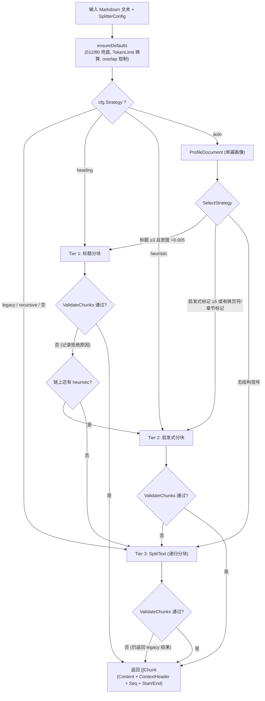
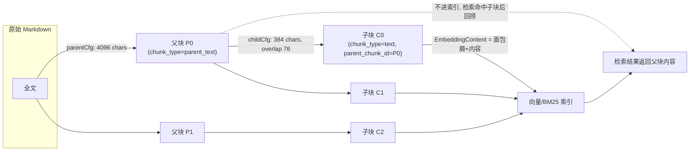

# 分块机制（Chunking）

检索的准确度很大程度上取决于文档被切成什么样：切太碎，单块信息不完整、答不全；切太大，一块里混了好几个主题，向量表达不准。分块就是这一步。

大多数情况下用默认值就行（分块 512 字、重叠 80 字、自适应策略），需要调的时候按下面这张表判断：

| 遇到的情况 | 建议 |
| --- | --- |
| 回答缺上下文、经常答半句 | 调大 `chunk_size`，或开启父子分块（子块检索、父块回答） |
| 检索命中的块跟问题关系不大 | 调小 `chunk_size`，让每块主题更集中 |
| 资料是条目式的（FAQ、字典、参数表） | 重叠设为 0，避免相邻条目互相污染 |
| 资料是长篇叙述（报告、论文） | 重叠调到 150–200，保住跨块的语义连贯 |
| 想先看看会切成什么样 | 用分块预览接口 `POST /api/v1/chunker/preview` 试切，不落库 |

改完分块配置需要对已有文档重新解析才会生效。下面是完整机制。

WeKnora 的分块在 **Go 侧**完成（`internal/infrastructure/chunker` 包），采用"文档画像 → 分层策略 → 结果校验 → 逐级回退"的自适应架构；Python 侧 `docreader/splitter/` 保留了同源的递归分块器供 docreader sidecar 使用（生产主路径是 Go 实现，`docreader/splitter/splitter.py` 注释明确说明二者默认值已对齐）。

涉及源码：

| 模块 | 文件 |
|------|------|
| 策略入口与回退链 | `internal/infrastructure/chunker/strategy.go` |
| 文档画像 | `internal/infrastructure/chunker/profiler.go` |
| Tier 1 标题分块 | `internal/infrastructure/chunker/heading_splitter.go`、`heading_hierarchy.go` |
| Tier 2 启发式分块 | `internal/infrastructure/chunker/heuristic_splitter.go`、`patterns.go` |
| Tier 3 递归分块（legacy） | `internal/infrastructure/chunker/splitter.go` |
| 表头追踪 | `internal/infrastructure/chunker/header_tracker.go` |
| 结果校验 | `internal/infrastructure/chunker/validator.go` |
| Token 估算 | `internal/infrastructure/chunker/tokens.go` |
| 配置结构 | `internal/types/knowledgebase.go`（`ChunkingConfig`）、`internal/types/indexing_strategy.go` |
| 管线接入 | `internal/application/service/knowledge_process.go`（`buildSplitterConfigFromChunking` / `buildParentChildConfigs` / `processChunks`） |
| 调试端点 | `internal/handler/chunker_debug.go`（`POST /api/v1/chunker/preview`） |
| Python 侧 | `docreader/splitter/splitter.py`、`docreader/splitter/header_hook.py` |

## 1. 配置模型

### 1.1 ChunkingConfig（KB 级，可被单次上传覆盖）

`internal/types/knowledgebase.go`：

| 字段 | 类型 | 默认值 | 说明 |
|------|------|--------|------|
| `chunk_size` | int | 512（字符） | 单块目标大小。约 100–130 英文 token / 300 中文 token。FAQ 式原子内容建议 200–400，长叙事文档 1000–2000 |
| `chunk_overlap` | int | 80（约 15%） | 相邻块重叠字符数。原子数据可设 0，长叙事可 150–200。超过 `chunk_size/2` 会被钳制到一半 |
| `separators` | []string | `["\n\n", "\n", "。"]` | 递归分块的分隔符优先级序列 |
| `strategy` | string | `""`（= legacy） | 分块策略：`auto` / `heading` / `heuristic` / `recursive` / `legacy`，见 §2 |
| `token_limit` | int | 0（不启用） | 以近似 token 数上限约束块大小；>0 时按语言换算字符预算并取更小者（0.9 安全系数） |
| `languages` | []string | 空（自动检测） | 启发式模式的语言提示，如 `["zh"]`、`["en","de"]` |
| `enable_parent_child` | bool | false | 启用父子（两级）分块，见 §5 |
| `parent_chunk_size` | int | 4096 | 父块大小（仅父子模式） |
| `child_chunk_size` | int | 384 | 子块大小（仅父子模式），子块 overlap 固定为 `child_size/5`（约 20%） |
| `parser_engine_rules` | []ParserEngineRule | 空 | 文件类型 → 解析引擎路由，附带解析器级开关如 `xlsx_first_row_as_header`（属于解析而非分块，但同在此结构） |
| `table_metadata_instructions` | string | 空 | CSV/Excel 表格摘要生成时的业务指引 |

默认值的单一来源是 `chunker` 包常量（`splitter.go`）：

```go
const (
    DefaultChunkSize    = 512
    DefaultChunkOverlap = 80
)
```

> 迁移注意（源码注释原文）：历史上 Go DefaultConfig 用 64、knowledge.go 用 50、Python docreader 用 100 三种 overlap 默认值，现已统一为 80。存量 KB 若 DB 中存的是 `ChunkOverlap=0`，重建索引时会取 80，embedding 与旧值不再逐位一致。

### 1.2 SplitterConfig（运行时配置）

服务层通过 `buildSplitterConfigFromChunking`（`knowledge_process.go`）把 `ChunkingConfig` 映射为 `chunker.SplitterConfig{ChunkSize, ChunkOverlap, Separators, Strategy, TokenLimit, Languages}`；chunker 包内 `ensureDefaults` 再做兜底：

- `TokenLimit > 0` 时：`charBudget = CharsForTokenLimit(TokenLimit, lang)`，若小于 `ChunkSize` 则取代之（`tokens.go`，字符/Token 比：en 4.0、de 4.5、zh 1.7、mixed 3.0，附 0.9 安全系数——确保块不超过 embedding 模型的 token 上限）；
- `ChunkOverlap > ChunkSize/2` 时钳制为 `ChunkSize/2`。

### 1.3 IndexingStrategy 与分块的关系

`internal/types/indexing_strategy.go` 的四个开关决定分块产物流向哪些管线：

```go
type IndexingStrategy struct {
    VectorEnabled  bool // 向量索引
    KeywordEnabled bool // BM25 关键词索引
    WikiEnabled    bool // Wiki 生成
    GraphEnabled   bool // 图谱抽取
}
```

- `NeedsChunks()`（任一开启）为假时不需要分块；
- `NeedsEmbedding()`（vector || keyword）为假时分块只写 DB、跳过 `BatchIndex`（`processChunks` 中 `skipStage(StageEmbedding)`）；
- Wiki / Graph 都以文本 chunk 为输入在后处理阶段消费。

## 2. 自适应策略：三个 Tier 与回退链

公开入口是 `chunker.Split(text, cfg)` / `chunker.SplitWithDiagnostics`（`strategy.go`）。`cfg.Strategy` 的取值与解析（`resolveChainWithProfile`）：

| Strategy 值 | 尝试链（Tier Chain） | 说明 |
|-------------|----------------------|------|
| `auto` | 由画像器决定，可能为 `[heading, heuristic, legacy]` 的子序列 | 推荐值，按文档结构自动选 |
| `heading` | `[heading, legacy]` | 强制标题分块，失败回退 legacy |
| `heuristic` | `[heuristic, legacy]` | 强制启发式分块 |
| `recursive` | `[legacy]` | `recursive` 是 `legacy` 的公开别名 |
| `legacy` / `""`（空） | `[legacy]` | 历史递归分块器，向后兼容默认值 |

每个 Tier 的输出都要过 **Validator**（`validator.go`）才能被采纳，否则链条前进到下一 Tier；`legacy` 是保底层——即使它也未通过校验，仍返回其结果（永不返回空）：

Validator 的拒绝规则：

| 规则 | 拒绝原因字符串 |
|------|----------------|
| 无输出 | `no chunks produced` |
| 文档超过 `2*chunkSize` 却只产出 1 块 | `single chunk for large document` |
| 非末尾的 <50 字符小块超过总数 1/4 且 >2 个 | `too many tiny chunks` |
| 最大块不足 `chunkSize/4`（过度碎片化） | `all chunks far below target size` |
| 最大块超过 `2*chunkSize`（无视预算） | `chunk exceeds 2x target size` |

### 2.1 文档画像（profiler.go）

`ProfileDocument(text)` 单遍扫描产出 `DocProfile`：总字符/行数、行长均值方差、Markdown 各级标题计数、编号小节数、全大写短行数、连续空行块、换页符 `\f` 数、水平分隔线数、德/英/中章节标记数、页脚行数、是否含表格/代码、代码占比、语言检测（前 4096 字节采样，`DetectLanguage` 按 CJK/拉丁比例判 `zh/de/en/mixed`）。

`SelectStrategy(profile)` 组装尝试链：

```go
// Tier 1 候选：Markdown 标题结构
if p.MdHeadingTotal >= 3 && p.HeadingDensity() > 0.005 && p.DominantHeadingLevel() > 0 {
    chain = append(chain, TierHeading)
}
// Tier 2 候选：启发式边界
if p.HeuristicMarkerTotal() >= 5 || p.FormFeedCount > 0 ||
    p.GermanChapterCount+p.EnglishChapterCount+p.ChineseChapterCount > 0 {
    chain = append(chain, TierHeuristic)
}
chain = append(chain, TierLegacy) // 永远兜底
```

`DominantHeadingLevel` 选主分割层级：优先取"出现 ≥3 次的最浅层级"（文档真正的结构骨架），否则取最深的出现过的层级。

### 2.2 分块决策流程图



## 3. 三种分块算法详解

### 3.1 Tier 1：标题感知分块（heading_splitter.go）

**适用**：有规范 Markdown 标题结构的文档（技术文档、导出的 Word/带书签 PDF 等）。

算法：

1. 以 `DominantHeadingLevel` 为主层级，`findHeadingBoundaries` 找出所有 `level <= primaryLevel` 的标题行作为段边界（跳过 fenced code 内的伪标题）；边界 ≤1 时直接回退 `SplitText`。
2. `HeadingHierarchy`（`heading_hierarchy.go`）维护一个 6 层标题栈：压入 level-N 标题会弹出所有 ≥N 的层，`BreadcrumbWithHashes()` 输出如 `"# 第一章\n## 1.2 节"` 的面包屑。
3. 每个 section：
   - 若 `面包屑长度 + 2 + 段长 <= ChunkSize`：整段作为一个 Chunk，面包屑放入 **`ContextHeader`（不进 Content）**；
   - 若超长：段内交给 `SplitText` 二次切分，每个子块通过 `sectionBreadcrumbs` + `breadcrumbAtOffset` 拿到"该偏移处生效的最深标题路径"作为 ContextHeader（段内的 `###`/`####` 子标题不会被压扁成段级标题）。
4. `coalesceTinyChunks`：相邻、小于 `ChunkSize/2`（下限 200）且共享标题前缀、位置连续（`cur.End == next.Start`）的小块合并——FAQ 式短小节文档不再因"too many tiny chunks"整体跌落到 legacy。

**位置不变式**：`End - Start == utf8.RuneCountInString(Content)` 始终成立（面包屑不算入 Content），文档还原、UI 高亮依赖这一点。

### 3.2 Tier 2：启发式边界分块（heuristic_splitter.go + patterns.go）

**适用**：没有 Markdown 标题、但有可识别结构线索的文档（OCR 出的 PDF、纯文本手册、扫描版书籍等）。

先扫描全部候选边界（同一偏移只留最高优先级）：

| 边界类型 | 正则（patterns.go） | 优先级 |
|----------|---------------------|--------|
| 换页符 `\f` | `FormFeedPattern` | 100 |
| 编号小节（`1.2.3 标题`、`IV. Results`） | `NumberedSectionPattern` | 90 |
| 章节标记（`Chapter 3` / `Kapitel 2` / `第一章`、`第3节`） | `EnglishChapterPattern` / `GermanChapterPattern` / `ChineseChapterPattern`（按 `Languages` 提示筛选，空则全用） | 85 |
| 全大写短行标题 | `AllCapsHeadingPattern` | 70 |
| 视觉分隔线（`---`、`===`、`***`） | `VisualSeparatorPattern` | 60 |
| 页脚（`Page 3 of 10` / `Seite 3 von 10` / `页码 3`） | `PageFooterPattern` | 50 |
| 连续 ≥3 个换行 | `ExcessiveBlanksPattern` | 40 |

然后：

- `dropBoundsInsideSpans`：落在受保护区间（表格/代码块/公式，见 §3.3）**内部**的边界被丢弃，边缘对齐的保留；
- **贪心装箱**：沿边界累积块，累计超过 `ChunkSize` 且已有 ≥ `max(ChunkSize/4, 50)` 内容时落一个 Chunk；
- 两边界之间的超大块递归交给 `SplitText`；
- overlap 对齐：`applyOverlapAligned` 在 `[curEnd-2*overlap, curEnd)` 窗口内优先吸附到最近的语义边界，其次吸附到换行，避免下一块从词中间开始。

### 3.3 Tier 3：递归分块 legacy（splitter.go，Python 移植）

这是从 `docreader/splitter/splitter.py` 移植的基础实现，也是所有 Tier 的兜底与"段内二次切分"引擎。三步：

**Step 1 — 受保护区间识别**（`protectedSpans`），这些内容绝不从中间切开：

```go
var protectedPatterns = []*regexp.Regexp{
    regexp.MustCompile(`(?s)\$\$.*?\$\$`),        // LaTeX 块级公式
    regexp.MustCompile(`!\[[^\]]*\]\([^)]+\)`),   // Markdown 图片
    regexp.MustCompile(`\[[^\]]*\]\([^)]+\)`),    // Markdown 链接
    /* 表头+分隔行 */ /* 表格数据行 */             // Markdown 表格
    regexp.MustCompile("(?s)```(?:\\w+)?[\\r\\n].*?```"), // fenced 代码块
}
```

超过 `maxProtectedSize = 7500` rune 的保护区（超大表格/代码块）会被强制在换行或空格处切开，避免超出 embedding API 限制。

**Step 2 — 递归分隔**（`splitBySeparators`）：按 `Separators` 优先级切（默认 `\n\n` → `\n` → `。`），仍超 `ChunkSize` 的片段递归应用下一级分隔符（与 Python `_split` 语义一致，分隔符保留在片段中）。

**Step 3 — 合并与重叠**（`mergeUnits`）：把小单元装配为块；`curLen + uLen + headersLen > chunkSize` 时落块，`computeOverlap` 从当前块尾部取一段作为下一块开头；绝对上限 `absoluteMaxSize = 7500`。

`computeOverlap` 取的是**语义后缀**而不是定长字符切片：

- `ChunkOverlap` 是硬上限而非目标值。窗口取块尾 `min(ChunkOverlap, ChunkSize - 下一单元长度)` 个字符，再额外向前多看 4 个字符（`semanticOverlapLookbehind`，最长分隔符 `\r\n\r\n` 的长度），避免分隔符恰好被窗口边界切断而看不见；候选边界的最后一个字符必须落在窗口内（相对原窗口 ≥ -1），因此保留内容不会超过上限；
- 边界优先级：段落分隔（`\n\n`）> 换行（`\n`）> 句末（`。`、`？`、`！`，以及英文 `. ` / `? ` / `! `——英文标点要求后面跟空格，避免把 `3.14`、`v1.2` 切开）。优先级相同时取窗口内**最靠前**的那个，让有效重叠尽量大；
- 窗口可以切进单个 `splitUnit` 内部（旧实现只能整单元保留，普通段落经常直接退化成零重叠），但不会跨越表头标记这类 `start == end` 的零宽合成单元，以维持 `Start/End` 偏移与 Content 的对应不变式；
- 受保护区间（代码块、行内代码 `` ` ` ``、公式、表格、图片/链接）内部的分隔符不作为边界；边界之后若只剩空白也不成立；
- 窗口内找不到合法语义边界时**不保留重叠**，宁可没有重叠也不从半个词开始。

行内代码 `` `foo` `` 在这一版加入了受保护正则列表，防止在反引号内部切开。

### 3.4 表格处理：表头追踪（header_tracker.go）

大 Markdown 表格被切成多块后，后续块会丢失列名上下文。`headerTracker`（移植自 `docreader/splitter/header_hook.py`）解决这一问题：

- 检测"表头行 + 分隔行"（`| A | B |` + `| --- | --- |`）作为**活动表头**，在表格结束（空行 / 非 `|` 开头行）前保持活动；
- `mergeUnits` 落新块时，若活动表头未在重叠区/下一单元中出现且列数匹配（`headerAlreadyPresent` / `headerColumnMismatch`），把表头作为 `start==end` 的零宽单元**前置到新块**——每个表格分片都自带列名；
- 空表头（MarkItDown 常见的 `||` + `|---|---|`）用第一行数据行补全列名（`pendingExtend`）；
- 表格边界感知：块尾 `\n\n` 后出现新表行、或新行列数与表头不一致时，结束旧表头并强制落块（`headerEndedThisUnit`），防止上一张表的表头污染下一张表。

另外，OCR 引擎（PaddleOCR-VL 等）输出的内联 HTML 表格在解析阶段就被 `docparser/html_table_normalizer.go` 的 `normalizeHTMLTables` 转成 GFM Markdown 表格（含 rowspan/colspan 的只剥离表现属性），从而进入上述保护与表头追踪逻辑，不会被 chunker 切碎。

### 3.5 图片处理

- Markdown 图片引用 `` 是受保护模式，永不被切断；
- `chunker.ExtractImageRefs(text)`（`splitter.go`）用支持一层括号嵌套的正则提取块内图片引用，供 `processChunks` 建立 chunk ↔ 图片关联；
- 每张图片在多模态阶段生成 `image_caption` / `image_ocr` 两个子 Chunk（`ParentChunkID` 指向文本块）并单独索引——图片语义可召回，命中后回到原文块。

## 4. 上下文头（ContextHeader）

`Chunk.ContextHeader` 是与 Content **分离存储**的上下文串（标题面包屑）：

```go
// internal/types/chunk.go
// ContextHeader is a Markdown heading breadcrumb prepended when indexing.
// It is persisted so a later content edit can rebuild the same index input.
ContextHeader string `json:"-" gorm:"type:text"`

func (c *Chunk) EmbeddingContent() string {
    body := strings.TrimSpace(c.Content)
    if c.ContextHeader == "" { return body }
    return c.ContextHeader + "\n\n" + body
}
```

设计要点：

- **只影响 embedding，不影响原文**：`processChunks` 组装索引内容为 `知识标题 + "\n" + chunk.EmbeddingContent()`，向量携带章节语境；而 Content 保持原文逐字切片，`StartAt/EndAt` 偏移不变式成立；
- **持久化到 `chunks.context_header` 列**（migration `000078`）。早期版本是内存字段（`gorm:"-"`），索引完成即丢弃；引入分块手工编辑后，重新索引单个分块时必须复现同样的索引输入，因此改为落库。`json:"-"` 保持不变，接口响应里仍不返回；
- 父子分块时 `mergeBreadcrumbs`（`strategy.go`）合并父/子面包屑并去掉首行重复，子块获得比父块更细的路径。

## 5. 父子分块（Parent-Child / 多粒度）

`EnableParentChild = true` 时启用两级分块（`chunker.SplitParentChild`，策略感知版；legacy 版为 `SplitTextParentChild`）：

1. 先用 `parentCfg`（默认 4096 字符、复用配置的 overlap、继承 Strategy）切出**父块**；
2. 每个父块再用 `childCfg`（默认 384 字符、overlap = 子块大小/5、继承 Strategy）切出**子块**；
3. 子块 `Seq` 全文档连续，`Start/End` 平移回文档级偏移，`ParentIndex` 指向父块；若某父块只产出一个与自身完全相同的子块，则不存父块（`ParentIndex = -1`），避免冗余。

服务侧落库规则（`knowledge_process.go` `processChunks`）：

- 父块 → `ChunkTypeParentText`，**只入 DB 不进向量索引**，父块间串 `PreChunkID/NextChunkID` 链表；
- 子块 → `ChunkTypeText` + `ParentChunkID`，是唯一被嵌入/索引的粒度；
- 检索时命中子块、返回父块内容——小窗口精确匹配 + 大窗口上下文。

`buildParentChildConfigs` 特别强调 Strategy 必须透传：否则空 Strategy 解析为 legacy tier，父子块会静默丢失标题对齐与 ContextHeader 面包屑。



## 6. FAQ 分块的特殊性

FAQ 知识库**不经过任何分块算法**：每条问答对本身就是一个 `ChunkTypeFAQ` 的 Chunk（`knowledge_faq.go`），Content 由 `buildFAQChunkContent` 按索引模式生成：

```go
builder.WriteString(fmt.Sprintf("Q: %s\n", meta.StandardQuestion))
// Similar Questions: 逐条列出
// 负例（NegativeQuestions）不写入 Content —— 不应被索引
if mode == types.FAQIndexModeQuestionAnswer && len(meta.Answers) > 0 {
    // Answers: 逐条列出
}
```

- 结构化数据存 `Chunk.Metadata`（`FAQChunkMetadata`），`ContentHash`（归一化 SHA256）用于导入去重与克隆差量同步；
- 索引模式：`question_only` / `question_answer`（KB 级 `FAQIndexMode`）；问题索引模式 `combined`（标准问+相似问一个向量）/ `separate`（每个相似问独立向量，支持增量更新）；
- 建议 FAQ 场景 `chunk_overlap = 0` 的通用原则在此天然成立——条目间无重叠。

## 7. 与入库管线的衔接

`knowledge_process.go` 中的调用链：

```
processDocument
  └─ convert()                          // docreader → Markdown
  └─ imageResolver.ResolveAndStore()    // 图片入存储, 重写 URL
  └─ buildSplitterConfigFromChunking()  // ChunkingConfig → SplitterConfig
  └─ chunker.Split / SplitParentChild   // 本文所述算法
  └─ processChunks()                    // 建 Chunk 行, EmbeddingContent → BatchIndex
```

分块阶段有独立 Span（`StageChunking`，记录 `chunks_planned/chunks_written/total_text_chars`），失败错误码 `ErrCodeChunkingFailed`。

## 8. 调试能力：POST /api/v1/chunker/preview（chunker_debug.go）

只读预览端点，KB 编辑器的"分块调试面板"使用它在改参数前试切样例文本——**不写 DB、不产生 embedding、不记录文本日志**。

请求体：

```json
{
  "text": "样例文本…",
  "chunking_config": {
    "chunk_size": 512, "chunk_overlap": 80,
    "separators": ["\n\n", "\n", "。"],
    "strategy": "auto", "token_limit": 0, "languages": ["zh"],
    "enable_parent_child": false,
    "parent_chunk_size": 4096, "child_chunk_size": 384
  }
}
```

传 `enable_parent_child: true` 时，预览返回的是**子块**（与检索实际命中的粒度一致），诊断信息则来自父块那一趟切分。预览与入库共用 `chunker.NormalizeSplitterConfig()` 与 `chunker.DeriveParentChildConfigs()` 推导配置，避免出现「预览看着没问题、入库切出来不一样」——早期预览始终按单级分块试切，开了父子分块的知识库预览结果和真实结果对不上。

响应（`PreviewChunkingResponse`）：

| 字段 | 说明 |
|------|------|
| `selected_tier` | 最终胜出的 Tier（`heading`/`heuristic`/`legacy`） |
| `tier_chain` | 本次尝试链 |
| `rejected` | 各被拒 Tier 及 Validator 给出的原因（`TierRejection{tier, reason}`） |
| `profile` | 完整 `DocProfile`（auto 时来自策略选择过程，显式策略时按需补算） |
| `chunks[]` | 每块的 `seq/start/end/size_chars/size_tokens_approx/context_header/content` |
| `stats` | `count/avg_chars/min_chars/max_chars/stddev_chars`，按**全量**块集计算；截断时附 `truncated_to` |

保护措施（常量）：输入上限 `previewMaxChars = 64k` rune（返回 413）、返回块数上限 `previewMaxChunks = 500`（统计仍按全量算）、超时 `previewTimeout = 5s`（splitter 不接受 context，超时后 handler 返回 504 但工作 goroutine 会自然跑完，64k 上限是主要防护）。诊断信息由 `chunker.SplitWithDiagnostics` 产出，其 JSON 形状是公开 API 的一部分。

路由注册（`internal/router/router.go`）：

```go
g.apiKeyRoute(r, http.MethodPost, "/chunker/preview",
    apiKeyRetrieve(apiKeyIngest(apiKeyFullAccess())), g.Viewer(), handler.PreviewChunking)
```

## 9. Python 侧分块器（docreader/splitter/）

`docreader/splitter/splitter.py` 的 `TextSplitter` 是 Go legacy 实现的原型，仍随 docreader sidecar 保留：

- 默认值已与 Go 对齐：`DEFAULT_CHUNK_SIZE = 512`、`DEFAULT_CHUNK_OVERLAP = 80`；构造器默认分隔符 `["\n", "。", " "]`，最后附字符级切分兜底；
- 同一套受保护正则（公式/图片/链接/表头/表行/代码块），`_split`（递归分隔）→ `_split_protected` + `_join`（保护区间隔离）→ `_merge`（重叠合并 + `HeaderTracker` 表头前置）；
- 产出 `(start, end, text)` 三元组并断言 `"".join(splits) == text` 可完整还原；`restore_text` 演示了去重叠还原算法；
- `docreader/splitter/header_hook.py` 的 `HeaderTracker` 与 Go `header_tracker.go` 行为一致（表头识别、空表头补全、列数不匹配时结束）。

## 10. 参数速查与调优建议

| 场景 | strategy | chunk_size | chunk_overlap | 其他 |
|------|----------|------------|---------------|------|
| 通用文档（推荐起点） | `auto` | 512 | 80 | — |
| 结构化技术文档 / 手册 | `auto`（会命中 heading） | 512–1024 | 80 | 面包屑自动生效 |
| OCR PDF / 纯文本书籍 | `auto`（会命中 heuristic） | 512–1024 | 80–150 | `languages` 指定语种可减少误判 |
| 长叙事 / 论证型文档 | `auto` | 1000–2000 | 150–200 | 可叠加父子分块 |
| 精确检索 + 长上下文 | 任意 | — | — | `enable_parent_child=true`，parent 4096 / child 384 |
| FAQ / 原子记录 | 不适用（FAQ KB 逐条成块） | — | 0 | `FAQIndexMode` 控制答案是否入索引 |
| 严格 token 上限的 embedding 模型 | 任意 | — | — | 设 `token_limit`，自动换算字符预算 |
| 复现旧版本行为 | `legacy` | 原值 | 显式设 64 | 见 §1.1 迁移注意 |
