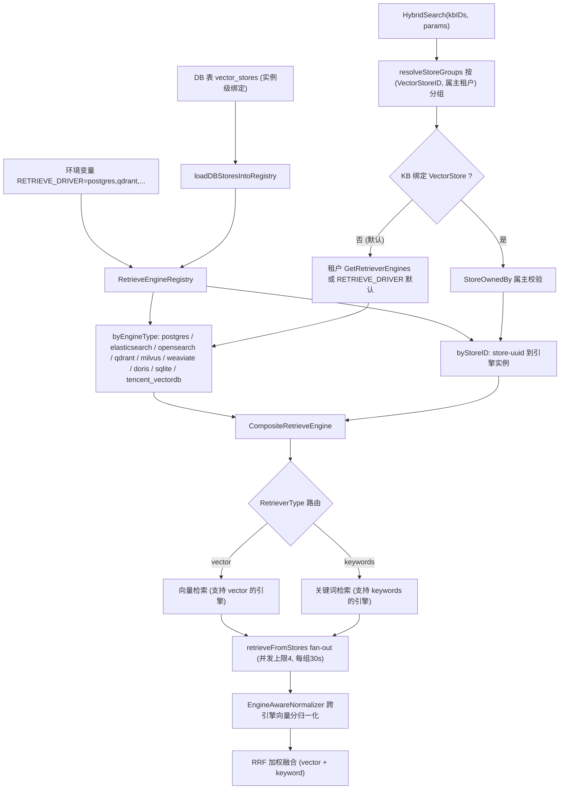
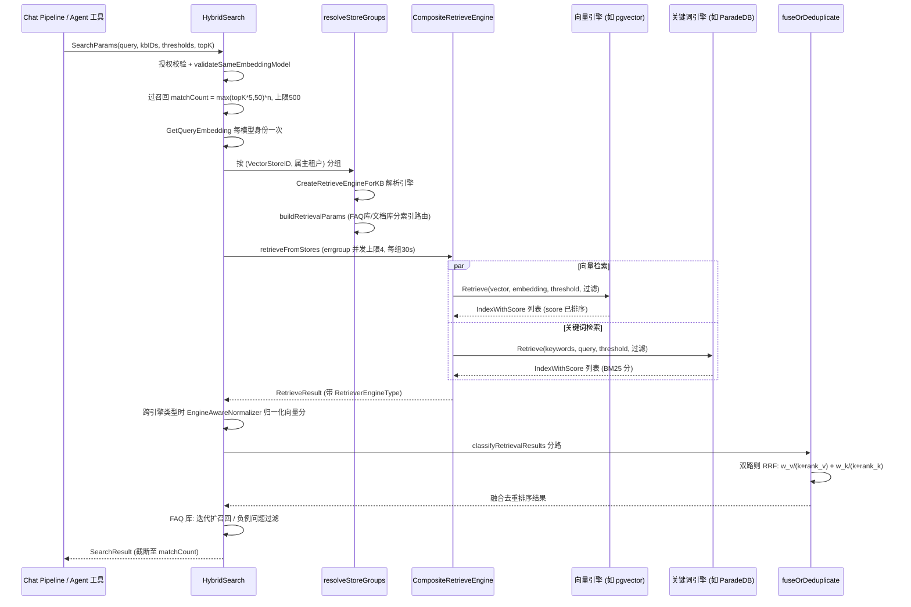

# 检索引擎与向量存储（Retrieval Engines）

向量存到哪、关键词怎么搜，由「检索引擎」决定。WeKnora 支持 10 种后端，但**绝大多数部署不需要选**：默认的 PostgreSQL（ParadeDB 镜像自带 pgvector + BM25）既能做向量也能做关键词，和业务数据同库，运维成本最低。

需要换的典型理由：

| 情况 | 考虑 |
| --- | --- |
| 单机 / 桌面版，不想跑数据库 | SQLite（内嵌，零依赖） |
| 向量规模到千万级、要独立扩容 | Qdrant、Milvus |
| 公司已有 Elasticsearch / OpenSearch 栈 | 复用现有集群 |
| 要按知识库分开存放数据 | 保持默认引擎，另在「设置 → 向量存储」注册实例并绑定到指定知识库 |

换引擎需要重建索引，建库之后知识库绑定的向量存储不可更改。下面逐引擎详解检索能力、建索引方式、过滤能力与配置方法，源码位置如下：

| 环节 | 源码位置 |
|------|----------|
| 引擎注册（env + DB store） | `internal/container/container.go`（`initRetrieveEngineRegistry`）、`engine_factory.go` |
| 注册表 / 组合引擎 / 工厂 | `internal/application/service/retriever/`（`registry.go`、`composite.go`、`factory.go`、`normalizer.go`） |
| 各引擎实现 | `internal/application/repository/retriever/{postgres,sqlite,elasticsearch,opensearch,qdrant,milvus,weaviate,doris,tencentvectordb,neo4j}` |
| 混合检索调度与融合 | `internal/application/service/knowledgebase_search*.go` |
| 引擎类型常量 | `internal/types/retriever.go` |
| 租户默认引擎 | `internal/types/tenant.go`（`GetDefaultRetrieverEngines`） |
| 环境变量清单 | `.env.example`（C1 节）、`docker-compose.yml` |

## 1. 分层架构：Repository → KVHybridRetrieveEngine → Composite → Registry

每个后端实现 `interfaces.RetrieveEngineRepository`（`EngineType()` / `Support()` / `Save` / `BatchSave` / `Retrieve` / `DeleteBy*` / `CopyIndices` / `BatchUpdateChunkEnabledStatus` / `BatchUpdateChunkTagID` / `EstimateStorageSize`）。其上依次是：

- **KVHybridRetrieveEngine**（`retriever/keywords_vector_hybrid_indexer.go`）：把 Repository 包装成 `RetrieveEngineService`，负责在 Index 时按支持的检索类型计算 embedding 并写入；
- **CompositeRetrieveEngine**（`retriever/composite.go`）：组合模式。`Retrieve` 按每个 `RetrieveParams.RetrieverType`（`vector` / `keywords`）路由到第一个支持该类型的引擎并发执行；`Index` / `Delete` / `CopyIndices` 等写操作广播到所有成员引擎；
- **RetrieveEngineRegistry**（`retriever/registry.go`）：双索引注册表——`byEngineType`（`RETRIEVE_DRIVER` 环境变量驱动的"env store"，每类型仅一个）与 `byStoreID`（数据库 `VectorStore` 表驱动的实例级注册，同一引擎类型可注册多实例，如两个 ES 集群）。

#### 按需重建（rehydrate）

启动时某个向量存储恰好不可用（后端还没起来、网络抖动），它就不会进入 `byStoreID`；此后所有绑定该 store 的知识库检索、甚至删除知识库都会一直失败。注册表因此支持**按需重建**：

- `GetOrLoadByStoreID` 命中不到时，用注入的 `VectorStoreRepository` + `EngineFactory` 现场构建引擎并注册；仓库或工厂任一为 nil 时退化为普通查找；
- 单次构建有 `EngineBuildTimeout`（10s）上限，`singleflight` 把并发请求合并成一次构建；
- 构建失败进入 `rebuildCooldown`（30s）冷却，避免后端持续不可用时每个请求都白等一个完整超时；
- 用 `storeGen` 代际计数防止竞态：构建开始前采样，只有代际没变才发布结果，因此构建期间发生的注册或删除不会被旧结果覆盖。

删除知识库时若引擎尚未就绪，也会走这条重建路径重试，而不是直接判失败。

### 1.1 引擎注册：initRetrieveEngineRegistry

`internal/container/container.go`。启动时解析 `RETRIEVE_DRIVER`（逗号分隔），逐驱动构建客户端并 `registry.Register(retriever.NewKVHybridRetrieveEngine(repo, engineType))`；单个驱动初始化失败只记日志不阻断启动。随后 `loadDBStoresIntoRegistry` 从 `vector_stores` 表加载租户自建的向量存储实例，经 `createEngineServiceFromStore`（`engine_factory.go`）构建引擎后 `RegisterWithStoreID` 注册。

### 1.2 检索时的引擎选择

检索入口 `HybridSearch`（`knowledgebase_search.go`）按 KB 的绑定关系选择引擎：

1. `resolveStoreGroups` 把参与检索的 KB 按 `(VectorStoreID, 属主租户)` 分组；
2. 每组调用 `retriever.CreateRetrieveEngineForKB`（`factory.go`）：
   - KB 未绑定 store（`VectorStoreID` 为空，当前默认）→ 走租户的 `GetRetrieverEngines()`：租户配置了 `RetrieverEngines.Engines` 则用之，否则 `GetDefaultRetrieverEngines()` 按 `RETRIEVE_DRIVER` 环境变量生成（`internal/types/tenant.go`）；
   - KB 绑定了 store → 先 `ownership.StoreOwnedBy` 校验租户属主（防跨租户探测，失败返回 `ErrVectorStoreForbidden`），再 `registry.GetByStoreID` 取实例（未注册返回 `ErrVectorStoreNotFound`），包装为单成员 Composite；
3. `buildRetrievalParams` 按引擎 `SupportRetriever` 能力与 KB 类型生成向量/关键词两类 `RetrieveParams`（FAQ 库只走 FAQ 向量索引，文档库走默认向量索引 + 关键词索引）；
4. 多组时 `retrieveFromStores` errgroup 并发 fan-out（上限 4 组、每组超时 `MULTI_STORE_RETRIEVE_TIMEOUT_SEC` 默认 30s），结果跨引擎类型时做分数归一化。



## 2. 引擎逐个详解

引擎类型常量见 `internal/types/retriever.go`：`postgres`、`elasticsearch`、`opensearch`、`qdrant`、`milvus`、`weaviate`、`doris`、`sqlite`、`tencent_vectordb`（另有 `infinity`、`elasticfaiss` 为遗留枚举，无可部署实现）。除特别注明外，所有引擎的 `Support()` 均返回 `[keywords, vector]` 两类。

### 2.1 PostgreSQL（pgvector + ParadeDB）— 默认引擎

`internal/application/repository/retriever/postgres/repository.go`。数据与业务库同库（`embeddings` 表，GORM 管理）。

- **向量检索**：pgvector `halfvec`（半精度，2 字节/维）。`embedding` 列不定维，HNSW 索引建在表达式 `(embedding::halfvec(dim)) halfvec_cosine_ops` 上——**ORDER BY 表达式必须与索引表达式完全一致**（两侧显式 cast），否则退化为顺序扫描（源码注释引 pgvector issue #702/#835）。查询用子查询先取 `expandedTopK`（TopK*2，夹在 [100,200]，避免大 LIMIT 拖垮 HNSW）个候选算 `distance = embedding <=> query`，再按 `distance <= 1-threshold` 过滤，`score = 1 - distance`。事务内 `SET LOCAL hnsw.ef_search`（≥40）与 `SET LOCAL hnsw.iterative_scan = strict_order`（pgvector ≥ 0.8，选择性过滤下持续补召回），老版本 GUC 不存在时自动降级重试。
- **关键词检索**：ParadeDB `pg_search` BM25——`content ||| query`（任意 token 匹配）+ `paradedb.score(id) as score`。
- **过滤**：`knowledge_base_id` / `knowledge_id` / `tag_id` IN 过滤（AND 语义），`is_enabled` 为 NULL 或 true。
- **建索引**：`BatchSave` + `ON CONFLICT DO NOTHING`；删除按 chunk/source/knowledge ID 物理删除。

### 2.2 SQLite（FTS5 + sqlite-vec）— 轻量单机

`internal/application/repository/retriever/sqlite/repository.go`。零外部依赖的全内嵌方案。

- **向量检索**：`sqlite-vec` 扩展（cgo bindings），**每个维度一张 vec0 虚表**：`CREATE VIRTUAL TABLE ... USING vec0(embedding float[dim] distance_metric=cosine)`；查询 `WHERE v.embedding MATCH ?`（序列化查询向量）`ORDER BY v.distance`，`score = 1 - distance`。启动时 `ensureExistingVecTables` 按已有数据维度补建虚表。
- **关键词检索**：FTS5 contentless 表 `lite_embeddings_fts`，写入时手动 **bigram 分词**（对中文友好），查询经 `sanitizeFTS5Query` 同样 bigram 化后 `MATCH`。
- **过滤**：主表 `lite_embeddings` 上的 KB/knowledge/tag/is_enabled 过滤。向量路径的过滤条件必须**先于 top-k 生效**——写成 `v.rowid IN (SELECT ... FROM lite_embeddings filtered WHERE ...)` 的子查询而不是 JOIN 之后再过滤，否则 vec0 先取全局最近的 k 条、再被过滤掉大半，指定知识库或标签时会出现「明明有匹配却召回为空」；
- **错误传播**：任一检索路径出错直接返回错误，而不是塞一条带 `Error` 字段的空结果继续走——后者会被上层当成「检索成功但没命中」；
- **阈值**：向量阈值为 0 时视为不过滤，而不是把所有结果都滤掉。
- 适合桌面版 / 开发环境 / 极小规模部署。

### 2.3 Elasticsearch v8

`internal/application/repository/retriever/elasticsearch/v8/repository.go`。typed client，单索引（`ELASTICSEARCH_INDEX`，默认 `WeKnora`），文档含 `dense_vector` embedding 字段。

- **向量检索**：`script_score` 查询，脚本 `cosineSimilarity(params.query_vector, 'embedding')`（Lucene 禁止负最终分，实际值域 [0,1]），threshold 过滤在应用侧。
- **关键词检索**：`match` 查询 content 字段（BM25）。
- **过滤**：bool filter（KB/knowledge/tag ID terms；`is_enabled` 用 must_not 反向匹配，历史无该字段的数据视为启用）；启动时探测 mapping 决定 ID 字段是否需要 `.keyword` 后缀。
- **建索引**：Bulk API 批量写入，空向量拒绝。

### 2.4 Elasticsearch v7 — 仅关键词

`internal/application/repository/retriever/elasticsearch/v7/repository.go`。注意：**`Support()` 只返回 `[keywords]`**——v7 驱动在 WeKnora 中仅作为 BM25 关键词引擎注册（代码中保留了 `script_score cosineSimilarity` 的向量查询构造，但能力声明不含 vector，Composite 不会把向量请求路由给它）。需向量检索时应搭配其他驱动（如 `RETRIEVE_DRIVER=postgres,elasticsearch_v7`）或升级 v8。

### 2.5 OpenSearch

`internal/application/repository/retriever/opensearch/`（多文件拆分：`repository.go`、`retrieve.go`、`query.go`、`mapping.go`、`crud.go` 等）。工程化最完整的驱动。

- **版本门禁** `probeVersion`：拒绝 ES 发行版与 OS 1.x / 2.0-2.3（Lucene HNSW 预览版）；2.4-2.10 警告接受；2.11+ / 3.x 干净接受（主测 3.3.2）。`probeKNNPlugin` 要求所有节点装有 `opensearch-knn` 插件。
- **向量检索**：k-NN 插件 `knn` 查询（`query.go buildKNNQuery`）；k-NN 的 `COSINESIMIL` space type 返回 `(1+cosine)/2`，天然 [0,1]。
- **关键词检索**：`match` content（BM25）。混合不走 OS 原生 hybrid pipeline，统一交给上层 RRF 融合（`query.go` 注释明示）。
- **建索引**：`mapping.go` 声明式 mapping（`knn_vector` 字段带 method/engine 参数），启动时校验 mapping 指纹，漂移报 `ErrConfigInvalid`；别名管理 + `copy.go` 支持 reindex；索引创建/重建事件经 AuditSink 写审计日志。
- 配置含 `OPENSEARCH_INSECURE_SKIP_VERIFY` 与 SSRF 安全传输层（`transport.go`）。

### 2.6 Qdrant

`internal/application/repository/retriever/qdrant/repository.go`。gRPC 客户端（默认端口 6334）。

- **集合管理**：**每维度一个 collection**：`{QDRANT_COLLECTION|weknora_embeddings}_{dim}`，Distance=Cosine；payload 字段（kb_id/knowledge_id/chunk_id/tag_id 等）建 keyword 索引，content 建**多语言 tokenizer 的全文索引**。
- **向量检索**：`Query` API，score 为归一化向量点积（≈cosine，IR embedding 下 [0,1]），threshold 由 score_threshold 下推。
- **关键词检索**：`tokenizeQuery` 本地分词后对每个 token 构造 `MatchText(content, token)` 的 **should（OR）过滤**，用 `Scroll` 遍历所有匹配维度的 collection 取回；无 BM25 打分（命中即回，分数由上层 RRF 的 rank 决定）。
- **过滤**：`getBaseFilter` 用 `MatchKeywords` 精确过滤 KB/knowledge/tag/is_enabled。
- 配置：`QDRANT_HOST` / `QDRANT_PORT` / `QDRANT_API_KEY` / `QDRANT_USE_TLS`。

### 2.7 Milvus

`internal/application/repository/retriever/milvus/repository.go`。

- **集合管理**：每维度一个 collection（`{MILVUS_COLLECTION|weknora_embeddings}_{dim}`）。schema 含稠密向量 `embedding`（HNSW 索引，M=16 efConstruction=128，metric 由 `MILVUS_METRIC_TYPE` 决定：IP 默认 / COSINE /）与稀疏向量 `content_sparse` —— 通过 **内建 BM25 Function**（`entity.FunctionTypeBM25`）由 content 自动生成，配 `AutoIndex(BM25)`。
- **向量检索**：`Search` + `WithANNSField(embedding)`，COSINE 模式原始值域 [-1,1]，是唯一需要 `(score+1)/2` 归一化的引擎。
- **关键词检索**：对 `content_sparse` 做 BM25 稀疏向量检索（Milvus 2.5+ 原生全文检索）。
- **过滤**：`filter.go` 构造布尔表达式（kb/knowledge/tag/is_enabled）。
- **启停同步**：`BatchUpdateChunkEnabledStatus` 逐 collection 更新，失败用 `errors.Join` 聚合后**返回错误**而不是只打 warn——主库里已停用的分块绝不能因为索引更新静默失败而继续可被检索到。
- 配置：`MILVUS_ADDRESS` / `MILVUS_USERNAME` / `MILVUS_PASSWORD` / `MILVUS_DB_NAME` / `MILVUS_METRIC_TYPE`（改后需重建 collection）。

### 2.8 Weaviate

`internal/application/repository/retriever/weaviate/repository.go`。HTTP + gRPC 双通道。

- **类管理**：动态创建 Class（`WEAVIATE_COLLECTION` 解析），支持 ReplicationConfig / ShardingConfig。
- **向量检索**：GraphQL `nearVector` + `WithCertainty(threshold)`；certainty = `(2-distance)/2`，天然 [0,1]，阈值原生下推。
- **关键词检索**：GraphQL **BM25** 查询（`Bm25ArgBuilder`）。
- **过滤**：GraphQL where 过滤 KB/knowledge/tag/is_enabled。
- 配置：`WEAVIATE_HOST` / `WEAVIATE_GRPC_ADDRESS` / `WEAVIATE_SCHEME` / `WEAVIATE_AUTH_ENABLED` + `WEAVIATE_API_KEY`。

### 2.9 Apache Doris（4.1+）

`internal/application/repository/retriever/doris/`（`repository.go` 699 行 + `schema.go` + `structs.go`）。MySQL 协议连 FE（9030），HTTP（8030）走 Stream Load（SSRF 安全客户端）。

- **建表**：每维度一张表（前缀 `DORIS_TABLE_PREFIX|weknora_embeddings`），`schema.go` 生成 DDL：ANN 索引 HNSW + `inner_product`（写入/查询前对向量单位化，等价 cosine）；content 列建 **inverted 倒排索引并声明 chinese parser**（无需应用侧分词）。DDL 后轮询 ANN 索引就绪。
- **兼容模式** `DORIS_COMPAT_MODE`：`auto`（探测）/ `inner_product_duplicate`（DUPLICATE KEY 表 + `inner_product_approximate`）/ `legacy`（`1 - cosine_distance_approximate`）；建表后不可互换。
- **向量检索**：`inner_product_approximate(embedding, query)`（单位化后即 cosine）或 legacy 公式，SQL LIMIT TopK。
- **关键词检索**：`content MATCH_ANY ?` 走倒排索引。
- **写入**：DUPLICATE KEY 表按 id 显式 delete + insert 保持替换语义；enabled/tag 更新经 Stream Load partial update。
- 配置：`DORIS_ADDR` / `DORIS_HTTP_PORT` / `DORIS_DATABASE` / `DORIS_USERNAME` / `DORIS_PASSWORD` / `DORIS_TABLE_PREFIX` / `DORIS_COMPAT_MODE`。

### 2.10 腾讯云 VectorDB

`internal/application/repository/retriever/tencentvectordb/repository.go`。RpcClient，EventualConsistency，10s 超时。

- **集合管理**：每维度一个 collection（`{TENCENT_VECTORDB_COLLECTION|weknora_embeddings}_{dim}`），索引三件套：稠密向量 HNSW+COSINE（M=16, efConstruction=200）、**稀疏向量 SPARSE_INVERTED+IP**（服务端 BM25）、标量 FILTER 索引（id 主键 + content/source/chunk/knowledge/kb/tag 过滤字段）。
- **向量检索**：Search COSINE，SDK 值域 [-1,1]（IR embedding 实际 [0,1]）。
- **关键词检索**：本地 `encoder.SparseEncoder`（BM25）把查询编码为稀疏向量，对 `sparse_vector` 字段做稀疏检索，遍历匹配维度的所有 collection。
- 配置：`TENCENT_VECTORDB_ADDR` / `TENCENT_VECTORDB_USERNAME` / `TENCENT_VECTORDB_API_KEY` / `TENCENT_VECTORDB_DATABASE` / `TENCENT_VECTORDB_COLLECTION`。三项核心配置缺一则跳过注册。

### 2.11 Neo4j — 图谱检索（不在 Registry 体系内）

`internal/application/repository/retriever/neo4j/repository.go` 实现的是 `RetrieveGraphRepository`（`SearchNode(ctx, NameSpace, entities)`），不是向量/关键词引擎：按 `NameSpace{KnowledgeBase, Knowledge}` 检索实体节点与关系，服务于 chat pipeline 的 `ENTITY_SEARCH` 阶段（GraphRAG）。由 `NEO4J_ENABLE=true` + `NEO4J_URI`/`NEO4J_USERNAME`/`NEO4J_PASSWORD` 启用。

## 3. 能力矩阵与选型对比

| 引擎 | RETRIEVE_DRIVER 值 | 向量检索 | 关键词/全文 | 关键词打分 | 中文分词 | 维度管理 | 阈值下推 | 部署复杂度 | 适用场景 |
|------|-------------------|----------|------------|-----------|---------|----------|---------|-----------|----------|
| PostgreSQL | `postgres` | pgvector halfvec + HNSW 表达式索引 | ParadeDB BM25（`\|\|\|`） | BM25（paradedb.score） | ParadeDB tokenizer | 单表混维，表达式索引按维 cast | 距离阈值 SQL 内 | 低（默认镜像内置） | 默认选择；与业务同库，事务一致 |
| SQLite | `sqlite` | sqlite-vec vec0（cosine） | FTS5 contentless | FTS5 | 应用侧 bigram | 每维一张 vec0 虚表 | 应用侧 | 极低（内嵌） | 桌面版 / 开发 / 微型部署 |
| Elasticsearch v8 | `elasticsearch_v8` | script_score cosineSimilarity | match（BM25） | BM25 | ES analyzer | dense_vector 单索引 | 应用侧 | 中 | 已有 ES 8 集群 |
| Elasticsearch v7 | `elasticsearch_v7` | 不支持（Support 仅 keywords） | match（BM25） | BM25 | ES analyzer | — | — | 中 | 存量 ES 7，仅作关键词引擎，需与其他向量引擎组合 |
| OpenSearch | `opensearch` | k-NN 插件 knn（HNSW） | match（BM25） | BM25 | OS analyzer | knn_vector 声明式 mapping + 指纹校验 | k-NN 原生 | 中 | 需审计/别名/reindex 的生产 ES 系方案；版本 2.11+/3.x |
| Qdrant | `qdrant` | 原生 HNSW Cosine | 全文索引 MatchText（token OR） | 无打分（Scroll 命中即回，靠 RRF rank） | 多语言 tokenizer | 每维一个 collection | score_threshold 原生 | 中 | 纯向量为主、需 payload 过滤的场景 |
| Milvus | `milvus` | HNSW（IP/COSINE/） | BM25 Function 稀疏向量 | BM25 | Milvus analyzer | 每维一个 collection | 应用侧 | 中高 | 大规模向量、需要原生 BM25 混检 |
| Weaviate | `weaviate` | nearVector（certainty） | 原生 BM25 | BM25 | Weaviate tokenizer | 动态 Class | certainty 原生 | 中 | GraphQL 生态、需副本/分片配置 |
| Doris | `doris` | ANN HNSW inner_product/cosine | 倒排索引 MATCH_ANY | 倒排命中 | 建表声明 chinese parser | 每维一张表 | SQL 内 | 高 | 已有 Doris 数仓，检索与分析一体 |
| 腾讯云 VectorDB | `tencent_vectordb` | HNSW COSINE | 稀疏向量 BM25（SPARSE_INVERTED） | BM25 | SDK SparseEncoder | 每维一个 collection | 应用侧 | 低（云托管） | 腾讯云托管、免运维 |

> 说明：无论引擎自身是否提供"混合检索"，WeKnora 的混合始终是**上层统一的 RRF 融合**（`knowledgebase_search_fusion.go`）——向量与关键词各自独立检索，按 rank 加权合并（见 §5），因此各引擎只需分别提供两类单模检索。

## 4. Embedding 维度管理

WeKnora 允许不同 KB 使用不同 embedding 模型（维度各异），各引擎的维度隔离策略：

| 引擎 | 策略 |
|------|------|
| PostgreSQL | 单表 `embeddings` 混存，行内 `dimension` 列；HNSW 建在 `embedding::halfvec(dim)` 表达式上，检索时 `WHERE dimension = ?` + 同维 cast 命中对应索引 |
| SQLite | 每维度一张 `vec0` 虚表（启动时按存量数据维度自动补建） |
| Qdrant / Milvus / TencentVectorDB | 每维度一个 collection：`{base}_{dim}`，首写时 `ensureCollection` 惰性创建（sync.Map 记忆已建维度） |
| Doris | 每维度一张表：`{prefix}_{dim}`，`schema.go` 生成 DDL 并轮询 ANN 索引就绪 |
| Elasticsearch / OpenSearch | 单索引 `dense_vector`/`knn_vector` mapping（`ELASTICSEARCH_INDEX` / `OPENSEARCH_INDEX`），维度在 mapping 中固定 |

检索侧的一致性由 `validateSameEmbeddingModel`（`knowledgebase_search_shared.go`）保证：一次多库检索中的所有 KB 必须共享同一 embedding 模型身份（`model.Name + BaseURL`，跨租户可等价），否则拒绝——避免跨向量空间的分数不可比。查询向量按模型身份分组只计算一次（`ResolveEmbeddingModelKeys` + `GetQueryEmbedding`），随 `params.QueryEmbedding` 传播到所有 store 组，杜绝重复 embedding API 调用。

## 5. 混合检索打分与归一化

### 5.1 跨引擎向量分归一化（EngineAwareNormalizer）

`internal/application/service/retriever/normalizer.go`。多 store fan-out 且结果跨引擎类型时（`hasMixedEngineTypes`），把各引擎的向量分映射到统一 [0,1]：

| 引擎 | 原始值域 | 归一化 |
|------|---------|--------|
| Milvus（COSINE） | [-1, 1] 原始 cosine | `(score + 1) / 2` 再 clamp01 |
| Elasticsearch v8 | [0, 1]（Lucene script_score 非负不变量） | 直通 clamp01 |
| OpenSearch | [0, 1]（k-NN COSINESIMIL 已做 `(1+cos)/2`） | 直通 clamp01 |
| Weaviate | [0, 1]（certainty 定义即 `(2-distance)/2`） | 直通 clamp01 |
| Postgres / SQLite / Qdrant / TencentVectorDB / Doris | 理论 [-1,1]，IR 归一化 embedding 实际 [0,1] | 直通 clamp01 |
| 未知引擎 | — | clamp01 兜底 + 每请求一次 WARN |

**关键词（BM25）分数不归一化**——其值域无上界，压缩会坍缩长尾；下游 RRF 基于 rank，天然免疫尺度差异。`clamp01` 同时消化 NaN/Inf，保护下游排序的严格弱序不变量。同一引擎内部的结果保持原生尺度（直接可比，不做无谓变换）。

### 5.2 RRF 加权融合

`knowledgebase_search_fusion.go`。向量与关键词两路都有结果时：

```go
// fuseWithRRF
rrfScore = vectorWeight/(rrfK + vectorRank) + keywordWeight/(rrfK + keywordRank)
```

- rank 为各路结果的 1-indexed 排名（各引擎已按分排序返回）；
- `rrfK`、`vectorWeight`、`keywordWeight` 来自租户 `RetrievalConfig`（`GetEffectiveRRFK` / `GetEffectiveRRFWeights` 提供缺省）；
- 单路结果时不走 RRF，`deduplicateByScore` 保留每 chunk 最高原始分（对 FAQ 的 embedding 相似度语义很重要，如 `FAQDirectAnswerThreshold` 直接比对该分数）。

融合之后的复合打分（rerank 模型分 0.6 + 检索基础分 0.3 + 来源权重 0.1、MMR、FAQ/Wiki 加权）发生在 chat pipeline 的 `CHUNK_RERANK` 阶段，见《检索问答全流程》文档 §3.4。

## 6. 配置方法汇总

核心开关（`.env.example` C1 节、`docker-compose.yml`）：

| 环境变量 | 默认 | 说明 |
|----------|------|------|
| `RETRIEVE_DRIVER` | `postgres` | 逗号分隔多驱动：`postgres` / `sqlite` / `elasticsearch_v7` / `elasticsearch_v8` / `opensearch` / `qdrant` / `milvus` / `weaviate` / `doris` / `tencent_vectordb`。多驱动时写操作广播到全部，检索按类型路由 |
| `MULTI_STORE_RETRIEVE_TIMEOUT_SEC` | 30 | 多 store 并行检索每组超时 |
| `ELASTICSEARCH_ADDR` / `_USERNAME` / `_PASSWORD` / `_INDEX` | — / `WeKnora` | ES v7/v8 共用 |
| `OPENSEARCH_ADDR` / `_USERNAME` / `_PASSWORD` / `_INDEX` / `_INSECURE_SKIP_VERIFY` | — | OpenSearch |
| `QDRANT_HOST` / `_PORT` / `_COLLECTION` / `_API_KEY` / `_USE_TLS` | `localhost` / 6334 / `weknora_embeddings` | Qdrant（gRPC 端口） |
| `MILVUS_ADDRESS` / `_COLLECTION` / `_METRIC_TYPE` / `_USERNAME` / `_PASSWORD` / `_DB_NAME` | `localhost:19530` / `weknora_embeddings` / `IP` | metric 改后需重建 collection |
| `WEAVIATE_HOST` / `_GRPC_ADDRESS` / `_SCHEME` / `_AUTH_ENABLED` / `_API_KEY` / `_COLLECTION` | `weaviate:8080` / `weaviate:50051` / `http` | 容器内用服务名 |
| `DORIS_ADDR` / `_HTTP_PORT` / `_DATABASE` / `_USERNAME` / `_PASSWORD` / `_TABLE_PREFIX` / `_COMPAT_MODE` | `doris-fe:9030` / 8030 / `weknora` / `root` / — / `weknora_embeddings` / `auto` | Doris 4.1+；compat 模式建表后不可互换 |
| `TENCENT_VECTORDB_ADDR` / `_USERNAME` / `_API_KEY` / `_DATABASE` / `_COLLECTION` | — | 三项核心缺一跳过注册 |
| `NEO4J_ENABLE` / `NEO4J_URI` / `_USERNAME` / `_PASSWORD` | `false` / `bolt://neo4j:7687` | 图谱检索（独立于向量引擎体系） |

除环境变量（env store，进程级全局）外，还可在管理端为租户创建 `VectorStore` 记录（DB store）并绑定到具体 KB——同一引擎类型可接多套集群实例，检索时按 KB 绑定自动路由并做租户属主校验（§1.2）。

## 7. 检索执行数据流


