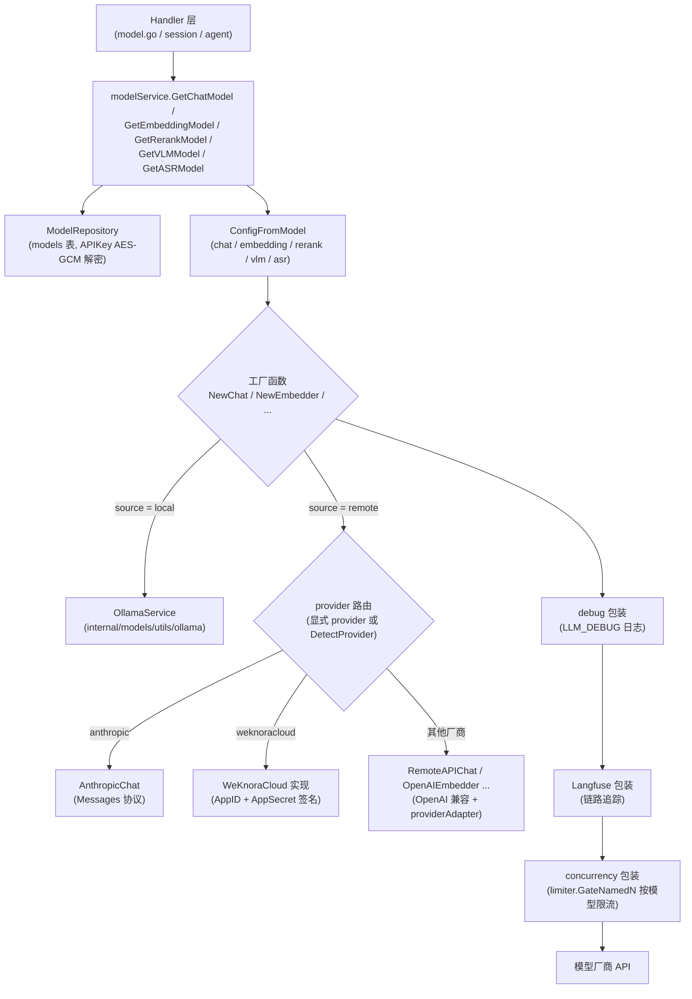

# 模型管理

WeKnora 不绑定任何一家模型厂商：对话、向量化、重排、图片理解、语音转写这五类能力都抽象成统一的「模型」，你在「设置 → 模型」里添加，然后在知识库和 Agent 上按需选用。本地 Ollama 和 20 多家远程厂商（OpenAI、DeepSeek、通义、智谱、混元、Gemini、硅基流动等）都可以混着用，比如用本地小模型做向量化、用远程大模型做回答。

<Screenshot
  src="/screenshots/settings-models.png"
  caption="模型设置：按类型管理已添加的模型"
  hint="展示模型列表（名称、类型、来源、默认标记）与「添加模型」表单，含连通性测试结果。" />

添加模型时注意两点：

- **向量模型选定后别再换**。它决定索引里向量的含义与维度，换了之后老数据检索不到，必须重建索引；
- **保存前点一下测试**。连不通的模型保存后只会在提问时报错，排查更费劲。

下面梳理模型类型、Provider 抽象、配置字段、内置模型机制、并发限流、连通性测试与用量统计。

## 模型类型与用途

模型类型定义在 `internal/types/model.go`：

```go
const (
    ModelTypeEmbedding   ModelType = "Embedding"   // Embedding model
    ModelTypeRerank      ModelType = "Rerank"      // Rerank model
    ModelTypeKnowledgeQA ModelType = "KnowledgeQA" // KnowledgeQA model
    ModelTypeVLLM        ModelType = "VLLM"        // VLLM model
    ModelTypeASR         ModelType = "ASR"         // ASR model
)
```

| 类型 | 前端标识 | 客户端包 | 接口 | 用途 |
|------|---------|---------|------|------|
| `KnowledgeQA` | `chat` | `internal/models/chat` | `Chat` / `ChatStream`（支持 Tools、Thinking、多模态消息） | 知识问答、Agent 推理、摘要 / 问题生成 / 图谱抽取等一切 LLM 调用 |
| `Embedding` | `embedding` | `internal/models/embedding` | `Embed` / `BatchEmbed`（含 `GetDimensions`） | 文本向量化，供向量检索索引与查询 |
| `Rerank` | `rerank` | `internal/models/rerank` | `Rerank(query, documents)` 返回 `RankResult` | 检索结果精排 |
| `VLLM` | `vllm` | `internal/models/vlm` | `Predict(imgBytes, prompt)` | 视觉语言模型（VLM），文档图片理解 / 多模态解析 |
| `ASR` | `asr` | `internal/models/asr` | `Transcribe(audioBytes, fileName)` 返回文本与分段时间戳 | 音频转写（自动语音识别） |

前后端类型映射见 `internal/handler/model.go` 的 `modelTypeToFrontend()`（`KnowledgeQA -> chat` 等）。

模型来源（`ModelSource`）核心取值为两个：`local`（本地 Ollama 拉起）与 `remote`（远程 API）；其余历史值（`aliyun`、`zhipu`、`openai` 等）为兼容保留，路由行为等同 `remote` + 对应 provider。

## Provider 抽象

`internal/models/provider/provider.go` 定义了多厂商适配的统一注册表：

```go
type Provider interface {
    // Info 返回服务商的元数据
    Info() ProviderInfo
    // ValidateConfig 验证服务商的配置
    ValidateConfig(config *Config) error
}
```

每个厂商在自己的文件（如 `provider/openai.go`、`provider/aliyun.go`）中通过 `init()` 调用 `Register()` 注册自身，`ProviderInfo` 携带 `DisplayName`、`Description`、按模型类型区分的 `DefaultURLs`、支持的 `ModelTypes`、`RequiresAuth` 以及可选的 `ExtraFields`（例如 Azure OpenAI 声明了 `api_version` 额外字段，默认 `2024-10-21`）。

### 支持的厂商清单

`AllProviders()`（`provider/provider.go`）返回的完整列表（共 27 个，每个厂商在自己的文件里 `init()` 注册）。表格最后一行的 Ollama 不在其中，它走 `source=local` 这条独立路径，列在这里只为方便对照：

| Provider 标识 | 名称 | 说明 |
|---------------|------|------|
| `generic` | Generic | 任意 OpenAI 兼容 / 自定义部署（默认兜底） |
| `weknoracloud` | WeKnoraCloud | WeKnora 云服务（硬编码 `https://weknora.weixin.qq.com`，使用 AppID/AppSecret 凭证） |
| `aliyun` | 阿里云 DashScope | |
| `zhipu` | 智谱 AI（GLM 系列） | |
| `volcengine` | 火山引擎 Ark | |
| `hunyuan` | 腾讯混元 | |
| `siliconflow` | 硅基流动 | |
| `deepseek` | DeepSeek | |
| `minimax` | MiniMax | |
| `moonshot` | 月之暗面 Moonshot (Kimi) | |
| `modelscope` | 魔搭 ModelScope | |
| `qianfan` | 百度千帆 | |
| `qiniu` | 七牛云 | |
| `openai` | OpenAI | 五种模型类型全支持 |
| `anthropic` | Anthropic Claude | 独立 Messages 协议实现 |
| `gemini` | Google Gemini | Embedding 走专用 API |
| `openrouter` | OpenRouter | |
| `litellm` | LiteLLM（自托管 OpenAI 兼容代理） | 默认 URL 为占位符，loopback 需加入 `SSRF_WHITELIST` |
| `requesty` | Requesty | |
| `jina` | Jina AI | Embedding 与 Rerank |
| `mimo` | 小米 MiMo | |
| `longcat` | 美团 LongCat AI | |
| `lkeap` | 腾讯云 LKEAP（知识引擎原子能力） | 提供专用 Rerank 实现 |
| `gpustack` | GPUStack（私有化部署） | |
| `nvidia` | NVIDIA | 专用 Embedding / Rerank 实现 |
| `novita` | Novita AI | |
| `azure_openai` | Azure OpenAI | 额外字段 `api_version` |
| `ollama`（source=`local`） | Ollama 本地模型 | 非 Provider 注册表成员，由 `ModelSourceLocal` 路由 |

当模型未显式指定 provider 时，`DetectProvider(baseURL)` 会按 BaseURL 域名特征自动识别（如 `dashscope.aliyuncs.com -> aliyun`、`api.anthropic.com -> anthropic`），识别失败回落为 `generic`。

### 协议路由

`internal/models/chat/chat.go` 的 `NewRemoteChat`：

```go
func NewRemoteChat(config *ChatConfig) (Chat, error) {
    providerName := provider.ProviderName(config.Provider)
    if providerName == "" {
        providerName = provider.DetectProvider(config.BaseURL)
    }
    if providerName == provider.ProviderAnthropic {
        return NewAnthropicChat(config) // 独立 Messages 协议
    }
    return NewRemoteAPIChat(config) // 统一 OpenAI 兼容协议 + providerAdapter
}
```

- **Ollama**（`source=local`）：`chat/ollama.go`、`embedding/ollama.go`、`vlm/ollama.go` 通过 `internal/models/utils/ollama` 的 `OllamaService` 直连本机 Ollama。
- **Anthropic**：`chat/anthropic.go` 实现 Messages 协议。
- **其余远程厂商**：统一走 `chat/remote_api.go` 的 OpenAI 兼容 Chat Completions 实现，厂商差异（thinking 编码、参数兼容等）由构造时解析的 `providerAdapter` 处理。
- **Embedding** 有更多专用实现：阿里云多模态（`tongyi-embedding-vision-*` 走 DashScope 专用端点，纯文本模型自动改写为 `/compatible-mode/v1` OpenAI 兼容端点）、Volcengine 多模态、Jina、Azure OpenAI、NVIDIA、Gemini、Zhipu、WeKnoraCloud，其余为 OpenAI 兼容（`embedding/openai.go`）。
- **Rerank** 专用实现：Aliyun、Zhipu、Jina、NVIDIA、WeKnoraCloud、LKEAP、Volcengine，默认 `NewOpenAIReranker`（通用 `/rerank` 风格接口）。两个厂商有额外适配：
  - **LKEAP**：腾讯云 `RunRerank` 限制单次最多 60 篇文档、Query 与 Docs 合计不超过 2000 字符。`lkeapRerankBatches` 按这两个上限自动切批并回填全局下标，调用方不用感知分批；单篇文档自身就超限时直接报错并指出下标。
  - **Volcengine**：候选集超过接口单次文档上限时自动切成多批**并发**打分再合并（并发上限见 `volcengineRerankMaxConcurrency`），不会静默截断候选。
  - **NVIDIA**：接口返回的是原始 logit 而非 [0,1] 概率。`normalizeNvidiaLogit` 用数值稳定的 sigmoid 归一化（负数走 `e^x/(1+e^x)` 分支避免溢出），否则 `RerankThreshold` 这类阈值配置在该厂商下完全失效。
- **ASR**：所有厂商统一使用 OpenAI 兼容 `/v1/audio/transcriptions`（`asr/asr.go`：`NewASR` 直接 `NewOpenAIASR`）。

## 模型调用链



工厂函数在真实客户端外层依次套上三个装饰器（见 `chat.NewChat` / `embedding.NewEmbedder` / `vlm.NewVLM`）：

```go
c, err = wrapChatDebug(c, err)
c, err = wrapChatLangfuse(c, err)
// Outermost: hold the per-model concurrency slot only around the real
// provider round-trip, so the wait is excluded from debug/langfuse timing.
return wrapChatConcurrency(c, config.MaxConcurrency, err)
```

## 模型配置字段

模型实体 `types.Model` 的 `Parameters`（`internal/types/model.go` 的 `ModelParameters`）：

| 名称 | 类型 | 默认值 | 说明 |
|------|------|--------|------|
| `base_url` | string | 空（可用 Provider 的 `DefaultURLs`） | 模型 API 地址，创建/更新时经过 SSRF 校验（`ValidateURLForSSRF`） |
| `api_key` | string | 空 | API 密钥，**AES-256-GCM 加密落库**（`ModelParameters.Value/Scan`），仅通过 `PUT /models/:id/credentials` 子资源修改 |
| `interface_type` | string | 空（VLM：local 默认 `ollama`，remote 默认 `openai`） | 接口协议类型 |
| `embedding_parameters.dimension` | int | 0 | 向量维度 |
| `embedding_parameters.truncate_prompt_tokens` | int | 0 | 输入截断 token 数 |
| `embedding_parameters.supports_dimension_override` | bool | false | 是否支持请求级维度覆盖（`dimensions` 参数） |
| `parameter_size` | string | 空 | Ollama 模型参数规模（如 "7B"），后端维护、前端不可改 |
| `provider` | string | 空（按 BaseURL 自动检测） | 厂商标识 |
| `extra_config` | map[string]string | nil | 厂商专属配置（如 Azure 的 `api_version`） |
| `custom_headers` | map[string]string | nil | 附加自定义 HTTP 请求头（类似 OpenAI SDK `extra_headers`；`Authorization`、`api-key` 等保留头在运行期被忽略） |
| `supports_vision` | bool | false | Chat 模型是否接受图片多模态输入 |
| `context_window` | int | 0（回落到 200000） | 对话/VLM 上下文窗口（token）。智能体压缩历史按此上限工作；留空使用默认 200K。请填厂商真实窗口，填大会导致压缩不触发 |
| `max_concurrency` | int | 0（回落到全局 `model.max_concurrency`） | 该模型后台任务并发上限（仅 chat/vlm/embedding 生效） |
| `app_id` / `app_secret` | string | 空 | WeKnoraCloud 专用凭证，`app_secret` AES 加密存储 |

模型级字段还包括 `name`（运行期实际调用的模型名）、`display_name`、`type`、`source`、`is_default`（同一 `(tenant_id, type)` 桶内唯一默认）、`is_builtin`、`managed_by`、`status`（`active` / `downloading` / `download_failed`）。

### 管理 API（`internal/router/router.go`）

| 方法 & 路径 | 说明 |
|-------------|------|
| `GET /models/providers` | 按 `model_type` 查询支持的厂商列表（`ListModelProviders`） |
| `POST /models` / `GET /models` / `GET /models/:id` / `PUT /models/:id` / `DELETE /models/:id` | 模型 CRUD |
| `PUT /models/:id/credentials`、`DELETE /models/:id/credentials/:field` | 凭证子资源；`PUT /models/:id` 请求体中的 `api_key` 会被强制忽略并告警 |
| `POST /models/:id/debug` | 模型调试（见下文） |
| `GET /models/weknoracloud/status` | WeKnoraCloud 凭证状态 |

## 内置模型机制

`internal/types/builtin_models_config.go` 实现了声明式内置模型：启动时读取 `config/builtin_models.yaml`（或 `BUILTIN_MODELS_CONFIG` 指定路径，模板见 `config/builtin_models.yaml.example`），把每个条目 UPSERT 到 `models` 表，`is_builtin=true`、`managed_by="yaml"`、默认 `tenant_id=10000`（`DefaultBuiltinModelTenantID`），对所有租户可见。

关键行为（`LoadBuiltinModelsConfig`）：

- 任意字符串字段支持 `${ENV_NAME}` 环境变量插值；未设置的变量保留字面量以便暴露配置错误。
- 每次启动按 `id` UPSERT，并把 `deleted_at` 强制重置为 NULL（文件中重新出现的条目会复活）。
- **漂移清理**：`managed_by='yaml'` 但 id 已不在文件中的行被软删除——从 YAML 删除条目即是下线内置模型的正规方式。
- 管理员在运行时接管某行（`managed_by` 置空）后，YAML 加载器会跳过该行（"preserving runtime override"）。
- `is_default: true` 条目会先清掉同 `(tenant_id, type)` 桶内其他默认，保持与 API 路径一致的唯一默认不变式。
- 校验规则：id 非空且 ≤64 字符（`ModelIDMaxLen`）、type 必须是 `KnowledgeQA | Embedding | Rerank | VLLM | ASR`、status 合法或为空；YAML 解析失败时中止对账（不执行漂移清理）。

YAML 示例（摘自 `builtin_models.yaml.example`）：

```yaml
builtin_models:
  - id: builtin-llm-default
    type: KnowledgeQA
    source: remote
    is_default: true
    name: ${LLM_MODEL_NAME}
    parameters:
      base_url: ${LLM_BASE_URL}
      api_key: ${LLM_API_KEY}
      provider: ${LLM_PROVIDER}
```

### 本地模型下载（Ollama）

本地模型的生命周期由 `internal/models/utils/ollama/ollama.go` 的 `OllamaService` 管理（`IsModelAvailable` / `PullModel` / `EnsureModelAvailable` / `ListModelsDetailed` / `DeleteModel` 等），HTTP 入口在 `internal/handler/initialization.go`：

| 路径 | 说明 |
|------|------|
| `GET /initialization/ollama/status` | Ollama 服务可用性 |
| `GET /initialization/ollama/models` | 列出本地已有模型 |
| `POST /initialization/ollama/models/check` | 批量检查模型是否已下载 |
| `POST /initialization/ollama/models/download` | 异步下载（`downloadModelAsync` + `pullModelWithProgress`，写入模型 `status=downloading`） |
| `GET /initialization/ollama/download/progress/:taskId`、`GET /initialization/ollama/download/tasks` | 下载进度 / 任务列表 |

> 注意：`cmd/download/duckdb/duckdb.go` 与模型无关——它在构建镜像时预下载 DuckDB 的 `spatial`、`excel` 扩展，供数据分析工具使用。模型权重下载只发生在 Ollama 路径。

## 并发与限流（limiter）

`internal/models/limiter` 提供**按模型 ID 的分布式后台并发闸门**，核心设计（`limiter.go` 包注释）：共享的稀缺资源是模型厂商的请求预算，因此在模型客户端层（唯一能看到所有任务类型的位置）限流，而不是在 asynq 队列层。

- **Redis 后端**（`NewRedisLimiter`）：自愈式分布式信号量。每个持有的槽位是 ZSET 成员（唯一 token），score 为租约到期时间；`acquireScript` Lua 脚本原子地清理过期租约、计数、在限额内准入。租约 TTL 30s，持有方每 TTL/3 心跳续租（同时续 ZSET key 自身的 TTL），进程崩溃后租约自然过期回收。**任何后端错误都 fail-open**——限流器故障绝不能阻断模型流量。
- **Local 后端**（`NewLocalLimiter`）：Lite 模式（单进程无 Redis）下的进程内计数信号量。
- **仅后台任务被限流**：`GateNamedN`（`governor.go`）只在 `types.IsBackgroundTask(ctx)` 为真（asynq worker：摘要、问题生成、图谱抽取、多模态增强等）时排队；交互式用户请求永不被闸门阻塞。
- 限额优先取模型自身 `parameters.max_concurrency`，为 0 时回落进程级默认 `model.max_concurrency`（可经系统设置在运行时通过 `SetGlobalLimit` 热更新）。
- 运行时观测：`GET /system/admin/runtime/queues`（`internal/handler/system.go`）返回 `limiter.RuntimeStats()` 的每模型 `active / waiting / limit`（Redis 后端 active 为集群级，waiting 为进程本地）。

## 模型健康检查 / 连通性测试

两套机制，均在服务端持有凭证、不回传明文密钥：

1. **测试连接**（`internal/handler/initialization.go`，供模型创建/编辑表单的 "Test connection" 按钮）：
   - `POST /initialization/remote/check` — Chat 模型（`CheckRemoteModel` / `checkChatModelConnection`）
   - `POST /initialization/embedding/test` — Embedding（`TestEmbeddingModel`）
   - `POST /initialization/rerank/check` — Rerank（`CheckRerankModel`）
   - `POST /initialization/asr/check` — ASR（`CheckASRModel`）
   - `POST /initialization/multimodal/test` — VLM 多模态解析（`TestMultimodalFunction`）

   请求体 `ModelTestRequest` 可携带 `modelId`：`fillSecretsFromStoredModel` 会把请求中缺失的 `APIKey` / `AppSecret` 从已存模型（解密后）补齐，实现"改 BaseURL 用旧密钥一键验证"，前端无需也无法拿到明文密钥。`buildTestModel` 把请求转换为**不落库**的临时 `*types.Model`，与生产路径共享同一套 `ConfigFromModel` 映射。

2. **模型调试器**（`POST /models/:id/debug`，`ModelHandler.DebugModel`）：对已保存模型按类型发起真实调用并返回完整归一化响应——Chat 走流式并聚合 `stream_events` / thinking 观测项；Embedding 返回向量与维度；Rerank 返回打分结果；VLM / ASR 接受上传文件。响应含 `elapsed_ms`、脱敏后的请求预览（`redactedDebugConfig` 隐去 secret/token/api_key 类字段）与 `observations`。

## rerank_server_demo.py 的用途

仓库根目录的 `rerank_server_demo.py` 是一个**自托管 Rerank 服务的最小参考实现**：FastAPI + HuggingFace `AutoModelForSequenceClassification`，暴露 `POST /rerank`，请求体 `{query, documents}`，返回 `{"results": [{index, document: {text}, score}]}`。

它故意把打分字段命名为 `score` 而非 `relevance_score`，用于验证 Go 客户端的兼容性——`internal/models/rerank/reranker.go` 中 `RankResult.UnmarshalJSON` 会优先读取 `relevance_score`，缺失时回退到 `score`；`DocumentInfo.UnmarshalJSON` 同时兼容字符串与 `{text}` 对象两种格式。因此任何按此协议实现的私有 rerank 服务都可以以 `generic` provider 接入 WeKnora。

## 模型用量统计

- **Token 用量**：`types.TokenUsage`（`internal/types/chat.go`）记录 `prompt_tokens / completion_tokens / total_tokens` 及 prompt cache 细分（`cache_read_tokens / cache_write_tokens / cache_miss_tokens / cache_status`）。每个 Chat 实现通过 `internal/models/chat/usage.go` 的 `logUsage` 输出统一的结构化日志行：

  ```go
  logger.Infof(ctx,
      "[LLM Usage] model=%s, purpose=%s, prompt_prefix=%s, prompt_tokens=%d, completion_tokens=%d, ...",
      ...)
  ```

  其中 `purpose` 来自 `types.WithLLMCallMetadata`（如 `web_fetch_summary`、`entity_extraction`），可按用途聚合。
- **链路追踪**：启用 Langfuse 时，每类模型都有 `langfuse_wrapper.go` 装饰器把调用（含 usage）上报为 trace/span。
- **流式响应**：usage 随最后的 `StreamResponse` 事件返回（模型调试器会将其聚合进 `usage` 字段）。
- **并发水位**：如上节所述，`GET /system/admin/runtime/queues` 暴露每模型实时 `active / waiting / limit`。
