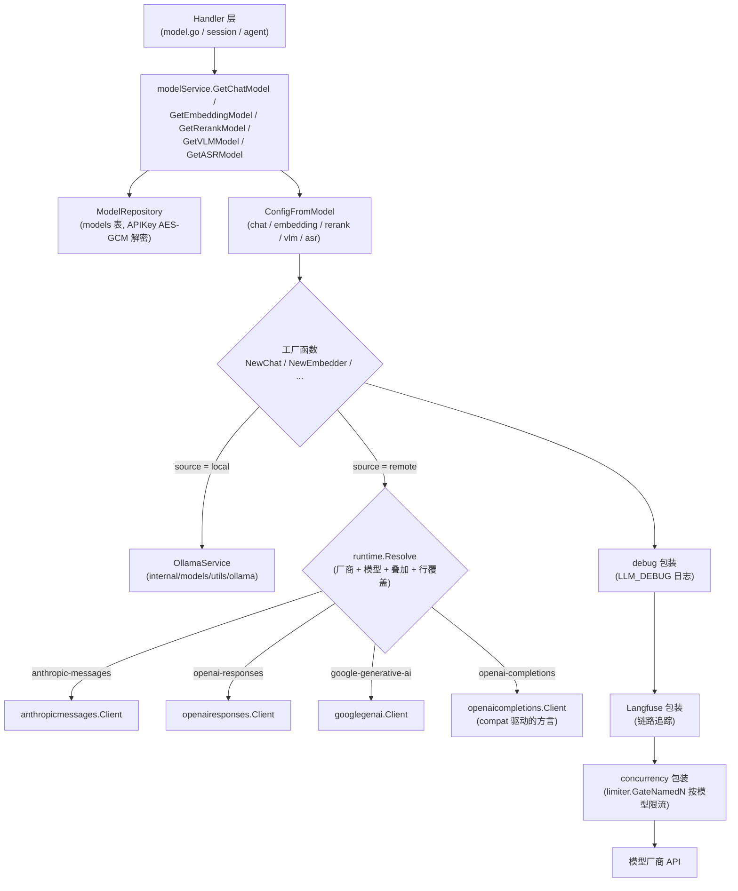

# 模型管理

在「设置 → 模型」添加对话、向量、重排、视觉和语音模型，再由知识库或智能体按需选用。本地 Ollama 和远程模型可以组合使用，例如由本地模型生成向量、远程模型生成回答。

<Screenshot
  src="/screenshots/settings-models.png"
  caption="模型设置：按类型管理已添加的模型"
  hint="展示模型列表（名称、类型、来源、默认标记）与「添加模型」表单，含连通性测试结果。" />

添加模型时应检查连接配置和索引兼容性：

- **更换向量模型需要重建索引**。模型决定向量的语义空间与维度，新旧向量不能直接混用；
- **保存前测试连接**。确认服务地址、凭据和模型名称可用后，再将模型用于知识库或智能体。

模型类型、配置字段和使用状态可按以下说明查询。

## 选择模型类型

| 类型 | 用途 |
| --- | --- |
| 对话模型 | 生成问答、摘要和智能推理内容 |
| 向量模型 | 将文档与问题转换为向量，支持语义检索 |
| 重排模型 | 对召回片段重新排序 |
| 视觉模型 | 识别文档或对话中的图片 |
| 语音模型 | 将音频转写为文本 |

## 添加与验证连接

在模型设置中选择类型和提供商，填写实际模型名称、服务地址与凭据，测试通过后保存。向量模型需要匹配索引维度；对话与视觉模型的上下文窗口应使用服务实际支持的大小，以便正确触发历史压缩。

修改连接地址时，测试可复用已保存凭据。模型调试器会实际发起请求，显示耗时、脱敏请求和响应结果，可用于检查向量维度、重排得分或流式输出。

## 查看引用与调整配置

知识库和智能体保存对模型的引用。删除模型前需检查依赖详情；内置模型由 YAML 配置管理，应在配置文件中维护。调用量和缓存使用情况可结合[可观测性与审计](16-observability.md)查看。

## 配置与调用参考

### 模型类型与用途

模型类型定义在 `internal/types/model.go`：

```go
const (
    ModelTypeEmbedding   ModelType = "Embedding"   // Embedding model
    ModelTypeRerank      ModelType = "Rerank"      // Rerank model
    ModelTypeKnowledgeQA ModelType = "KnowledgeQA" // KnowledgeQA model
    ModelTypeVLLM        ModelType = "VLLM"        // VLLM model
    ModelTypeASR         ModelType = "ASR"         // ASR model
)
```

| 类型 | 前端标识 | 客户端包 | 接口 | 用途 |
|------|---------|---------|------|------|
| `KnowledgeQA` | `chat` | `internal/models/chat` | `Chat` / `ChatStream`（支持 Tools、Thinking、多模态消息） | 知识问答、Agent 推理、摘要 / 问题生成 / 图谱抽取等一切 LLM 调用 |
| `Embedding` | `embedding` | `internal/models/embedding` | `Embed` / `BatchEmbed`（含 `GetDimensions`） | 文本向量化，供向量检索索引与查询 |
| `Rerank` | `rerank` | `internal/models/rerank` | `Rerank(query, documents)` 返回 `RankResult` | 检索结果精排 |
| `VLLM` | `vllm` | `internal/models/vlm` | `Predict(imgBytes, prompt)` | 视觉语言模型（VLM），文档图片理解 / 多模态解析 |
| `ASR` | `asr` | `internal/models/asr` | `Transcribe(audioBytes, fileName)` 返回文本；模型提供时附带分段时间戳（如 OpenAI `whisper-1`） | 音频转写（自动语音识别） |

前后端类型映射见 `internal/handler/model.go` 的 `modelTypeToFrontend()`（`KnowledgeQA -> chat` 等）。

模型来源（`ModelSource`）核心取值为两个：`local`（本地 Ollama 拉起）与 `remote`（远程 API）；其余历史值（`aliyun`、`zhipu`、`openai` 等）为兼容保留，路由行为等同 `remote` + 对应 provider。

### 模型配置字段

模型实体 `types.Model` 的 `Parameters`（`internal/types/model.go` 的 `ModelParameters`）：

| 名称 | 类型 | 默认值 | 说明 |
|------|------|--------|------|
| `base_url` | string | 空（可用 Provider 的 `DefaultURLs`） | 模型 API 地址，创建/更新时经过 SSRF 校验（`ValidateURLForSSRF`） |
| `api_key` | string | 空 | API 密钥，**AES-256-GCM 加密落库**（`ModelParameters.Value/Scan`），仅通过 `PUT /models/:id/credentials` 子资源修改 |
| `interface_type` | string | 空（VLM：local 默认 `ollama`，remote 默认 `openai`） | 接口协议类型 |
| `embedding_parameters.dimension` | int | 0 | 向量维度 |
| `embedding_parameters.truncate_prompt_tokens` | int | 0 | 服务端截断 token 数。这是 vLLM 的扩展参数，只发给 `generic`、`gpustack`（为 0 时沿用历史值 511）；托管厂商的文档里没有它，一律不发 |
| `embedding_parameters.supports_dimension_override` | bool | false | 是否在请求里指定向量维度。字段名由厂商决定（OpenAI 系 `dimensions`、Gemini `outputDimensionality`、百炼多模态 `parameters.dimension`）；厂商文档里没有该参数的模型（NVIDIA NIM、混元、Novita、ada-002 等）即使勾选也不发 |
| `parameter_size` | string | 空 | Ollama 模型参数规模（如 "7B"），后端维护、前端不可改 |
| `provider` | string | 空（按 BaseURL 自动检测） | 厂商标识 |
| `extra_config` | map[string]string | nil | 厂商专属配置（由厂商定义的 `extraFields` 驱动，如 Azure 的 `api_version`）；保留键 `api`（强制协议）、`remote_model_name`、`thinking_control`（旧版） |
| `spec` | object | nil | 单行目录覆盖：`api`、`reasoning`、`input`、`context_window`、`max_output_tokens`、`thinking_levels`、`compat`（协议相关的扁平 JSON） |
| `custom_headers` | map[string]string | nil | 附加自定义 HTTP 请求头（类似 OpenAI SDK `extra_headers`；`Authorization`、`api-key` 等保留头在运行期被忽略） |
| `supports_vision` | bool | false | Chat 模型是否接受图片多模态输入 |
| `context_window` | int | 0（回落到 200000） | 对话/VLM 上下文窗口（token）。智能体压缩历史按此上限工作；留空使用默认 200K。应填写服务实际支持的窗口大小，过高会导致压缩无法及时触发 |
| `max_concurrency` | int | 0（回落到全局 `model.max_concurrency`） | 该模型后台任务并发上限（仅 chat/vlm/embedding 生效） |
| `app_id` / `app_secret` | string | 空 | WeKnoraCloud 专用凭证，`app_secret` AES 加密存储 |

模型级字段还包括 `name`（运行期实际调用的模型名）、`display_name`、`type`、`source`、`is_default`（同一 `(tenant_id, type)` 桶内唯一默认）、`is_builtin`、`managed_by`、`status`（`active` / `downloading` / `download_failed`）。

#### 管理 API（`internal/router/router.go`）

| 方法 & 路径 | 说明 |
|-------------|------|
| `GET /models/providers` | 按 `model_type` 查询支持的厂商列表（`ListModelProviders`） |
| `POST /models` / `GET /models` / `GET /models/:id` / `PUT /models/:id` / `DELETE /models/:id` | 模型 CRUD |
| `PUT /models/:id/credentials`、`DELETE /models/:id/credentials/:field` | 凭证子资源；`PUT /models/:id` 请求体中的 `api_key` 会被强制忽略并告警 |
| `POST /models/:id/debug` | 模型调试（见下文） |
| `GET /models/weknoracloud/status` | WeKnoraCloud 凭证状态 |

### 模型健康检查 / 连通性测试

两套机制，均在服务端持有凭证、不回传明文密钥：

1. **测试连接**（`internal/handler/initialization.go`，供模型创建/编辑表单的 "Test connection" 按钮）：
   - `POST /initialization/remote/check` — Chat 模型（`CheckRemoteModel` / `checkChatModelConnection`）
   - `POST /initialization/embedding/test` — Embedding（`TestEmbeddingModel`）
   - `POST /initialization/rerank/check` — Rerank（`CheckRerankModel`）
   - `POST /initialization/asr/check` — ASR（`CheckASRModel`）
   - `POST /initialization/multimodal/test` — VLM 多模态解析（`TestMultimodalFunction`）

   请求体 `ModelTestRequest` 可携带 `modelId`：`fillSecretsFromStoredModel` 会把请求中缺失的 `APIKey` / `AppSecret` 从已存模型（解密后）补齐，实现"改 BaseURL 用旧密钥一键验证"，前端无需也无法拿到明文密钥。`buildTestModel` 把请求转换为**不落库**的临时 `*types.Model`，与生产路径共享同一套 `ConfigFromModel` 映射。

2. **模型调试器**（`POST /models/:id/debug`，`ModelHandler.DebugModel`）：对已保存模型按类型发起真实调用并返回完整归一化响应——Chat 走流式并聚合 `stream_events` / thinking 观测项；Embedding 返回向量与维度；Rerank 返回打分结果；VLM / ASR 接受上传文件。响应含 `elapsed_ms`、脱敏后的请求预览（`redactedDebugConfig` 隐去 secret/token/api_key 类字段）与 `observations`。

### 内置模型机制

`internal/types/builtin_models_config.go` 实现了声明式内置模型：启动时读取 `config/builtin_models.yaml`（或 `BUILTIN_MODELS_CONFIG` 指定路径，模板见 `config/builtin_models.yaml.example`），把每个条目 UPSERT 到 `models` 表，`is_builtin=true`、`managed_by="yaml"`、默认 `tenant_id=10000`（`DefaultBuiltinModelTenantID`），对所有租户可见。

关键行为（`LoadBuiltinModelsConfig`）：

- 任意字符串字段支持 `${ENV_NAME}` 环境变量插值；未设置的变量保留字面量以便暴露配置错误。
- 每次启动按 `id` UPSERT，并把 `deleted_at` 强制重置为 NULL（文件中重新出现的条目会复活）。
- **漂移清理**：`managed_by='yaml'` 但 id 已不在文件中的行被软删除——从 YAML 删除条目即是下线内置模型的正规方式。
- 管理员在运行时接管某行（`managed_by` 置空）后，YAML 加载器会跳过该行（"preserving runtime override"）。
- `is_default: true` 条目会先清掉同 `(tenant_id, type)` 桶内其他默认，保持与 API 路径一致的唯一默认不变式。
- 校验规则：id 非空且 ≤64 字符（`ModelIDMaxLen`）、type 必须是 `KnowledgeQA | Embedding | Rerank | VLLM | ASR`、status 合法或为空；YAML 解析失败时中止对账（不执行漂移清理）。

YAML 示例（摘自 `builtin_models.yaml.example`）：

```yaml
builtin_models:
  - id: builtin-llm-default
    type: KnowledgeQA
    source: remote
    is_default: true
    name: ${LLM_MODEL_NAME}
    parameters:
      base_url: ${LLM_BASE_URL}
      api_key: ${LLM_API_KEY}
      provider: ${LLM_PROVIDER}
```

#### 本地模型下载（Ollama）

本地 embedding 与对话共用同一 `OLLAMA_BASE_URL`；向量模型名与环境变量说明见 [配置文档](../01-getting-started/04-configuration.md)。

本地模型的生命周期由 `internal/models/utils/ollama/ollama.go` 的 `OllamaService` 管理（`IsModelAvailable` / `PullModel` / `EnsureModelAvailable` / `ListModelsDetailed` / `DeleteModel` 等），HTTP 入口在 `internal/handler/initialization.go`：

| 路径 | 说明 |
|------|------|
| `GET /initialization/ollama/status` | Ollama 服务可用性 |
| `GET /initialization/ollama/models` | 列出本地已有模型 |
| `POST /initialization/ollama/models/check` | 批量检查模型是否已下载 |
| `POST /initialization/ollama/models/download` | 异步下载（`downloadModelAsync` + `pullModelWithProgress`，写入模型 `status=downloading`） |
| `GET /initialization/ollama/download/progress/:taskId`、`GET /initialization/ollama/download/tasks` | 下载进度 / 任务列表 |

> 注意：`cmd/download/duckdb/duckdb.go` 与模型无关——它在构建镜像时预下载 DuckDB 的 `spatial`、`excel` 扩展，供数据分析工具使用。模型权重下载只发生在 Ollama 路径。

### 模型用量统计

- **Token 用量**：`types.TokenUsage`（`internal/types/chat.go`）记录 `prompt_tokens / completion_tokens / total_tokens` 及 prompt cache 细分（`cache_read_tokens / cache_write_tokens / cache_miss_tokens / cache_status`）。每个 Chat 实现通过 `internal/models/chat/usage.go` 的 `logUsage` 输出统一的结构化日志行：

  ```go
  logger.Infof(ctx,
      "[LLM Usage] model=%s, purpose=%s, prompt_prefix=%s, prompt_tokens=%d, completion_tokens=%d, ...",
      ...)
  ```

  其中 `purpose` 来自 `types.WithLLMCallMetadata`（如 `document_summary`、`entity_extraction`），可按用途聚合。
- **链路追踪**：启用 Langfuse 时，每类模型都有 `langfuse_wrapper.go` 装饰器把调用（含 usage）上报为 trace/span。
- **流式响应**：usage 随最后的 `StreamResponse` 事件返回（模型调试器会将其聚合进 `usage` 字段）。
- **并发水位**：如上节所述，`GET /system/admin/runtime/queues` 暴露每模型实时 `active / waiting / limit`。

## 模型调用与实现参考

### 厂商目录（catalog）

模型接入按数据、厂商、运行时、协议分工：

| 层 | 位置 | 职责 |
|----|------|------|
| 协议层 | `internal/models/api/<protocol>` | 一个 wire 协议一个包。对话：`openaicompletions`、`openairesponses`、`anthropicmessages`、`googlegenai`；重排：`cohererank`、`dashscoperank`、`nimrerank`；向量：`openaiembeddings`、`dashscopeembeddings`、`arkembeddings`、`googleembeddings`；语音：`openaitranscriptions`。各自持有请求/响应结构与解析，不依赖厂商注册表或模型目录 |
| 厂商层 | `internal/models/providers/<id>.go` | 一个厂商一份定义，同时声明 Chat、Embedding、Rerank、ASR；图标放 `providers/assets/`，在 `builtin.go` 显式注册 |
| 目录层 | `internal/models/catalog` | 加载统一生成的目录，管理部署叠加与原子替换 |
| 运行时 | `internal/models/runtime` | 合并单个模型配置、选择协议、组装该模型的认证和端点，隔离旧字段推断 |

`runtime.Resolve(Ref{Provider, Model, BaseURL, Extra, Override})` 的合并顺序从低到高：

1. 协议默认值（`DefaultOpenAICompletions()` 等）；
2. 厂商级 `Compat`（`providers/<id>.go` 里声明，例如 DeepSeek 的 `max_tokens_field: max_tokens`）；
3. `catalog/data/models.generated.json` 里匹配到的条目（精确 id → `aliases` → `match` 通配，最长字面前缀优先）；
4. 部署叠加 `config/models.json`（见下）；
5. 模型行上的 `parameters.spec`（UI「高级」里的协议覆盖与 compat JSON）；
6. `extra_config.api` 强制协议、`extra_config.thinking_control` 旧版思考编码、`extra_config.remote_model_name`。

厂商参数依据厂商文档维护，每个 `providers/<id>.go` 的包注释列出依据与文档链接，目录条目的 `source` 字段记录来源。对应的出站 JSON 由各协议包的 golden 测试钉死（如 `openaicompletions/golden_test.go`）。

#### 关键 compat 字段（OpenAI Chat Completions 方言）

| 字段 | 含义 | 典型厂商 |
|------|------|----------|
| `max_tokens_field` | `max_tokens` 或 `max_completion_tokens`，二者只发一个 | DeepSeek / 智谱 / 硅基流动 用 `max_tokens`；OpenAI / 火山 用 `max_completion_tokens` |
| `thinking_format` | `openai`（`reasoning_effort`）、`thinking-type`（`thinking.type`）、`enable-thinking`（`enable_thinking` + `thinking_budget`）、`chat-template-kwargs`（vLLM）、`openrouter`（`reasoning`）、`none` | 见各厂商 |
| `supports_reasoning_effort` | 是否额外发 `reasoning_effort` | DeepSeek、智谱、火山、OpenAI |
| `thinking_always_send` / `thinking_disable_on_non_stream` | 每次请求都钉开关；非流式强制关 | 百炼混合思考模型 |
| `thinking_budget_excludes_effort` | 厂商禁止 `thinking_budget` 与 `reasoning_effort` 同发，发了报错；置真时按档位优先、丢掉预算 | 百炼 qwen3.8 系列 |
| `supports_temperature` / `fixed_temperature` | 推理模型拒绝采样参数；Moonshot v1 固定 1 | GPT-5 / o 系列、Kimi K2.5+ |
| `tool_choice_modes` | 允许的 `tool_choice` 取值 | DeepSeek 思考模式不支持 `required` |
| `replay_reasoning_content` | 多轮回传 `reasoning_content` | DeepSeek、MiMo、Kimi |
| `prompt_cache_key` / `cache_control_format` | OpenAI 缓存路由 / Anthropic 式断点 | OpenAI、OpenRouter、百炼 |

思考强度在内部统一为 `off / auto / minimal / low / medium / high / xhigh / max`，每个模型的 `thinking_levels` 把统一等级映射到厂商取值（`null` 表示不支持，`"off": null` 表示无法关闭思考，如 DeepSeek Reasoner、QwQ、Kimi K3），不支持的等级按 PI 的规则就近钳位。

#### 内置厂商

`GET /api/v1/models/providers?model_type=chat` 返回全部厂商定义（图标 data URI、默认地址、额外字段、内置模型与思考能力），前端完全据此动态渲染，没有本地厂商表。目前内置 27 个厂商：`generic`、`weknoracloud`、`aliyun`、`zhipu`、`volcengine`、`hunyuan`、`siliconflow`、`deepseek`、`minimax`、`moonshot`、`mimo`、`modelscope`、`qianfan`、`qiniu`、`longcat`、`lkeap`、`openai`、`azure_openai`、`anthropic`、`gemini`、`openrouter`、`litellm`、`requesty`、`jina`、`nvidia`、`novita`、`gpustack`；Ollama 走 `source=local` 独立路径。

协议选择：Anthropic 走 Messages 协议；Gemini 默认走原生 `generateContent`（`base_url` 指向 `/v1beta/openai` 则保持 OpenAI 兼容）；OpenAI 在 `api.openai.com` 上走 Responses 协议，中转/代理保持 Chat Completions；任何厂商 `base_url` 以 `/anthropic` 结尾时自动切到 Messages 协议（MiniMax、智谱、Kimi 的 Anthropic 兼容口）。单行 `spec.api` 的明确选择优先于 URL 和厂商推断；兼容旧配置的 `extra_config.api` 仍具有最高优先级。`extra_config.api` 可强制指定对话协议，只对 chat / VLM 行生效；embedding 行的协议覆盖写在 `spec.compat` 的 `"api"` 里，取值是向量协议（`openai-embeddings`、`dashscope-embeddings`、`ark-embeddings`、`google-embeddings`）。

目录条目按模型类型查找：embedding 行只匹配 embedding 条目，不会被同名前缀的对话通配（如百炼的 `qwen3*`、OpenAI 的 `gpt-5*`）套上对话的 compat。目录里还没有的新 id、带日期的快照照常按厂商默认解析。

#### 新增厂商

同一厂商的多种能力在一份定义中声明；共用协议不需要复制实现：

1. 新建 `internal/models/providers/<id>.go`，声明名称、能力、各类型默认地址、认证方式、协议默认值及特殊端点钩子，写明官方文档依据；
2. 在 `internal/models/catalog/data/seed.json` 的对应厂商中维护模型元数据；在 `internal/models/catalog/data/overrides.json` 中维护协议、思考映射与 compat 修正。模型键包含类型与 id / match，同名 Chat 和 Embedding 可以共存；
3. 将图标放入 `providers/assets/<id>.svg` 并引用，在 `providers/builtin.go` 的 `Builtins()` 列表加入定义，由 runtime 按厂商 ID 组合模型目录；
4. 执行 `make model-catalog-generate` 生成统一目录。生成文件不直接手改；已有协议可以复用，新协议才增加 `api/<protocol>` 包。

然后跑一条命令，目录层的守护测试会自动覆盖新厂商，无需为它单独写用例：

```bash
make model-catalog-check
```

它先检查生成数据是否过期，再运行模型模块全部测试：`providers` 的注册与图标检查；`runtime` 的解析与叠加；`parity` 包的**不变量**（每个模型条目的字段合法性、compat 键名可解码、上下文与最大输出自洽）和**逐模型出站请求检查**（每个对话模型在思考开 / 关两种情况下，只能出现一个输出上限字段；不支持采样参数的模型不得带 temperature；始终思考的模型不得收到关闭开关等）。新加的厂商和模型一旦违反这些规则，测试直接失败。

前端不需要任何改动：厂商下拉、图标、额外字段、内置模型列表都由 `GET /api/v1/models/providers` 动态渲染。

写入侧也有一道闸：`runtime.ValidateRow` 会在创建 / 更新模型（REST）和加载 `config/builtin_models.yaml`（启动）时解析这行配置（全部模型类型），未知协议、拼错的 compat 键、非法的思考档位在写入时就被拒绝（YAML 行只打 WARN 不阻塞启动，避免一次重启把线上模型下线）。

#### 厂商更新了模型怎么办

分两种情况：

**只是新增 / 调整模型元数据**（新模型 id、上下文窗口、价格）。先拿差异报告，再人工核对厂商文档更新 `internal/models/catalog/data/seed.json`，再运行 `make model-catalog-generate`：

```bash
make model-catalog-diff                 # 全部厂商
make model-catalog-diff VENDOR=deepseek # 只看一家
```

报告对比 [models.dev](https://models.dev/api.json) 的公开元数据：`+` 是上游有而我们没有的模型，`~` 是数值差异，`?` 是上游没收录的条目（国内厂商和别名经常如此，不代表错）。脚本只读不写，也从不在运行时调用——**字段名、思考格式这类行为事实不会被自动同步**，必须以厂商文档为准手工维护，这是刻意的取舍：models.dev 不携带这些信息，自动同步会让线上请求悄悄改变行为。

**厂商改了接口行为**（换了输出上限字段、新增 effort 取值、思考开关格式变化）。改 `providers/<id>.go` 或 `catalog/data/overrides.json` 中对应模型的 `compat`，再生成目录，并同步更新包注释里的文档链接；`internal/models/api/openaicompletions/golden_test.go` 之类的快照测试会把出站 JSON 钉死，改动必须先改测试预期，评审时一眼能看到行为变化。

**紧急情况不必等发版**：用下面的部署叠加在配置里先改，验证无误后再补回代码。

#### 部署叠加 `config/models.json`

不改代码也能加厂商、改地址、补模型：复制 `config/models.json.example` 到 `config/models.json`（或用 `MODELS_CONFIG` 指定路径），采用按厂商组织的部署覆盖结构：`providers` 按厂商 id 键入，已知 id 打补丁，新 id 声明新厂商；支持 `base_url` / `base_urls`、`api_key`（`${ENV}` 插值）、`headers`、`compat`、`thinking_levels`、`models`（按 id upsert：已存在的 id 只覆盖你写出来的字段，没写的 `reasoning`、`thinking_levels`、`compat`、`input` 保持原样；新 id 则整条新建）、`model_overrides`、`icon`（内联 `<svg …>` 字符串，或相对于叠加文件所在目录的 `.svg` 路径——不接受绝对路径、不能越出该目录、必须是 256 KB 以内的 SVG，因为图标会以 data URI 下发给所有能打开模型页的人）。未知键在启动时报错。运行时不会自动从外部拉取模型数据：字段名、思考格式这类行为事实必须由人维护。

#### 升级到目录化实现的注意事项

老库里的模型行**不需要任何迁移**：`parameters` 列只增加了可选的 `spec` 字段，旧的 26 个 `provider` 取值全部仍然注册，`extra_config` 的历史键（`thinking_control` 的每个取值、`remote_model_name`、`api_version`、`secret_key`、`region`、`instruction`、`truncate_prompt_tokens`）语义不变，目录里已没有的模型 id（自定义微调、已退役型号）照常解析并保留思考开关。这些由 `internal/models/runtime/legacy_rows_test.go` 与 `internal/types/legacy_persisted_json_test.go` 钉住。

但有四处**既有模型行的运行时行为会变**，升级时需要知会使用者：

1. **`extra_config.api` 变成保留键**。它现在是协议选择器（`openai-completions` / `openai-responses` / `anthropic-messages` / `google-generative-ai` / `ollama`），取值非法会在创建、更新模型时返回 400。WeKnora 自身从未写过这个键，只有手工调 REST 或写 YAML 造出来的行会受影响——升级前删掉或改成合法取值。这里刻意选择报错而不是忽略：静默忽略会让人以为切换生效了。
2. **Azure OpenAI 未填 `api_version` 的行改走 `/openai/v1` GA 数据面**，不再是 `/openai/deployments/{model}/...?api-version=2024-10-21`。旧默认版本根本不支持它同时声称的 `reasoning_effort` 与 `max_completion_tokens`，属于自相矛盾。要保留旧路径，在额外字段里显式填一个 `api_version`。
3. **`api.openai.com` 的一方流量改走 Responses 协议**（`PreferAPI` 只对官方域生效）。各类中转 / 网关仍走 Chat Completions，`parity` 包里有断言钉住这一点。
4. **7 家厂商的输出上限字段按文档纠正**：hunyuan、modelscope、qiniu、requesty、longcat、novita 由 `max_completion_tokens` 改回 `max_tokens`，moonshot 反向改为 `max_completion_tokens`。每一处在 `internal/models/parity/parity_test.go` 里都记了变更理由与厂商文档。aliyun 保持 `max_completion_tokens` 不变：兼容模式两个字段都收，但 DashScope 的参数表已经把 `max_tokens` 标为即将废弃并指名了继任者。

Rerank 行（逐厂商的出站请求由 `internal/models/rerank/wire_test.go` 钉住，含火山与 LKEAP 两个签名 SDK 客户端）：

1. **OpenAI 不再出现在 rerank 的厂商列表里**。OpenAI 的 API 没有 rerank 接口，在这里建的行只会 404；架在 OpenAI 风格地址后面、自带 rerank 的中转请建成 generic 行。已有的行照常解析。
2. **火山 rerank 每次最多 200 条**（文档：datas「数组长度不超过 200」），旧实现按自己定的 50 条切分。
3. **火山 rerank 的默认指令改为控制台原文** `Whether the document answers the query or matches the content retrieval intent`，文档要求「如需对齐控制台效果，请使用相同指令」；旧默认值把 Document / Query 写成了大写。已在额外字段里保存了指令的行不受影响。

Embedding 行也有几处按厂商文档纠正的行为变化（逐厂商的出站请求由 `internal/models/embedding/wire_test.go` 钉住）：

1. **托管厂商不再收到 `truncate_prompt_tokens`**。此前所有 OpenAI 兼容厂商都被塞了一个 511，它只是 vLLM 的扩展参数；`generic`、`gpustack` 照旧发送。
2. **NVIDIA NIM 的检索查询改用 `input_type: query`**。文档侧照旧是 `passage`，已有索引不受影响；这一标记在一次检索重构里丢失过，现在由 `types.WithEmbedQuery` 在三处查询入口设置。超长输入改为 `truncate: END` 截断而不是报错；`dimensions` 不再发送（NIM 没有这个参数）。目录里已被 NVIDIA 标记下线的 `nv-embed-v1`、`llama-3.2-nemoretriever-300m-embed-v1`、`baai/bge-m3` 已移除。
3. **阿里云按模型分流**：文本模型走 `/compatible-mode/v1/embeddings`，`qwen3-vl-embedding`、`qwen2.5-vl-embedding`、`tongyi-embedding-vision*`、`multimodal-embedding*` 走原生多模态接口。`base_url` 只填主机、国际站或业务空间域名时保留该主机，不再被替换成北京默认地址。
4. **火山方舟的文本向量接口已归档下线**，当前只有多模态接口。沿用老的 `doubao-embedding-text*` / `doubao-embedding-large-text*` 的行改发到它们归档文档里的 `/api/v3/embeddings`；此前它们被发往多模态接口。
5. **Gemini 的缩维放进 `embedContentConfig.outputDimensionality`**。请求顶层的同名字段已被文档标为 deprecated；旧实现发的是顶层 `output_dimensionality`。
6. **SiliconFlow 每次最多 32 条、百炼 `text-embedding-v1/v2` 最多 25 条**，超出时自动拆批；v1/v2 固定 1536 维，不发 `dimensions`。
7. **OpenAI 兼容回复里没有 `index` 时按顺序取**（和旧实现一致）；有 `index` 就按它放回，重复或缺位报错。
8. **Jina 的 `task`、Gemini 的 `taskType`、OpenRouter 的 `input_type`、火山的 `instructions`、百炼原生接口的 `text_type` / `instruct` 都不发**。它们会改变文档侧向量，开启后同一个知识库里新旧向量不在同一空间；需要按行显式开启的设计另见 Tencent/WeKnora#1401。

ASR 行的变化（逐厂商的出站表单由 `internal/models/asr/wire_test.go` 钉住）：

1. **不再一律发 `response_format=verbose_json`**。OpenAI 文档写明 gpt-4o-transcribe / gpt-4o-mini-transcribe「only supported format is json」，旧实现发给它们必然 400；GPUStack 的音频后端 vox-box 在 FunASR 模型（SenseVoice、Paraformer）上对 `verbose_json` 返回裸字符串，旧实现解不开。现在只有文档写明支持的模型声明它（OpenAI `whisper-1`），其余走默认 json，Langfuse 里的音频时长因此只在返回分段的模型上有。需要分段的自建行可以在 `spec.compat` 里写 `{"response_format": "verbose_json"}`。
2. **按厂商文档的上限和格式在上传前拒绝**：文件大小（OpenAI / 智谱 / OpenRouter 25 MB、Requesty 32 MB、SiliconFlow / MiniMax 50 MB；阿里与小米按整段 `data:` URI 计 10 MB），以及文档给出封闭格式清单的厂商（智谱、小米只收 wav/mp3，OpenAI、Requesty、MiniMax 各有列表）。
3. **回复里没有 `text` 字段即报错**，不再当成「未检测到语音」入库；静音音频返回的是空字符串 `text`，照常处理。
4. ASR 行现在带上 provider 走目录解析，go-openai 依赖随之移除。provider 没有声明 ASR 的行：显式填了该厂商的直接报错；没填、靠 URL 识别到的，按 OpenAI 形状打到它的 URL（与旧实现一致），不走该厂商的 Endpoint 钩子。
5. **支持 ASR 的厂商按文档补齐**。OpenAI 形状（multipart `file` + `model`）：openai、siliconflow、gpustack、generic、智谱（`glm-asr-2512`，单文件 ≤30 秒）、MiniMax（`asr-1.0`，路径是 `/v1/speech_to_text`）、OpenRouter、Requesty、LiteLLM。经 chat completions 的 `input_audio`（base64 data URI，编码后 ≤10 MB）：阿里云 `qwen3-asr-flash`、小米 `mimo-v2.5-asr`。
6. **知识库的「音频语言提示」终于发出去了**（此前从未接线）。位置按厂商文档：OpenAI / Requesty / OpenRouter / GPUStack / generic 是 `language` 表单字段，MiniMax 是 `language` 请求头，阿里与小米是 `asr_options.language`；智谱、SiliconFlow、LiteLLM 文档没有这个参数，不发。填 `auto` 等同留空。
7. **音频时长从回包里读**：MiniMax 的 `duration`、OpenAI 系与阿里的 `usage.seconds`，Langfuse 不再只靠 `verbose_json` 的分段。

阿里只有 `qwen3-asr-flash` 能直接带音频调用；其余 ASR 模型名由一条兜底条目拒绝并说明原因。

查过但没有接的：火山豆包语音（独立域名与密钥，当前文档的请求体只收音频 URL）、千帆（`vop_asr` 挂在应用实例下要 `app_id`；短语音接口 ≤60 秒且只收 pcm/wav/amr/m4a）、七牛（只收音频 URL）、Novita（GLM-ASR 自有接口，≤30 秒）、腾讯云 ASR（与混元不是同一套鉴权）、NVIDIA 托管 Riva（gRPC）、Gemini（没有专用转写接口，只能让对话模型听音频）、Azure（见下）。阿里 Paraformer / Fun-ASR / `*-filetrans` 是异步任务，同样要公网 URL。

Azure OpenAI 仍不声明 ASR：音频转写只出现在 v1 **preview** 参考里（`/openai/v1/audio/transcriptions?api-version=preview`），v1 GA 参考没有；未填 `api_version` 的行会被钩子发到不带版本的 v1 路径，能否调通没有核实。

### 模型调用链



工厂函数在真实客户端外层依次套上三个装饰器（见 `chat.NewChat` / `embedding.NewEmbedder` / `vlm.NewVLM`）：

```go
c, err = wrapChatDebug(c, err)
c, err = wrapChatLangfuse(c, err)
// Outermost: hold the per-model concurrency slot only around the real
// provider round-trip, so the wait is excluded from debug/langfuse timing.
return wrapChatConcurrency(c, config.MaxConcurrency, err)
```

### 并发与限流（limiter）

`internal/models/limiter` 提供**按模型 ID 的分布式后台并发闸门**，核心设计（`limiter.go` 包注释）：共享的稀缺资源是模型厂商的请求预算，因此在模型客户端层（唯一能看到所有任务类型的位置）限流，而不是在 asynq 队列层。

- **Redis 后端**（`NewRedisLimiter`）：自愈式分布式信号量。每个持有的槽位是 ZSET 成员（唯一 token），score 为租约到期时间；`acquireScript` Lua 脚本原子地清理过期租约、计数、在限额内准入。租约 TTL 30s，持有方每 TTL/3 心跳续租（同时续 ZSET key 自身的 TTL），进程崩溃后租约自然过期回收。**任何后端错误都 fail-open**——限流器故障绝不能阻断模型流量。
- **Local 后端**（`NewLocalLimiter`）：Lite 模式（单进程无 Redis）下的进程内计数信号量。
- **仅后台任务被限流**：`GateNamedN`（`governor.go`）只在 `types.IsBackgroundTask(ctx)` 为真（asynq worker：摘要、问题生成、图谱抽取、多模态增强等）时排队；交互式用户请求永不被闸门阻塞。
- 限额优先取模型自身 `parameters.max_concurrency`，为 0 时回落进程级默认 `model.max_concurrency`（可经系统设置在运行时通过 `SetGlobalLimit` 热更新）。
- 运行时观测：`GET /system/admin/runtime/queues`（`internal/handler/system.go`）返回 `limiter.RuntimeStats()` 的每模型 `active / waiting / limit`（Redis 后端 active 为集群级，waiting 为进程本地）。

### rerank_server_demo.py 的用途

仓库根目录的 `rerank_server_demo.py` 是一个**自托管 Rerank 服务的最小参考实现**：FastAPI + HuggingFace `AutoModelForSequenceClassification`，暴露 `POST /rerank`，请求体 `{query, documents}`，返回 `{"results": [{index, document: {text}, score}]}`。

示例服务返回 `score` 字段，可用于验证客户端兼容性。`RankResult.UnmarshalJSON` 优先读取 `relevance_score`，缺失时读取 `score`；`DocumentInfo.UnmarshalJSON` 同时接受字符串和 `{text}` 对象。遵循此协议的私有重排服务可通过 `generic` provider 接入。


重构后的配置边界：每个模型仍单独保存 URL、API Key、额外参数和 `spec`，不新增连接实体，不修改模型 ID 或历史引用。部署覆盖每次从内置定义重新构建；通过 `runtime.Initialize` / `runtime.Reload` 校验后整体发布，失败保留旧版本。暂不监听文件变更，修改部署文件后仍需重启服务。
