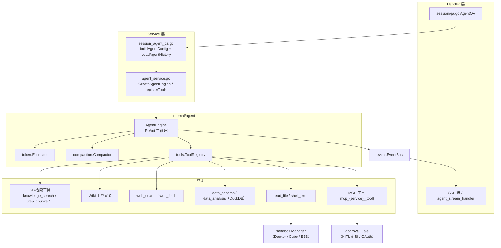
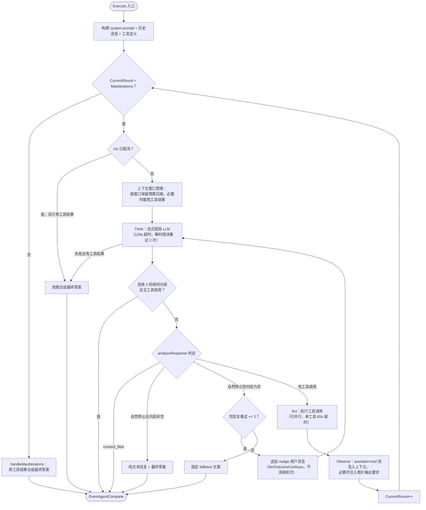
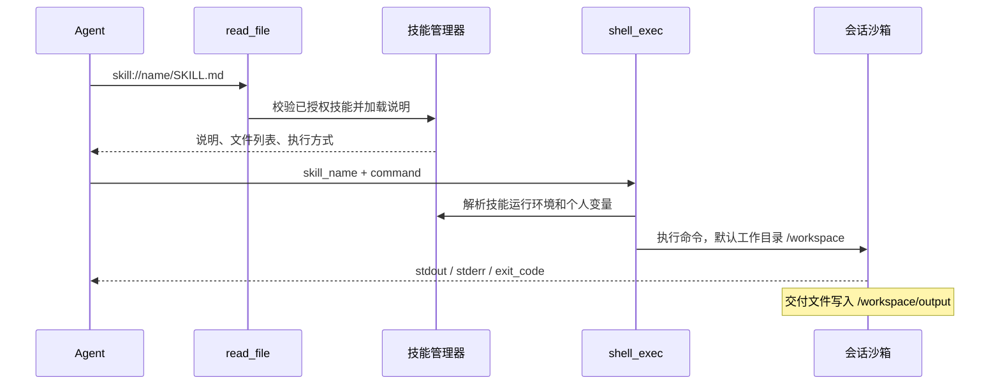

# Agent 引擎

智能体可结合知识库检索、联网搜索和外部工具处理多步骤任务，例如比较多份合同的条款。智能推理模式按问题选择工具并执行多轮调用，再根据获得的结果生成回答。

对话框顶部可选择快速问答或智能推理：

| 模式 | 适用任务 | 执行特点 |
| --- | --- | --- |
| 快速问答（quick-answer） | 基于文档的事实查询 | 检索后生成回答，通常调用次数较少 |
| 智能推理（smart-reasoning） | 跨文档分析、联网查询或工具操作 | 可能执行多轮调用，耗时与用量取决于任务 |

在「智能体」页可以创建自定义智能体，选择模式和模型，限定知识库范围，并配置提示词、联网搜索、MCP 工具及技能。保存后可用于网页对话，也可绑定到 IM 或嵌入渠道。

<Screenshot
  src="/screenshots/agent-editor.png"
  caption="自定义 Agent 配置：模式、模型、知识范围与工具"
  hint="展示 Agent 编辑弹窗，含模式选择、模型选择、知识库范围、联网搜索开关与 MCP 工具勾选。" />

<Screenshot
  src="/screenshots/agent-chat.png"
  caption="Agent 对话：推理过程与工具调用时间线"
  hint="展示一轮 Agent 回答，包含展开的思考步骤、工具调用卡片与最终答案的引用。" />

配置决定智能体可访问的资料与工具，实际调用仍受当前用户或渠道的权限约束。

## 创建与使用智能体

1. 在「智能体」页新建智能体，选择快速问答或智能推理模式。
2. 选择模型、知识库范围和提示词。类型预设会预填配置，保存前仍可调整。
3. 根据任务启用联网搜索或选择 MCP 工具；运行技能脚本时还需绑定已安装技能的沙箱。
4. 保存后在对话页选择该智能体，完成一次提问，检查回答来源与工具结果。

初次使用可直接选择内置智能体。快速问答适用于文档查询；数据分析智能体面向 CSV 和 Excel；Wiki 智能体用于浏览和维护 Wiki 内容。

## 设置资料和工具范围

智能体可以使用全部、指定或禁用的知识库及技能范围。对话中的提及用于选择本轮资料或提示优先技能，不能绕过已有授权。联网搜索同时受智能体配置和本轮请求开关约束。

通过组织共享智能体后，接收方在授权范围内使用来源空间的模型与资料。共享智能体为只读，接收方不能修改其配置。

## 处理工具审批与授权

需要人工审批的 MCP 工具在执行前显示审批卡片，用户可批准、拒绝或修改参数。默认等待上限为 10 分钟；拒绝、超时或取消会作为工具结果返回，智能体可据此继续处理。此审批机制只用于 MCP 工具。

MCP 服务需要 OAuth 授权时，可在当前对话中完成授权，成功后系统会重试工具调用。

## 使用技能、附件和记忆

绑定沙箱后，智能推理可读取附件、运行脚本并生成文件。可下载的产物应写入 `/workspace/output`，回答完成后可在会话中预览和下载。安装与变量配置见[技能目录与沙箱](22-skills-sandbox.md)，附件操作见[会话与对话体验](18-chat-experience.md)。

长期记忆按空间和调用者隔离，智能体可单独关闭记忆读写；完整说明见[跨会话长期记忆](23-memory.md)。

## 配置参考

### 自定义 Agent {#_7-自定义-agent}

#### 模式与类型预设 {#_7-1-模式与类型预设}

`CustomAgent`（`internal/types/custom_agent.go`）有两个运行模式（`Config.AgentMode`）：

- `quick-answer`：经典 RAG 管道（检索→拼上下文→单次生成），不进 Agent 引擎；
- `smart-reasoning`：ReAct Agent 模式，`IsAgentMode()` 返回 true，并强制 `MultiTurnEnabled = true`。

smart-reasoning 下还可选**类型预设**（`Config.AgentType`，定义在 `config/agent_type_presets.yaml`，由 `internal/types/agent_type_preset.go` 加载）。预设只在编辑器里**预填表单**，用户可任意覆盖：

| 预设 ID | 系统提示词模板 | 温度 | 最大迭代 | 预填工具 | KB 过滤 |
| --- | --- | --- | --- | --- | --- |
| `rag-qa` | `progressive_rag_agent` | 0.7 | 30 | knowledge_search、grep_chunks、list_knowledge_chunks、get_document_info | 由工具派生：any_of vector/keyword |
| `wiki-qa` | `wiki_researcher` | 0.7 | 30 | wiki_search、wiki_read_page、wiki_read_source_doc、wiki_flag_issue | 由工具派生：any_of wiki |
| `hybrid-rag-wiki` | `hybrid_rag_wiki_agent` | 0.7 | 40 | wiki_search、wiki_read_page、knowledge_search、grep_chunks、list_knowledge_chunks、get_document_info、wiki_flag_issue | any_of vector/keyword/wiki |
| `data-analysis` | `data_analyst` | 0.3 | 30 | data_schema、data_analysis；关闭 web 搜索；限定文件类型 csv/xlsx | 显式 `none_of: [faq]` |
| `custom` | 无 | — | — | 不预填 | 不限制 |

`thinking` 和 `todo_write` 默认不包含在预设工具中，使用时需手动选择；启用会增加 token 开销。

#### 可配置项（CustomAgentConfig） {#_7-2-可配置项-customagentconfig}

`internal/types/custom_agent.go` 中 `CustomAgentConfig` 的主要字段（handler `CreateAgent`/`UpdateAgent` 直接接收该结构）：

| 分类 | 字段 | 说明 / 默认（EnsureDefaults） |
| --- | --- | --- |
| 基础 | `agent_mode` | `quick-answer` / `smart-reasoning` |
| 基础 | `agent_type` | smart-reasoning 下的预设类别，空/未知视为 custom |
| 基础 | `system_prompt` / `system_prompt_id` | 直接内容或模板 ID（启动时经 `ResolveBuiltinAgentPromptRefs` 等解析） |
| 基础 | `context_template` / `context_template_id` | 普通模式下检索片段的拼装模板 |
| 模型 | `model_id`、`rerank_model_id`、`temperature`、`max_completion_tokens`、`thinking`、`citation_enabled` | temperature<0 → 0.7；max_completion_tokens=0 使用运行时默认：quick-answer 2048、smart-reasoning 4096、绑定沙箱的 smart-reasoning 24576；thinking 未设时固定为 false；citation 未设时视为 true |
| Agent | `max_iterations` | 默认 10（服务层上限 100） |
| Agent | `llm_call_timeout` | 单次 LLM 调用秒数，0 用全局默认（120s） |
| Agent | `allowed_tools` | 工具白名单；空回退 DefaultAllowedTools |
| MCP | `mcp_selection_mode`（all/selected/none）、`mcp_services`、`mcp_auth_wait_timeout` | OAuth 等待秒数 <=0 用 Gate 默认 |
| 技能 | `skills_selection_mode`（all/selected/none）、`selected_skills`、`sandbox_config_id` | 选择空间沙箱及其已安装技能，见[技能目录与沙箱](22-skills-sandbox.md) |
| 记忆 | `memory_enabled` | nil 继承空间，false 禁用本智能体的记忆读写 |
| 知识库 | `kb_selection_mode`（all/selected/none）、`knowledge_bases`、`retrieve_kb_only_when_mentioned`、`retain_retrieval_history` | retain=true 时历史 KB 检索结果不脱敏 |
| 多模态 | `image_upload_enabled`、`vlm_model_id`、`audio_upload_enabled`、`asr_model_id`、`image_storage_provider` | VLM 也用于 MCP 工具返回图片的描述 |
| 文件 | `supported_file_types`、`chat_parser_engine_rules`、`attachment_image_understanding`、`attachment_ocr_max_pages`、`attachment_parse_wait_timeout_sec` | 数据分析型 Agent 常限定 csv/xlsx |
| FAQ | `faq_priority_enabled`、`faq_direct_answer_threshold`、`faq_score_boost` | — |
| Web | `web_search_enabled`、`web_search_max_results`、`web_search_provider_id`、`web_fetch_enabled`、`web_fetch_top_n` | max_results 默认 5 |
| 多轮 | `multi_turn_enabled`、`history_turns` | history_turns 默认 5；smart-reasoning 强制 multi_turn |
| 检索 | `embedding_top_k`（10）、`keyword_threshold`（0.3）、`vector_threshold`（0.5）、`rerank_top_k`（5）、`rerank_threshold` | 括号内为默认值 |
| 高级 | `enable_query_expansion`、`enable_rewrite`、`rewrite_prompt_*`、`query_understand_model_id`、`fallback_strategy`（默认 model）、`fallback_response`、`fallback_prompt`、`intent_prompts`、`data_analysis_enabled` | 主要作用于 quick-answer 管道 |
| 建议 | `question_suggestions`（starters / follow_ups） | starters 默认 hybrid 模式 6 条；follow_ups 默认关闭、3 条 |

Handler 层（`internal/handler/custom_agent.go`）提供 `CreateAgent`、`GetAgent`、`ListAgents`、`UpdateAgent`、`DeleteAgent`、`CopyAgent`、`GetPlaceholders`（返回 `types.PlaceholdersByField(PromptFieldAgentSystemPrompt)` 的占位符清单）、`GetAgentTypePresets`（带 i18n 的预设列表）、`GetSuggestedQuestions`。创建/更新时经 `authorizeAgentKnowledgeScope` 校验受限 API Key 的 KB 范围：`kb_selection_mode: all` 对 KB 受限 key 直接 403，`selected` 逐一鉴权。

运行时映射：`buildAgentConfig`（`session_agent_qa.go`）把 `CustomAgentConfig` 转换为引擎的 `types.AgentConfig`（`internal/types/agent.go`），并叠加：web 搜索需 Agent 与请求同时开启（`customAgent.Config.WebSearchEnabled && req.WebSearchEnabled`）、web provider 回退租户默认、`SearchTargets` 由 KB/@文档/@标签 scope 统一构建、`MaxContextTokens` 兜底 200000、`@Skill` 的每轮优先提示与 `@MCP` 的每轮范围收窄（共享 Agent 的 @MCP 只能落在 Agent 预设集合内）。另外只有当 `knowledge_search` 实际可用时才要求配置 rerank 模型（`agentRequiresRerankModel`）。

#### 分享机制（agent_share） {#_7-3-分享机制-agent-share}

`internal/application/service/agent_share.go`：Agent 可分享给**组织（Organization）**：

- 仅 Agent 属主租户可分享（`ErrNotAgentOwner`）；分享者所在租户须为组织 Editor+ 成员；
- 分享前校验 Agent 配置完整：必须有 `model_id`；若 `knowledge_search` 在其工具集内（或工具集为空回退默认集）且 KB scope 未禁用，还必须有 `rerank_model_id`，否则 `ErrAgentNotConfigured`；
- **权限强制为只读**：`permission = types.OrgRoleViewer`（跨租户编辑不在 v1 范围）；重复分享则幂等更新；
- 接收方租户可通过 `TenantDisabledSharedAgentRepository` 把某个共享 Agent 在本租户禁用；
- 使用共享 Agent 对话时（`session_agent_qa.go`），检索与模型 scope 切到 **Agent 属主租户**（`resolveRetrievalTenantID`），因此共享方的 KB 对使用方可用，而使用方自己的 MCP @提及会被限制在 Agent 预设内。

### 内置 Agent（config/builtin_agents.yaml） {#_8-内置-agent-config-builtin-agents-yaml}

内置 Agent 由 `config/builtin_agents.yaml` 定义，启动时 `types.LoadBuiltinAgentsConfig` 载入并重建 `BuiltinAgentRegistry`（`internal/types/builtin_agent_config.go`），支持 default/zh-CN/zh-TW/ja-JP/ko-KR 多语言名称与描述；`system_prompt_id`/`context_template_id` 在启动时经 `ResolveBuiltinAgentPromptRefs` 解析为具体模板内容。

| ID | 名称（zh-CN） | agent_mode / agent_type | 关键配置 |
| --- | --- | --- | --- |
| `builtin-quick-answer` | 快速问答 | `quick-answer` | 模板 `default_kb` + `default_context`；temperature 0.7；FAQ 优先（直接回答阈值 0.9、加权 1.2）；query expansion + rewrite；web 搜索开、5 条；不进 Agent 引擎 |
| `builtin-smart-reasoning` | 智能推理 | `smart-reasoning` / `rag-qa` | `max_iterations: 50`；工具：knowledge_search、grep_chunks、list_knowledge_chunks、query_knowledge_graph、get_document_info；web 搜索开；多轮 5 轮 |
| `builtin-data-analyst` | 数据分析师 | `smart-reasoning` / `data-analysis` | 模板 `data_analyst`；temperature 0.3；`max_iterations: 30`；工具仅 data_schema + data_analysis；限定 csv/xlsx；关闭 web 搜索；历史 10 轮 |
| `builtin-wiki-researcher` | 维基问答 | `smart-reasoning` / `wiki-qa` | 模板 `wiki_researcher`；`max_iterations: 30`；工具：wiki_search、wiki_read_page、wiki_read_source_doc、wiki_flag_issue（只读 + 报障）；关闭 web 搜索 |
| `builtin-wiki-fixer` | 维基修订 | `smart-reasoning` / `custom` | 模板 `wiki_fixer`；`retain_retrieval_history: true`（修订需要跨轮记住页面内容）；工具含全部 wiki 写操作（wiki_write_page、wiki_replace_text、wiki_rename_page、wiki_delete_page、wiki_read_issue、wiki_update_issue 等 9 个）；`kb_selection_mode: selected` |

补充两点（来自 `internal/types/custom_agent.go`）：

- `builtin-wiki-fixer` 不显示在用户可见的 Agent 列表（`builtinAgentIDsOrdered` 排除了它）——它是 Wiki 编辑器程序化调用的内部 Agent，但仍可经 `GetAgentByID` 使用；
- `builtinAgentIDsOrdered` 中还保留了 `builtin-deep-researcher`、`builtin-knowledge-graph-expert`、`builtin-document-assistant` 等 ID 常量位次，但当前 YAML 未定义这些条目，注册表以 YAML 为准；
- `builtin_agents.yaml` 里每个条目都带 `reflection_enabled`（数据分析师为 `true`，其余 `false`），但**后端目前不消费这个字段**——`internal/` 下既没有对应的结构体字段也没有引用，只有 YAML 与前端类型定义里存在。也就是说它当前不影响 Agent 的实际行为，看到它为 `true` 不要以为多了一轮反思。

顺带一提，`internal/agent/prompts_wiki.go` 中的 `WikiSummaryPrompt`、`WikiKnowledgeExtractPrompt`、`WikiTaxonomyPlanPrompt` 等常量属于 **Wiki ingest 管道**（文档入库时 LLM 生成 wiki 页面/目录规划）使用的提示词，与 wiki 类 Agent 的运行时工具互补：前者生产 Wiki 内容，后者消费与维护。

### 建议问题（Starters 与追问） {#_10-建议问题-starters-与追问}

对话框在两个位置会给出可点击的问题：会话还空着时的**开场问题**（starters），以及每轮回答结束后的**追问建议**（follow-ups）。这套配置归 Agent 所有（`QuestionSuggestionConfig`，`internal/types/custom_agent.go`），渠道设置只能抑制展示，不能改内容策略。

#### 配置项

两组配置各自独立开关，`mode` 决定问题从哪来：

| mode | 来源 |
| --- | --- |
| `curated` | 只用人工写死的 `items` |
| `knowledge` | 从知识库内容里取 |
| `generated` | 让模型生成 |
| `hybrid`（默认） | 上述几种混合 |

| 配置 | 默认 | 说明 |
| --- | --- | --- |
| `starters.enabled` / `mode` / `items` / `count` | — / `hybrid` / 空 / 6 | 开场问题 |
| `follow_ups.enabled` / `mode` / `count` | — / `hybrid` / 3 | 追问建议 |
| `follow_ups.model_id` | 空（用会话模型） | 生成追问用的模型，可指定小模型省成本 |
| `follow_ups.categories` | 空 | 限定问题类型：`clarify`（澄清）/ `deepen`（深入）/ `action`（行动） |
| `follow_ups.max_context_turns` | 2 | 生成时回看几轮对话 |
| `follow_ups.additional_instruction` | 空 | 追加到生成提示词的业务约束 |
| `follow_ups.suppress_on_fallback` | — | 回答走了兜底策略时不出建议 |
| `follow_ups.suppress_when_answer_asks_question` | — | 回答本身在反问用户时不出建议（避免两个问题打架） |
| `follow_ups.knowledge_fallback` | — | 生成失败时回退到知识库来源 |
| `follow_ups.allow_regenerate` | — | 是否允许用户手动换一批 |

#### 生成、缓存与埋点

- 结果存 `message_suggestion_sets` 表，按 `(assistant_message_id, placement, config_hash, locale)` 缓存——`config_hash` 把「当前生效的 Agent 配置」摘要进缓存键，所以改了配置会自然拿到新的一批，而不是读到旧缓存；`locale` 让多语言各自缓存；
- 状态：`generating` → `ready`，另有 `suppressed`（按上面的抑制规则跳过）与 `failed`；`lease_until` 防止多实例重复生成同一批；
- 接口：`GET /sessions/:id/messages/:message_id/suggestions` 读，`POST` 同路径触发生成（幂等），`POST /sessions/:session_id/suggestion-events` 上报埋点；
- 埋点事件：`impression`（曝光）/ `click`（点击）/ `dismiss`（关掉）/ `regenerate`（换一批），存 `message_suggestion_events`。点击后发出的下一条用户消息会带 `SuggestionAttribution`（`suggestion_set_id` + `question_id`），因此统计上能区分「点了建议」与「自己打了同样的问题」。

## 执行机制参考

### 总览与架构 {#_1-总览与架构}

#### 核心组件 {#_1-1-核心组件}

| 组件 | 源码位置 | 职责 |
| --- | --- | --- |
| `AgentEngine` | `internal/agent/engine.go` | ReAct 主循环的驱动者，持有配置、工具注册表、Chat 模型、事件总线等 |
| `ToolRegistry` | `internal/agent/tools/registry.go` | 工具注册、查找、参数校验、执行、输出截断、资源清理 |
| 内置工具集 | `internal/agent/tools/*.go` | 按能力注册的内置工具 + 动态 MCP 工具 |
| Token 估算与压缩 | `internal/agent/token/` + `internal/agent/compaction/` | `Estimator`（BPE 估算）与长轮次上下文压缩（sandbox 工具历史） |
| 记忆整合 | `internal/application/service/memory/` | 跨会话长期记忆：抽取、召回、主题提升、文档亲和度、整理 |
| 技能系统 | `internal/agent/skills/` | SKILL.md 的发现、加载与脚本执行（Progressive Disclosure） |
| 执行沙箱 | `internal/sandbox/` | 技能脚本与 `shell_exec` 的 Docker / Cube / E2B 会话级隔离执行与安全校验 |
| 工具审批 | `internal/agent/approval/gate.go` | MCP 危险工具的人工审批（HITL）与会话内 OAuth 授权 |
| Agent 服务层 | `internal/application/service/agent_service.go` | 组装引擎：注册工具、解析 KB 元信息、初始化技能/沙箱/VLM |
| 会话问答入口 | `internal/application/service/session_agent_qa.go` | 从 `CustomAgent` 构建运行时 `AgentConfig` 并执行 |
| 历史重建 | `internal/application/service/agent_history.go` | 从 DB 重建多轮 LLM 上下文（`LoadAgentHistory`） |

`AgentEngine` 的结构体定义（`internal/agent/engine.go`）：

```go
type AgentEngine struct {
	config               *types.AgentConfig
	toolRegistry         *agenttools.ToolRegistry
	chatModel            chat.Chat
	eventBus             *event.EventBus
	knowledgeBasesInfo   []*KnowledgeBaseInfo      // Detailed knowledge base information for prompt
	selectedDocs         []*SelectedDocumentInfo   // User-selected documents (via @ mention)
	pinnedMCPServices    []*PinnedMCPServiceInfo   // User @mentioned MCP services for this turn
	pinnedSkills         []*PinnedSkillInfo        // User @mentioned skills for this turn
	sessionID            string
	systemPromptTemplate string
	skillsManager        *skills.Manager           // Skills manager for Progressive Disclosure (optional)
	appConfig            *appconfig.Config
	imageDescriber       ImageDescriberFunc        // VLM function for describing images in tool results
	tokenEstimator       *agenttoken.Estimator     // Token estimator for context window management
	compactor            *compaction.Compactor // Structured conversation compaction
	lastUsage            types.TokenUsage          // Token usage from the most recent LLM call
	lastSentMsgCount     int
	resourceRefs         *llmresource.Registry
	sourceRefs           *llmreference.Registry
}
```

引擎职责与约束：

1. **引擎跨轮无状态（stateless across turns）**。引擎源码注释明确写道：会话历史每轮由调用方通过 `service.LoadAgentHistory` 从 DB 重建，作为 `llmContext` 传入 `Execute`；引擎自身不维护缓存、system prompt 存储或跨轮缓冲。
2. **事件驱动输出**。引擎不直接写 SSE，所有输出（思考、工具调用、工具结果、最终答案、完成事件）都通过 `event.EventBus` 发射，由 Handler 层的订阅者转成 SSE 流并落库。相关事件类型包括 `EventAgentThought`、`EventAgentFinalAnswer`、`EventAgentToolCall`、`EventAgentToolResult`、`EventAgentTool`、`EventAgentComplete`、`EventError`。
3. **引用/资源别名**。`resourceRefs`（`llmresource.Registry`）与 `sourceRefs`（`llmreference.Registry`）在每次 LLM 调用前对消息做 Encode，把持久化 ID（chunk/document/web 的 UUID）替换为短别名（`cN`/`dN`/`bN`/`wN`、`res://NNNN`），流式返回时再 Decode。这样模型永远看不到真实 UUID。`think.go` 中特别注明了编码顺序：`resourceRefs` 必须先于 `sourceRefs` 编码，否则 wiki summary 页 slug 中内嵌的文档 UUID 会被 citation 压缩误替换为 `d1` 之类的别名，形成死链。
4. **可观测性**。每次执行会开启 Langfuse span 层级：`agent.execute` → `agent.round.N` → `agent.tool.<name>`，内含轮次、token 用量、工具输出预览（截断至 4000 rune）等。`database_query` 的 SQL 参数在 Langfuse 与 UI hint 中均被脱敏（`toolHintSensitiveArgs`）。

#### 组件关系图 {#_1-2-组件关系图}



#### System Prompt 的构建 {#_1-3-system-prompt-的构建}

`internal/agent/prompts.go` 中的 `BuildSystemPromptWithOptions` 按以下优先级选择模板：

1. Agent 配置了自定义 system prompt（`AgentConfig.UseCustomSystemPrompt` 或 `SystemPrompt` 非空）→ 直接使用；
2. 无任何绑定知识库 → `GetPureAgentSystemPrompt`（`config/prompt_templates/agent_system_prompt.yaml` 中 mode 为 `pure` 的模板）；
3. 否则 → `GetProgressiveRAGSystemPrompt`（mode 为 `rag` 的模板）。

模板支持的占位符（`renderPromptPlaceholdersWithStatus`）：

| 占位符 | 展开为 |
| --- | --- |
| `{{knowledge_bases}}` | 历史遗留占位符；现在展开为一句指向 `<runtime_context>` 内 `<bound_knowledge_bases>` 的提示（KB 详情已移入用户消息） |
| `{{web_search_status}}` | `Enabled` / `Disabled` |
| `{{current_time}}` | RFC3339 当前时间 |
| `{{language}}` | 用户语言名（如 "Chinese (Simplified)"） |
| `{{skills}}` | 被清空；技能元数据由 `formatSkillsMetadata` 单独追加 |

启用技能时，`formatSkillsMetadata` 会在 system prompt 末尾追加 "Available Skills" 段落（Level 1 元数据 + 强制的 Skill Matching Protocol），并说明 `read_file` 读取技能资源与 `shell_exec` 执行技能命令的用法。

**运行时上下文（runtime_context）**：与 system prompt 不同，绑定 KB 的完整详情（capabilities、最近文档/FAQ 列表）、@提及的固定文档（pinned_documents）、当前时间、会话 ID，是以 XML 块 `<runtime_context scope="this_turn">` 注入到**当前轮用户消息**里的（`internal/agent/observe.go` 的 `buildRuntimeContextBlock`），且**不持久化**到历史，避免过期 scope 干扰后续轮次。块内还固定携带两条指令：

- `<communication_instruction>`：禁止在答案/思考中出现内部工具名和内部 ID（要求说"关键词检索"而非 `grep_chunks` 等）；
- `<answer_instruction>`：信息足够后直接以纯文本写出完整答案并停止（不要再发起工具调用）——这就是 Agent 的终止协议。

当用户 @提及了 MCP 服务或技能时，`buildMustUseBlock` 会额外注入 `<must_use>` 块，强制模型使用对应前缀的 MCP 工具或先用 `read_file` 读取技能说明。

### ReAct 循环逐阶段详解 {#_2-react-循环逐阶段详解}

#### 入口：Execute {#_2-1-入口-execute}

`AgentEngine.Execute`（`internal/agent/engine.go`）流程：

1. `defer e.toolRegistry.Cleanup(ctx)` —— 执行结束时清理实现了 `types.Cleanable` 的工具（如 `data_analysis` 会 DROP 本会话建的 DuckDB 表）；
2. 开启 Langfuse `agent.execute` span；
3. 初始化 `types.AgentState`（`RoundSteps`、`KnowledgeRefs`、`IsComplete=false`、`CurrentRound=0`）；
4. `buildSystemPrompt` + `buildMessagesWithLLMContext`（system + 历史 + 当前用户消息，附图片 URL）；
5. `buildToolsForLLM` 把注册表中的工具转换为 function calling 定义；
6. 进入 `executeLoop`。

#### 主循环：executeLoop 与 runReActIteration {#_2-2-主循环-executeloop-与-runreactiteration}

```go
for state.CurrentRound < e.config.MaxIterations {
    // ctx 取消检查 → 若已有工具结果则抢救性合成最终答案
    outcome, iterErr := e.runReActIteration(...)
    switch outcome {
    case iterOutcomeContinue: continue loop   // 空回复重试，不消耗轮次
    case iterOutcomeBreak:    break loop      // 终止（自然停止/卡死/取消/内容过滤）
    case iterOutcomeNext:     state.CurrentRound++
    }
}
if !state.IsComplete && ctx.Err() == nil {
    e.handleMaxIterations(ctx, query, state, sessionID) // 兜底合成最终答案
}
```

`executeLoop` 用 `defer emitCompletion()` 保证**每条退出路径恰好发射一次 `EventAgentComplete`**（使用 `context.WithoutCancel` 使用户点击"停止"后事件仍能送达），该事件携带 `state.RoundSteps`，由 stream handler 写到 assistant 消息的 `AgentSteps` 字段持久化。

一次迭代 `runReActIteration` 内部依次是四个阶段：

**① Think（思考）**：先做上下文窗口管理（见[记忆与上下文压缩](#_4-记忆与上下文压缩)），然后 `callLLMWithRetry`（`internal/agent/think.go`）：

- `agenttools.SanitizeMessages` 修复连续同角色、孤儿 tool result 等问题；
- 流式调用 LLM（`streamThinkingToEventBus`），单次调用超时 `defaultLLMCallTimeout = 120s`（可用 `AgentConfig.LLMCallTimeout` 覆盖）；
- 瞬时错误（429/5xx/timeout/overloaded 等，见 `transientErrorMarkers`）最多重试 `maxLLMRetries = 2` 次，退避 1s、2s；
- 若重试仍失败但此前已有工具结果，走**优雅降级**：`streamFinalAnswerToEventBus` 基于既有工具结果合成最终答案，`state.IsComplete = true`。

流式过程中：`reasoning_content` 通道（DeepSeek 等）与内嵌 `<think>` 块（由 `ThinkStreamSplitter` 切分）都路由到"思考"区（`EventAgentThought`）；普通 content 直接乐观地流到最终答案区（`EventAgentFinalAnswer`），如果本轮随后发起了工具调用，这段文本会被 UI 视为 preamble 挪进步骤树，同时保留为该轮的 `Thought`。

**② Analyze（判定）**：`analyzeResponse`（`internal/agent/observe.go`）检查停止条件：

- `finish_reason == "content_filter"` 且无工具调用 → 终止，答案为被过滤的内容或固定的道歉话术；
- 自然停止（`isNaturalStopFinishReason`：`stop` / `end_turn` / `stop_sequence`）且无工具调用 → **Agent 结束**，纯文本回复即最终答案（**没有专门的 final_answer 工具**；历史数据中遗留的 `final_answer` 工具调用会在重放时被 `filterNonTerminalToolCalls` 过滤掉）；
- 自然停止但内容为空 → 追加一条 nudge 用户消息 `"Please provide your complete answer now as plain text."` 重试，最多 `maxEmptyResponseRetries = 2` 次（返回 `iterOutcomeContinue`，不消耗轮次）；重试耗尽用固定 fallback 文案终止。

另有一个**卡死检测**在 Analyze 之前：若连续 `maxRepeatedResponseRounds = 2` 轮返回完全相同内容且无工具调用（通常是未处理的 finish reason 导致），强制终止并把该内容作为最终答案。

**③ Act（行动）**：`executeToolCalls`（`internal/agent/act.go`）执行本轮所有工具调用：

- `AgentConfig.ParallelToolCalls == true` 且调用数 ≥ 2 时用 `errgroup` **并行执行**（best-effort，单个失败不取消兄弟任务），结果按原顺序回填；
- 每个调用先 `NormalizeToolCallID`，然后解析 JSON 参数——解析失败会先经 `RepairJSON` 修复再试；仍失败则返回带提示的错误结果（`"[Analyze the error above and try a different approach.]"`），让模型换路子而不是让整轮失败；
- 单个工具执行超时 `defaultToolExecTimeout = 60s`；`ToolExecContext` 中额外携带不带该超时的 `ApprovalCtx`，供 MCP 人工审批/OAuth 等合法长等待使用；
- 发射 `EventAgentToolCall`（含中文 display name 的 hint，如 `搜索网页("...")`）、`EventAgentToolResult`、`EventAgentTool` 事件。

**④ Observe（观察）**：`appendToolResults`（`internal/agent/observe.go`）按 OpenAI 协议把本轮追加进消息数组：一条带 `tool_calls` 的 assistant 消息 + 每个结果一条 `role:"tool"` 消息（内容经 `sourceRefs.ModelOutput` 别名化）。若本轮任一成功的工具结果里含 Markdown 图片，还会向 system 消息追加一次 `## Retrieved Image Output Requirement` 要求（`internal/agent/image_requirement.go`），强制最终答案原样携带相关图片。随后 `state.CurrentRound++` 进入下一轮。

#### 终止条件汇总与最大迭代 {#_2-3-终止条件汇总与最大迭代}

| 终止路径 | 触发条件 | 最终答案来源 |
| --- | --- | --- |
| 自然停止 | finish_reason ∈ {stop, end_turn, stop_sequence} 且无工具调用、内容非空 | 该轮纯文本回复 |
| 空回复耗尽 | 自然停止但内容为空，nudge 重试 2 次仍空 | 固定 fallback 文案 |
| 内容过滤 | finish_reason == content_filter 且无工具调用 | 被过滤内容或安全提示 |
| 卡死检测 | 连续 2 轮相同内容且无工具调用 | 重复的内容本身 |
| 用户取消 / 超时 | ctx.Done()；若已有工具结果则抢救合成 | 合成答案或保留部分步骤 |
| LLM 不可恢复失败 | 重试耗尽；有工具结果 → 降级合成，否则报错 | 合成答案 / 错误事件 |
| 达到最大迭代 | `CurrentRound == MaxIterations` | `handleMaxIterations` → `streamFinalAnswerToEventBus` 合成 |

最大迭代次数的多层默认值：

- 引擎级默认 `DefaultAgentMaxIterations = 20`（`internal/agent/const.go`）；
- 服务层 `ValidateConfig`：`<= 0` 时兜底为 5，硬上限 `MAX_ITERATIONS = 100`（`internal/application/service/agent_service.go`）；
- `CustomAgent.EnsureDefaults`：未配置时为 10（`internal/types/custom_agent.go`）;
- 内置 Agent：智能推理 50、数据分析师 30、Wiki 问答/修订 30（`config/builtin_agents.yaml`）。

达到上限后 `handleMaxIterations` 会用一个专门的合成 prompt（`internal/agent/finalize.go`）把全部工具结果作为 user 消息喂给 LLM 生成完整答案（合成阶段关闭 thinking），若检索结果含 Markdown 图片还会附加图片输出要求。

#### ReAct 循环流程图 {#_2-4-react-循环流程图}



### 内置工具全解 {#_3-内置工具全解}

#### 工具总表 {#_3-1-工具总表}

工具名常量定义在 `internal/agent/tools/definitions.go`。下表覆盖全部内置工具（参数列只列 schema 中的字段，`*` 为必填）：

| 工具名 | 关键参数 | 行为 / 返回 |
| --- | --- | --- |
| `thinking` | `thought`\*、`next_thought_needed`\*、`thought_number`\*、`total_thoughts`\*、`is_revision`、`revises_thought`、`branch_from_thought`、`branch_id`、`needs_more_thoughts` | Sequential Thinking：记录/修订/分支思考步骤；返回思考进度（含 `incomplete_steps`），提示禁止在思考里出现工具名和最终答案 |
| `todo_write` | `task`、`steps[]`\*（`id`/`description`/`status`：pending/in_progress/completed） | 创建/更新检索类任务计划，仅限检索任务（总结交给 thinking）；返回格式化计划，`display_type: "plan"` |
| `knowledge_search` | `queries[]`\*（1–5 条语义问题）、`knowledge_base_ids[]` | 语义/向量检索，可选 rerank；默认 topK=5、vector 阈值 0.6、keyword 阈值 0.5；`minScore` 参数虽然仍可传入且默认 0.3，但**后置过滤已被跳过**——`HybridSearch` 改用 RRF 融合后分数落在 [0, ~0.033] 区间，旧的 [0,1] 阈值不再适用，阈值过滤在 RRF 之前就已由各引擎完成，重排阶段另有 `rerankThreshold()`（优先取全局配置）；结果带 `cN`/`dN` 短 ID；会话内已见 chunk 去重压缩 |
| `grep_chunks` | `query`\*（单条 POSIX 正则，支持 `\|` 交替） | 直接在 DB 做大小写不敏感正则匹配（PostgreSQL `~*` / MySQL `REGEXP`）；上限 30 条，>10 条时做 MMR（λ=0.7）去冗；返回 `<match>` 片段、按文档聚合摘要（最多 20 行）；已见 chunk 标 `already_seen` |
| `list_knowledge_chunks` | `faq_id` / `chunk_id` / `knowledge_id`（三选一）、`limit`（默认 20 上限 100）、`offset` | 读取单个 FAQ/chunk 或分页遍历某文档全部分块；校验 KB 在 searchTargets 内及 @mention 范围 |
| `query_knowledge_graph` | `knowledge_base_ids[]`\*（1–10 个 `bN`）、`query`\* | 并发查询各 KB 知识图谱的实体与关系；未配置图谱的 KB 退化为普通检索结果 |
| `get_document_info` | `knowledge_ids[]`（`dN`）、`faq_ids[]`（`cN`）（至少一个） | 并发批量返回文档元数据（标题、类型、大小、parse_status、分块数）或 FAQ 标准问/答案 |
| `database_query` | SQL（SELECT-only） | 只读查询白名单表（`knowledge_bases`/`knowledges`/`chunks`），自动注入 tenant_id 过滤与 `deleted_at IS NULL`；SQL 参数在 UI/Langfuse 中脱敏 |
| `data_schema` | `knowledge_id`\*（`dN`） | 读取 CSV/Excel 文件的 `table_summary` + `table_column` 类型分块，返回表名、列信息与行数 |
| `data_analysis` | `knowledge_id`\*、`sql`\* | 把 CSV/Excel 载入 DuckDB 后执行 SQL；多 Sheet Excel 合并为一张表并暴露 `__sheet_name` 列；自动纠正列名大小写/空格差异；会话结束 Cleanup 时 DROP 所建表 |
| `web_search` | `query`\*，可选 `count`、`country`、`freshness`、`content` | 联网搜索，直接返回提供商的标题、摘要和 `wN` 页面短 ID；按任务需要选择知识库或联网检索，Agent 搜索不再自动进行 RAG 压缩；Brave 支持地区/时效过滤，`content=true` 并行抓取前 3 条正文并返回完整正文地址 |
| `web_fetch` | `items[]`\*（每项 `url`\*=`wN` 或 HTTP(S) URL，可选 `offset`、`limit`） | 并发抓取最多 8 个网页（SSRF 安全客户端 + DNS pinning，必要时 chromedp 渲染），直接返回 Markdown 或支持的文本正文；60s 超时。按字符分页，使用 `next_offset` 续读；完整正文保存在 `full_output_path`，可用 `read_file` 跨轮按行读取；逐 URL 返回 `success`/`failed`/`skipped` 状态与可重试错误码，部分失败不影响其它页面 |
| `read_file` | `path`、offset、limit、max_bytes；网页可带 line_offset | 读取工作区文本、skill:// 资源和 web:// 网页快照，按结果续读 |
| `shell_exec` | `command`；skill_name、work_dir、timeout_sec、max_output_bytes、max_stderr_bytes、env | 在当前会话沙箱运行命令，指定技能时解析技能目录和变量 |
| `list_sandbox_files` | 路径等 | 浏览沙箱文件和可用产物 |
| `write_sandbox_file` | path、content、mode | 写入或追加工作区文件 |
| `edit_sandbox_file` | path、edits | 基于原版本批量精确替换 |
| `search_memory` | query、limit | 按当前调用者作用域查长期记忆 |
| `search_conversations` | 查询与范围 | 检索当前调用者可用的历史对话 |
| `wiki_search` | `queries[]`\*（正则）、`limit`（默认 10）、`knowledge_base_id` | 在 Wiki 页面（标题/内容/slug/摘要）上做 POSIX 正则搜索，返回带 `bN` 标记的页面与摘要；已见 slug 去重 |
| `wiki_read_page` | `slugs[]`\*、`knowledge_base_id` | 按 slug 读取 Wiki 页面全文、元数据、出入链（链接附摘要，已见的省略）；`index` slug 返回按类型分组的目录概览（每类 top 20） |
| `wiki_read_source_doc` | `knowledge_id`\*（`dN`）、`query`（正则）、`start_chunk_index`、`end_chunk_index` | 深入阅读 Wiki 页面的源文档：正则过滤或按 chunk 区间取连续内容；都不传则返回文档开头 |
| `wiki_write_page` | `slug`\*、`title`\*、`summary`\*、`content`\*、`page_type`\*、`aliases[]`、`source_refs[]` | 新建或整页覆盖 Wiki 页面；写入前规范化并校验 slug；自动处理出链 |
| `wiki_replace_text` | `slug`\*、`old_text`\*、`new_text`\*、`source_refs[]` | 精确文本替换，适合小修订 |
| `wiki_rename_page` | `slug`\*、`new_slug`\* | 重命名 slug 并级联更新所有引用它的页面链接 |
| `wiki_delete_page` | `slug`\* | 删除页面并自动清理其他页面上的入链，防止死链 |
| `wiki_flag_issue` | `slug`\*、`issue_type`\*（mixed_entities/contradictory_facts/out_of_date/other）、`description`\*、`suspected_knowledge_ids[]` | 标记页面事实错误/实体混淆等问题，记录 issue 供人工或自动维护 |
| `wiki_read_issue` | `issue_id` / `slug` | 查看某条 issue 详情或列出某页面的 pending issue |
| `wiki_update_issue` | `issue_id`\*、`status`\*（resolved/ignored/pending） | 更新 issue 状态 |
| `mcp_{service}_{tool}`（动态） | 由 MCP 服务的 InputSchema 决定 | 包装外部 MCP 工具；描述前缀 `[MCP Service: X (external)]` 提示不可信来源；可挂人工审批与会话内 OAuth |

默认工具白名单 `DefaultAllowedTools()`（旧 Agent 未配置 `allowed_tools` 时的回退）：`thinking`、`todo_write`、`knowledge_search`、`grep_chunks`、`list_knowledge_chunks`、`query_knowledge_graph`、`get_document_info`、`database_query`、`data_analysis`、`data_schema`。

#### 工具注册表（ToolRegistry） {#_3-2-工具注册表-toolregistry}

`internal/agent/tools/registry.go`：

- **注册**：`RegisterTool` 采用 **first-wins** 策略——同名工具后注册者被拒绝，防止 MCP 服务通过名字碰撞劫持内置工具（对应安全公告 GHSA-67q9-58vj-32qx）；
- **定义导出**：`GetFunctionDefinitions` 按工具名排序，保证发给 LLM 的 tools 载荷跨请求字节级一致，以命中依赖前缀匹配的 provider prompt cache（如 Qwen 显式缓存）；
- **执行管线**：`ExecuteTool` = `CastParams`（把 `"true"` 转 `true` 等 LLM 常见类型偏差）→ `ValidateParams`（按 JSON Schema 预校验，省一次无效执行 + LLM 往返）→ `tool.Execute` → 输出截断；
- **输出截断**：`TruncateToolOutput`（`truncate.go`）默认上限 `DefaultMaxToolOutput = 16000` **rune**（可由 `AgentConfig.MaxToolOutputChars` 覆盖），超限保留头 70% + 尾 30%，中间插入截断标记，防止大结果污染上下文；
- **错误提示**：失败结果统一追加 `"[Analyze the error above and try a different approach.]"`，引导 LLM 换策略；
- **清理**：`Cleanup` 遍历实现 `types.Cleanable` 的工具释放资源。

#### 能力（capabilities）机制与按配置启停 {#_3-3-能力-capabilities-机制与按配置启停}

`internal/agent/tools/capabilities.go` 是前端 `frontend/src/utils/tool-capabilities.ts` 的 Go 镜像，声明每个工具对 KB 能力的需求：

```go
var ToolCapabilityRequirements = map[string]ToolRequirement{
	"thinking":   {},
	"todo_write": {},
	"knowledge_search":      {AnyOf: []KBCapability{CapVector, CapKeyword}, ConsumesFiles: true},
	"grep_chunks":           {AnyOf: []KBCapability{CapVector, CapKeyword}, ConsumesFiles: true},
	// ...
	"wiki_search":          {AllOf: []KBCapability{CapWiki}},
	// ...
	"data_analysis": {AnyOf: []KBCapability{CapVector, CapKeyword}, ConsumesFiles: true},
}
```

能力枚举为 `vector` / `keyword` / `wiki` / `graph` / `faq`。由此派生：

- `DeriveKBFilterForAgent(agentMode, allowedTools)`：Agent 编辑器/`@` 菜单里可选 KB 的过滤谓词；`quick-answer` 模式隐式要求 `vector|keyword`；
- `KBSatisfiesToolRequirements`：后端最后防线——绕过前端的客户端也无法把不兼容 KB 塞给工具；
- `ToolsConsumeFiles`：决定聊天输入框是否展示 `@file` 列表。

**运行时启停逻辑**（`agent_service.go` 的 `registerTools`）遵循"**只过滤、不注入**"原则：

1. 起点是 `config.AllowedTools`（用户可编辑的白名单，preset 只做初始填充）；为空回退 `DefaultAllowedTools()`；
2. 若本轮**没有任何知识检索 scope**（Pure Agent 模式），过滤掉全部 KB/Wiki/数据工具；若同时未开 Web 搜索，连 `todo_write` 也一并去掉；
3. `WebSearchEnabled` 时自动追加 `web_search` + `web_fetch`；
4. **硬安全网**：扫描 `SearchTargets` 中各 KB 的真实能力——没有 wiki KB 就丢弃全部 wiki 工具；没有 vector/keyword KB 就丢弃全部 RAG 工具（防止配置陈旧：先勾了 wiki 工具、后换成非 wiki KB）；
5. 去重后逐个实例化并注册；MCP 工具按 `MCPSelectionMode`（all/selected/none）另行注册；沙箱 shell/文件工具按会话能力注册，`read_file` 再叠加技能和网页数据源；旧技能工具名仅作兼容识别，不再注册。

### 记忆与上下文压缩 {#_4-记忆与上下文压缩}

长期记忆按空间和调用者跨会话保存，与下述会话历史压缩分别配置。开启和个人管理见[跨会话长期记忆](23-memory.md)，完整接口见[记忆 API](../04-api/02-api-memory.md)。

#### Token 预算与估算器 {#_4-1-token-预算与估算器}

- 上下文预算：`AgentConfig.MaxContextTokens`，`buildAgentConfig` 未设置时兜底 `types.DefaultMaxContextTokens = 200000`；
- `token.Estimator`（`internal/agent/token/estimator.go`）用 tiktoken 的 **cl100k_base** 编码估算，常量 `perMessageOverhead = 3`、`perConversationTail = 3`；编码失败时退化为 `len(s)/4` 近似；
- **权威值优先**：真正的 token 数以模型 API 返回的 `Usage` 为准。引擎的 `estimateCurrentTokens` 用上一轮 API 报告的 `lastUsage.TotalTokens` 作基线，只对新增消息（assistant 回复 + tool 结果）做 BPE 增量估算；首轮无 Usage 时才全量估算。

#### 上下文压缩与溢出恢复 {#_4-2-上下文压缩与溢出恢复}

`manageContextWindow`（`internal/agent/observe.go`）在每轮 Think 前调用 `compaction.Compactor`。MaxContextTokens 优先取智能体配置，其次模型 parameters.context_window，最后回退 200000。触发阈值为窗口减去 reserve，reserve 至少 16384，并随本轮输出预算增加：`max(completion 预算 + 4096, 16384)`。

压缩按 Token 预算选择保留的最近消息，默认 KeepRecentTokens=20000，小窗口会压低到可用窗口的四分之一。长 ReAct 会话可以在当前轮内部切分；切点不拆开 assistant 工具调用与其 tool 结果，切分轮的前半段单独总结，以解释保留的后半段。

旧摘要参与更新，较老历史生成结构化摘要；结果以带标记的 user 消息放在 system 与保留尾部之间。摘要预算由 reserve、模型输出上限和保留预算计算，不再固定为 2000。每次摘要最多尝试 2 次，每次 60 秒；失败时回退原始文本归档，并标记 degraded。

`internal/agent/compaction/fileops.go` 机械提取被压缩消息中的文件读写路径，并继承旧摘要的文件清单，避免模型忘记已经落盘的产物。普通读取使用 read_file，历史旧读取名仍可兼容识别。

若压缩后仍超预算，最后才裁短工具结果，工具结果预算取窗口的 20%，限制在 8192–32768 Token。没有可压缩内容或释放空间不足 5% 时，记下当前消息数量，避免在同一上下文大小反复花费模型调用。成功压缩会清除旧 usage 基线，并发出 context_compacted 事件，包含前后 Token/消息数、原因、split_turn 与 degraded。

提供商报告上下文超限（错误或响应截断判据）时，还可强制压缩并重试一次。仅因生成耗尽 completion 预算的截断不应误判成上下文超限。具体提供商错误识别见 `internal/agent/compaction/overflow.go`。

#### 会话历史（agent_history） {#_4-3-会话历史-agent-history}

跨轮历史由 `LoadAgentHistory`（`internal/application/service/agent_history.go`）每轮从 messages 表重建（DB 是唯一事实来源，无 Redis/内存缓存）：

- 取 `HistoryTurns × 4`（最低 50）条原始消息，按 `RequestID` 配对 user/assistant，只保留 assistant 已完成（`IsCompleted`）的完整轮，按时间排序取最近 `HistoryTurns` 轮；
- 每轮展开为：user 消息（含图片 caption 与附件 prompt；忽略 `RenderedContent` 快照，避免将旧渲染协议带入上下文）→ 每个含工具调用的 `AgentStep` 展开为 assistant(with tool_calls) + 若干 tool 消息 → 末尾一条规范化最终答案 assistant 消息（剥离 `<think>` 块）；
- 历史中的 tool 消息内容用 `CompactToolOutputForHistory`（`internal/agent/tools/persist.go`）压缩：带 `display_type` 的大载荷（如 `knowledge_chunks_list` 的 chunks、`grep_results` 的 chunk_results）替换为一行摘要（如 `"Listed 20/87 chunks from X (content omitted from history)"`）。

进入引擎后，`buildMessagesWithLLMContext` 还会做**历史 KB 结果脱敏**（`redactHistoryKBResults`）：除非 Agent 开启 `RetainRetrievalHistory`，历史轮次中 KB 类工具（`knowledge_search`、`grep_chunks`、`list_knowledge_chunks`、`query_knowledge_graph`、`get_document_info`、`wiki_search`、`wiki_read_page`、`wiki_read_source_doc`）的结果一律替换为 `"[Previous retrieval result omitted — knowledge base may have changed. Please perform a fresh search.]"`，强制模型对可能已变更的知识库做新鲜检索。

持久化侧，`SanitizeAgentStepsForStorage` 在把 `AgentSteps` 写入 DB / SSE 重放前剥离 LLM-only 大载荷，只留紧凑摘要。

### 技能（Skills）系统 {#_5-技能-skills-系统}

使用步骤、安装来源、沙箱连接、网络策略和环境变量见[技能目录与沙箱](22-skills-sandbox.md)。技能依赖智能体选择的空间沙箱配置，生产对话不加载宿主机 `skills/preloaded`。

#### 渐进加载和作用域 {#_5-1-渐进加载和作用域}

技能包包含带 YAML frontmatter 的 `SKILL.md`，以及 scripts/templates 等资源。模型先看到名称和说明（Level 1），再通过 `read_file(path="skill://<name>/SKILL.md")` 读取完整说明（Level 2），按需读取附加资源（Level 3）。读取结果同时给出实际执行方式、可用文件和技能目录信息。

`skills_selection_mode` 为 all/selected/none；selected 由 selected_skills 指定。运行时仅暴露所选沙箱中已安装且可用的技能。`@技能` 只把已授权的提及记录为本轮优先项，不收窄原白名单，也不会授权一个原本不可用的技能。

统一入口为 `read_file` 和 `shell_exec(skill_name=..., command=...)`；旧 `read_skill`、`execute_skill_script` 不再注册。技能文件 URI 不是 shell 路径；执行包内脚本使用读取结果给出的目录或 `$WEKNORA_SKILL_DIR`。未选择空间沙箱配置时，脚本执行不可用。

#### 会话环境与文件 {#_5-2-会话环境与文件}

Docker、Cube、E2B 都提供会话级沙箱。附件暂存、shell 执行和产物收集复用同一实例；沙箱身份绑定到会话，不能通过工具参数切换其他空间的运行环境。默认执行账号为沙箱内 root，隔离边界是沙箱本身。Docker 默认关闭，启用条件见[技能目录与沙箱](22-skills-sandbox.md#选择沙箱后端)。

| 路径 | 用途 |
| --- | --- |
| `/workspace/input` | 暂存聊天附件 |
| `/workspace` | 本轮或后续轮使用的工作文件、脚本 |
| `/workspace/output` | 可收集、预览和下载的交付文件 |
| `skill://<name>/...` | 技能包资源的读取地址 |
| `web://...` | 本会话持久化的网页快照，无沙箱时也可读取 |

沙箱空闲 TTL、技能镜像更新或重建会影响实例中的临时状态。对话产物收集见[会话与对话体验](18-chat-experience.md)，接口见[沙箱与技能 API](../04-api/02-api-sandbox-skills.md)。

#### 文件工具契约 {#_5-3-文件工具契约}

- **写入**：`write_sandbox_file` 只写 /workspace 下的文件，排除只读输入目录 /workspace/input；支持 overwrite/append，单文件最多 8 MiB。模型输出额度用于生成前预算，不作为拒绝完整文件内容的预测字节阈值。截断的工具调用在执行前拒绝，避免把半份内容写入文件。
- **读取**：`read_file` 使用从 1 开始的 offset 行号、limit 默认 2000 行，并受 max_bytes 和工具输出预算限制；截断时按返回的 next_offset 续读。工作区文本最多 64 KiB/页；网页快照最多 50 KiB/页，超长行使用 line_offset 续读。二进制不会直接作为文本返回。
- **修改**：`edit_sandbox_file` 接受 `edits:[{old_string,new_string,replace_all?}]`，所有匹配基于同一原始版本解析；匹配失败、歧义或区间重叠时整批拒绝，不部分写入。
- **并发**：append/edit 是读改写操作，按会话和文件路径串行化；不同路径仍可并行。
- **技能包**：普通工作区文件工具不直接修改已安装技能包。安装维护使用专门的技能写入工具，不作为普通 Agent 的通用文件编辑入口。

约束放在工具描述中，系统提示词仅说明选型和跨工具流程。底层文件缓存依赖会话、路径、大小、mtime 与文件变更纪元，避免同长度编辑后读到旧内容。

#### 执行流程 {#_5-4-执行流程}



### 工具审批机制（Human-in-the-Loop） {#_6-工具审批机制-human-in-the-loop}

MCP 工具审批由 `internal/agent/approval/gate.go` 实现。

**审批范围**：审批门（`approval.MCPApproval`）**只接入 MCP 工具**——`MCPTool.Execute`（`internal/agent/tools/mcp_tool.go`）在真正调用 MCP 服务前询问 `gate.NeedsApproval(tenantID, serviceID, toolName)`；内置工具不走审批。哪些 MCP 工具需要审批由 `Checker`（DB 中的 `MCPToolApprovalService`，经 `approval.Adapter` 适配）按租户+服务+工具名判定。

**Fail-close 默认**：`NeedsApproval` 的检查器出错时默认**要求审批**（对 HITL 特性更安全）；可用环境变量 `WEKNORA_AGENT_TOOL_APPROVAL_FAIL_OPEN=true` 恢复旧的放行行为。

**审批流程**（`RequestAndWait`）：

1. 生成 `pendingID`（UUID），把 waiter 挂入内存 map；
2. 通过 EventBus 发射 `EventToolApprovalRequired`（携带服务名、MCP 工具名、参数 JSON、超时秒数、tool_call_id 等），前端弹出审批卡片；
3. 阻塞等待三者之一：用户 `Resolve`、超时（默认 **10 分钟**，`cfg.Agent.ToolApprovalTimeoutSeconds` 可配）、请求 ctx 取消；结果统一以 `EventToolApprovalResolved` 通知 UI；
4. `Decision` 支持 `Approved`、`Reason`，以及 `ModifiedArgs`——用户可在批准时**修改工具参数**，MCPTool 会用修改后的参数重新解析执行；
5. 拒绝/超时/取消都会作为工具失败结果返回给 LLM（而非中断整个 Agent）。

**长等待与超时的配合**：普通工具执行有 60s 超时，但审批可能等更久。引擎在 `ToolExecContext.ApprovalCtx` 中传入**不含** per-tool 超时的轮级 ctx 供审批等待使用；批准后 MCPTool 再从 `ApprovalCtx` 派生一个全新的执行超时窗口，避免审批耗尽预算导致刚批准就超时。

**跨实例支持**：waiter 存在发起等待的实例内存里；配置 Redis 后，`Resolve` 在本地未命中时通过 Pub/Sub 频道 `weknora:mcp_approval:resolve`（可加 `WEKNORA_REDIS_NAMESPACE` 后缀隔离多部署）广播到所有副本，由持有 waiter 的实例投递，并经带 nonce 的 per-pending 回复频道回 ack，使 HTTP 层能准确区分 `ok` / `not_found` / `tenant_mismatch` / `user_mismatch` / `already_resolved`。无 Redis 时退化为单进程语义（需要粘性会话）。

**授权校验**：`Resolve` 时校验 tenant 匹配；waiter 注册了 `userID` 时调用者必须携带相同的非空 userID（空视为不匹配，fail-close），防止旁人替会话主人批准。

**会话内 OAuth**：同一个 Gate 还提供 `RequestOAuthAndWait`——当 MCP 传输层返回"需要授权"错误时（而非查审批表），发射 `EventMCPOAuthRequired` 让用户在对话内完成 OAuth，等待上限取 Agent 配置的 `MCPAuthWaitTimeout`（`internal/agent/tools/mcp_oauth.go`），授权成功后自动重试工具调用。

### Agent 模式与普通 RAG 问答模式 {#_9-agent-模式与普通-rag-问答模式}

#### 两条问答路径 {#_9-1-两条问答路径}

路由层（`internal/router/router.go`）注册了两个入口：

```go
knowledgeChat.POST("/:session_id", handler.KnowledgeQA)  // /knowledge-chat/:session_id
agentChat.POST("/:session_id", handler.AgentQA)          // /agent-chat/:session_id
```

两者最终都汇聚到 `internal/handler/session/qa.go` 的统一执行流 `executeQA(reqCtx, mode, generateTitle)`，`mode` 二选一：

```go
const (
	qaModeNormal qaMode = iota // KnowledgeQA pipeline (RAG / pure chat)
	qaModeAgent                // Agent engine with tool calling
)
```

#### 模式决策逻辑 {#_9-2-模式决策逻辑}

`Handler.AgentQA` 按以下顺序选择执行模式：

1. 解析请求并经 `resolveAgent` 解析 `agent_id` 对应的 `CustomAgent`（含内置与共享 Agent 的权限校验）；
2. **`CustomAgent.IsAgentMode()` 优先于请求里的 `agent_enabled` 字段**——即 `Config.AgentMode == "smart-reasoning"` 才走 Agent，`quick-answer` 型 Agent 即使打到 `/agent-chat` 也会被降级：
3. 若 agent 模式成立但 `customAgent == nil`（典型场景：前端 localStorage 里 `selectedAgentId` 被清空但开关残留），提前返回 400 `"agent_id is required when agent mode is enabled"`，避免异步流里报晦涩错误；
4. 成立 → `executeQA(reqCtx, qaModeAgent, true)`；否则打日志 `"Agent mode disabled, delegating to normal mode"` 并走 `qaModeNormal`。

嵌入渠道（`internal/handler/embed_channel.go` 的 `delegateEmbedChat`）同理：`agentMode && ch.AgentID != types.BuiltinQuickAnswerID` 才转发 `AgentQA`，否则 `KnowledgeQA`。

#### 两条路径的差异 {#_9-3-两条路径的差异}

| 维度 | 普通 RAG（qaModeNormal） | Agent（qaModeAgent） |
| --- | --- | --- |
| 执行体 | KnowledgeQA chat pipeline（意图识别→改写→检索→rerank→拼 context→单次生成） | `AgentEngine.Execute` 的 ReAct 多轮循环 |
| 检索方式 | 管道固定的向量/关键词混合检索 | LLM 自主选择工具（语义/正则/图谱/Wiki/Web/SQL…），可多轮迭代 |
| 服务入口 | `sessionService.KnowledgeQA` | `sessionService.AgentQA`（**强制要求** `req.CustomAgent != nil`） |
| 历史 | 管道自身的多轮改写与历史拼装 | `LoadAgentHistory` 重建 assistant+tool 消息级历史 |
| 结果持久化 | 单条回答 | 回答 + `AgentSteps`（思考/工具调用树），SSE 可回放 |
| KB 兼容性 | 隐式要求 vector 或 keyword 索引（`quickAnswerKBFilter`） | 按 `allowed_tools` 的 capabilities 派生 |

`sessionService.AgentQA`（`internal/application/service/session_agent_qa.go`）在进入引擎前还处理：共享 Agent 的租户切换、视觉模型路由（模型支持 vision 则直传图片，否则把 VLM 描述并入 query）、引用上下文/附件内容并入 query、rerank 模型按需初始化等；执行是异步的，事件经 EventBus 流回 Handler 层。

### 关键常量速查 {#_11-关键常量速查}

| 常量 | 值 | 位置 |
| --- | --- | --- |
| `DefaultAgentMaxIterations` | 20 | `internal/agent/const.go` |
| `MAX_ITERATIONS`（服务层上限） | 100 | `internal/application/service/agent_service.go` |
| `defaultLLMCallTimeout` | 120s | `internal/agent/const.go` |
| `defaultToolExecTimeout` | 60s | `internal/agent/const.go` |
| `maxLLMRetries` | 2 | `internal/agent/const.go` |
| `maxEmptyResponseRetries` | 2 | `internal/agent/const.go` |
| `maxRepeatedResponseRounds` | 2 | `internal/agent/const.go` |
| `DefaultMaxToolOutput` | 16000 rune（头 70% / 尾 30%） | `internal/agent/tools/truncate.go` |
| `DefaultMaxContextTokens` | 200000 | `internal/types/agent.go` |
| `DefaultReserveTokens` | 16384（输出预算较大时增加） | `internal/agent/compaction/settings.go` |
| `DefaultKeepRecentTokens` | 20000（小窗口下调） | `internal/agent/compaction/settings.go` |
| 审批默认超时 | 10 分钟 | `internal/agent/approval/gate.go` |
| shell_exec 默认超时 | 120s，上限 600s；资源限额取沙箱后端配置 | `internal/agent/tools/shell_exec.go` |
| 技能命名限制 | name ≤ 64、description ≤ 1024 | `internal/agent/skills/skill.go` |
