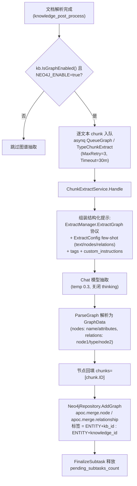
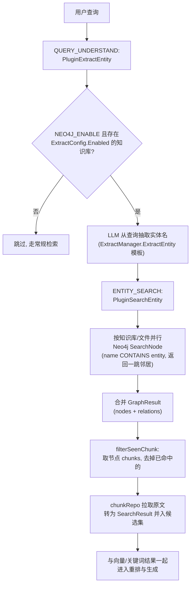

# 知识图谱

向量检索擅长找「意思相近的段落」，但不擅长回答「A 和 B 是什么关系」。知识图谱补的就是这一块：文档入库时用大模型把里面的实体和关系抽出来存成图，提问时顺着图多召回一批相关片段，一起交给模型作答。

适合关系密集的资料（人物、组织、产品线、合同条款之间互相牵扯），普通的问答场景开不开区别不大。代价是入库时要额外调大模型，且需要部署 Neo4j。

<Screenshot
  src="/screenshots/kg-graph.png"
  caption="知识图谱视图：实体与关系"
  hint="展示知识库图谱页签中的实体关系图，节点可点击查看关联文档。" />

图谱存储后端为 **Neo4j**（唯一实现，依赖 APOC 插件；代码中不存在 Nebula 等其他图数据库集成）。

## 开启配置

图谱功能需要**两级开关**同时满足：

### 1. 全局开关：Neo4j 环境变量

`NEO4J_ENABLE` 是知识图谱的唯一全局开关（`docker-compose.yml` 注释明确：`ENABLE_GRAPH_RAG` 自 v0.1.6 起已被 `NEO4J_ENABLE` 取代，Go 主应用不再读取）。

| 名称 | 类型 | 默认值 | 说明 |
|------|------|--------|------|
| `NEO4J_ENABLE` | string | 空（关闭） | 置为 `true` 启用图谱；`internal/container/container.go` 的 `initNeo4jClient` 与任务入队 / 检索管线都会检查它 |
| `NEO4J_URI` | string | `bolt://neo4j:7687` | Neo4j 连接地址 |
| `NEO4J_USERNAME` | string | `neo4j` | 用户名 |
| `NEO4J_PASSWORD` | string | `password` | 密码 |

`initNeo4jClient` 启动时最多重试 30 次（间隔 2s）建立并验证连接；未启用时返回 `nil` driver，此时 `Neo4jRepository` 的所有方法降级为 no-op（日志 `NOT SUPPORT RETRIEVE GRAPH`）。`GET /system` 信息接口通过 `getGraphDatabaseEngine()` 报告 `"Neo4j"` 或 `"Not Enabled"`（`internal/handler/system.go`）。

docker-compose 的 `neo4j` 服务预装 APOC：`NEO4JLABS_PLUGINS=["apoc"]`（图谱写入依赖 `apoc.merge.node` / `apoc.merge.relationship`，删除依赖 `apoc.periodic.iterate`）。

### 2. 知识库级开关：IndexingStrategy + ExtractConfig

`internal/types/knowledgebase.go`：

```go
// IsGraphEnabled checks if knowledge graph extraction is enabled.
// Requires both the IndexingStrategy flag and a valid ExtractConfig.
func (kb *KnowledgeBase) IsGraphEnabled() bool {
    return kb != nil && kb.IndexingStrategy.GraphEnabled &&
        kb.ExtractConfig != nil && kb.ExtractConfig.Enabled
}
```

- `IndexingStrategy.GraphEnabled`（`internal/types/indexing_strategy.go`）：知识库索引策略里的图谱开关，默认 `false`；旧字段 `ExtractConfig.Enabled` 会在读取时向 `IndexingStrategy.GraphEnabled` 单向同步（`knowledgebase.go` 635 行附近的 legacy sync）。
- `ExtractConfig`（`internal/types/knowledgebase.go`）承载抽取的 few-shot 配置：

| 名称 | 类型 | 默认值 | 说明 |
|------|------|--------|------|
| `enabled` | bool | false | 是否启用抽取 |
| `text` | string | 空 | few-shot 示例原文 |
| `tags` | []string | nil | 关系类型标签集合 |
| `nodes` | []*GraphNode | nil | 示例实体节点（name / attributes） |
| `relations` | []*GraphRelation | nil | 示例关系（node1 / node2 / type） |
| `custom_instructions` | string | 空 | 领域自定义抽取指令（追加进系统提示，结构化输出协议仍由系统控制） |

配置向导辅助 API（`internal/handler/initialization.go`，路由 `internal/router/router.go` 914-916 行）：

- `POST /initialization/extract/text-relation`（`ExtractTextRelations`）：对一段文本（≤5000 字符）按选定标签试跑关系抽取，用于预览效果；
- `POST /initialization/extract/fabri-text` / `fabri-tag`（`FabriText` / `FabriTag`）：让 LLM 生成示例文本 / 推荐标签，帮助用户快速搭建 `ExtractConfig`。

## 实体关系抽取流程（构建）

### 触发与任务编排

文档解析完成后，`internal/application/service/knowledge_post_process.go` 在增强扇出阶段对每个文本 chunk 计数（`eff.GraphEnabled` 时 `graphChunkCount = len(textChunks)`），并调用 `internal/application/service/extract.go` 的 `NewChunkExtractTask` 逐 chunk 入队：

```go
func NewChunkExtractTask(...) (bool, error) {
    if strings.ToLower(os.Getenv("NEO4J_ENABLE")) != "true" {
        logger.Warn(ctx, "NEO4J is not enabled, skip chunk extract task")
        return false, nil
    }
    ...
    task := asynq.NewTask(types.TypeChunkExtract, payload,
        asynq.Queue(types.QueueGraph), asynq.MaxRetry(3), asynq.Timeout(30*time.Minute))
    ...
}
```

任务走独立的 asynq `QueueGraph` 队列，每个 chunk 一次 LLM 调用（源码注释称其为"管线中最昂贵的增强扇出"），受模型级后台并发限流（limiter）约束；被取消 / 删除 / 被新解析尝试取代（`attemptSuperseded`）的任务会跳过执行并释放父任务的 `pending_subtasks_count` 计数。

### 抽取执行（ChunkExtractService.Handle）

`internal/application/service/extract.go`：

1. 加载 chunk、知识库与文件级 `ProcessOverrides`，用 `ResolveProcessConfig` 求出生效的 `ExtractConfig`（未启用则跳过）。
2. 组装结构化提示模板：系统协议部分来自 `config.ExtractManager.ExtractGraph`（`config/config.yaml` 的 `extract.extract_graph`，一个包含实体抽取 + 属性丰富 + 关系抽取步骤的多步指令），叠加知识库的 `custom_instructions`、`tags` 与 `ExtractConfig` 的 few-shot 示例（`Text/Nodes/Relations`）。
3. `chatpipeline.NewExtractor(chatModel, template).Extract(ctx, chunk.Content)` 调用 Chat 模型（`temperature 0.3`、`max_tokens 4096`、关闭 thinking），由 `Formater.ParseGraph` 解析为 `types.GraphData`（`internal/types/extract_graph.go`）：

```go
type GraphNode struct {
    Name       string   `json:"name,omitempty"`
    Chunks     []string `json:"chunks,omitempty"`
    Attributes []string `json:"attributes,omitempty"`
}
type GraphRelation struct {
    Node1 string `json:"node1,omitempty"`
    Node2 string `json:"node2,omitempty"`
    Type  string `json:"type,omitempty"`
}
```

4. 为每个节点回填 `node.Chunks = []string{chunk.ID}`，然后 `graphEngine.AddGraph(ctx, NameSpace{KnowledgeBase, Knowledge}, ...)` 写入 Neo4j。
5. 全程有 SpanTracker 追踪（`postprocess.graph.chunk[i]` 子 span，记录 nodes/relations 数量与样例）。

### 存储后端：Neo4j

`internal/application/repository/retriever/neo4j/repository.go` 实现 `interfaces.RetrieveGraphRepository`（`AddGraph` / `DelGraph` / `SearchNode`）：

- **命名空间即标签**：`NameSpace{KnowledgeBase, Knowledge}` 映射为节点标签 `ENTITY<kb_id>`、`ENTITY<knowledge_id>`（连字符替换为下划线），节点属性含 `name`、`kg`（knowledge_id）、`attributes`、`chunks`。
- 写入用 APOC 幂等合并，同名实体的 `chunks` 做并集：

```cypher
UNWIND $data AS row
CALL apoc.merge.node(row.labels, {name: row.name, kg: row.knowledge_id}, row.props, {}) YIELD node
SET node.chunks = apoc.coll.union(node.chunks, row.chunks)
```

- 删除知识 / 知识库时（`knowledge_delete.go`、`knowledgebase.go`）调用 `DelGraph`，用 `apoc.periodic.iterate` 按 1000 批并行删边删点。

## 检索时的图谱增强（GraphRAG）

传统聊天管线（`internal/application/service/chat_pipeline`）中有两个插件：

1. **PluginExtractEntity**（`extract_entity.go`，挂在 `QUERY_UNDERSTAND` 事件）：`NEO4J_ENABLE=true` 时，先筛出 `ExtractConfig.Enabled` 的知识库（存入 `chatManage.EntityKBIDs` / `EntityKnowledge`），再用 `ExtractManager.ExtractEntity` 模板 + Chat 模型从**用户查询**里抽取实体名，存入 `chatManage.Entity`。
2. **PluginSearchEntity**（`search_entity.go`，挂在 `ENTITY_SEARCH` 事件）：对每个启用图谱的知识库 / 文件并行调用 `graphRepo.SearchNode`——Cypher 用 `n.name CONTAINS nodeText` 模糊匹配实体并返回一跳邻居与关系，合并为 `chatManage.GraphResult`；随后 `filterSeenChunk` 取出图谱节点携带的 `chunks`（去掉向量检索已命中的），从 `chunkRepo` 拉取原文并转换为 `SearchResult` 并入候选集，实现"实体 → 关联 chunk"的图谱补充召回。

Agent 模式则提供 `query_knowledge_graph` 工具（`internal/agent/tools/query_knowledge_graph.go`）：校验各知识库是否配置了图谱（`ExtractConfig.Nodes/Relations` 非空），并发对多库执行检索、按 chunk 去重排序，输出中附带各库的图谱配置状态（实体类型 / 关系类型清单）；未配置图谱的库回落为普通混合检索结果。

## 流程图

### 构建流程



### 查询流程



## 可视化

- **Mermaid 图生成**：`internal/application/service/graph.go` 的 `graphBuilder` 是 `types.GraphBuilder` 接口的内存版实现（LLM 抽实体 → 抽关系 → PMI×0.6 + Strength×0.4 计算关系权重并归一到 1-10 → 计算实体度数 → 构建 chunk 关联图），其 `generateKnowledgeGraphDiagram` 用 DFS 找连通分量并输出 Mermaid `graph TD` 子图（高频实体高亮、强度 >7 的关系用粗箭头）。注意：`NewGraphBuilder` 目前没有被容器装配调用（仓库内无其他引用），属于独立/遗留的图构建与可视化实现；生成的 Mermaid 图输出到日志。
- **对外 API**：知识图谱本身没有专门的可视化 REST 端点；`query_knowledge_graph` 工具的结构化输出（`graph_configs`、结果列表）供 Agent 前端渲染。`GET /wiki/graph`（`wikiHandler.GetGraph`）是 Wiki 功能自己的图接口，与本文的实体关系图谱无关。
- **prompt 模板**：`config/prompt_templates/graph_extraction.yaml` 提供 `default_extract_entities` 等模板（实体类型枚举 Person/Organization/Location/... 与 JSON 输出协议），经 `internal/config/config.go` 的 `extract_entities_prompt_id` / `extract_relationships_prompt_id` 解析进 `Conversation.ExtractEntitiesPrompt` / `ExtractRelationshipsPrompt`，供上述内存版 `graphBuilder` 使用；生产异步抽取路径使用的是 `config.yaml` 中 `extract.extract_graph` / `extract.extract_entity` 模板（`ExtractManagerConfig`）。
