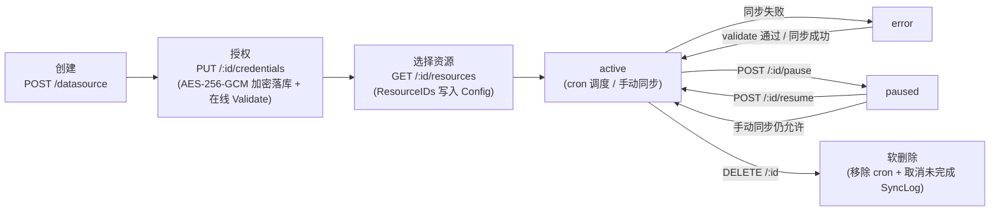
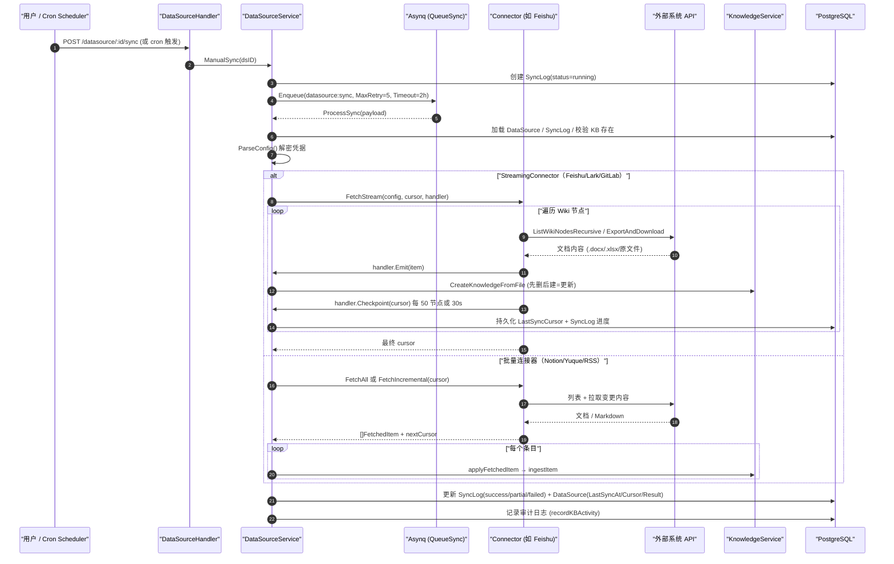

# 数据源导入（Data Source）

数据源将飞书、Notion、语雀等平台的内容持续同步到知识库。连接建立后，可按计划获取新增与修改；来源删除的内容按同步配置处理。

数据源在知识库中配置。打开目标知识库的编辑设置，进入「数据源」页签，新建连接并填写凭据，然后选择同步范围与周期。首次同步获取完整内容，后续同步根据连接器能力增量更新。

<Screenshot
  src="/screenshots/datasource-sync.png"
  caption="数据源：连接列表与同步状态"
  hint="展示已配置的数据源（类型、目标知识库、上次同步时间、状态）与同步日志入口。" />

连接器读取外部内容，调度器触发同步，服务层完成变更比较和知识入库。

## 建立连接并同步

1. 以空间管理员身份打开目标知识库的「数据源」设置。
2. 选择连接器，填写凭据并测试连接，确认能够列出所需资源。
3. 选择同步范围与周期，保存后发起首次同步。
4. 查看同步状态与日志，确认新增、更新、跳过和失败内容符合预期。

凭据更新需要提交完整配置，系统会在线验证。暂停数据源可停止后续计划同步；恢复后重新注册调度。

## 选择连接器

飞书、Lark、Notion 和语雀用于同步协作文档，GitLab 用于同步仓库中的文档目录，IMA 用于同步可访问的知识库与笔记，RSS 用于订阅文章。各连接器支持的格式、认证与删除检测见参考部分。

## 检查变更与失败

首次同步获取选定范围的内容，后续按连接器游标和修改信息更新。删除检测受连接器与同步配置约束；RSS 的自然淘汰不作为源文档删除。同步失败时先查看日志中的凭据、资源可见性或解析错误，再测试连接并重试。

## 连接器与接口参考

### 连接器实现详解

#### 连接器能力对比

| | Feishu / Lark | Notion | Yuque（语雀） | RSS / Atom |
| --- | --- | --- | --- | --- |
| 源码目录 | `internal/datasource/connector/feishu/` | `connector/notion/` | `connector/yuque/` | `connector/rss/` |
| 类型标识 | `feishu` / `lark` | `notion` | `yuque` | `rss` |
| 认证方式 | 企业自建应用 `app_id` + `app_secret`（tenant_access_token） | Internal Integration Token（`api_key`） | 个人/团队 Token（`api_token`，`X-Auth-Token` 头） | 无认证或自定义请求头（`auth_headers`） |
| 凭据字段 | `app_id`、`app_secret`、`base_url`（可选覆盖） | `api_key`（`base_url` 走 Settings） | `api_token`、`base_url`（私有化部署可选） | `auth_headers`（可选，属凭据）；`feed_urls` 属 Settings |
| 资源模型 | Wiki 空间 → 节点树（懒加载，`spaceID:nodeToken` 复合 ID） | 页面/数据库全量树（一次返回带 parent 关系） | 知识库（book/repo）扁平列表 | 每个 feed URL 一个资源（扁平） |
| 内容格式 | 导出 API → `.docx`/`.xlsx` 文件；drive 文件原样下载 | Block → Markdown；数据库转 Markdown 表格；附件下载 | `body` Markdown 原文（`.md`） | Readability 全文抽取 → HTML→Markdown |
| 增量机制 | 按内容 `obj_edit_time` 比对（cursor: `SpaceNodeTimes`） | 按页面/记录 `last_edited_time` 比对（cursor: `PageEditTimes`） | 按文档 `content_updated_at` 比对（cursor: `BookDocTimes`） | feed 信号指纹 + 内容 SHA-256 指纹双层比对 |
| 删除检测 | 支持（游标中有、当前树没有 → `IsDeleted`；部分列举失败时跳过删除检测） | 支持（区分"源端已删"与"用户取消勾选"，后者不报删除） | 支持 | 不支持（feed 天然滚动淘汰旧条目） |
| 流式可恢复同步 | 是（`StreamingConnector`，每 50 节点或 30 秒 checkpoint） | 否 | 否 | 否 |
| 限流应对 | 429 读 `Retry-After` + 指数退避（2s/4s/8s，最多 3 次重试）；5xx 重试 | — | 每次 `GetDocDetail` 间隔 300ms（个人 token 约 100 req/5min） | — |
| 部分失败 | 单文档失败生成带错误 metadata 的占位条目，继续同步 | 单页失败记日志跳过 | 单文档失败生成占位条目 | 单 feed 失败 → `PartialFetchError`；全部失败才算 fail |

#### Feishu / Lark（`connector/feishu/`）

飞书与 Lark（国际版 open.larksuite.com）是部署在两朵隔离云上的同一产品，Wiki/docx/drive API 完全一致，因此**共用同一份连接器代码**，由 `region.go` 中的 `Region` 结构选择云端（`RegionFeishu` / `RegionLark`，分别对应类型 `feishu` / `lark`、API 域名 `open.feishu.cn` / `open.larksuite.com`）。`base_url` 凭据字段可显式覆盖（兼容历史上把 feishu 连接器指向 larksuite 的存量数据源）。

- **认证**（`client.go`）：`POST /open-apis/auth/v3/tenant_access_token/internal` 换取 tenant_access_token，带互斥锁缓存与过期刷新。
- **资源列举**（`ListResources`）：三级懒加载——`parentID==""` 列 Wiki 空间；`parentID==spaceID` 列空间顶层节点；`parentID=="spaceID:nodeToken"` 列该节点子节点。早期版本会预先递归整棵树，大 Wiki 会超时（issue #1672），现在递归只发生在同步时。`ResolveResourceAncestors` 通过 `GetWikiNode` 的 `parent_node_token` 逐级上溯，O(depth) 回显深层勾选。
- **内容抓取**（`fetchNodeContent`）按 `obj_type` 分派：
  - `docx`/`doc` → 异步导出 API（`POST /drive/v1/export_tasks`）导出 `.docx`；
  - `sheet`/`bitable` → 导出 `.xlsx`；
  - `file` → drive 原文件下载（PDF/Word/图片等）；
  - `mindnote`/`slides` → **跳过**（无内容读取 API），并通过 `fetchTally` 统计输出 `discovered/fetched/failed/skipped_unsupported by_type` 摘要日志，解释"发现 13 篇为何只同步了 3 篇"（issue #2136）。
- **增量逻辑**：游标 `feishuCursor.SpaceNodeTimes`（`resourceID → nodeToken → editTime`）。变更判定用 `obj_edit_time`（文档内容编辑时间），而**不是** `node_edit_time`（只反映改标题/挪位置）。抓取失败的节点**不推进游标**（保留旧 editTime，下次必然 prev != current 而重试），避免瞬时导出失败导致文档被永久跳过。
- **FetchStream**：统一全量/增量路径（cursor==nil 即全量），每处理 `feishuStreamCheckpointInterval = 50` 个节点、或距上次 checkpoint 超过 `feishuStreamCheckpointMaxInterval = 30s` 就落盘一次游标——后者兜底"少量文档但每篇导出都极慢（被限流）"导致 2 小时超时前从未 checkpoint 的场景。
- **错误分类**（`feishuFailure`）：把原始错误归类为稳定 i18n code（`feishu_auth_or_permission` / `feishu_rate_limited` / `feishu_timeout` / `feishu_server_unavailable` / `feishu_api_error`(+code) / `sync_failed`），前端本地化展示；原始 status/body/log_id 只留在服务端日志。

#### GitLab（`connector/gitlab/`）

在数据源中选 GitLab，填写 credentials.base_url 与 access_token，然后选择项目、分支或标签及目录。Token 必须能读取所选项目的仓库；私有项目的可见性由 GitLab 凭据决定。

`config.settings.projects` 为非空数组，每项包含字符串 project_id、可选 ref 和 paths。ref 留空使用默认分支；paths 留空选整个仓库，目录使用相对路径与正斜杠。先验证凭据并浏览资源，再保存定时同步。

流式同步支持恢复检查点；增量通过仓库提交差异更新文件，源端删除按 sync_deletions 处理。选择的仓库文件仍经过 WeKnora 文件类型、大小与解析引擎校验，并非所有代码或二进制文件都可直接入库。

```json
{"credentials":{"base_url":"https://gitlab.example.com","access_token":"<token>"},"settings":{"projects":[{"project_id":"123","ref":"main","paths":["docs"]}]}}
```

#### 腾讯 IMA（`connector/ima/`）

填写 credentials.client_id 和 api_key；base_url 可选，默认 `https://ima.qq.com`。资源树列出该凭据可见的 IMA 知识库与目录，选择结果保存为 config.resource_ids。源端授权失败或资源不可见时，先检查 IMA 凭据及知识库访问权。

可下载文件进入文档解析，网页类按 URL 获取；笔记通过 note OpenAPI 读取正文。AI 会话和视频解析没有可用正文读取入口，会被跳过。支持全量与增量同步：按知识库、父目录和标题建立稳定身份，同名文件替换后 media_id 改变会触发更新；完整列举成功后才检测删除。

```json
{"credentials":{"client_id":"<client-id>","api_key":"<api-key>"},"resource_ids":["<resource-id-from-tree>"]}
```

飞书/Lark 同步记录的更新时间取内容编辑时间，避免仅凭 Wiki 节点操作时间遗漏正文变化。GitLab 与 IMA 都支持删除检测；RSS 的自然滚动淘汰不视为删除。

#### Notion（`connector/notion/`）

- **认证**：Internal Integration Token（凭据字段 `api_key`），API 版本 `NotionAPIVersion = "2026-03-11"`，默认 `https://api.notion.com`（`Settings.base_url` 可覆盖）。
- **资源列举**：Search API 一次拉取全部可见页面与数据库，返回带 `ParentID` 的完整树（因此 `parentID != ""` 的懒加载请求直接返回空；`ResolveResourceAncestors` 亦无需额外处理）。`resolveParentID` 处理 2025-09-03+ API 的 `data_source` 对象：其 `parent` 指向数据库容器，真实工作区位置要看 `database_parent`。
- **抓取**：`fetchPage` 递归处理页面——`GetBlockChildrenAll` 拉块 → `BlocksToMarkdown`（`markdown.go`）转 Markdown；`file_upload` 型文件块先 `ResolveBlock` 换临时下载 URL；**附件**（PDF 等，图片除外——图片已以 `` 内联在 Markdown 中）作为独立条目下载入库；`child_page` / `child_database` 块递归下钻。数据库两种形态：整库渲染成一张 Markdown 表格（`buildDatabaseItem`，含每条记录的块内容附录），数据库记录单独出现时按"属性列表 + 块内容"渲染（`buildRecordItem`）。属性提取 `propertyToString` 通用地跟随 `type` 链，覆盖全部 22 种属性类型；属性名按字母序排序保证增量比对的确定性。
- **增量逻辑**：首次同步（游标为空）直接委托 `FetchAll` 并用返回条目的 `UpdatedAt` 构建游标；后续同步 `discoverAllResources` 用 Search API + BFS 圈定选中根下的全部后代，逐页比对 `last_edited_time`。数据库走 `fetchDatabaseIncremental`：任一记录变更就整表重建。
- **删除与取消勾选的区分**：源端消失的页面报 `IsDeleted`；仍可见但因用户取消勾选祖先而不再可达的页面进入 excluded 集合，**不会**被误报为删除。`computeExcludedSet` 同时保证"用户从未见过的新页面"不被排除——选中的父节点仍会自动带上新子页面。

#### Yuque 语雀（`connector/yuque/`）

- **认证**：个人 Token（语雀设置 → Token）或团队 Token，凭据字段 `api_token`（请求头 `X-Auth-Token`）+ 可选 `base_url`（企业私有化域名，缺 scheme 自动补 `https://`）。
- **资源列举**：`GET /api/v2/user` 判断 token 身份——`type=="Group"` 为团队 token，直接列团队 repo；否则列个人 repo + 已加入 group 的 repo（用户未加入任何 group 时语雀返回 404，按空处理）。输出扁平的 `book` 资源列表，按 ExternalID 稳定排序。
- **抓取**（`walk`，全量/增量共用）：`ListBookDocs` 列文档 → 过滤 `type != "Doc"`（跳过 Sheet/Thread/Board/Table）与 `status != "1"`（跳过草稿）→ 每次 `GetDocDetail` 之间 sleep 300ms 规避限流 → `format` 为 `markdown`/`lake` 时取 `body` Markdown 原文入库（其他格式如 html 防御性跳过并记 `skip_reason`）。
- **增量逻辑**：游标 `yuqueCursor.BookDocTimes`（`bookID → docID → content_updated_at`），一致则跳过。删除检测：游标里有、当前列表没有 → `IsDeleted`。

#### RSS / Atom（`connector/rss/`）

- **配置**：`feed_urls`（换行/逗号分隔，多条去重）存放在 **Settings**（非机密，UI 可直接编辑）；`auth_headers`（`Name: Value` 每行一条，仅附加在 feed 请求上、绝不发给第三方文章页）存放在 **Credentials** 并加密。`HasConfiguredCredentials` 对 RSS 特判：只有 `auth_headers` 才算已配置凭据。
- **抓取**：`gofeed` 解析 RSS/Atom/JSON feed；条目有链接时抓原文页过 readability 抽取器，成功则以全文为准，失败回退 feed 自带内容（`content:encoded`/`description`）；HTML 经 `html-to-markdown/v2` 转 Markdown。条目 ID 取 `GUID > Link > Title` 第一个非空值。
- **增量逻辑**：双层指纹——先比 feed 侧信号指纹（`feedSignalFingerprint`，未变则连原文页都不抓）；再比抓取后内容的 SHA-256 指纹。**不支持删除同步**（feed 会自然淘汰旧条目）。
- **部分失败**：单个 feed 抓取/解析失败时沿用旧游标（`copyFeedCursor`）并继续其余 feed，最终以 `datasource.PartialFetchError` 上报（SyncLog 记 `partial`）；全部 feed 都失败才整体报错。

### 数据源生命周期与 REST API

路由注册在 `internal/router/router.go` 的 `RegisterDataSourceRoutes`（读操作 Viewer+，写操作 Admin+）：

| 方法与路径 | 权限 | 说明 |
| --- | --- | --- |
| `GET /api/v1/datasource/types` | Viewer | 可用连接器元数据列表（`ListAvailableConnectors`，按 Priority 排序） |
| `POST /api/v1/datasource/validate-credentials` | Admin | 用裸凭据测试连通性（不落库），供创建向导的"测试连接"按钮 |
| `POST /api/v1/datasource` | Admin | 创建数据源（校验 KB 归属租户 → 校验连接器类型 → 在线 Validate → 落库 → 注册 cron） |
| `GET /api/v1/datasource?kb_id=` | Viewer | 按知识库列出数据源（附带最近一次 SyncLog） |
| `GET /api/v1/datasource/:id` | Viewer | 详情 |
| `PUT /api/v1/datasource/:id` | Admin | 更新（凭据字段被忽略；配置实际变化且已有凭据时才触发在线校验；同步更新 cron） |
| `DELETE /api/v1/datasource/:id` | Admin | 软删除 + 移除 cron + 取消 pending/running 的 SyncLog |
| `PUT /api/v1/datasource/:id/credentials` | Admin | 原子替换凭据（见[凭据加密存储](#凭据加密存储)） |
| `DELETE /api/v1/datasource/:id/credentials/:field` | Admin | 清空凭据（field 只接受 `credentials`） |
| `POST /api/v1/datasource/:id/validate` | Admin | 对已存数据源做连接测试；失败置 `status=error`，成功清除 error 状态 |
| `GET /api/v1/datasource/:id/resources?parent_id=` | Viewer | 列出外部系统可选资源（parent_id 支持懒加载展开） |
| `POST /api/v1/datasource/:id/resource-ancestors` | Viewer | 解析选中资源的祖先链（编辑时回显深层勾选） |
| `POST /api/v1/datasource/:id/sync` | Admin | 手动触发同步（创建 SyncLog + 入队 Asynq 任务） |
| `POST /api/v1/datasource/:id/pause` / `resume` | Admin | 暂停/恢复（同时移除/重挂 cron） |
| `GET /api/v1/datasource/:id/logs`、`GET /api/v1/datasource/logs/:log_id` | Viewer | 同步历史 |

所有 `:id` 路径都先经 `getOwnedDataSource` → `getOwnedKnowledgeBase` 做**租户隔离**校验（数据源归属的 KB 必须属于当前租户，且通过 API Key 的 KB 授权检查）。

生命周期状态流转：



## 同步与存储参考

### 同步调度（internal/datasource/scheduler.go）

`Scheduler` 基于 `robfig/cron`（`cron.WithSeconds()`，支持秒级 6 段表达式）为每个配置了 `SyncSchedule` 的 active 数据源维护一个 cron entry；服务启动时 `Start()` 从 DB 加载全部 active 数据源批量注册。

由于 robfig/cron 按**绝对墙钟时间**触发（例如 `0 0 * * * *` 总在整点触发），多实例部署时所有实例会同时触发。去重靠两层机制：

1. **DB 层防重叠**：`syncLogRepo.HasRunningSync` —— 上一次同步还在 running 就跳过本次（防止同步耗时超过 cron 间隔时叠加执行）。
2. **Redis 层跨实例去重**：确定性的 `asynq.TaskID = "dssync:<dsID>:<yyyyMMddHHmm>"`（按分钟截断）。同一分钟内所有实例产生相同 TaskID，Redis 保证只有一个入队成功，其余得到 `asynq.ErrTaskIDConflict`，对应 SyncLog 标记为 `canceled`（"deduplicated: another instance enqueued first"）。

入队参数：队列 `types.QueueSync`、`MaxRetry(5)`、`Timeout(2*time.Hour)`。任务类型为 `types.TypeDataSourceSync`（`"datasource:sync"`），由 `internal/router/task.go` 中 `mux.HandleFunc(types.TypeDataSourceSync, params.DataSourceService.ProcessSync)` 消费。

### 同步执行与知识入库（datasource_service.go）

`ProcessSync` 是 Asynq 任务处理器，完整流程见下方时序图。要点：

- **防御性取消**：数据源或知识库已被删除时，把 SyncLog 置为 `canceled` 并返回 nil（不再重试）。
- **两条抓取路径**：连接器实现了 `StreamingConnector` 走 `processSyncStreaming`（流式）；否则按 `ForceFull || SyncMode==full` 走 `FetchAll`，或带上 `ParseSyncCursor()` 的游标走 `FetchIncremental`（批量）。
- **流式路径的游标策略**（`streamStartCursor`）：用户触发的全量同步在**首次尝试**时丢弃游标全量抓取；Asynq **重试**（attempt > 0）以及所有增量同步都从最后一个 checkpoint 续传。
- **入库核心 `applyFetchedItem` → `ingestItem`**：
  - `IsDeleted=true` 且 `sync_deletions=true` 时，按租户、知识库、数据源 ID 和 external_id 查找并真实删除对应知识；关闭同步删除则保留已有知识。删除能力还取决于连接器是否提供可靠的删除检测；
  - 有 `Content` 字节 → 包装成 `multipart.FileHeader` 走 `KnowledgeService.CreateKnowledgeFromFile`（完整文档解析流水线）；只有 `URL` → 走 `CreateKnowledgeFromURL` 由 WeKnora 下载解析；
  - **更新 = 先删后建**：按 metadata `external_id` 查到既有知识条目就先 `DeleteKnowledge` 再重建，计为 Updated；
  - 重复文件（`DuplicateKnowledgeError`）计为 Skipped，不算失败；
  - 每个条目自动带上 metadata：`external_id`、`source_resource_id`、`datasource_id` 以及连接器附加的 metadata。若源端提供时间，还保存 UTC RFC3339 格式的 `source_created_at` / `source_updated_at`；它们表示源文档时间，与 WeKnora 的 created_at/updated_at 分开。
- **自动打标**：`resolveAutoTagIDs` 按数据源名称在目标 KB 中 FindOrCreate 一个标签，所有同步条目自动挂上，便于在 KB 中识别来源；打标失败不阻断同步。
- **结果状态**：全部条目失败 → `failed`（`allFetchedItemsFailedError`）；RSS 部分 feed 失败（`PartialFetchError`）或流式路径存在失败文档 → `partial`；其余 → `success`。失败样本以 `SyncItemError` 形式最多保留 100 条。
- 抓取失败时若连接器返回了新游标（如 RSS），仍会持久化游标，避免瞬时故障后被迫全量重抓。



### 凭据加密存储

凭据在写入、读取和 API 返回时分别处理：

**1. 写入时加密 —— `DataSourceConfig.ToJSON()`**（`internal/types/datasource.go`）：

```go
// 当配置了 SYSTEM_AES_KEY 时，Credentials 中的每个字符串值在序列化前
// 都会做 AES-256-GCM 加密。这是凭据进入 DB 的唯一写路径（GORM 的 JSON
// 类型本身是字节透传），因此在这里加密即可保证 DataSource.Config 落库全程密文。
if key := utils.GetAESKey(); key != nil && len(out.Credentials) > 0 {
    ...
    if enc, err := utils.EncryptAESGCM(s, key); err == nil { encCreds[k] = enc }
}
```

**2. 读取时解密 —— `DataSource.ParseConfig()`**：透明处理三种情况——空串原样返回；无 `enc:v1:` 前缀的历史明文原样返回（免迁移）；密文用 `SYSTEM_AES_KEY` 解密。解密失败（密钥丢失/轮转）时将对应凭据字段置空，UI 显示"凭据未配置"，用户重填即可，不会丢失数据源其他配置。

**3. 独立的凭据子资源 —— `internal/handler/datasource_credentials.go`**：凭据不走普通的 `PUT /datasource/:id`，而是独立的 `/credentials` 子资源，采用整体原子替换，确保连接器一次获得完整凭据：

- `PUT /api/v1/datasource/:id/credentials` — 整体替换凭据 map，替换后立即调用连接器 `Validate` 做在线校验（凭据无效时立即返回错误）
- `DELETE /api/v1/datasource/:id/credentials/credentials` — 整体清空
- 响应中**永远不回传密文/明文**，只返回 `{"credentials": {"configured": true/false}}`；列表/详情接口经 `dto.NewDataSourceResponse` 序列化时也从构造上剥离 `Credentials`

普通更新接口 `UpdateDataSource`（`datasource_service.go`）会**强制保留库中已存凭据**，即使请求体里带了 credentials 也被忽略并打警告日志。另外 `StripNonSecretCredentials` 会把误放进 credentials 的非机密字段清出去（目前只有 RSS 的 `feed_urls`，它属于 `Settings`）。

### 安全限制（internal/datasource/httpclient.go 与 errors.go）

`httpclient.go` 提供两个所有连接器共用的 SSRF 防护入口：

```go
// ValidateConnectorBaseURL 对连接器 base_url 做 SSRF 策略校验（空值放行，由调用方套默认值）
func ValidateConnectorBaseURL(rawURL string) error {
    ...
    if err := utils.ValidateURLForSSRF(url); err != nil { ... }
}

// NewConnectorHTTPClient 返回带重定向与拨号期 SSRF 防护的 HTTP 客户端
func NewConnectorHTTPClient(timeout time.Duration) *http.Client {
    cfg := utils.DefaultSSRFSafeHTTPClientConfig()
    cfg.Timeout = timeout
    return utils.NewSSRFSafeHTTPClient(cfg)
}
```

底层 `internal/utils/security.go` 会拒绝私网地址、回环地址、link-local 等目标，并且在**每次重定向和实际拨号时**重新校验（而非只校验初始 URL），防止恶意 feed 或自定义 base_url 把 WeKnora 引向内网服务。各连接器的 `parseXXXConfig` 都会对 base_url 调用 `ValidateConnectorBaseURL`。

`errors.go` 定义了模块级哨兵错误（`ErrConnectorNotFound`、`ErrDataSourceInvalid`、`ErrInvalidCredentials`、`ErrSyncFailed` 等）与 `PartialFetchError`（部分资源成功、部分失败；调用方应处理已得条目、持久化游标、把 `Details` 以 partial 状态呈现给用户）。

### 核心抽象：Connector 接口

所有连接器必须实现 `internal/datasource/connector.go` 中的 `Connector` 接口：

```go
type Connector interface {
    // Type 返回连接器类型标识（如 "feishu"、"notion"）
    Type() string
    // Validate 通过实际调用外部 API 验证配置与凭据有效性
    Validate(ctx context.Context, config *types.DataSourceConfig) error
    // ListResources 列出可同步的资源（文档、空间、文件夹等）。
    // parentID 支持层级资源的懒加载：""=顶层；非空=该资源的直接子节点
    ListResources(ctx context.Context, config *types.DataSourceConfig, parentID string) ([]types.Resource, error)
    // ResolveResourceAncestors 解析已选资源的祖先链，用于懒加载选择器回显深层选中项
    ResolveResourceAncestors(ctx context.Context, config *types.DataSourceConfig, resourceIDs []string) ([]string, error)
    // FetchAll 全量同步指定资源
    FetchAll(ctx context.Context, config *types.DataSourceConfig, resourceIDs []string) ([]types.FetchedItem, error)
    // FetchIncremental 基于游标增量同步，返回变更项与下一次同步的新游标
    FetchIncremental(ctx context.Context, config *types.DataSourceConfig, cursor *types.SyncCursor) ([]types.FetchedItem, *types.SyncCursor, error)
}
```

#### 可选扩展：StreamingConnector（流式可恢复同步）

`StreamingConnector` 支持逐条抓取、入库并保存游标，适用于大规模同步，减少一次性缓存全部内容的内存占用：

```go
type StreamHandler interface {
    // Emit 逐条入库一个抓取项；返回错误则中止整个流
    Emit(ctx context.Context, item types.FetchedItem) error
    // Checkpoint 同步持久化游标快照（必须是完整可恢复的快照，而非增量）
    Checkpoint(ctx context.Context, cursor *types.SyncCursor) error
}

type StreamingConnector interface {
    Connector
    FetchStream(ctx context.Context, config *types.DataSourceConfig,
        cursor *types.SyncCursor, h StreamHandler) (*types.SyncCursor, error)
}
```

任务超时后可从最近的 checkpoint 继续处理。Asynq 同步任务超时为 2 小时，流式路径按条目推进，避免缓存全部文件正文。Feishu/Lark 和 GitLab 连接器均实现了 `StreamingConnector`。

#### ConnectorRegistry：注册与查找

`ConnectorRegistry` 是简单的 `map[string]Connector` 注册表。实际注册发生在 `internal/container/container.go` 的 `initConnectorRegistry()`：

```go
registry.Register(feishuConnector.NewConnector(feishuConnector.RegionFeishu))  // feishu
registry.Register(feishuConnector.NewConnector(feishuConnector.RegionLark))    // lark（国际版，同一实现不同 Region）
registry.Register(notionConnector.NewConnector())                              // notion
registry.Register(yuqueConnector.NewConnector())                               // yuque
registry.Register(rssConnector.NewConnector())                                 // rss
registry.Register(gitlabConnector.NewConnector())                              // gitlab
registry.Register(imaConnector.NewConnector())                                 // ima
```

> 注意：`connector.go` 中的 `ConnectorMetadataRegistry` 为前端展示定义了更多连接器元数据（Confluence、GitHub、Google Drive、OneDrive、DingTalk、Web Crawler、Slack、IMAP 等），但**当前代码库中实际注册可用的连接器有 7 个类型：`feishu`、`lark`、`notion`、`yuque`、`rss`、`gitlab`、`ima`**（其中 feishu/lark 共用同一份实现）。未注册类型在创建数据源时会被 `connectorRegistry.Get()` 以 `ErrConnectorNotFound` 拒绝。

### 数据模型（internal/types/datasource.go）

| 结构 | 说明 |
| --- | --- |
| `DataSource` | 数据源配置实体（表 `data_sources`）。关键字段：`Type`（连接器类型）、`Config`（JSONB，含加密凭据）、`SyncSchedule`（cron 表达式）、`SyncMode`（`incremental`/`full`）、`Status`（`active`/`paused`/`error`/`deleted`）、`ConflictStrategy`、`SyncDeletions`、`LastSyncCursor`（增量游标 JSONB）、`LastSyncAt`、`LastSyncResult`、`SyncLogRetentionDays` |
| `SyncLog` | 单次同步执行记录（表 `sync_logs`）。状态：`running`/`success`/`partial`/`failed`/`canceled`；计数：`ItemsTotal/Created/Updated/Deleted/Skipped/Failed`；`Result` 保存 `SyncResult` JSON |
| `DataSourceConfig` | 解密后的配置结构：`Type` + `Credentials map[string]interface{}` + `ResourceIDs []string`（选中的资源）+ `Settings map[string]interface{}`（非机密配置） |
| `Resource` | 外部系统的可选资源：`ExternalID`、`Name`、`Type`、`URL`、`ParentID`、`HasChildren`、`ModifiedAt`、`Metadata` |
| `FetchedItem` | 单个抓取到的文档：`ExternalID`、`Title`、`Content []byte`、`ContentType`、`FileName`、`URL`、`UpdatedAt`、`Metadata`、`IsDeleted`、`SourceResourceID` |
| `SyncCursor` | 增量游标：`LastSyncTime` + `ConnectorCursor map[string]interface{}`（连接器自定义结构） |
| `SyncResult` | 同步结果汇总 + `Errors []SyncItemError`（失败样本，上限 100 条，见 `maxSyncResultErrors`） |
| `SyncItemError` | 面向用户的失败样本：稳定的 i18n `Code` + 插值 `Params` + 兜底 `Message`；原始 API 状态码/响应体只留在服务端日志 |
| `DataSourceSyncPayload` | Asynq 任务载荷：`DataSourceID`、`TenantID`、`SyncLogID`、`ForceFull`、`Trigger`（`manual`/`schedule`） |

## 参考

- 连接器开发指南（随代码维护）：`internal/datasource/CONNECTOR_IMPLEMENTATION_GUIDE.md`
- 模块说明（随代码维护）：`internal/datasource/README.md`

## 实现参考

- 连接器框架与实现：`internal/datasource/`（`connector.go`、`scheduler.go`、`httpclient.go`、`errors.go`、`connector/` 各实现）
- HTTP 接口层：`internal/handler/datasource.go`、`internal/handler/datasource_credentials.go`
- 业务服务层：`internal/application/service/datasource_service.go`
- 数据模型：`internal/types/datasource.go`
