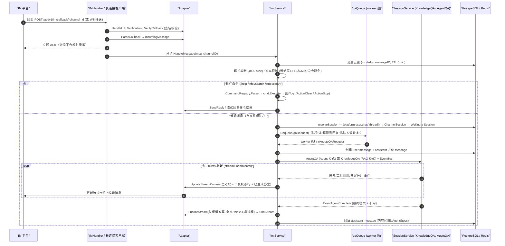
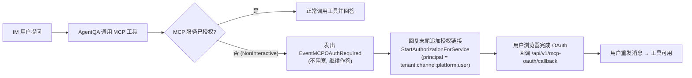

# IM 集成（IM Integration）

让同事用上知识库最省事的方式，往往不是让他们打开一个新网站，而是把机器人放进他们已经在用的聊天工具里。IM 集成就是干这件事：在企业微信、飞书、钉钉、Slack、Telegram 等平台里 @ 机器人提问，WeKnora 走同一套 RAG / Agent 流水线作答。

配置路径：「设置 → IM 集成」新建渠道 → 选平台 → 填该平台的应用凭据 → 绑定一个 Agent（决定用哪些知识库、开不开联网）→ 启用。Webhook 模式需要把回调地址填回平台后台，长连接模式不需要公网地址。

<Screenshot
  src="/screenshots/im-channels.png"
  caption="IM 渠道配置：平台、凭据与绑定的 Agent"
  hint="展示渠道列表与某个渠道的配置表单（平台类型、凭据、绑定 Agent、回调地址）。" />

用户在群里还能直接发文件给机器人入库，机器人也支持 `/help` 之类的内置命令，细节见下文。相关代码：

- 核心框架与编排：`internal/im/`（`adapter.go`、`service.go`、`supervisor.go`、`command*.go`、`qaqueue.go`、`session/stream/think/tool_display` 等）
- 各平台适配器：`internal/im/{wecom,feishu,dingtalk,slack,telegram,mattermost,wechat,qqbot,yunzhijia}/`
- HTTP 接口层：`internal/handler/im.go`
- 路由：`internal/router/router.go` 的 `RegisterIMRoutes` / `RegisterIMChannelRoutes`

## 架构总览

### Adapter 接口（internal/im/adapter.go）

每个平台适配器实现统一的 `Adapter` 接口，把平台差异收敛到四个方法：

```go
type Adapter interface {
    Platform() Platform
    // VerifyCallback 校验回调请求的签名/Token
    VerifyCallback(c *gin.Context) error
    // ParseCallback 把平台原始回调解析为统一的 IncomingMessage（非消息事件返回 nil）
    ParseCallback(c *gin.Context) (*IncomingMessage, error)
    // SendReply 把回复发回 IM 平台
    SendReply(ctx context.Context, incoming *IncomingMessage, reply *ReplyMessage) error
    // HandleURLVerification 处理平台的 URL 验证挑战
    HandleURLVerification(c *gin.Context) bool
}
```

两个**可选**扩展接口决定了平台能力差异：

- `StreamSender` —— 流式回复（`StartStream` → `UpdateStreamContent`（整段替换语义）→ `FinalizeStream`（最终只保留答案，剥离思考/工具过程）→ `EndStream`）。实现者：Feishu/Lark（流式卡片）、DingTalk（AI 卡片，需 `card_template_id`）、Slack、Telegram（消息编辑）、Mattermost、WeCom WebSocket 模式。
- `FileDownloader` —— 从平台下载用户发送的文件/图片（`DownloadFile`）。实现者：除 QQ 机器人外的全部平台（WeCom 两种模式均支持）。

统一消息模型 `IncomingMessage` 携带 `Platform`、`MessageType`（`text`/`file`/`image`）、`UserID`、`ChatID`、`ChatType`（`direct`/`group`）、`Content`、`MessageID`（用于去重）、`FileKey`/`FileName`/`FileSize`、`ThreadID`（话题/线程 ID）、`Quote`（引用消息）等字段。

### Service 编排（internal/im/service.go）

`im.Service` 是消息处理中枢，职责（见源码注释）：

1. 从 Adapter 接收统一的 `IncomingMessage`；
2. 为该 IM 渠道解析或创建 WeKnora 会话（Session）；
3. 优先分发斜杠命令（不进入 QA 流水线）；
4. 普通消息调用 WeKnora QA 流水线（`KnowledgeQA` / `AgentQA`）；
5. 收集流式回答并通过 Adapter 回发。

平台适配器通过 `AdapterFactory` 注册（`internal/container/container.go` 的 `registerIMAdapterFactories`）：

```go
imService.RegisterAdapterFactory("wecom", wecom.NewFactory())
imService.RegisterAdapterFactory("feishu", feishu.NewFactory(feishu.RegionFeishu))
imService.RegisterAdapterFactory("lark", feishu.NewFactory(feishu.RegionLark)) // Lark 与飞书同一适配器，仅 API 域名不同
imService.RegisterAdapterFactory("slack", slack.NewFactory())
imService.RegisterAdapterFactory("telegram", telegram.NewFactory())
imService.RegisterAdapterFactory("dingtalk", dingtalk.NewFactory())
imService.RegisterAdapterFactory("mattermost", mattermost.NewFactory())
imService.RegisterAdapterFactory("wechat", wechat.NewFactory())
imService.RegisterAdapterFactory("qqbot", qqbot.NewFactory())
imService.RegisterAdapterFactory("yunzhijia", yunzhijia.NewFactory())
```

## 支持的平台与能力对比

`internal/handler/im.go` 中 `validIMPlatforms` 定义了 10 个合法平台。各平台能力（以各 `factory.go` 与 adapter 编译期断言为准）：

| 平台 | 接入模式（默认加粗） | 流式回复 StreamSender | 文件下载 FileDownloader | 线程/话题 ThreadID | 主要凭据字段（credentials JSON） |
| --- | --- | --- | --- | --- | --- |
| 企业微信 `wecom` | **websocket**（智能机器人长连接）/ webhook（自建应用回调） | 仅 websocket 模式 | 两种模式均支持 | 否 | websocket：`bot_id`、`bot_secret`、`ws_endpoint`、`bot_name`；webhook：`corp_id`、`agent_secret`、`token`、`encoding_aes_key`、`corp_agent_id`、`api_base_url` |
| 飞书 `feishu` | **websocket**（长连接事件流）/ webhook | 是（流式卡片） | 是 | 是（`root_id`，顶层消息用自身 `message_id`） | `app_id`、`app_secret`、`verification_token`、`encrypt_key` |
| Lark `lark` | 同飞书（同一适配器，`RegionLark` 指向 open.larksuite.com） | 是 | 是 | 是 | 同飞书 |
| Slack `slack` | **websocket**（Socket Mode）/ webhook（Events API） | 是 | 是 | 是（`thread_ts`） | websocket：`app_token` + `bot_token`；webhook：`bot_token` + `signing_secret` |
| Telegram `telegram` | **websocket**（长轮询 getUpdates）/ webhook | 是（消息编辑） | 是 | 是（Forum Topics 的 `message_thread_id`） | `bot_token`；webhook 另有 `secret_token` |
| 钉钉 `dingtalk` | **websocket**（Stream 模式）/ webhook | 是（AI 卡片） | 是 | 否 | `client_id`、`client_secret`、`card_template_id` |
| Mattermost `mattermost` | **webhook**（仅支持 Outgoing Webhook + REST API） | 是 | 是 | 是（`root_id`） | `site_url`、`bot_token`、`outgoing_token`（必填）、`bot_user_id`、`post_to_main` |
| 微信 `wechat`（iLink 机器人） | **longpoll**（强制；创建时后端强制 `mode=longpoll`、`output_mode=full`） | 否（仅整段输出） | 是 | 否 | `bot_token`、`ilink_bot_id`（均必填） |
| QQ 机器人 `qqbot` | **websocket**（仅支持） | 否 | 否 | 否 | `app_id`、`client_secret`、`api_base_url`、`gateway_url` |
| 云之家 `yunzhijia` | **webhook** / websocket（从 `send_msg_url` 推导 WS 地址） | 否 | 是 | 否 | `send_msg_url`（必填）、`secret`、`app_id`、`app_secret`、`allowed_webhook_host_suffix`、`timeout_seconds` |

## 渠道模型与配置（internal/im/types.go）

一个 `IMChannel`（表 `im_channels`）把某个平台机器人绑定到某个 Agent：

| 字段 | 说明 |
| --- | --- |
| `AgentID` | 绑定的自定义智能体；回答走该 Agent 的配置（模型、知识库、Skills、MCP、联网搜索） |
| `Platform` / `Mode` | 平台与接入模式。默认值：mattermost/yunzhijia → `webhook`，wechat → `longpoll`（且强制 `output_mode=full`），其余 → `websocket` |
| `OutputMode` | `stream`（默认，流式）或 `full`（等完整答案后一次性回复） |
| `KnowledgeBaseID` | 可选"文件知识库"。无论是否配置，文件/图片都会下载后供 QA 理解；配置后会额外在后台入库（见下文） |
| `SessionMode` | `user`（默认，按 平台+用户+群 维度映射会话）或 `thread`（按 平台+线程+群 维度，每个顶层消息开新会话） |
| `BotIdentity` | 由平台+模式+凭据推导的机器人唯一标识（`computeBotIdentity`，如 `feishu:<app_id>`、`telegram:<botID>`、`wecom:ws:<bot_id>`），数据库唯一索引防止同一个机器人被配置到两个渠道（`checkDuplicateBot` 返回 `duplicate_bot:` 前缀错误 → HTTP 409） |
| `Credentials` | JSONB 凭据。列表接口（`IMChannelSummary`）**从不返回凭据内容**，只返回 `credentials_configured` 布尔值 |

`ChannelSession`（表 `im_channel_sessions`）把 `(platform, user_id, chat_id, thread_id, tenant_id)` 映射到 WeKnora `session_id`，实现 IM 侧的对话连续性。若底层 Session 被从 Web UI 删除，`HandleMessage` 会检测 `ErrSessionNotFound`，软删陈旧映射并自动重建（修复 #1046、#1499 中"机器人永久失联"的问题）。

### 渠道管理 API（internal/handler/im.go + router.go）

| 方法与路径 | 说明 |
| --- | --- |
| `POST /api/v1/agents/:id/im-channels` | 为 Agent 创建渠道（校验 platform 合法性、填充默认 mode/output_mode） |
| `GET /api/v1/agents/:id/im-channels` | 列出 Agent 的渠道（不含凭据） |
| `GET /api/v1/im-channels` | 租户内跨 Agent 渠道总览 |
| `PUT /api/v1/im-channels/:id` | 更新（name/mode/output_mode/knowledge_base_id/credentials/enabled/agent_id） |
| `DELETE /api/v1/im-channels/:id` | 删除 |
| `POST /api/v1/im-channels/:id/toggle` | 启用/停用 |
| `GET / POST /api/v1/im/callback/:channel_id` | **平台回调地址**（webhook 模式下配置到各平台后台；走平台自身签名校验，不需要 WeKnora API Key） |

Webhook 模式的接入方式就是把 `https://<你的域名>/api/v1/im/callback/<channel_id>` 填到平台的事件订阅/回调地址处；WeKnora 会先响应平台的 URL 验证挑战（`HandleURLVerification`，如飞书的 challenge 回显、企微的 echostr 解密），之后每个回调都过 `VerifyCallback` 签名校验。WebSocket/长连接模式则无需公网回调地址，由 WeKnora 主动连接平台网关。

### 长连接的可靠性：leader 选举与 Supervisor

- **多实例 leader 选举**（`service.go`）：websocket/longpoll 渠道在多实例部署（有 Redis）时，通过 `SETNX im:ws:leader:<channelID>`（TTL 15s，每 5s 续期）保证**只有一个实例**维持长连接；非 leader 实例每 10s 重试抢锁，leader 宕机后自动接管。longpoll 渠道停止时刻意不立即释放锁，等 TTL 自然过期，避免新旧实例短暂双写。续期失败（丢失 leader 身份）时走 `handleWSLeadershipLoss`：先停掉本实例的适配器，再把渠道放回抢锁重试循环——重试前会重新读一次数据库中的渠道行，因此期间被删除、禁用或改配置的渠道不会被旧运行时复活。
- **连接保活**（`supervisor.go` 的 `RunSupervised`）：部分 SDK（钉钉、飞书）的内部重连可能进入"僵尸态"（连接对象活着但收不到消息），Supervisor 每 6 小时（`defaultRecycleInterval`）主动重建连接，连接失败按 5s 退避重试，把最坏停摆时间限制在回收间隔内。

## 消息处理流程

`IMCallback`（webhook）或长连接回调最终都进入 `Service.HandleMessage`，随后经队列进入 QA 执行：



关键细节（均见 `service.go`）：

- **去重**：`MessageID` 写入 Redis `im:dedup:`（TTL 5 分钟）或本地 `sync.Map`（单实例模式），IM 平台重推的回调直接跳过。
- **限流**：按 `channelID:userID:chatID[:threadID]` 做滑动窗口限流（默认 60s 内 10 条，可经 `config.IM` 覆盖）；**斜杠命令绕过限流**，保证用户在风暴中仍能 `/stop`。
- **QA 队列**（`qaqueue.go`）：有界队列 + 固定 worker 池（默认 workers=5、队列上限 50、单用户排队上限 3、排队超时 60s），多实例下通过 Redis 计数实现**全局单用户上限**（`im:queue:user:`）与可选的**全局并发闸门**（`im:global:active` + Lua 脚本，`GlobalMaxWorkers` 配置），对下游 LLM 形成背压。排队位置 > 0 时先回一条"排队中"提示。
- **会话解析**：`user` 模式按用户维度共享会话，标题形如"张三 · 群聊 1a2b3c4d"；`thread` 模式每个顶层消息/话题一个会话（Slack thread、飞书话题群、Telegram Forum Topic、Mattermost root_id）。首条消息会异步生成会话标题（`GenerateTitleAsync`）。
- **身份注入**（`withIMIdentity`）：IM 回调走平台签名而非 WeKnora 登录态，因此注入合成身份 `system-<tenantID>` + `PrincipalIMUser`（`tenantID:channelID:platform:userID`）+ Viewer 角色，使组织共享知识库等依赖 UserID 的逻辑正常工作；同时标记 `MCPOAuthNonInteractive`（见下文 OAuth 通知）。
- **流式渲染**（`handleMessageStream` + `think.go` + `tool_display.go`）：订阅 EventBus 的 `EventAgentThought`（思考）、`EventAgentToolCall`/`EventAgentToolResult`（工具状态行，内部工具经 `isToolVisibleToUser` 过滤；快速问答只显示 `query_understand`/`knowledge_search` 两个 RAG 流水线工具）、`EventAgentFinalAnswer`（答案分片）、`EventAgentReferences`（引用）、`EventAgentComplete`。Agent 模式下"乐观答案"在后续又发起工具调用时会被**撤回**进思考块（`retractAgentLiveAnswer`，与 Web 端 superseded preamble 一致）。每 300ms 把缓冲内容整段推送（`UpdateStreamContent` 为替换语义）；`holdbackCutoff` 会扣住跨分片边界的不完整 `provider://` URL、Markdown 图片、XML 标签，避免闪烁半截内容。最终 `FinalizeStream` 只保留答案文本（`StripThinkBlocks`），并把 `<kb/>`、`<web/>` 引用标签与 `<image>` XML 清洗掉、`provider://` 存储 URL 重写为可访问链接（`cleanIMContent` / `rewriteStorageURLs`）。
- **非流式路径**：渠道 `output_mode=full`、适配器不支持 `StreamSender`、或 `StartStream` 失败时，走 `runQA` 聚合完整答案后 `SendReply` 一次性发送。
- **引用消息**（`Quote`，目前由 WeCom 长连接适配器等填充）：文本引用以 `<quoted_message>` 包裹注入 LLM 上下文（上限 500 rune，区分"引用了机器人自己的回复"）；引用图片/文件/视频等非文本消息时，注入的是"明确告知用户无法查看该内容"的指令，**防止模型幻觚猜测内容**。

## 内置命令系统

命令框架在 `command.go` / `command_registry.go`：命令只声明意图（`CommandResult.Action`），副作用由 Service 执行；`LooksLikeCommand` 区分"命令尝试"（`/help`）与应透传给 QA 的路径文本（`/api/v2/users`）——前者未注册时回复"未知指令"，后者正常进入问答。

`NewService` 中注册的全部命令：

| 命令 | 实现文件 | 功能 | 副作用 |
| --- | --- | --- | --- |
| `/help [命令名]` | `cmd_help.go` | 列出全部可用指令，或查看某条指令的详细用法 | 无 |
| `/info` | `cmd_info.go` | 展示当前绑定 Agent 的信息与能力：Agent/RAG 模式、启用的知识库清单（`KBSelectionMode` all/selected/none）、Skills、MCP 服务、联网搜索开关、输出模式 | 无 |
| `/search <关键词>` | `cmd_search.go` | 直接对 Agent 可达的知识库做混合检索（向量+关键词），返回原文片段（**不经 AI 总结**）；最多显示 5 条、每条 200 rune，附匹配度百分比。知识库范围与 QA 流水线的 `resolveKnowledgeBasesFromAgent` 一致（含 Agent 模式能力过滤） | 无 |
| `/stop` | `cmd_stop.go` | 中止当前正在进行的回答（可打断长 ReAct 推理链） | `ActionStop`：先移出队列或取消本机 in-flight；再向 StreamManager 写 stop 事件（与 Web 端 StopSession 同机制，支持**跨实例**停止——通过 `im:inflight:` 映射查到 sessionID/messageID）；最后写 Redis `im:stop:` 标记兜底"已排队未执行"的请求 |
| `/clear` | `cmd_clear.go` | 清空对话记忆 | `ActionClear`：软删当前 `ChannelSession`，下一条消息创建全新 WeKnora 会话 |

## 群聊与私聊行为

- `ChatType` 由适配器判定：`direct`（私聊，`ChatID` 为空）或 `group`。
- **飞书/Lark**：群聊中通常需要 @机器人（长连接订阅到的群消息文本带 `@_user_N` 前缀，适配器循环剥除后再处理）；回复时群聊优先走 reply-in-thread（话题回复），若群不支持话题（错误码 230071 等）自动回退普通发消息（`adapter.go` 的 fallback 逻辑）。
- **Slack**：群聊消息来自 `AppMentionEvent`（@机器人）以及 channel/group 的 `MessageEvent`（过滤 `BotID` 非空的机器人消息、非 `file_share` 的 subtype）；回复固定发在 thread 中（`thread_ts` 顶层消息用自身时间戳）。
- **Telegram**：`group`/`supergroup` 判定为群聊，剥除 `@botname` 提及前缀；回复带 `reply_to_message_id`。
- **Mattermost**：Outgoing Webhook 触发词必须是消息**第一个词**，否则回调解析为空消息（`handler/im.go` 中有针对性的排查日志）；`post_to_main` 凭据控制回帖发主频道还是线程。
- 会话隔离：`user` 模式下同一用户在"私聊"与"群 A""群 B"分别是不同 `ChannelSession`（key 含 `chat_id`）；`thread` 模式下同一线程内所有用户共享会话。

## 文件消息处理

文件和图片会作为 QA 附件处理：文档内容会提供给模型，图片会在模型支持时直接识别。因此，即使渠道未配置文件知识库，机器人也会基于附件内容正常回复。

`knowledge_base_id` 只决定是否将附件额外保存到知识库。配置后，保存任务在后台执行，不影响当前 QA 回复，也不会额外发送“已入库”或“解析完成”消息。解析文本最多保留前 500 行且不超过 32 KiB，触及任一限制时模型会得到通用截断提示。附件无法读取、平台不支持下载或文件超过 32 MiB 时，机器人会提示用户改用文字描述或重新发送。

## 回复中的图片外链（resource:// 改写）

答案里引用知识库图片时，正文中是 `resource://` 或 `local://` / `minio://` 等内部引用，IM 客户端无法直接拉取。`rewriteStorageURLs`（`internal/im/service.go`）在发送前把它们换成可访问的 http(s) URL：

- 解析结果**不是** http(s) 时（例如仍是内部 `storage://` 路径），保留原引用并打一条可操作的 WARN，而不是把 IM 端注定加载失败的链接发出去；
- 成功改写记 INFO 日志（含签名 URL，便于排障，代价是有日志权限的人可在有效期内使用该链接）。

要让图片正常显示，二选一：

1. **存储后端公网可达**：对象存储使用公网 endpoint（或把 `MINIO_ENDPOINT` 设为公网 host），`resource://` 会回退到后端预签名 URL；
2. **配置 `APP_EXTERNAL_URL`**：`resource://` 改写成 `<APP_EXTERNAL_URL>/r/<token>`，请求经 nginx 的 `location ^~ /r/` 反代回 app。官方前端镜像已内置该 location；自建反代必须补上，否则请求落进 SPA fallback 返回空白页。

默认的 MinIO 内网部署（`minio:9000`）和 `local` 后端只能走第二种。IM 渠道已启用但 `APP_EXTERNAL_URL` 为空时，`LoadAndStartChannels` 会打印一次启动告警（`imImageConfigWarning`）。

图片仍然不显示时，按[图片与文件的对外访问](21-file-access.md)的排查表逐项对照——那里汇总了四种 URL 形式与各渠道的取法。

## MCP OAuth 授权通知（身份绑定）

IM 场景下没有可交互的前端来完成 MCP 服务的会话内 OAuth 授权，因此：

- `withIMIdentity` 给上下文打上 `MCPOAuthNonInteractive` 标记——Agent 遇到未授权的 OAuth MCP 服务时**不阻塞等待**，而是发出一次性 `EventMCPOAuthRequired` 事件；
- `handleMessageStream` 收集这些事件（按 ServiceID 去重），回答结束后由 `buildIMMCPAuthNotice` 生成授权提示追加在回复末尾：若配置了 `APP_EXTERNAL_URL` 且 OAuthManager 可用，则为每个服务生成专属授权链接（回调地址 `<APP_EXTERNAL_URL>/api/v1/mcp-oauth/callback`，主体为 `PrincipalIMUser`，即授权与"租户+渠道+平台+IM 用户"绑定）；否则提示到 WeKnora 管理后台完成授权；
- 用户点链接完成授权后**重新发送原消息**即可使用该 MCP 服务。



## 多实例部署要点

所有分布式状态集中定义在 `service.go` 的 Redis key 前缀常量：

| Redis Key | 用途 |
| --- | --- |
| `im:ws:leader:<channelID>` | WebSocket/长轮询渠道 leader 选举（TTL 15s，5s 续期，10s 抢锁重试） |
| `im:dedup:<messageID>` | 跨实例消息去重（TTL 5min） |
| `im:stop:<userKey>` | 跨实例 /stop 预执行标记（TTL 30s） |
| `im:inflight:<userKey>` | userKey → `sessionID:messageID` 映射，供跨实例 /stop 写 StreamManager 停止事件 |
| `im:queue:user:<userKey>` | 全局单用户排队计数 |
| `im:ratelimit:<key>` | 滑动窗口限流（ZSET） |
| `im:global:active` | 全局并发 QA worker 计数（Lua 原子 INCR+校验，TTL 5min 自愈） |

无 Redis（Lite/单实例模式）时全部回退为本地内存实现，功能不变，仅失去跨实例语义。
