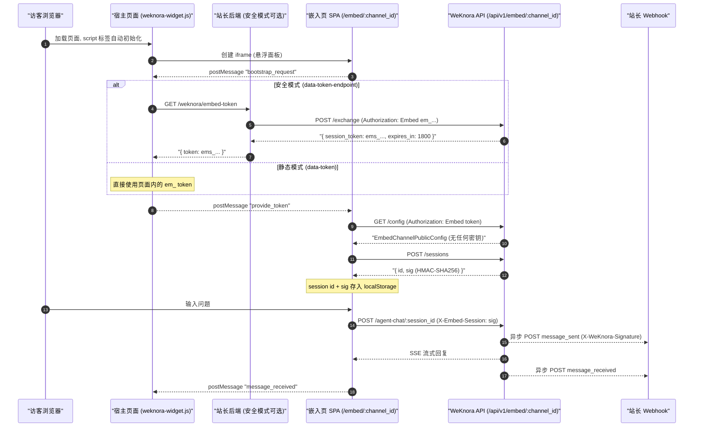

# 网页嵌入（Embed Channel）

想给自己的官网、帮助中心加一个「问文档」的客服挂件，用嵌入渠道：在 WeKnora 里建一个渠道并绑定 Agent，拿到一段 `<script>` 贴进网页，访客不需要 WeKnora 账号就能对话。

配置路径：「设置 → 网页嵌入」新建渠道 → 绑定 Agent → 填允许嵌入的域名白名单 → 复制代码片段。上线前务必配好域名白名单和限流，否则任何人都能拿你的渠道地址消耗你的模型额度。

<Screenshot
  src="/screenshots/embed-channel.png"
  caption="网页嵌入渠道：配置、代码片段与挂件效果"
  hint="展示渠道配置（绑定 Agent、允许域名、外观设置）与生成的 script 片段；如有可能再附一张挂件在网页上展开的效果图。" />

下文覆盖整条链路：渠道创建与配置、公开配置下发、匿名会话与 token 交换、来源（Origin）校验、限流、以及可选的 webhook 事件回调。

访客侧图片走的是渠道维度的鉴权代理，与主站不同；图片不显示时见[图片与文件的对外访问](21-file-access.md)。

## 数据模型

`internal/types/embed_channel.go` 中的 `EmbedChannel` 是渠道的完整定义（表 `embed_channels`，软删除，`publish_token` 上有部分唯一索引）：

```go
type EmbedChannel struct {
    ID                     string         // UUID 主键
    TenantID               uint64         // 所属租户
    AgentID                string         // 绑定的 Agent（默认 builtin-quick-answer）
    Name                   string         // 渠道名称
    Enabled                bool           // 是否启用
    PublishToken           string         // 长效发布令牌，"em_" 前缀
    AllowedOrigins         JSON           // 允许的来源 Origin 列表（JSONB）
    WelcomeMessage         string         // 欢迎语
    RateLimitPerMinute     int            // 单 IP 每分钟限流（默认 30）
    RateLimitPerDay        int            // 渠道级每日限流（默认 10000）
    PrimaryColor           string         // 主题色
    PageTitle              string         // 页面标题
    HeaderTitleMode        string         // "channel" | "session"
    ShowSuggestedQuestions bool           // 推荐问题开关
    WidgetPosition         string         // 挂件位置
    AllowWebSearch         bool           // 允许联网搜索
    AllowFileUpload        bool           // 允许文件/图片上传
    DefaultLocale          string         // 默认语言
    WebhookURL             string         // 出站 webhook（HTTPS）
    WebhookSecret          string         // HMAC-SHA256 签名密钥
    ...
}
```

### 渠道配置项

创建/更新渠道时（`internal/handler/embed_channel.go` 中的 `embedChannelRequest`）可配置：

| 配置项 | 类型 | 默认值 | 说明 |
| --- | --- | --- | --- |
| `name` | string | — | 渠道显示名称 |
| `enabled` | bool | `true` | 渠道开关，关闭后所有公开接口拒绝访问 |
| `agent_id` | string | `builtin-quick-answer` | 绑定的 Agent，决定知识库范围与对话能力 |
| `allowed_origins` | string[] | — | **必填至少一项**。支持三种形式：完整 `http(s)://` Origin、子域名通配 `*.example.com`、全通配 `*`（仅开发模式允许，生产环境拒绝） |
| `welcome_message` | string | 空 | 打开挂件时的欢迎语 |
| `rate_limit_per_minute` | int | `30` | 单 IP 每分钟请求上限 |
| `rate_limit_per_day` | int | `10000` | 渠道级每日请求总量上限 |
| `primary_color` | string | — | 挂件主题色（CSS 颜色值，如 `#0052d9`） |
| `page_title` | string | 空 | 嵌入页浏览器标题 |
| `header_title_mode` | string | `channel` | 标题模式：`channel`（固定渠道名）/ `session`（随会话自动生成） |
| `show_suggested_questions` | bool | `true` | 是否展示推荐问题 |
| `widget_position` | string | `bottom-right` | `bottom-right` \| `bottom-left` \| `top-right` \| `top-left` |
| `allow_web_search` | bool | `false` | 访客侧是否允许联网搜索开关 |
| `allow_file_upload` | bool | `false` | 访客侧是否允许上传图片/文件 |
| `default_locale` | string | 空（跟随浏览器） | `zh-CN` \| `en-US` \| `ko-KR` \| `ru-RU` |
| `webhook_url` | string | 空 | 事件回调地址，**必须为 HTTPS 且通过 SSRF 校验**（禁止内网/链路本地地址） |
| `webhook_secret` | string | 空 | webhook 签名密钥（API 响应中永不回显） |

## 管理 API（需登录鉴权）

由 `RegisterEmbedChannelRoutes`（`internal/router/router.go`）注册，支持 API Key 的 `ManageChannels` 能力：

| 方法 | 路径 | 权限 | 说明 |
| --- | --- | --- | --- |
| POST | `/api/v1/agents/:id/embed-channels` | Admin | 为 Agent 创建渠道 |
| GET | `/api/v1/agents/:id/embed-channels` | Viewer | 列出某 Agent 的渠道 |
| GET | `/api/v1/embed-channels` | Viewer | 列出租户全部渠道 |
| GET | `/api/v1/embed-channels/:channel_id` | Viewer | 渠道详情（含 `publish_token`） |
| PUT | `/api/v1/embed-channels/:channel_id` | Admin | 更新渠道配置 |
| DELETE | `/api/v1/embed-channels/:channel_id` | Admin | 删除渠道（软删除） |
| POST | `/api/v1/embed-channels/:channel_id/rotate-token` | Admin | 轮换 `publish_token`（旧 token 及所有已签发会话签名立即失效） |
| POST | `/api/v1/embed-channels/:channel_id/preview-session` | Viewer | 签发预览用短效会话 token（管理台预览挂件） |
| GET | `/api/v1/embed-channels/:channel_id/stats` | Viewer | 渠道会话统计 |

## 公开 API（匿名访问，Embed 鉴权）

由 `RegisterEmbedPublicRoutes` 注册在 `/api/v1/embed/:channel_id` 前缀下，全部经过 `middleware.EmbedAuth` 中间件（token 校验 + Origin 校验 + 限流）：

```go
embed := r.Group("/api/v1/embed/:channel_id", middleware.EmbedAuth(embedService, tenantService, redisClient))
{
    embed.POST("/exchange", embedHandler.ExchangeEmbedSession)
    embed.GET("/config", embedHandler.GetEmbedConfig)
    embed.GET("/suggested-questions", embedHandler.GetEmbedSuggestedQuestions)
    embed.GET("/chunks/:chunk_id", embedHandler.GetEmbedChunk)
    embed.POST("/sessions", embedHandler.CreateEmbedSession)
    embed.POST("/knowledge-chat/:session_id", embedHandler.EmbedKnowledgeChat)
    embed.POST("/agent-chat/:session_id", embedHandler.EmbedAgentChat)
    embed.GET("/messages/:session_id/load", embedHandler.EmbedLoadMessages)
    embed.POST("/sessions/:session_id/stop", embedHandler.EmbedStopSession)
    embed.POST("/sessions/:session_id/events", embedHandler.EmbedRelayWebhookEvent)
    // 消息推荐问题、MCP OAuth、工具审批、文件服务等路由略
    embed.GET("/files", newFileServeHandler(...))
}
```

### 公开配置下发

`GET /api/v1/embed/:channel_id/config` 返回 `EmbedChannelPublicConfig`（`internal/types/embed_channel.go`）——只包含渲染挂件所需的展示与能力信息：

- 下发：`channel_id`、`name`、`display_title`（服务端按 `PageTitle → Name → AgentName → "AI Assistant"` 顺序解析）、`agent_id/agent_name/agent_avatar`、`knowledge_base_ids`、`welcome_message`、`primary_color`、`header_title_mode`、`show_suggested_questions`、`widget_position`、`allow_web_search`、`allow_file_upload`、`agent_web_search_enabled`、`agent_image_upload_enabled`、`default_locale` 等；
- **永不下发**：`publish_token`、`webhook_url`、`webhook_secret`。

## 鉴权与匿名会话

### 两种 Token

| Token | 前缀 | 生命周期 | 用途 |
| --- | --- | --- | --- |
| Publish Token | `em_` | 长效（直到轮换） | 渠道发布令牌，可直接嵌入页面（静态模式），或仅保存在站长后端（安全模式） |
| Session Token | `ems_` | **30 分钟**（Redis TTL） | 由 publish token 通过 `/exchange` 换取的短效令牌，浏览器侧使用 |

所有公开接口通过请求头 `Authorization: Embed <token>` 携带令牌（**不接受 query string**）。`EmbedAuth` 中间件（`internal/middleware/embed_auth.go`）依次执行：

1. 按 `channel_id` 查渠道，校验 token 与 `publish_token` 匹配，或在 Redis（key `embed:session:{token}`）中查到 session token 归属该渠道；
2. 校验渠道 `enabled`；
3. 校验请求 `Origin` 命中 `allowed_origins`（空列表拒绝一切；`*` 仅开发模式；`*.example.com` 后缀通配；其余精确匹配、大小写不敏感）；
4. 限流（Redis Lua 脚本，滑动窗口）：
   - 单 IP 每分钟 ≤ `RateLimitPerMinute`；
   - 渠道全局每分钟 ≤ `max(RateLimitPerMinute × 20, 120)`——防止攻击者轮换 IP 绕过单 IP 限流；
   - 渠道每日总量 ≤ `RateLimitPerDay`。

### Token 交换（安全模式核心）

`POST /api/v1/embed/:channel_id/exchange`，请求头 `Authorization: Embed em_xxx`（**只接受 publish token**，session token 会被拒绝）。响应：

```json
{ "success": true, "data": { "session_token": "ems_...", "expires_in": 1800 } }
```

实现见 `internal/application/service/embed_session.go` 的 `IssueSessionToken`：随机 32 字节 base64 加 `ems_` 前缀，写入 Redis，TTL 30 分钟。

### 匿名会话建立

`POST /api/v1/embed/:channel_id/sessions` 创建聊天会话，返回：

```json
{ "success": true, "data": { "id": "<session_uuid>", "sig": "<HMAC-SHA256 base64>" } }
```

- 会话写入 `sessions` 表，`Description` 标记为 `embed_channel:{channel_id}`，`UserID` 使用 `EmbedSessionPrincipal(tenantID, channelID, sessionID).StorageID()` 生成的不透明访客标识；
- `sig` 为 **会话签名**：`HMAC-SHA256(channel.PublishToken, "{channel_id}|{session_id}")`。此后每次访问 `/sessions/:session_id/*` 都必须携带请求头 `X-Embed-Session: <sig>`，服务端做常量时间比较（`internal/handler/embed_channel.go`）。这防止仅凭 session_id 冒用他人会话；轮换 publish token 后所有签名同时失效。

前端还可附带 `X-Embed-Visitor: <uuid>` 用于访客维度统计。会话 id 与 sig 会按渠道缓存到 `localStorage`，页面刷新后直接恢复会话（`frontend/src/composables/useEmbedBridge.ts`）。

## Webhook 回调

配置了 `webhook_url` 的渠道会在以下事件时向站长后端 POST JSON（`internal/application/service/embed_webhook.go`）：

| 事件 | 触发时机 | 载荷字段 |
| --- | --- | --- |
| `message_sent` | 访客发出提问 | `type`、`channel_id`、`session_id`、`timestamp`、`query` |
| `message_received` | 助手回复完成 | `type`、`channel_id`、`session_id`、`timestamp`、`content` |

安全与投递语义：

- 配置了 `webhook_secret` 时附带签名头 `X-WeKnora-Signature: sha256=<hex(HMAC-SHA256(secret, raw_body))>`；
- URL 必须 HTTPS，出站请求走 SSRF 安全客户端（每次重定向重新校验，最多 5 跳），超时 5 秒，User-Agent 为 `WeKnora-Embed-Webhook/1.0`；
- 异步 best-effort 投递，失败仅记录日志、**不重试**；
- 前端也可通过 `POST /api/v1/embed/:channel_id/sessions/:session_id/events` 显式转发事件。

## 前端挂件接入

挂件 SDK 是一个无依赖的 loader 脚本 `frontend/public/weknora-widget.js`（部署后从 WeKnora 服务根路径提供），负责渲染悬浮按钮 + iframe 面板，iframe 指向嵌入页 SPA `/embed/{channel_id}`（入口 `frontend/src/embed-main.ts`）。

### 方式一：静态 Token 模式（最简单，token 暴露在页面）

```html
<script
  src="https://your-weknora.example.com/weknora-widget.js"
  data-channel="你的渠道UUID"
  data-token="em_你的publish_token"
  data-position="bottom-right"
  data-primary-color="#07C05F"
  data-title="AI Assistant"
></script>
```

publish token 直接写在页面 HTML 中，任何访客可见；轮换 token 需要同步更新所有部署页面。适合内部站点或低敏感场景。

### 方式二：安全模式（Secure Mode，推荐）

publish token 只保存在站长自己的后端，页面通过 `data-token-endpoint` 指向站长后端的一个换取接口：

```html
<script
  src="https://your-weknora.example.com/weknora-widget.js"
  data-channel="你的渠道UUID"
  data-token-endpoint="https://your-backend.example.com/weknora/embed-token"
  data-position="bottom-right"
></script>
```

站长后端实现该 endpoint：服务端持有 `em_` token，调用 `POST /api/v1/embed/{channel_id}/exchange` 换取 `ems_` 短效 token 并返回 `{ "token": "ems_...", "expiresIn": 1800 }`。挂件会在约 80% TTL 时（不早于 30 秒）自动刷新 token（见 `weknora-widget.js` 中的 `scheduleRefresh`）。**publish token 永不到达浏览器。**

其余可选属性：`data-base-url`（默认从 script src 推导）、`data-width` / `data-height`（面板尺寸，默认 400×600）、`data-sandbox`（iframe sandbox 策略；跨域嵌入时自动加 `allow-scripts allow-forms allow-popups allow-modals allow-same-origin`）。

### 方式三：编程式 API

```html
<script src="https://your-weknora.example.com/weknora-widget.js"></script>
<script>
  WeKnora.init({
    channel: '渠道UUID',
    tokenEndpoint: 'https://your-backend.example.com/weknora/embed-token', // 或 token: 'em_...'
    position: 'bottom-right',
    primaryColor: '#07C05F',
    title: 'AI Assistant',
    baseUrl: 'https://your-weknora.example.com',
  });
  WeKnora.setContext({ userId: 'u_123', page: location.pathname }); // 上下文随每次提问注入
  WeKnora.setLocale('en-US');
  WeKnora.openWithQuery('如何重置密码？');   // 打开面板并自动发送提问
  WeKnora.on('ready', () => console.log('widget ready'));
  // 其他：WeKnora.open() / close() / toggle() / destroy() / off(event, fn)
</script>
```

### 直接 iframe 接入

也可以不用 loader，直接内嵌 iframe（此时需要通过 URL/postMessage 提供 token，通常建议使用 loader）：

```html
<iframe src="https://your-weknora.example.com/embed/渠道UUID"
        width="400" height="600" style="border:none"></iframe>
```

### postMessage Bridge 协议

宿主页（loader）与 iframe 内嵌入页之间通过 `postMessage` 通信，双方都做严格的 Origin 校验（loader 只向推导出的 `embedOrigin` 发消息，绝不使用 `*`；嵌入页对首个可信消息做 origin 固定 —— 见 `frontend/src/composables/useEmbedBridge.ts`）：

- 宿主 → iframe（`source: "weknora-host"`）：`provide_token`（下发 token）、`set_context`、`set_locale`、`open_with_query`；
- iframe → 宿主（`source: "weknora-embed"`）：`ready`、`bootstrap_request`（请求 token）、`message_sent`、`message_received`。

## 端到端时序



## 安全要点小结

- **Origin 白名单**：`allowed_origins` 为空时拒绝所有请求；`*` 通配仅开发模式可用；支持 `*.example.com` 子域名通配。
- **双 token 体系**：安全模式下 publish token 不出服务端，浏览器只持有 30 分钟短效 `ems_` token。
- **会话签名**：`X-Embed-Session` HMAC 签名把会话绑定到（渠道、会话、当前 publish token）三元组，轮换 token 即可全量吊销。
- **三层限流**：单 IP/分钟、渠道/分钟（20 倍单 IP、下限 120）、渠道/天，Redis Lua 原子实现。
- **Webhook SSRF 防护**：仅 HTTPS、内网地址拒绝、重定向逐跳校验、5 秒超时。

## 实现参考

想读源码时按下表定位（路径相对仓库根目录）：

| 层 | 文件 |
| --- | --- |
| 数据结构 | `internal/types/embed_channel.go` |
| HTTP Handler | `internal/handler/embed_channel.go` |
| 渠道服务 | `internal/application/service/embed_channel.go` |
| 匿名会话/Token | `internal/application/service/embed_session.go` |
| Webhook 分发 | `internal/application/service/embed_webhook.go` |
| 鉴权中间件 | `internal/middleware/embed_auth.go` |
| 路由注册 | `internal/router/router.go`（`RegisterEmbedPublicRoutes` / `RegisterEmbedChannelRoutes`） |
| 挂件加载器（SDK） | `frontend/public/weknora-widget.js` |
| 嵌入页 SPA 入口 | `frontend/src/embed-main.ts`、`frontend/src/composables/useEmbedBridge.ts`、`useEmbedChatSession.ts` |
| 数据库迁移 | `migrations/versioned/000060_embed_channels.up.sql` |
