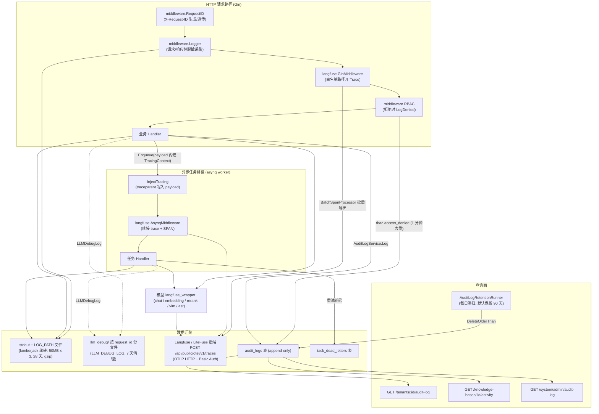
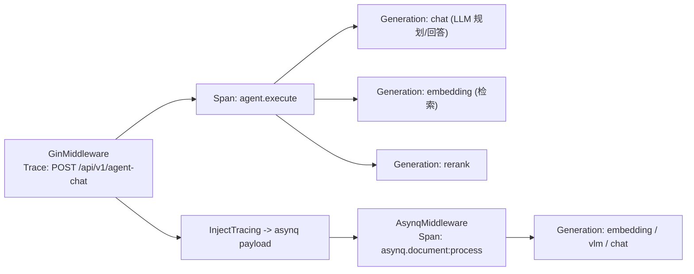

# 可观测性与审计

线上跑起来之后，你会关心三类问题：某次回答为什么慢、为什么答错；谁在什么时候改了什么；后台任务有没有堆积。WeKnora 分别提供了追踪、审计日志和队列面板来回答它们。

| 想知道什么 | 去哪看 |
| --- | --- |
| 某次问答检索了什么、调了几次模型、花了多少 token | 接入 Langfuse 后在 Langfuse 里看完整调用链 |
| 谁改了知识库 / 成员 / 系统设置 | 知识库设置的「活动」，以及「设置 → 审计日志」 |
| 后台解析、摘要、Wiki 任务是否堆积或失败 | 「设置 → 运行时队列」 |
| 服务是否存活 | `GET /health` |
| 一次请求在各服务的日志里怎么串起来 | 按响应头里的 `X-Request-ID` 检索日志 |

<Screenshot
  src="/screenshots/queue-dashboard.png"
  caption="运行时任务队列：各队列的积压、失败与重试情况"
  hint="展示队列面板，含队列名、待处理/进行中/失败数量与死信任务操作入口。" />

<Screenshot
  src="/screenshots/observability-langfuse.png"
  caption="Langfuse 追踪：一次问答的完整调用链"
  hint="展示 Langfuse 中一条 trace 的展开视图，含检索、重排、生成各 span 与 token 用量。" />

下面按日志、追踪、审计、限流、健康检查逐项展开。

## 1. 可观测性数据流总览



## 2. 日志系统（`internal/logger`）

### 2.1 格式与级别

- 底层为**私有** logrus 实例（`appLogger`，避免外部依赖改写全局 logrus 导致日志丢失），自定义 `CustomFormatter`。
- 默认单行格式：`LEVEL[时间戳] [request_id 字段...] caller | message`，caller 为 `文件:行[函数名]`（`addCaller`）。
- 可通过 `LOG_FORMAT` 环境变量提供模板，占位符：`%d`=时间、`%level`=级别、`%thread`=goroutine ID（仅模板引用时才取，避免每条日志跑 `runtime.Stack`）、`%logger`=caller、`%traceId`=request_id、`%msg`=消息+结构化字段。单趟 `strings.NewReplacer` 替换避免二次替换问题。
- 级别由 `LOG_LEVEL` 控制（`debug`/`info`/`warn`/`error`/`fatal`，未设置或非法时**默认 debug**）。
- 颜色：stdout 是终端时启用 ANSI 颜色；非终端（Docker 采集）禁用；写文件时 `ansiStripWriter` 剥离 ANSI 序列保持纯文本。
- 结构化字段 API：`logger.WithField(ctx, k, v)` / `WithFields` 把带字段的 entry 存进 context（`types.LoggerContextKey`），后续 `logger.Infof(ctx, ...)` 自动携带；`WarnWithFields` 专用于审计相关事件（跨租户探测、不变量破坏），便于日志聚合器按 tenant/资源索引。
- `CloneContext` 在派生后台 goroutine 时复制关键 context 键（tenant/user/request_id/角色/语言等），并同时保留 Langfuse `*Trace` 句柄与**活跃的 OTel span**，防止子 span 变成孤儿 trace。

### 2.2 输出与轮转

`ConfigureFromEnv()`（init 时执行，`main` 加载 `.env` 后可重调）：始终写 stdout；`LOG_PATH` 非空（或 macOS `.app` 打包运行时自动落到 `~/Library/Logs/<App>/<App>.log`）时通过 lumberjack 附加落盘：

```go
// internal/logger/logger.go openLogFile()
return &lumberjack.Logger{
    Filename:   logPath,
    MaxSize:    50, // megabytes
    MaxBackups: 3,
    MaxAge:     28, // days
    Compress:   true,
}, nil
```

### 2.3 LLM 调试日志（`internal/logger/llm_logger.go`）

`LLM_DEBUG_LOG=true|1|<目录>` 开启后，每次模型调用（Chat / Chat Stream / Embedding / Rerank / VLM）都会把**完整**的输入消息、工具调用、输出与错误写到 `llm_debug/` 目录，**同一 request_id 的所有调用追加到同一个文件**（`<request_id>.log`），便于还原一次会话内的全部模型交互。目录中超过 7 天的文件在启动时后台清理（`cleanupOldDebugFiles`）。

### 2.4 请求日志中间件（`internal/middleware/logger.go`）

- `RequestID()`：读取或生成 `X-Request-ID`，写回响应头，并把 request_id 与带字段的 logger 一起放入 gin context 与 `http.Request` context —— 全链路日志（含 asynq worker 侧透传的 session 标签）都能按 request_id 关联。
- `Logger()`：记录 method、path（query 经 `sanitizeQuery` 抹掉 `token`/`code`/`state` 等 OAuth 敏感参数）、status_code、latency、client_ip、size，以及最多 10KB 的请求/响应体。请求/响应体经 `sensitiveFieldRegex` 脱敏（password/token/api_key/secret/private_key 等字段值替换为 `"***"`，兼容 snake_case/camelCase）；SSE 响应体记为 `[SSE流式响应，已跳过]`；`/assets/` 与 wiki stats 轮询路径直接跳过。
- 信任代理：`r.SetTrustedProxies(...)`（`WEKNORA_TRUSTED_PROXIES`）防止伪造 `X-Forwarded-For` 绕过基于 `ClientIP` 的限流。

## 3. Langfuse 追踪（`internal/tracing/langfuse`）

WeKnora 的分布式追踪不是通用 OTel 接入，而是**基于 OpenTelemetry Go SDK 实现的 Langfuse v3+ / LiteFuse 客户端**：span 携带 Langfuse 语义约定属性（`langfuse.observation.*`，镜像 langfuse-python v4 的 `_client/attributes.py`），经 OTLP/HTTP 导出到 `POST <host>/api/public/otel/v1/traces`。完全 opt-in：未启用时所有入口都是零成本 no-op。

### 3.1 配置（环境变量，`config.go`）

| 环境变量 | 默认值 | 说明 |
| --- | --- | --- |
| `LANGFUSE_ENABLED` | 有公私钥时自动启用 | 总开关（与 Python SDK 约定一致） |
| `LANGFUSE_HOST` | `https://cloud.langfuse.com` | Langfuse/LiteFuse 基址（可自建） |
| `LANGFUSE_PUBLIC_KEY` / `LANGFUSE_SECRET_KEY` | — | Basic Auth 项目凭证 |
| `LANGFUSE_RELEASE` / `LANGFUSE_ENVIRONMENT` | — | 附加到每条 trace 用于 UI 过滤 |
| `LANGFUSE_FLUSH_AT` | 15 | 批量导出批大小（BatchSpanProcessor `MaxExportBatchSize`） |
| `LANGFUSE_FLUSH_INTERVAL` | 3s | 批量导出最大间隔（`BatchTimeout`） |
| `LANGFUSE_QUEUE_SIZE` | 2048 | 内存缓冲上限（端点不可达时防止无界增长） |
| `LANGFUSE_REQUEST_TIMEOUT` | 10s | 单次 ingestion HTTP 超时 |
| `LANGFUSE_SAMPLE_RATE` | 1.0 | `ParentBased(TraceIDRatioBased)` 采样率，0..1 |
| `LANGFUSE_DEBUG` | false | 批量发送错误的详细日志 |

### 3.2 导出器（`exporter.go`）

OTLP/HTTP exporter，`Authorization: Basic base64(public:secret)`；`x-langfuse-ingestion-version: 4` 是 Langfuse v3/LiteFuse OTel 直写路径的必需门槛头（缺失会返回 400），`x-langfuse-sdk-name/version` 为兼容标记。`Manager`（`manager.go`）持有独立的 `TracerProvider`（`service.name=weknora` resource），刻意**不**调用 `otel.SetTextMapPropagator` 等全局 OTel 变更，避免影响进程内其他 OTel 埋点；W3C `TraceContext` propagator 为包级私有值。

### 3.3 观测模型与埋点点位

三种句柄（`tracer.go`）：`Trace`（根，一次请求）、`Span`（非 LLM 的逻辑工作单元）、`Generation`（一次模型调用，含 `TokenUsage` token 统计与流式 time-to-first-token `MarkCompletionStart`）。父子关系通过 OTel span context 自动建立；无 trace 时自动开 auto-trace 防止孤儿 span。

主要埋点：

| 点位 | 源码 | 产出 |
| --- | --- | --- |
| HTTP 入口 | `middleware.go` `GinMiddleware` | 对 `shouldTrace` 白名单路径（knowledge-chat / agent-chat / knowledge-search / 各类 ingestion POST/PUT / FAQ 导入 / wiki auto-fix / evaluation / initialization 检测等）开根 Trace，名称为 `METHOD /path`，metadata 含 http.method/path/query/request_id，输出为 status 与 response.size；提取上游 W3C `traceparent` 头继承外部调用方 trace id |
| asynq worker | `asynq.go` `AsynqMiddleware` | 从 payload 恢复 traceparent 续接 HTTP trace，否则新开 `asynq.<task_type>` trace；包一层 SPAN，metadata 含 task_id/queue/retry/max_retry/payload_bytes；payload 只预览前 1KB |
| 入队侧注入 | `asynq.go` `InjectTracing` + `internal/types/tracing.go` `TracingContext` | 把 traceparent、user/session 标签以 `lf_*` JSON 字段嵌入任务 payload，跨进程传递 |
| 模型调用 | `internal/models/{chat,embedding,rerank,vlm,asr}/langfuse_wrapper.go` | 每次调用一个 Generation（模型名、输入、参数、输出、token usage、错误） |
| 检索/重排摘要 | `retrieval_obs.go` | `SummarizeRetrieveOutput` / `SummarizeSearchResults` 等把召回结果压缩成 top-25 预览（rank/chunk_id/score/160 字符 preview），避免全文进 trace |
| Agent 执行 | `internal/agent/engine.go`、`act.go` | agent.execute 等 SPAN，经 `logger.CloneContext` 保持与 HTTP 根 trace 同树 |

上报内容（span 属性，`events.go`）：`langfuse.observation.type/input/output/metadata/model.name/model.parameters/usage_details/completion_start_time`、`langfuse.trace.name/input/output/metadata/tags`、`user.id`（显式 user 或 `tenant:<id>`）、`session.id`、`langfuse.environment/release`。



## 4. 审计日志

### 4.1 数据模型（`internal/types/audit_log.go`）

`audit_logs` 表 **append-only**（无 UpdatedAt、无软删除），单调 id 同时作为主键与游标：

| 字段 | 类型 | 说明 |
| --- | --- | --- |
| `id` | uint64 自增 | 主键 + 分页游标（`WHERE id < after_id ORDER BY id DESC`） |
| `tenant_id` | uint64 | 空间；`0` = 系统级（system-scope）事件 |
| `actor_user_id` / `actor_role` | varchar | 操作者与其当时角色（系统触发时为空） |
| `action` | varchar(64) | 点分命名 `<area>.<event>`（见 4.2） |
| `scope_type` / `scope_id` | varchar | 资源作用域（如 `knowledge_base` + kbID，驱动 KB 活动页） |
| `target_type` / `target_id` / `target_user_id` | varchar | 具体目标资源 / 用户 |
| `request_path` / `request_method` | varchar | 路由模板（非原始 URL，防游标爆表；原始 URL 存 Details.raw_path） |
| `outcome` | varchar(16) | `success` / `accepted`（异步已受理未终态）/ `denied` / `failed` / `partial` / `canceled` |
| `details` | jsonb | 动作特定负载；密钥值**绝不**入库（如 vector_store 只记变更字段名） |
| `created_at` | timestamp | 保留策略清扫依据 |

### 4.2 审计动作清单

| 分组 | 动作 |
| --- | --- |
| RBAC / 成员 | `rbac.member_added`、`rbac.member_removed`、`rbac.member_role_changed`、`rbac.member_left`、`rbac.access_denied`、`rbac.invitation_sent`、`rbac.invitation_accepted`、`rbac.invitation_declined`、`rbac.invitation_revoked`、`rbac.invitation_expired` |
| 向量库 | `vector_store.created`、`vector_store.updated`、`vector_store.deleted` |
| OpenSearch 派生资源 | `opensearch.index_created`、`opensearch.index_deleted`、`opensearch.reindex_executed` |
| 系统管理（tenant_id=0） | `system.setting_changed`、`system.admin_promoted`、`system.admin_revoked`、`system.user_password_reset`、`system.api_key_created`、`system.api_key_revoked` |
| 运行时队列操作（tenant_id=0） | `system.queue_task_retried`、`system.queue_task_deleted`、`system.queue_task_run_now`、`system.queue_task_cancelled`、`system.queue_archived_purged` |
| 知识库 | `kb.created`、`kb.updated`、`kb.deleted`、`kb.duplicated`、`kb.clone_started`、`kb.clone_completed`、`kb.clone_failed`、`kb.share_added`、`kb.share_permission_changed`、`kb.share_removed` |
| 知识 | `knowledge.created`、`knowledge.updated`、`knowledge.deleted`、`knowledge.batch_deleted`、`knowledge.reparse_started`、`knowledge.parse_canceled`、`knowledge.move_started`、`knowledge.move_completed`、`knowledge.move_failed` |
| 标签 / 数据源 | `tag.created`、`tag.updated`、`tag.deleted`、`datasource.created`、`datasource.updated`、`datasource.deleted`、`datasource.sync_started`、`datasource.sync_completed`、`datasource.sync_failed`、`datasource.paused`、`datasource.resumed` |
| Wiki / FAQ | `wiki.content_changed`、`faq.import_started`、`faq.import_completed`、`faq.import_failed` |

### 4.3 写入路径（service + middleware）

- `auditLogService.Log`（`internal/application/service/audit_log.go`）是规范写入口：默认 `outcome=success`、填充 `CreatedAt`；**写失败只记 ERROR 日志不向上传播** —— 审计失败绝不能中断业务操作。
- `LogDenied` 记录 RBAC 中间件拒绝：以 `(tenant_id, actor, action=rbac.access_denied, route 模板)` 为键做 **1 分钟滑动窗口去重**（`denyDedupWindow`，`repo.CountSinceForDedup`），防止探测客户端灌满表（100 RPS 打同一端点每分钟只产生 1 行）；用路由模板而非原始 URL 作为 dedup 键，防止遍历 UUID 绕过窗口。stderr 侧的 `[rbac] role insufficient` 日志不受去重影响，每次拒绝都打。
- `middleware/audit_provider.go` 的 `AuditServiceProvider` 把 service 注入 gin context（键 `weknora.audit_service`），RBAC 中间件经 `AuditServiceFromContext` 取用，nil 安全（Lite 模式可不配审计）。

### 4.4 查询 API（`internal/handler/audit_log.go`）

| 路由 | 权限 | 说明 |
| --- | --- | --- |
| `GET /api/v1/tenants/:id/audit-log` | PathTenantMatch + Admin | 空间审计流；只返回 `scope_type=''` 的空间级行（`UnscopedOnly`） |
| `GET /api/v1/knowledge-bases/:id/activity` | KB 创建者或空间 Admin，且必须是 owner 空间（组织共享消费方不可读） | `scope_type=knowledge_base` + `scope_id=kbID` 的 KB 活动投影 |
| `GET /api/v1/system/admin/audit-log` | SystemAdmin（+ 平台 API Key `system.audit_read`） | `tenant_id=0` 的平台级事件（settings / promote / queue 操作等） |

统一查询参数：`after_id`（游标，返回 id 更小的行）、`limit`（1–100，默认 50，硬上限 `auditLogListLimitMax=100`）、`action` / `outcome` / `actor` 精确过滤。响应含 `next_cursor`（页内最小 id，0 表示到底）。

### 4.5 保留策略（`internal/application/service/audit_log_retention.go`）

- 配置：`audit.retention_days`（YAML）/ `WEKNORA_AUDIT_RETENTION_DAYS`（env 覆盖）；省略 `audit:` 段时默认 **90 天**；显式 0 表示禁用清扫（合规场景库外归档），负值在 config 校验时报错。
- `AuditLogRetentionRunner`：裸 `time.Ticker` 后台 goroutine（无 cron / asynq 依赖），启动延迟 10 分钟（避开迁移与启动流量），之后**每 24h** 执行一次 `Purge` → `DeleteOlderThan(now - retention_days)`（单条带索引 DELETE，30s 超时）。删除数量记 INFO，失败记 WARN（下轮再试）。由 `internal/container/container.go` 装配并注册 `ResourceCleaner` 优雅停止（`Stop` 幂等，未 Start 直接返回）。

## 5. 限流（`internal/ratelimit` 与中间件）

### 5.1 通用滑动窗口限流器（`internal/ratelimit/limiter.go`）

- Redis 优先：Lua 脚本原子完成"剔除过期 ZSET 成员 → `ZCARD` 计数 → 未超限则 `ZADD` + `PEXPIRE`"，多实例共享预算；member 为 `<instanceID>:<ms>` 保证唯一。
- Redis 不可用（错误或 Lite 无 Redis）时**自动降级**为进程内 `localLimiter`（`sync.Map` + 每 key 时间戳数组），`StartCleanup` 周期驱逐空 key。
- `max` 按每次 `Allow` 调用传入，同一 limiter 可对不同 key 用不同预算（如各 embed 渠道各自配额）。
- 使用方：Web embed 公开接口（每分钟 + 每 24h 两个 limiter，按 channel+ClientIP，`internal/middleware/embed_auth.go`）、IM 服务（`internal/im/service.go`）。

### 5.2 公开认证端点 IP 限流（`internal/middleware/auth_public_ratelimit.go`）

`PublicAuthRateLimit()` 保护未认证的邀请链接端点（`/auth/invitations/lookup`、`/auth/register-by-invite`）：进程内滑动窗口，每 IP **30 次/分钟**（跨两个端点共享桶），超限返回 429（`ErrTooManyRequests`）。纯本地实现（低流量端点），注释中明确水平扩展时应换用 `internal/ratelimit` 的 Redis 版。

## 6. 健康检查

`internal/router/router.go` 注册无需认证的健康探针（`internal/middleware/auth.go` 的公开路径白名单包含 `/health`）：

```go
// internal/router/router.go
r.GET("/health", func(c *gin.Context) {
    c.JSON(200, gin.H{"status": "ok"})
})
```

这是纯存活探针（liveness，不检查 DB/Redis 依赖），适合作为容器 / LB 健康检查目标。`langfuse.shouldTrace` 与请求日志采样也都排除了它，避免探针噪声。进程 uptime 由 `internal/runtime/server.go` 的 `MarkServerStarted`/`ServerUptime` 提供给运维面板。

## 7. 模型引用统计（`internal/application/repository/model_usage.go`）

该文件提供的是**模型引用（usage-by-reference）查询**，即回答"哪些资源正在使用某个模型"，用于删除模型前的依赖保护，而非 token 用量计费：

- `scopeKnowledgeBasesByModelID`：匹配 `knowledge_bases` 中任一模型绑定字段 —— `embedding_model_id`、`summary_model_id`、`image_processing_config.model_id`、`vlm_config.model_id`、`asr_config.model_id`、`wiki_config.synthesis_model_id`（Postgres 用 `->>` JSON 操作符，SQLite 用 `json_extract`，双方言等价）。
- `scopeCustomAgentsByModelID`：匹配 `custom_agents.config` 中的 `model_id`、`rerank_model_id`、`vlm_model_id`、`asr_model_id`、`query_understand_model_id`、`question_suggestions.follow_ups.model_id`。
- 消费方：`knowledgebase.go` / `custom_agent.go` 仓储的 `ListModelUsages` 复用上述 scope，返回租户内活动对象的最小投影（`id`、`name`、合并后的 `bindings`），条数上限为 `ModelUsageListLimit`（50）。`internal/application/service/model.go` 的删除守卫以 `CountByModelID` 得到的 `knowledge_base_total` / `agent_total` 为是否拦截的依据，并在 HTTP 400 的 `error.details` 中同时返回截断列表和总数。

token 级别的模型用量则由 Langfuse Generation 的 `usage_details`（`TokenUsage`：input/output/total/cache_*）上报，在 Langfuse UI 中按模型 / 用户（`tenant:<id>`）/ 会话聚合查看。

## 8. 运维速查

| 想知道… | 去哪里 |
| --- | --- |
| 某次请求全链路发生了什么 | 用响应头 `X-Request-ID` grep 应用日志；开启 `LLM_DEBUG_LOG` 后看 `llm_debug/<request_id>.log` |
| 一次聊天/解析的 LLM 调用树与 token 消耗 | Langfuse UI（trace 名 `POST /api/v1/agent-chat` 或 `asynq.document:process`） |
| 谁在什么时候改了什么 | 空间审计 `/tenants/:id/audit-log`；KB 活动 `/knowledge-bases/:id/activity`；平台审计 `/system/admin/audit-log` |
| 为什么某文档一直失败 | `task_dead_letters` 表（scope=knowledge/knowledge_base）+ 运行时面板 archived 任务的 `last_error` |
| 服务是否存活 | `GET /health`（200 `{"status":"ok"}`） |
| 配置是否按预期加载 | 启动日志 `[startup-env]` 横幅（`internal/runtime/startup.go`，敏感值只显示长度） |

## 实现参考

想读源码时按下表定位（路径相对仓库根目录）：

| 能力 | 源码路径 |
| --- | --- |
| 应用日志 | `internal/logger/logger.go` |
| LLM 调用调试日志 | `internal/logger/llm_logger.go` |
| 请求日志 / RequestID 中间件 | `internal/middleware/logger.go` |
| Langfuse 追踪（OTel SDK） | `internal/tracing/langfuse/`（`config.go`、`manager.go`、`exporter.go`、`tracer.go`、`middleware.go`、`asynq.go`、`events.go`、`retrieval_obs.go`、`context.go`） |
| 跨进程 trace 载体 | `internal/types/tracing.go` |
| 审计日志 handler / service / repo | `internal/handler/audit_log.go`、`internal/application/service/audit_log.go`、`internal/application/repository/audit_log.go` |
| 审计保留策略 | `internal/application/service/audit_log_retention.go`、`internal/config/config.go`（`applyAuditDefaults`） |
| 审计动作 / 模型 | `internal/types/audit_log.go` |
| 限流 | `internal/ratelimit/limiter.go`、`internal/middleware/auth_public_ratelimit.go` |
| 健康检查 | `internal/router/router.go`（`GET /health`） |
| 模型引用统计 | `internal/application/repository/model_usage.go` |
