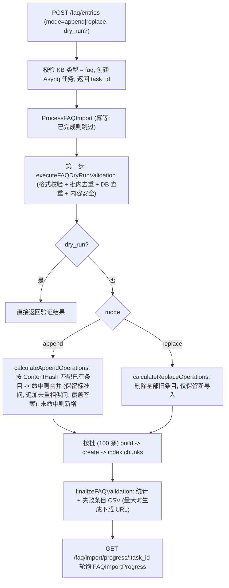
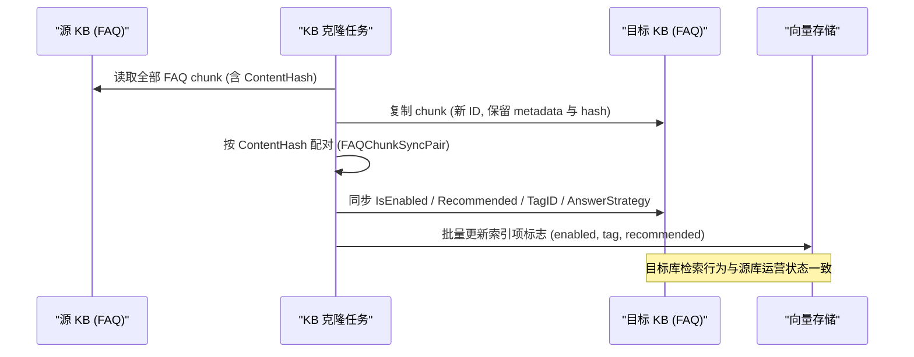

# FAQ 能力

有些问题的答案是固定的——退货政策、报销流程、常见报错处理。这类内容用文档检索绕一圈反而不稳，直接维护成问答对更可靠：建库时把类型选成 **FAQ**，条目按「标准问 + 相似问 + 反例问 + 答案」录入，提问时匹配的是问题而不是文档片段，命中就直接给准备好的答案。

常见用法：先用 Excel / CSV 批量导入历史工单里的常见问题，再在界面上补相似问；对容易误命中的问题补反例问。FAQ 库可以和文档库一起被同一个 Agent 检索，形成「先查标准答案、查不到再翻文档」的效果。

<Screenshot
  src="/screenshots/faq-management.png"
  caption="FAQ 管理：条目列表、筛选与批量导入"
  hint="展示 FAQ 条目列表（标准问、相似问数量、标签、状态）与导入入口/导入结果提示。" />

下文覆盖 FAQ 条目模型、API、导入导出、去重归一化算法、检索命中策略、与普通知识的区别，以及克隆 / 共享场景下的状态同步机制。

## 1. 数据模型

### 1.1 存储形态：FAQ 条目 = 一个 Chunk

FAQ 条目**不是独立表**：每个条目是一条 `Chunk` 记录（`chunk_type = "faq"`），挂在该 KB 内一条类型为 `faq` 的 `Knowledge` 下（首次创建条目时自动创建该 Knowledge）。条目的结构化内容存在 `Chunk.Metadata`（JSON）：

```go
// internal/types/faq.go
type FAQChunkMetadata struct {
    StandardQuestion  string         `json:"standard_question"`
    SimilarQuestions  []string       `json:"similar_questions,omitempty"`
    NegativeQuestions []string       `json:"negative_questions,omitempty"` // 反例问：命中即过滤
    Answers           []string       `json:"answers,omitempty"`
    AnswerStrategy    AnswerStrategy `json:"answer_strategy,omitempty"`    // all | random
    Version           int            `json:"version,omitempty"`            // 每次更新自增
    Source            string         `json:"source,omitempty"`
}

const (
    AnswerStrategyAll    AnswerStrategy = "all"    // 返回全部答案
    AnswerStrategyRandom AnswerStrategy = "random" // 随机返回一个
)
```

Chunk 上复用的通用字段：`SeqID`（自增整数，对外 API 的条目 ID）、`TagID`（分类标签，默认标签名常量 `UntaggedTagName = "未分类"`）、`IsEnabled`（停用开关）、`Flags`（bit0 `ChunkFlagRecommended` 是否可被推荐）、`ContentHash`（去重哈希，见 §3）。

### 1.2 API 投影：FAQEntry

```go
type FAQEntry struct {
    ID                int64          `json:"id"`        // chunk.SeqID
    ChunkID           string         `json:"chunk_id"`
    KnowledgeID       string         `json:"knowledge_id"`
    KnowledgeBaseID   string         `json:"knowledge_base_id"`
    TagID             int64          `json:"tag_id"`
    TagName           string         `json:"tag_name"`
    IsEnabled         bool           `json:"is_enabled"`
    IsRecommended     bool           `json:"is_recommended"`
    StandardQuestion  string         `json:"standard_question"`
    SimilarQuestions  []string       `json:"similar_questions"`
    NegativeQuestions []string       `json:"negative_questions"`
    Answers           []string       `json:"answers"`
    AnswerStrategy    AnswerStrategy `json:"answer_strategy"`
    IndexMode         FAQIndexMode   `json:"index_mode"`
    Score             float64        `json:"score,omitempty"`            // 检索得分
    MatchType         MatchType      `json:"match_type,omitempty"`
    MatchedQuestion   string         `json:"matched_question,omitempty"` // 实际命中的问题文本
}
```

### 1.3 KB 级 FAQ 配置（FAQConfig）

| 配置 | 取值 | 默认 | 说明 |
| --- | --- | --- | --- |
| `index_mode` | `question_only` / `question_answer` | `question_answer` | 索引内容是否包含答案 |
| `question_index_mode` | `combined` / `separate` | `combined` | 标准问 + 相似问合成一个索引项，或每个问题独立索引项 |

`separate` 模式下每个相似问单独生成索引项，`SourceID = fmt.Sprintf("%s-%s", chunk.ID, hashQuestion(similarQ))`，支持相似问级别的精细增删。

## 2. API 端点

`internal/handler/faq.go`（路由注册于 `internal/router/router.go`，KB 门禁与知识库一致：读走 KBAccessRead，写走 KBAccessWrite；API Key 需 `ingest` / `retrieve` 能力）：

| 方法 | 路径 | 功能 |
| --- | --- | --- |
| GET | `/knowledge-bases/:id/faq/entries` | 条目列表（分页 / 标签 / 关键词） |
| GET | `/knowledge-bases/:id/faq/entries/:entry_id` | 单条详情 |
| POST | `/knowledge-bases/:id/faq/entry` | 同步创建单条 |
| PUT | `/knowledge-bases/:id/faq/entries/:entry_id` | 更新单条（增量索引） |
| POST | `/knowledge-bases/:id/faq/entries` | 批量导入 / 更新（异步，append/replace） |
| POST | `/knowledge-bases/:id/faq/entries/:entry_id/similar-questions` | 追加相似问 |
| PUT | `/knowledge-bases/:id/faq/entries/fields` | 批量更新字段（启用 / 推荐 / 策略） |
| PUT | `/knowledge-bases/:id/faq/entries/tags` | 批量更新标签 |
| DELETE | `/knowledge-bases/:id/faq/entries` | 批量删除 |
| POST | `/knowledge-bases/:id/faq/search` | FAQ 检索（混合搜索） |
| GET | `/knowledge-bases/:id/faq/entries/export` | 导出（CSV / JSON） |
| GET | `/faq/import/progress/:task_id` | 导入任务进度 |
| PUT | `/knowledge-bases/:id/faq/import/last-result/display` | 导入结果面板显示状态（open/close） |

列表查询参数：`page` / `page_size`、`tag_id`（单标签）或 `tag_ids`（逗号分隔，OR 语义）、`keyword` + `search_field`（`standard_question` / `similar_questions` / `answers`，缺省搜全部）、`sort_order`（`asc`，默认倒序）。

**写入校验**（`sanitizeFAQEntryPayload` + `checkFAQQuestionDuplicate`）：标准问必填；答案至少一个；`answer_strategy` 只能是 `all` / `random`（默认 `all`）；相似问 / 反例 / 答案去空白去重；并做四级重复检查——相似问 vs 标准问、相似问互查、反例 vs 标准问及相似问、DB 内跨条目冲突（返回详细冲突信息）。

## 3. 归一化与内容哈希（去重核心）

FAQ 采用"**存储原始文本、按归一化文本判等**"的分层设计：

```go
// 写入：DB 保留原始数据，ContentHash 基于归一化副本
func (c *Chunk) SetFAQMetadata(meta *FAQChunkMetadata) error {
    meta.Sanitize()                          // 仅基础清理
    c.Metadata, _ = json.Marshal(meta)
    normalized := meta.Normalize()           // 归一化副本
    c.ContentHash = CalculateFAQContentHash(normalized)
    return nil
}
```

`NormalizeQuestion` 的处理链（顺序敏感）：去首尾空白 → 移除 URL → 转小写 → 去首尾标点（`？。，；、：！?.,;!:'"` 等）→ **繁体转简体** → **全角转半角** → 智能空格（中文之间去空格，英文 / 数字间保留）。

`CalculateFAQContentHash` = SHA256(归一化标准问 + 排序后相似问 + 排序后反例 + 排序后答案)。`internal/types/faq_test.go` 固化了哈希的关键不变式：大小写 / 标点不敏感、繁简不敏感、全半角不敏感、数组顺序不敏感、写入与读取路径一致。该哈希用于导入去重与克隆同步的条目配对。

## 4. 批量导入

`internal/application/service/knowledge_faq_import.go`。入口 `POST /knowledge-bases/:id/faq/entries`：

```go
type FAQBatchUpsertPayload struct {
    Entries     []FAQEntryPayload `json:"entries" binding:"required"` // 也可经 EntriesURL 从对象存储拉取
    Mode        string            `json:"mode" binding:"oneof=append replace"`
    KnowledgeID string            `json:"knowledge_id"`
    TaskID      string            `json:"task_id"` // 可选，不传自动生成 UUID
    DryRun      bool              `json:"dry_run"` // 仅验证不落库
}
```

导入字段（CSV 模板列，与导出格式对称，多值用 `##` 分隔）：标准问（必填）、相似问题、反例问题、答案（必填）、是否全部回复、是否停用、是否禁止被推荐、分类（默认"未分类"）。



进度对象 `FAQImportProgress` 的统计字段：`success_count` / `failed_count` / `partial_failed_count`（相似问或反例被剔除但条目仍导入）/ `skipped_count`（重复跳过）/ `merged_count` / `added_count`、`failed_entries[]`（含失败原因与原始内容）与 `failed_entries_url`、`import_mode`、`processing_time`；任务状态 `pending → processing → completed / failed`。

导出支持两种格式：CSV（列：分类、问题、相似问题、反例问题、机器人回答、是否全部回复、是否停用、是否禁止被推荐；含 BOM 保证 Excel UTF-8 兼容）与 JSON（`FAQExportEntry`，与导入 payload 兼容，支持"导出 → 编辑 → 重新导入"闭环）。

## 5. 与普通知识（Document）的区别

| 维度 | FAQ | Document |
| --- | --- | --- |
| KB 类型 | `faq` | `document` |
| Knowledge.Type | `faq`（每库通常一条聚合 Knowledge） | 文件 / `manual` / URL |
| Chunk 来源 | 用户直接录入结构化条目 | 解析器自动分块 |
| Chunk.ChunkType | `faq` | `text` / `image_ocr` / `summary` 等 |
| Metadata | `FAQChunkMetadata`（问 / 答 / 反例 / 策略） | 文档元数据（AI 生成问题等） |
| Chunk.Content | 由 `buildFAQChunkContent` 合成：`"Q: 标准问\nSimilar Questions:\n- ..."`；`question_answer` 模式追加 `Answers`；**反例问永不写入 Content（不参与索引）** | 原文片段 |
| ContentHash | 归一化去重哈希（核心机制） | 一般不使用 |
| 索引粒度 | 按 `question_index_mode` 一条或多条索引项 | 一 chunk 一索引项（父子分块另计） |
| 处理管线 | 同步创建 / 异步批量导入，即时索引生效 | 异步 DocReader 解析管线 |
| 检索后处理 | 负例过滤 + 迭代召回（见 §6） | 常规融合重排 |
| 状态开关 | `is_enabled` + `is_recommended`（Flags）+ `answer_strategy` | `enable_status` |

条目更新走**增量索引**（`incrementalIndexFAQEntry`）：只对变化部分重新 embedding——标准问变化重索引；相似问逐个 diff 增删；答案变化仅在 `question_answer` 模式触发重索引；借助 `SourceID` 精确删除失效索引项。

## 6. 检索命中策略

`internal/handler/faq.go` 的 `SearchFAQ` + `internal/application/service/knowledgebase_search_faq.go`：

```go
type FAQSearchRequest struct {
    QueryText            string  `binding:"required"`
    VectorThreshold      float64 // 向量相似度阈值（默认 0.7）
    MatchCount           int     // 返回数量（默认 10，上限 50）
    FirstPriorityTagIDs  []int64 // 一级优先标签（结果排前）
    SecondPriorityTagIDs []int64 // 二级优先标签
    OnlyRecommended      bool    // 仅返回可推荐条目
}
```

命中流程：

1. **混合召回**：查询文本归一化后做向量检索 + BM25 关键词检索，融合去重；
2. **两级标签优先**：`FirstPriorityTagIDs` 命中的条目排最前，其次 `SecondPriorityTagIDs`；
3. **负例过滤**（`filterByNegativeQuestions`）：查询文本与某条目的任一反例问完全匹配（小写比较）→ 该条目从结果中剔除。典型场景：用户问"不支持 X 吗"，避免返回"支持 X"的条目；
4. **迭代召回**（`applyFAQPostProcessing`）：当过滤后的唯一条目数不足 `match_count` 且向量结果打满时触发 `iterativeRetrieveWithDeduplication`——最多迭代 5 次、每次 TopK 翻倍（种子 `MatchCount*3` 与每轮增长均封顶 500，触顶即停），带去重与负例过滤缓存，无新结果提前终止；
5. 结果附带 `score`、`match_type`、`matched_question`（实际命中的是标准问还是哪个相似问），答案按 `answer_strategy`（all / random）返回。

非 FAQ 类型 KB 直接跳过该后处理（`if kb.Type != types.KnowledgeBaseTypeFAQ { return chunks, nil }`），普通混合检索不受影响；agent 检索链在 FAQ 库上同样经过这条后处理路径。

## 7. 克隆 / 共享同步机制

`internal/application/service/faq_clone_sync.go`。触发场景：**知识库克隆（copy）** 与 **共享知识库内容同步**——克隆产生的目标库 FAQ chunk 是新记录，运营状态（启停 / 推荐 / 标签 / 答案策略）需要与源库对齐：

- **配对**：按 `ContentHash` 匹配源 / 目标条目，得到 `FAQChunkSyncPair{SrcChunkID, DstChunkID}`（归一化哈希保证繁简 / 全半角 / 顺序差异不破坏配对，`internal/types/faq_sync_test.go` 佐证）；
- **同步内容**：`IsEnabled` 启停状态、`Flags` 的 `ChunkFlagRecommended` 推荐位、`TagID` 标签归属、`AnswerStrategy` 答案策略；
- **索引侧生效**：DB 更新后批量刷新向量存储中对应索引项的 `enabled` / `tag` / `recommended` 标志，检索过滤立即生效（差异计算见 `internal/application/repository/chunk_faq_diff_test.go`）。



## 实现参考

想读源码时按下表定位（路径相对仓库根目录）：

| 层 | 文件 |
| --- | --- |
| FAQ 类型与归一化 / 哈希 | `internal/types/faq.go`（及 `faq_test.go`、`faq_sync_test.go`） |
| FAQ Handler | `internal/handler/faq.go` |
| 条目 CRUD / 导出服务 | `internal/application/service/knowledge_faq.go` |
| 异步导入服务 | `internal/application/service/knowledge_faq_import.go` |
| 克隆 / 同步 | `internal/application/service/faq_clone_sync.go` |
| FAQ 检索后处理 | `internal/application/service/knowledgebase_search_faq.go` |
| KB 级 FAQ 配置 | `internal/types/knowledgebase.go`（`FAQConfig`） |
