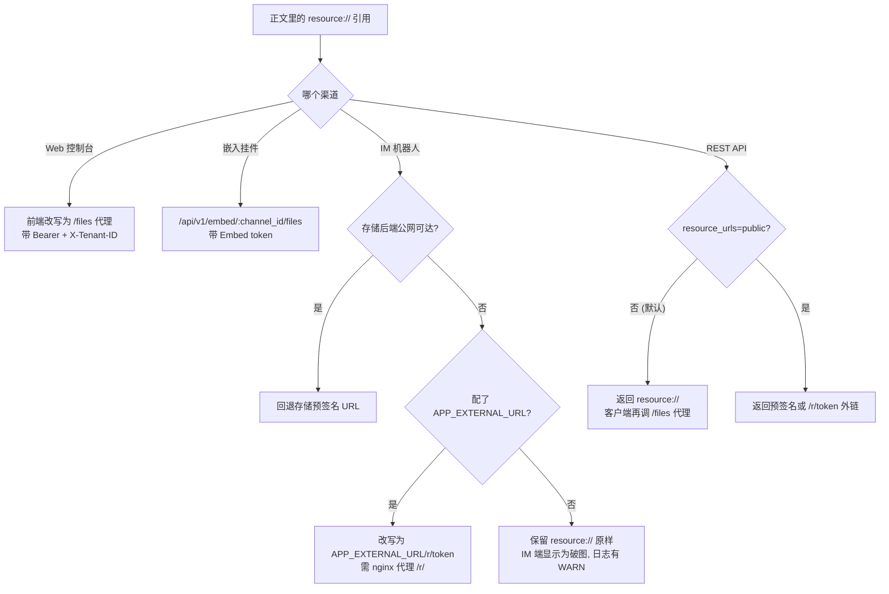

# 图片与文件的对外访问

「回答里的图片在网页上能看，在企业微信里是个破图」「用 API 拿到的引用里图片地址是 `resource://xxx`，前端加载不了」——这是最常见的一类问题。原因不是图挂了，而是**不同渠道能拿到的 URL 形式不一样**，需要按渠道配对。

这一篇把四种形式和每个渠道的取法讲清，末尾是按症状排查的对照表。

## 1. 四种形式

知识库里的图片和附件都存在对象存储里，正文里不直接写存储路径，而是写一个内部引用。对外交付时会被换成下面某一种：

| 形式 | 样子 | 谁能访问 | 有效期 |
| --- | --- | --- | --- |
| **内部引用** | `resource://<handle>` | 谁都不能直接访问，这是给服务端用的稳定句柄 | — |
| **鉴权代理** | `/files`、`/api/v1/knowledge-bases/:id/files`、`/api/v1/embed/:channel_id/files` | 带对应凭证的客户端（登录态 / KB 访问权 / Embed token） | 随凭证 |
| **能力短链** | `/r/<token>` | 任何拿到链接的人（**匿名可读**） | WeKnora 签发的 grant，2 小时 |
| **存储预签名** | 存储后端直接给的 http(s) 链接 | 任何拿到链接的人（**匿名可读**） | 由存储决定，MinIO 默认 24 小时 |

后两种是「拿到即可加载」的外链，代价是在有效期内**任何人**都能读到那个文件——不要写进日志或转给不该看的人。

::: tip 为什么不统一发外链
外链要么依赖存储后端本身公网可达，要么要签发匿名 grant。默认的 MinIO 部署（`minio:9000` 是内网地址）两者都不满足，而网页端本来就有登录态，走鉴权代理更安全也更简单。所以默认形式是内部引用 + 鉴权代理，外链是按需开启的。
:::

## 2. 各渠道分别怎么取

### Web 控制台

前端把 `resource://` 与 `provider://` 引用改写成鉴权代理地址（`frontend/src/utils/protectedFileAccess.ts`），按上下文选路径：普通场景走 `/files`（Bearer + `X-Tenant-ID`）；跨租户共享的知识库走 `/api/v1/knowledge-bases/:id/files`（按 KB 访问权判定，能读到属主租户下的图）。这条路径不需要任何额外配置。

### IM 机器人（最常出问题的一条）

IM 平台不可能带 WeKnora 的凭证，所以必须给它一个**公网可访问的 http(s) URL**。发送前 `rewriteStorageURLs()` 会尝试改写，二选一：

1. **存储后端本身公网可达**——对象存储用公网 endpoint，或把 `MINIO_ENDPOINT` 设成公网 host。此时回退到存储预签名 URL，不需要额外配置；
2. **配 `APP_EXTERNAL_URL`**——引用被改写成 `<APP_EXTERNAL_URL>/r/<token>`，请求经 nginx 的 `location ^~ /r/` 反代回 app。官方前端镜像已内置该 location，自建反代必须补上，否则请求落进 SPA fallback 返回空白页。

默认的 MinIO 内网部署与 `local` 存储只能走第二种。两者都不满足时，改写会**保留原引用**并打一条可操作的 WARN——宁可不改，也不发一个 IM 端注定加载失败的链接。另外，IM 渠道已启用但 `APP_EXTERNAL_URL` 为空时，服务启动会打印一次告警。

### 嵌入挂件

访客是匿名的，图片走渠道维度的鉴权代理 `/api/v1/embed/:channel_id/files`（Embed token 注入渠道租户，handler 校验请求路径属于该租户）。嵌入渠道**强制使用内部引用**，即使部署默认是 `public` 或请求带了 `?resource_urls=public` 也不改写——否则等于给匿名访客发匿名外链，绕过渠道自身的鉴权。

### REST API 与 SDK

默认返回 `resource://`，客户端需要再调一次 `/files` 代理。第三方 App 想直接渲染，可以要求外链：

- 单次请求：`?resource_urls=public`
- 整个部署：`RESOURCE_URL_MODE=public`

单次参数优先于环境变量，因此把部署默认设成 `public` 之后仍可用 `?resource_urls=handle` 单独退回。支持该参数的接口、覆盖范围与安全边界见 [API 总览](../04-api/01-api-overview.md)的「文件引用形式」。

两个限制值得记住：**限定知识库范围的 API Key 用 `public` 会返回 403**（这类 Key 本身就被禁止访问 `/files` 代理，能拿匿名外链等于绕过同一道限制）；**外链能力不具备时该引用保持 `resource://` 原样**，客户端仍可回退到代理。

## 3. 按症状排查

| 症状 | 最可能的原因 | 怎么处理 |
| --- | --- | --- |
| IM 里图片是破图/空白 | 未配 `APP_EXTERNAL_URL` 且存储不公网可达 | 配 `APP_EXTERNAL_URL`，确认 nginx 代理了 `/r/`；查 app 日志里 `rewriteStorageURLs no-op` 的 WARN |
| IM 图片链接能打开但返回空白页面 | nginx 缺 `location ^~ /r/`，请求落进 SPA fallback | 补上该 location（官方前端镜像已内置），见 [Web 前端](../05-clients/01-frontend.md) |
| `APP_EXTERNAL_URL` 配了内网地址或 `localhost` | IM 平台在公网侧，访问不到 | 换成 IM 平台可达的地址；本地开发用 ngrok / cloudflared / frp |
| API 返回的图片地址是 `resource://` | 默认就是内部引用 | 加 `?resource_urls=public`，或调 `/files` 代理 |
| 加了 `resource_urls=public` 仍返回 `resource://` | 部署不具备外链能力（如 `local` 存储且未配 `APP_EXTERNAL_URL`） | 补外链条件，或改用 `/files` 代理 |
| 加了 `resource_urls=public` 返回 403 | 用的是限定知识库的 API Key | 改用 `handle` 模式，或换一把 full-access Key |
| 嵌入挂件里图片不显示，但网页端正常 | 挂件走的是渠道代理，与主站凭证不同 | 确认挂件页面带着有效 Embed token；`resource_urls=public` 对嵌入渠道无效（设计如此） |
| 外链过一段时间失效 | 外链是限时的（grant 2 小时 / MinIO 预签名 24 小时） | 不要缓存外链本身，需要时重新取；同一文件在有效期内会复用同一链接 |
| 网页端图片 404，日志显示租户不匹配 | 跨租户共享库的图存在属主租户下 | 该场景应走 `/api/v1/knowledge-bases/:id/files`，确认前端拿到的是 KB 维度的代理地址 |

## 4. 相关配置

| 配置 | 作用 |
| --- | --- |
| `APP_EXTERNAL_URL` | IM 渠道图片外链的外部可达地址；`resource://` 改写成 `<APP_EXTERNAL_URL>/r/<token>` 的前提 |
| `RESOURCE_URL_MODE` | API 响应里文件引用的默认形式（`handle` / `public`） |
| `MINIO_ENDPOINT` 等存储 endpoint | 设为公网地址时，外链可由存储预签名提供，不必依赖 `APP_EXTERNAL_URL` |
| `SYSTEM_AES_KEY` | 建议配置：可复用 grant 行、稳定直链 URL，并降低读接口的写入压力 |

## 5. 相关章节

- [IM 集成](12-im-integration.md)：改写逻辑与启动告警
- [网页嵌入](13-embed-channel.md)：渠道鉴权与匿名会话
- [API 总览](../04-api/01-api-overview.md)：`resource_urls` 的完整语义
- [配置详解](../01-getting-started/04-configuration.md)：上述环境变量
- [Web 前端](../05-clients/01-frontend.md)：nginx 的 `/files` 与 `/r/` 代理
