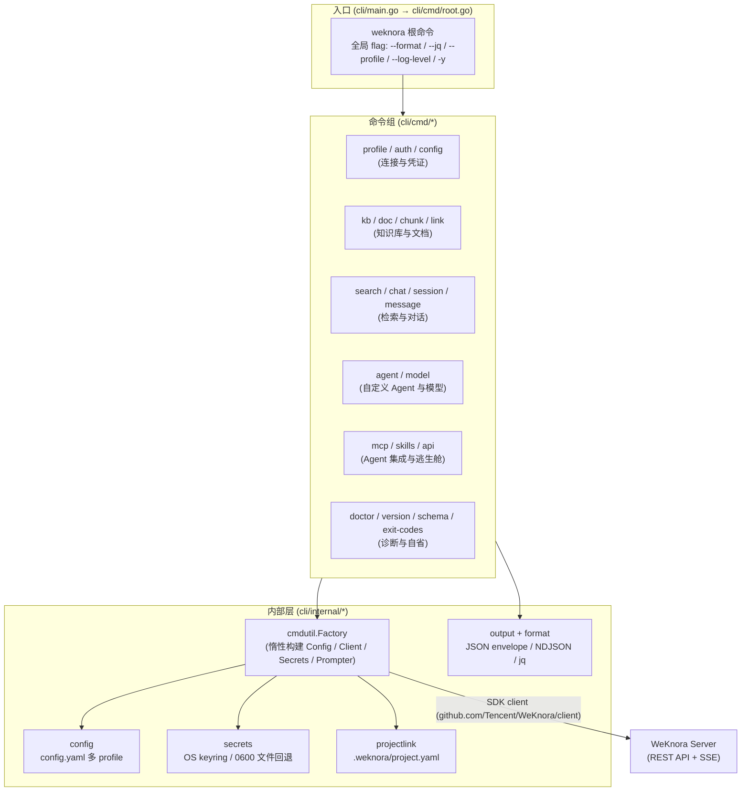

# WeKnora CLI（weknora 命令行工具）

WeKnora CLI（二进制名 `weknora`）是 WeKnora RAG 服务的官方命令行客户端，源码位于仓库的 `cli/` 目录（独立 Go module：`github.com/Tencent/WeKnora/cli`，要求 Go 1.26+）。它面向两类使用者：

- **人类用户**：管理知识库（Knowledge Base）与文档、执行混合检索（hybrid search）、进行有引用溯源（grounded）的流式问答；
- **AI Agent / 脚本**：默认输出 JSON envelope、提供类型化错误码与退出码矩阵、`--dry-run` 预演、`weknora schema` 机器可读契约，以及 `weknora mcp serve` MCP 服务器模式。

命令树入口在 `cli/cmd/root.go`，各命令组按目录组织在 `cli/cmd/` 下。

## 总体架构



---

## 安装

### 从源码构建（当前受支持的安装方式）

`cli/README.md` 明确说明：**从源码构建是目前受支持的安装方式**；预编译二进制、`go install`、CLI 的 Homebrew formula 计划随正式 tag 发布一同提供。

```bash
git clone https://github.com/Tencent/WeKnora.git
cd WeKnora/cli
go build -o weknora .
sudo mv weknora /usr/local/bin/   # 或放到任意 $PATH 目录
```

### 使用 cli/Makefile

`cli/Makefile` 提供带版本元数据（通过 `-ldflags` 注入 `internal/build.Version/Commit/Date`）的构建目标：

| target | 作用 |
|---|---|
| `make build` | 编译到 `./bin/weknora`，注入 `git describe` 版本、commit 短哈希与构建时间 |
| `make test` | `go test ./...` |
| `make test-coverage` | 测试并输出覆盖率报告 |
| `make lint` | `go vet ./...` |
| `make tidy` | `go mod tidy` |
| `make clean` | 删除 `./bin` 与 coverage.out |

注意：Makefile 中**没有** `install` target，构建产物需自行移动到 `$PATH`。

### Homebrew（服务端 Lite 版，非 CLI）

仓库 `Formula/` 目录下目前只有一个 formula：`Formula/weknora-lite.rb`，它安装的是 **WeKnora 服务端的单二进制 Lite 版**（`weknora-lite`），而不是本文档的 `weknora` CLI。该 formula：

- 按 macOS/Linux × arm64/amd64 四个平台从 GitHub Releases 下载 `WeKnora-lite_v<version>_<os>_<arch>.tar.gz`；
- 生成 `weknora-lite` 启动脚本：首次运行自动生成 `~/.config/weknora/.env.lite` 配置、数据存到 `~/.local/share/weknora/`；
- 支持 `brew services start weknora-lite` 作为后台服务运行，日志在 `$(brew --prefix)/var/log/weknora-lite.log`。

在本地用 Lite 版做 CLI 的目标服务器是一个方便的组合：`brew services start weknora-lite` 起服务端，再用 `weknora profile add local --host http://localhost:8080 --use` 连接。

---

## 配置与 Profile 管理

### 配置文件与路径

用户级配置由 `cli/internal/config/config.go` 管理，路径为 `$XDG_CONFIG_HOME/weknora/config.yaml`（`XDG_CONFIG_HOME` 未设置时为 `~/.config/weknora/config.yaml`；路径解析见 `cli/internal/xdg/xdg.go`，在所有操作系统上都遵循 XDG 变量，包括 macOS）。写入使用原子写（临时文件 + rename），权限 0600。

on-disk schema（`config.Config` / `config.Profile`）：

```yaml
current_profile: prod          # 当前激活的 profile 名
profiles:
  prod:
    host: https://kb.example.com   # 必填：服务器地址
    tenant_id: 42                  # 可选：租户 id（仅展示用，不注入请求头）
    user: user@example.com         # 可选：账号邮箱（仅 profile list 展示）
    api_key_ref: keychain://...    # API key 的存储引用（keychain:// 或 file://）
    token_ref: keychain://...      # JWT access token 引用
    refresh_token_ref: keychain://...
    default_kb_id: "..."           # 可选：默认知识库
defaults:
  format: json                 # 可选：CLI 级默认输出格式
  no_version_check: true       # 可选：关闭版本兼容检查
```

### 凭证存储（secrets）

凭证**不写入 config.yaml**，只存引用（ref）。`cli/internal/secrets/` 提供两种后端：

- **KeyringStore**：OS 钥匙串（macOS Keychain / Linux keyring），命名空间 `weknora:<profile>:<key>`，key 为 `access` / `refresh` / `api_key`；
- **FileStore**：钥匙串不可用时（headless CI、无 DBus 的 WSL、容器）回退到 `$XDG_CONFIG_HOME/weknora/secrets/<profile>/<key>` 的 0600 明文文件，`auth login` 会在 stderr 打印一次性警告。

### 多 Profile 切换与解析优先级

Profile 的解析链在 `cli/internal/cmdutil/factory.go`（`Factory.ActiveProfile`）中实现，优先级从高到低：

1. 全局 `--profile <name>` flag（仅本次调用生效，不写盘）；
2. 环境变量 `WEKNORA_PROFILE`；
3. `config.yaml` 中的 `current_profile`（由 `weknora profile use` 持久化切换）。

### 无状态环境变量凭证（headless / CI / Agent 路径）

`factory.go` 的 `buildClientFromEnv` 支持完全绕过 config.yaml 和钥匙串：

| 环境变量 | 作用 |
|---|---|
| `WEKNORA_TOKEN` | Bearer JWT（优先于 `WEKNORA_API_KEY`） |
| `WEKNORA_API_KEY` | API key |
| `WEKNORA_HOST` | 服务器地址（未设置时回退到激活 profile 的 host） |
| `WEKNORA_PROFILE` | 覆盖激活 profile |
| `WEKNORA_KB_ID` | 显式指定知识库 id |
| `WEKNORA_FORMAT` | 默认输出格式（text / json / ndjson） |
| `WEKNORA_LOG_LEVEL` | SDK 日志级别（error / warn / info / debug） |
| `WEKNORA_AGENT_HELP=1` | `--help` 时输出机器可读的 AgentHelp JSON（`cli/internal/cmdutil/agenthelp.go`） |

### 知识库（--kb）解析链

需要知识库作用域的命令（chat、doc、chunk、search chunks/docs 等）通过 `Factory.ResolveKB` 按 4 级回退解析（`cli/internal/cmdutil/factory.go`）：

1. `--kb` flag（UUID 直接透传；名称则经 `ListKnowledgeBases` 做名称 → id 查找，见 `cli/internal/cmdutil/kb.go`）；
2. `WEKNORA_KB_ID` 环境变量；
3. 项目链接文件 `.weknora/project.yaml`（由 `weknora link` 写入，从当前目录向上逐级查找，最多 64 层，见 `cli/internal/projectlink/projectlink.go`）；
4. 均未命中则报 `local.kb_id_required` 错误。

JWT profile（同时持有 access + refresh token）会自动获得 401 透明刷新传输层（`AuthRetryTransport`）：首个 401 触发 `/api/v1/auth/refresh` 并重放原请求；API key profile 与环境变量凭证不做刷新。

---

## 全局 Flag、输出格式与脚本化

### 全局 Flag（`cli/cmd/root.go` 的 `addGlobalFlags`）

| Flag | 简写 | 说明 |
|---|---|---|
| `--format` | | 输出格式：`text` \| `json` \| `ndjson`。**默认 `json`**（与是否 TTY 无关，agent-first 设计；人类可显式 `--format text`）。环境变量 `WEKNORA_FORMAT` 可设默认，优先级：`--format` > `WEKNORA_FORMAT` > 默认 json |
| `--jq` | `-q` | 用 jq 表达式过滤 JSON 输出（要求 `--format json|ndjson`；与显式 `--format text` 组合报错） |
| `--profile` | | 本次调用覆盖激活 profile（不写盘） |
| `--log-level` | | SDK 调试日志级别：error \| warn \| info \| debug |
| `--yes` | `-y` | 跳过破坏性操作的确认提示 |
| `--version` | | 打印版本（等价于 `weknora version`） |

许多写命令还注册了 `--dry-run`（`cli/internal/cmdutil/dryrun.go`），覆盖 kb/doc/agent/model/profile/session/link/api/skills 等几乎全部 mutation 命令：不执行任何写操作，输出 `meta.dry_run=true` + `meta.plan`（将要执行的动作描述）。

### JSON Envelope 输出契约（`cli/internal/output/envelope.go`）

成功路径写 stdout：

```json
{"ok": true, "data": ..., "meta": {"count": 2, "total_count": 2, "has_more": false}, "profile": "prod"}
```

- `data`：命令负载（对象或数组）；`--jq` 投影须以 `.data` 为根，如 `--jq '.data[].id'`；
- `meta`：列表命令携带 `count` / `total_count` / `has_more`；批量操作携带 `successes` / `failures` 及三态 `status`（success / partial / error）；dry-run 携带 `dry_run` + `plan`；
- `profile`：本次解析出的 profile 名。

错误路径写 stderr（stdout 保持干净，便于 `| jq` 管道）：

```json
{"ok": false, "error": {"type": "auth.unauthenticated", "message": "...", "exit_code": 3,
  "hint": "...", "retry_argv": ["weknora","auth","login"], "retryable": false}}
```

错误类型是分层字符串（`cli/internal/cmdutil/errors.go`）：`auth.*`、`resource.*`、`input.*`、`server.*`、`network.error`、`operation.*`、`local.*`、`internal.error`。`retry_argv` 是可直接 exec 的修复命令数组。

`--format ndjson` 用于流式命令（`chat` / `session ask` / `session resume`）：首行注入 CLI `init` 事件（含 session_id、kb_id、profile），之后逐行透传 SDK SSE 事件（`cli/internal/sse/`）。

### 退出码矩阵（`cli/cmd/exitcodes.go`，可运行 `weknora exit-codes` 获取机器可读版本）

| 退出码 | 含义 | 对应错误类型 | Agent 建议动作 |
|---|---|---|---|
| 0 | 成功 | — | 继续 |
| 1 | 类型化本地错误 / 操作失败 / 未分类 | `local.*`, `operation.failed`, `operation.cancelled`, `server.session_create_failed`, `internal.error` | 读 stderr 后决定重试/放弃 |
| 2 | flag / 参数解析错误（未知 flag、参数个数、缺必填 flag） | `input.invalid_argument`（与退出码 5 同类型，靠退出码区分） | 查 `weknora <cmd> --help` |
| 3 | 认证 / 授权失败 | `auth.*` | 重新 `weknora auth login` 后重试 |
| 4 | 资源不存在 | `resource.not_found` | 核对资源 id |
| 5 | 输入值非法（类型化校验，非解析错误） | `input.*`（除 confirmation_required） | 调整参数重试 |
| 6 | 限流 | `server.rate_limited` | 退避后重试 |
| 7 | 服务器 / 网络错误 | `server.*`, `network.*` | 瞬态错误，退避重试 |
| 10 | 需要确认（高风险写操作） | `input.confirmation_required` | 询问人类；获明确批准后加 `-y` 重试 |
| 124 | 操作超时 | `operation.timeout` | 提高 `--timeout` 或检查底层任务 |
| 130 | 被信号取消（SIGINT/SIGTERM） | — | 停止，不要重试 |

**高风险写保护（exit-10 协议）**：删除类、`kb config set`、`api -X DELETE/PUT/PATCH`、`message delete`、`session tool-approval resolve` 等命令在非 TTY / JSON 场景下若未加 `-y`，直接以退出码 10 返回 `input.confirmation_required` 且不执行任何变更 —— agent 无法静默修改服务器状态。

### 机器自省

- `weknora schema`（`cli/cmd/schema.go`）：无参数列出所有叶子命令 + 用途索引；`weknora schema kb create` 输出单个命令的完整契约（used_for、flags、examples、output、risk）；
- `WEKNORA_AGENT_HELP=1 weknora <cmd> --help`：输出同源的 AgentHelp JSON；
- 未知子命令输出类型化 `input.unknown_subcommand` envelope，含 `suggestions`（did-you-mean）与可用子命令列表。

---

## 命令组详解

以下每组对应 `cli/cmd/` 下的一个目录。

### profile — 管理连接目标（`cli/cmd/profile/`）

| 子命令 | Use | 说明 |
|---|---|---|
| list | `list` | 列出已配置的 profile |
| add | `add <name>` | 注册新 profile（只记 host，不含凭证） |
| use | `use <name>` | 持久化切换默认 profile |
| remove | `remove <name>` | 删除 profile（清除 config 条目与钥匙串引用） |

`add` 的关键 flag：`--host`（必填，服务器 URL）、`--user`（可选展示用邮箱）、`--use`（添加后立即切换）。

```bash
weknora profile add prod --host=https://kb.example.com --use
weknora profile list --format json
```

### auth — 凭证管理（`cli/cmd/auth/`）

| 子命令 | Use | 说明 |
|---|---|---|
| login | `login` | 认证**当前激活 profile**：交互式邮箱+密码，或 `--with-token` 从 stdin 读 API key（会先调 `/auth/me` 校验再持久化） |
| logout | `logout` | 清除某 profile 的存储凭证；`--all` 清除全部 profile |
| list | `list` | 列出认证 profile |
| status | `status` | 显示激活 profile、principal 与 token 状态 |
| refresh | `refresh` | 用存储的 refresh token 换新 JWT access token |
| token | `token` | 把激活 profile 的原始凭证打印到 stdout（shell 脚本用） |

```bash
weknora auth login                                    # 交互式（TTY）
echo "$WEKNORA_API_KEY" | weknora auth login --with-token   # 非交互 / agent
weknora auth status --format json
```

注意：`auth login` 不接受 `--host`，必须先 `profile add ... --use` 创建激活 profile。

### config — 查看解析后的配置（`cli/cmd/config/`）

| 子命令 | Use | 说明 |
|---|---|---|
| view | `view` | 只读展示解析后的配置及**每个值的来源**（active_profile / profile_source / auth_source / host / kb_id / kb_source / log_level / format_default / config_file / secrets / project_link 等），全程不发网络请求 |

```bash
weknora config view --format json --jq '.data.kb_source'
```

### link / unlink — 目录绑定知识库（`cli/cmd/link/`）

`link` 与 `unlink` 都直接挂在根命令下（见 `root.go`）。

| 命令 | Use | 说明 |
|---|---|---|
| link | `link [kb]` | 在当前目录写 `.weknora/project.yaml`，绑定 KB（位置参数或 `--kb`，等价；TTY 下不传参进入交互选择；已有链接直接覆盖）。支持 `--dry-run` |
| unlink | `unlink` | 删除当前目录的 KB 绑定 |

```bash
weknora link engineering            # 名称自动解析为 id
weknora link --kb a32a63ff-fb36-4874-bcaa-30f48570a694
```

### kb — 知识库管理（`cli/cmd/kb/`）

| 子命令 | Use | 说明 |
|---|---|---|
| list | `list` | 列出可见知识库；`--pinned` 只看置顶，`--limit/-L`（默认 30） |
| view | `view <kb-id>` | 按 ID 查看 |
| create | `create <name>` | 创建；`--description`、`--embedding-model`、`--chat-model`（创建即可用）、`--storage-provider` |
| update | `update <kb-id>` | 改名/描述：`--name`、`--description`（在 `kb/edit.go`） |
| delete | `delete <kb-id>` | 删除（exit-10 确认保护，`-y` 跳过） |
| pin / unpin | `pin <kb-id>` / `unpin <kb-id>` | 置顶/取消置顶（幂等：已处于目标状态则 no-op） |
| status | `status <kb-id>` | 浅健康检查（1 次 HTTP） |
| check | `check <kb-id>` | 端到端校验（状态 + 失败文档聚合） |
| config | `config <kb-id>` | 只读查看模型配置（embedding/llm/rerank/multimodal，`retrieval_ready` 标志，绝不显示 API key） |
| config set | `set <kb-id>` | 绑定模型：`--chat-model` 与 `--embedding-model` 均必填（id 或名称）；高风险写，exit-10 保护 |

```bash
weknora kb create docs --embedding-model text-embedding-3 --chat-model gpt-4o
weknora kb config set <kb-id> --chat-model <id> --embedding-model <id> -y
```

### doc — 文档管理（`cli/cmd/doc/`）

| 子命令 | Use | 说明 |
|---|---|---|
| upload | `upload <file>` | 上传本地文件；`--name`、`--recursive` + `--glob`（目录批量，如 `'*.pdf'`）、`--metadata key=value`（可重复）、`--enable-multimodel`、`--channel` |
| fetch | `fetch <url>` | 抓取远程文档；`--name`、`--title`、`--file-type`（URL 无扩展名时的类型提示）、`--tag-id`、`--channel` |
| create | `create` | 用内联 Markdown 文本建条目：`--text`（必填）、`--title`、`--tag-id`、`--channel` |
| list | `list` | 列表；`--status pending|processing|completed|failed`、`--keyword`、`--file-type`、`--source`、`--tag-id`、`--start-time/--end-time`（RFC3339）、`--limit/-L`、`--page-size`、`--all-pages` |
| view | `view <doc-id>` | 查看文档 |
| update | `update <doc-id>` | `--title`、`--description` |
| delete | `delete <doc-id> [<doc-id>...] \| --all --kb=<kb-id>` | 批量删除 / 清空 KB（exit-10 保护） |
| download | `download <doc-id>` | 下载原文件；`-O/--output`（`-` 到 stdout）、`--clobber` |
| reparse | `reparse <doc-id>` | 重新解析 |
| wait | `wait <doc-id> [<doc-id>...]` | 轮询等待解析完成；`--timeout`（默认 10m，超时退出码 124）、`--interval`（默认 2s，指数退避封顶 15s） |

```bash
weknora doc upload ./design.pdf --kb docs
weknora doc wait <doc-id> --timeout 5m && weknora search chunks "RRF" --kb docs
```

### chunk — 分块调试（`cli/cmd/chunk/`）

| 子命令 | Use | 说明 |
|---|---|---|
| list | `list` | 枚举文档分块（管理/调试用途，非检索）：`--doc`（必填）、`--limit/-L`、`--page-size`、`--all-pages` |
| view | `view <chunk-id>` | 查看单个分块内容 |
| delete | `delete <chunk-id> [<chunk-id>...] --doc <doc-id>` | 删除分块（`--doc` 必填；exit-10 保护） |

### search — 检索（`cli/cmd/search/`）

| 子命令 | Use | 说明 |
|---|---|---|
| chunks | `chunks "<query>"` | **混合检索**（向量 + 关键词）：`--kb`、`--limit/-L`（默认 8，为 RAG 上下文窗口调优）、`--vector-threshold`、`--keyword-threshold`、`--no-vector`、`--no-keyword` |
| docs | `docs "<query>"` | 按关键词找文档（服务端过滤）：`--kb`、`--limit`、`--page-size`、`--all-pages` |
| kb | `kb "<query>"` | 按名称/描述找知识库（客户端子串匹配）：`--limit` |
| sessions | `sessions "<query>"` | 按标题/描述找会话（客户端子串匹配）：`--limit`、`--page-size`、`--all-pages` |

```bash
weknora search chunks "rate limiting design" --kb docs --limit 5 --format json --jq '.data[].content'
```

### chat — 流式 RAG 问答（`cli/cmd/chat/chat.go`）

单命令：`chat "<text>"`。三种输出模式共享一次 SDK 流式调用：

- `--format json`（默认）：把流投影缓冲为单个 envelope（events、session_id、assistant_message_id 等）；
- `--format text`：实时人类可读回答流；
- `--format ndjson`：原始 SSE 事件透传（首行 init 事件带 session_id / kb_id）。

flag：`--kb`、`--session`（续接已有会话）、`--reference`（带引用索引）、`--verbose`（带 reasoning / 工具 / 生命周期事件）。

```bash
weknora chat "What is RRF?" --kb a32a63ff-fb36-4874-bcaa-30f48570a694
weknora chat "继续" --session sess_abc --format ndjson
```

### session — 会话管理（`cli/cmd/session/`）

| 子命令 | Use | 说明 |
|---|---|---|
| list | `list` | 会话列表：`--limit/-L`、`--page-size`、`--all-pages`、`--since`（如 7d / 24h / 30m） |
| view | `view <session-id>` | 查看会话；`--full` 连同聊天记录一起加载、`--limit/-L` |
| ask | `ask "<text>"` | 向**服务端自定义 Agent** 提问：`-a/--agent`（必填）、`--session`、`--reference`、`--verbose` |
| resume | `resume <session-id>` | 续接进行中/已完成消息的 SSE 事件流：`-m/--message`（必填） |
| stop | `stop <session-id>` | 停止某条 assistant 消息的生成：`-m/--message`（必填） |
| delete | `delete <session-id> [<session-id>...]` | 批量删除（exit-10 保护） |
| tool-approval resolve | `resolve <pending-id>` | 批准/拒绝 Agent 运行中挂起的工具调用：`--reject`、`--reason`、`--modified-args`（JSON，仅批准时）；高风险写 |

```bash
weknora session ask "总结这个 KB" --agent agt_123 --format ndjson
weknora session tool-approval resolve <pending-id> --reject --reason "不允许写操作" -y
```

### message — 会话内消息（`cli/cmd/message/`）

| 子命令 | Use | 说明 |
|---|---|---|
| list | `list --session <session-id>` | 列消息（新→旧，时间游标分页）：`--session`（必填）、`--limit/-L`、`--before`（RFC3339） |
| search | `search "<query>"` | 跨会话搜索聊天历史（问答对）：`--limit/-L`（默认 20）、`--mode keyword|vector|hybrid`、`--session`（可重复，限定范围） |
| delete | `delete <message-id> --session <session-id>` | 删除单条消息（`--session` 必填；高风险写，exit-10 保护） |

### agent — 自定义 Agent CRUD（`cli/cmd/agent/`）

| 子命令 | Use | 说明 |
|---|---|---|
| list | `list` | 列表：`--limit/-L` |
| view | `view <agent-id>` | 查看配置 |
| create | `create <name>` | 创建：`--model`（必填，除非 `--generate-skeleton`）、`--description`、`--system-prompt` / `--system-prompt-file`（互斥，`-` 读 stdin）、`--agent-mode`、`--attach-kb`（可重复）、`--kb-selection-mode`、`--rerank-model`、`--temperature`、`--from`（复制已有 Agent）、`--config-file`（完整 AgentConfig YAML/JSON）、`--generate-skeleton`（输出空白配置骨架） |
| update | `update <agent-id>` | 更新（`agent/edit.go`）：`--name`、`--description`、`--model`、`--system-prompt(-file)`、`--agent-mode`、`--rerank-model`、`--temperature`、`--add-kb` / `--remove-kb`（可重复、幂等）、`--kb-selection-mode`、`--config-file`（整体替换基线后再叠加细粒度 flag） |
| delete | `delete <agent-id>` | 删除（exit-10 保护） |
| status | `status <agent-id>` | 健康状态 |
| check | `check <agent-id>` | 端到端校验（状态 + kb_scope 可达性） |

```bash
weknora agent create researcher --model gpt-4o --attach-kb <kb-id> --system-prompt-file ./prompt.md
weknora agent update agt_123 --add-kb <kb-id2> --temperature 0.3
```

### model — 模型管理（`cli/cmd/model/`）

| 子命令 | Use | 说明 |
|---|---|---|
| list | `list` | 列表：`--type`（Embedding / Rerank / KnowledgeQA / VLLM / ASR）、`--source`（local / remote / openai / aliyun …）、`--limit/-L` |
| view | `view <model-id>` | 查看 |
| create | `create <name>` | 注册模型：`--type`（必填；`chat` 等价 KnowledgeQA）、`--source`（必填；local=Ollama，remote=provider API）、`--provider`（source=remote 时必填）、`--base-url`、`--api-key-stdin`（从 stdin 读 key，不进 argv/history）、`--dimension`（Embedding 专用）、`--default`、`--param key=value`（可重复，值按 JSON 解析）、`--display-name`、`--description` |
| update | `update <model-id>` | `--display-name`、`--description`、`--base-url`、`--api-key-stdin`（轮换 key）、`--param`、`--default` |
| delete | `delete <model-id>` | 删除（exit-10 保护） |

```bash
weknora model create bge-m3 --type Embedding --source local --base-url http://localhost:11434 --dimension 1024
echo "$OPENAI_KEY" | weknora model create gpt-4o --type chat --source remote --provider openai --api-key-stdin
```

### api — 原始 HTTP 逃生舱（`cli/cmd/api/api.go`）

单命令：`api <path>`。自动携带激活 profile 的认证 / 租户 / request-id 头。

| Flag | 简写 | 说明 |
|---|---|---|
| `--method` | `-X` | HTTP 方法（默认 GET；提供 body 时自动升级为 POST） |
| `--data` | `-d` | 内联 JSON body（与 `--input` / `-F` 互斥） |
| `--input` | | 从文件读 body（`-` 为 stdin） |
| `--field` | `-F` | `key=value` 组装 JSON 对象 body（可重复；true/false/null/数字自动类型化） |
| `--paginate` | | 跟随 offset 分页（?page=N&page_size=M），合并为单个 `{data, total}` 响应 |

`-X DELETE` 受 exit-10 destructive 确认保护；`PUT/PATCH` 受写确认保护；`POST` 与 typed create 一致不设门槛。支持 `--dry-run`（仅限非 GET）。

```bash
weknora api /api/v1/knowledge-bases                              # GET
weknora api /api/v1/knowledge-bases -d '{"name":"foo"}'          # POST（自动）
weknora api /api/v1/knowledge-bases/<id> -X DELETE -y
```

### mcp — Model Context Protocol 服务器（`cli/cmd/mcp/`）

| 子命令 | Use | 说明 |
|---|---|---|
| serve | `serve` | 在 stdin/stdout 上运行 JSON-RPC 2.0 MCP 服务器（当前仅 stdio 传输）；日志走 stderr；启动即急切构建 SDK client，无 profile 时以 `auth.unauthenticated` 立即失败 |

暴露**精选 10 个工具**（实现见 `cli/internal/mcp/tools.go`）：`kb_list` / `kb_view` / `doc_list` / `doc_view` / `doc_download` / `search_chunks` / `chunk_list` / `agent_list` 为只读；`chat` 与 `session_ask` 会创建会话/消息记录。破坏性动词（create / delete / upload）被刻意排除。

MCP 客户端注册示例（写入客户端的 `mcpServers` 配置）：

```json
{
  "mcpServers": {
    "weknora": { "command": "weknora", "args": ["mcp", "serve"] }
  }
}
```

### skills — 内嵌 Agent Skills（`cli/cmd/skills/skills.go`）

| 子命令 | Use | 说明 |
|---|---|---|
| list | `list` | 列出二进制内嵌（`cli/skills/embed.go`）的 Agent Skills（name / description / files） |
| install | `install` | 把内嵌 skills 写入 Agent 的 skills 目录：`--dir`（默认 `~/.claude/skills`，支持 `~` 展开）、`--force`（覆盖已存在文件，否则跳过）；支持 `--dry-run` |

```bash
weknora skills install --dry-run --format json
weknora skills install --dir ~/.claude/skills --force
```

### doctor — 自检（`cli/cmd/doctor/doctor.go`）

单命令：`doctor`。运行 4 项检查：base URL 可达性、认证、服务器版本兼容、凭证存储。每项状态为 `ok / warn / fail / skip`；任一 `fail` → 退出码 1（JSON 数据仍会输出）；仅 warn → 退出码 0 但 `summary.all_passed=false`。

flag：`--no-cache`（绕过 `$XDG_CACHE_HOME/weknora/server-info.yaml` 缓存强制重探测）、`--offline`（跳过网络检查，仅验本地钥匙串/文件存储）。

```bash
weknora doctor --format json --jq '.data.summary.all_passed'
```

### 根级辅助命令（`cli/cmd/root.go`、`schema.go`、`exitcodes.go`）

| 命令 | Use | 说明 |
|---|---|---|
| version | `version` | 构建元数据（version / commit / date） |
| schema | `schema [command...]` | 机器可读命令契约（见上文"机器自省"） |
| exit-codes | `exit-codes` | 退出码矩阵（JSON 或表格） |

---

## 验收测试覆盖了什么（`cli/acceptance/`）

`cli/acceptance/` 是 CLI 的跨切面契约/集成测试层（`doc.go` 注明"contract surface — change with care"），分两个子包：

### contract/ — 线协议契约测试

- **`wire_test.go`**：在进程内驱动完整 cobra 命令树，对每个场景捕获 stdout/stderr，并与 `testdata/wire/` 下的 JSON golden 文件逐字节比对。覆盖的场景包括：`version`、`auth_status`（成功 + `auth.unauthenticated` 失败）、`doctor`（offline 成功 + 网络错误）、`kb_list`（成功 / 空列表 / `auth.forbidden`）、`kb_view`（成功 / `resource.not_found`）、`profile_use`、`search`（成功 / `input.invalid` / not_found）。golden 文件固化了完整 envelope 形状（如 `{"ok":true,"data":[...],"meta":{"count":2,"total_count":2}}`），任何 wire 契约漂移都会立刻被发现；失败用例断言 stderr 包含预期的类型化错误码。
- **`errorcodes_test.go`**：用 go/ast 扫描 `cli/cmd/` 中每一处 `cmdutil.NewError(CodeXxx, ...)` / `Wrapf(CodeXxx, ...)` 字面引用，验证错误码全部登记在 `cmdutil.AllCodes()` 注册表中 —— 保证文档化的错误码清单与代码不脱节。

### e2e/ — 真实服务器端到端测试

`e2e_test.go` 带 `//go:build acceptance_e2e` 构建标签，默认 `go test ./...` 不运行；显式执行方式：

```bash
cd cli
WEKNORA_E2E_HOST=https://kb.example.com WEKNORA_E2E_TOKEN=eyJ... \
  go test -tags=acceptance_e2e -v ./acceptance/e2e/...
```

`TestRAGFullLoop` 编译真实 CLI 二进制，通过 `WEKNORA_HOST`/`WEKNORA_TOKEN` 环境变量凭证路径（验证了无钥匙串的 headless 认证链路）驱动完整 RAG 闭环：**kb create（带模型绑定）→ doc upload → doc wait（等待索引）→ search → chat**，每一步解析上一步的 JSON envelope 提取 id，同时校验功能行为与 wire 契约稳定性；临时 KB 通过 `t.Cleanup` 保证测试失败也会清理。

此外 `cli/cmd/` 下还有横切的树级测试（非 acceptance 目录，但同样约束整树行为）：`required_positional_coverage_test.go`、`dryrun_coverage_test.go`、`agenthelp_coverage_test.go`、`root_unknown_subcommand_test.go` 等，确保每个叶子命令的位置参数校验、`--dry-run` 支持、AgentHelp 元数据与未知子命令处理全覆盖。

---

## 5 分钟上手

```bash
# 1. 注册服务器为 profile 并激活
weknora profile add prod --host https://kb.example.com --use

# 2. 认证（交互式；agent 场景用 --with-token）
weknora auth login

# 3. 自检
weknora doctor

# 4. 建库、绑定模型、传文档、等索引
weknora kb create docs --embedding-model <emb> --chat-model <llm>
weknora doc upload ./design.pdf --kb docs
weknora doc wait <doc-id>

# 5. 检索与问答
weknora search chunks "rate limiting" --kb docs
weknora chat "总结这篇设计文档" --kb docs
```
