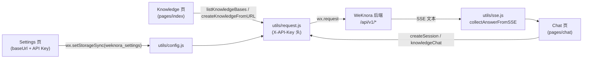

# 微信小程序客户端

WeKnora 在仓库的 `miniprogram/` 目录下提供了一个轻量级的微信小程序客户端，作为移动端的快捷入口。它不试图复刻 Web 前端的完整功能，而是聚焦三件事：

- 配置 WeKnora API 地址与租户 API Key；
- 列出并选择知识库（Knowledge Base），把网页 URL 导入到选中的知识库；
- 面向选中的知识库发起知识问答（Knowledge Chat）。

## 技术栈

该客户端是**原生微信小程序**（native Mini Program），未使用 Taro / uni-app / mpvue 等跨端框架，也没有任何 npm 运行时依赖：

- `miniprogram/app.js` — 标准的 `App({...})` 入口，`onLaunch` 时向本地存储写入默认设置；
- `miniprogram/app.json` — 标准小程序全局配置（`pages`、`window`、`tabBar`）；
- `miniprogram/app.wxss` — 全局样式；页面均为 `js / wxml / wxss / json` 四件套；
- `miniprogram/package.json` — 包名 `weknora-miniprogram`（version `0.1.0`），`description` 为 "WeChat Mini Program plugin for WeKnora"，**没有 `dependencies`**，仅有一个测试脚本（见下文「测试」）；
- `miniprogram/project.config.json` — `compileType: "miniprogram"`，`libVersion: "latest"`（基础库使用最新版），编译选项开启 `es6`、`enhance`、`postcss`、`minified`，并开启 `urlCheck: true`（合法域名校验）。**注意：该文件刻意不包含 `appid` 字段**，AppID 通过私有配置文件提供（见「构建与发布」）。

全局窗口样式：导航栏标题 `WeKnora`，背景色 `#0d3b2a`（深绿），文字白色。

## 页面清单

`miniprogram/app.json` 中注册了 3 个页面，且三者同时构成底部 `tabBar`（选中色 `#07c05f`）：

| 页面路径 | 名称（tabBar 文案） | 功能 |
| --- | --- | --- |
| `pages/index/index` | Knowledge（知识库） | 首页。检测是否已配置 baseUrl / API Key，未配置时提示并可一键跳转 Settings；调用 `GET /api/v1/knowledge-bases` 加载知识库列表，通过 `picker` 或列表点选知识库（选择结果持久化到本地存储）；输入网页 URL 后调用 `POST /api/v1/knowledge-bases/{id}/knowledge/url` 将该 URL 导入选中知识库（`enable_multimodel` 固定为 `false`） |
| `pages/chat/chat` | Chat（问答） | 知识问答页。首次提问时通过 `POST /api/v1/sessions` 懒创建会话（携带选中的 `knowledge_base_id`），随后调用 `POST /api/v1/knowledge-chat/{sessionId}` 提问；返回体为 SSE 文本，客户端用 `utils/sse.js` 解析并拼接 `response_type === "answer"` 的分片后整体展示（解析失败则回退展示原始响应） |
| `pages/settings/settings` | Settings（设置） | 连接配置页。填写 API Base URL 与 API Key（密码输入框），保存到本地存储 `weknora_settings` |

## 后端地址与认证配置

小程序**不在代码中硬编码后端地址**，一切连接信息由用户在「Settings」页填写，存储于 `wx.setStorageSync` 的本地存储键 `weknora_settings` 中，结构包含三个字段：

```js
{
  baseUrl: "http://localhost:8080",   // app.js onLaunch 写入的默认值
  apiKey: "",
  selectedKnowledgeBaseId: ""
}
```

- **默认值**：`miniprogram/app.js` 在 `onLaunch` 中若发现本地无设置，会写入默认 `baseUrl: "http://localhost:8080"`、空 `apiKey`。默认值仅便于本地开发，实际使用必须在 Settings 页改为真实地址。
- **读写与规范化**：`miniprogram/utils/config.js` 提供 `getSettings()` / `saveSettings()`，并通过 `normalizeBaseUrl()` 去除首尾空白与末尾 `/`。
- **认证方式为 API Key**：`miniprogram/utils/request.js` 中所有请求统一携带请求头：
  - `X-API-Key: <用户填写的 API Key>`（来自 WeKnora 租户设置页，形如 `sk-...`）；
  - `X-Request-ID: mp-<时间戳>-<随机串>`（便于服务端追踪）；
  - `Content-Type: application/json`。
- **前置校验**：`baseUrl` 或 `apiKey` 任一缺失时，请求会直接以错误 Promise 拒绝（"Please configure the WeKnora API base URL / API key first."）；`pages/index/index.js` 的 `onShow` 也会据此显示引导用户去 Settings 页的提示。
- **AppID 配置**：微信小程序 AppID 不放在共享的 `project.config.json` 中，而是复制 `miniprogram/project.private.config.json.example` 为 `project.private.config.json` 并填入真实 AppID（示例文件内容为 `{"appid": "your-wechat-mini-program-appid"}`）。

调用到的后端接口（均定义在 `miniprogram/utils/request.js`）：

| 函数 | 方法与路径 |
| --- | --- |
| `listKnowledgeBases()` | `GET /api/v1/knowledge-bases` |
| `createKnowledgeFromURL(kbId, url, enableMultimodel)` | `POST /api/v1/knowledge-bases/{kbId}/knowledge/url` |
| `createSession(kbId)` | `POST /api/v1/sessions` |
| `knowledgeChat(sessionId, query, kbId)` | `POST /api/v1/knowledge-chat/{sessionId}` |

## utils/ 工具模块

| 文件 | 职责 |
| --- | --- |
| `miniprogram/utils/config.js` | 设置的持久化层：定义存储键 `STORAGE_KEY = "weknora_settings"`，提供 `getSettings()`、`saveSettings()`（合并式更新）与 `normalizeBaseUrl()`（trim 并去除末尾斜杠） |
| `miniprogram/utils/request.js` | 基于 `wx.request` 的 Promise 化 HTTP 封装：拼接 `baseUrl + path`、注入 `X-API-Key` / `X-Request-ID` 头、统一 2xx 判定与错误消息提取（优先 `error.message`，其次 `message`，兜底 `HTTP <status>`）；并导出上表 4 个业务 API 函数 |
| `miniprogram/utils/sse.js` | Server-Sent Events 文本解析器：`parseSSE(raw)` 按空行切分事件块、解析 `event:` / `data:` 行；`collectAnswerFromSSE(raw)` 将各事件的 `data` 按 JSON 解析并累加 `response_type === "answer"` 的 `content`，得到最终答案文本。注意小程序端**不做流式渲染**，而是等 `wx.request` 拿到完整 SSE 文本后一次性解析展示 |

## 数据流概览



## 构建与发布流程

小程序无需编译步骤（原生开发、无构建工具链），直接用微信开发者工具（WeChat DevTools）打开即可：

1. **导入项目**：在微信开发者工具中选择「导入项目」，目录指向仓库的 `miniprogram/`。工具会读取 `project.config.json`（项目名 "WeKnora Mini Program"）。
2. **配置 AppID**：复制 `miniprogram/project.private.config.json.example` 为 `project.private.config.json`，将 `appid` 替换为你自己的小程序 AppID。共享的 `project.config.json` 刻意不含 AppID，避免维护者被迫使用占位项目；`project.private.config.json` 属于个人私有配置，不应提交。
3. **配置后端连接**：运行后进入 **Settings** tab，填写 API Base URL（如 `https://weknora.example.com`）与从 WeKnora 租户设置页获取的 API Key，保存。
4. **本地调试注意**：`project.config.json` 开启了 `urlCheck: true`，开发者工具默认会拦截 `localhost` 等非合法域名请求。本地测试可在 DevTools 中勾选「不校验合法域名」，或通过 HTTPS 开发域名暴露 WeKnora 服务。
5. **发布**：正式发布前，需在微信公众平台的小程序管理后台，把 WeKnora API 域名（必须为 HTTPS）加入 request 合法域名（request 域名白名单）；随后在开发者工具中点击「上传」提交代码，再在管理后台提交审核并发布。

### 测试

`miniprogram/package.json` 定义了唯一脚本：

```bash
cd miniprogram
npm test    # 实际执行 node --test ../tests/miniprogram/*.test.js
```

即使用 Node.js 内置 test runner 运行仓库 `tests/miniprogram/miniprogram.test.js` 中的单元测试（覆盖 `utils/` 下的纯函数逻辑），无需安装任何依赖。
