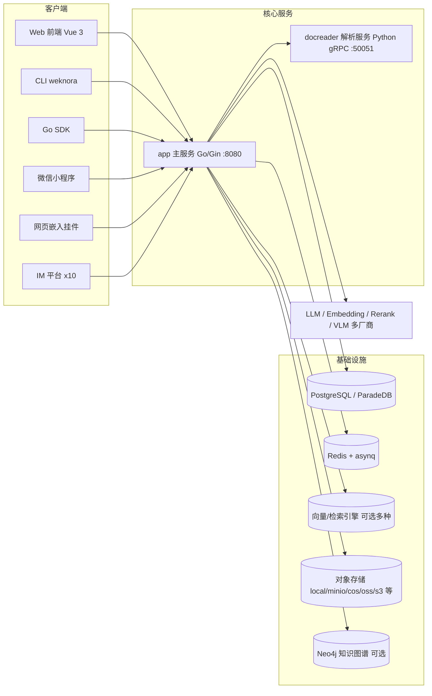

# WeKnora 文档

WeKnora（维娜拉）是腾讯开源的企业级知识库与 RAG（Retrieval-Augmented Generation）系统：Go 单体后端 + Vue 3 前端 + Python 文档解析微服务（docreader），支持多租户、多知识库、混合检索、Agent 智能体、知识图谱、Wiki 生成、MCP 集成、多平台 IM 接入与网页嵌入等能力。

本目录是 WeKnora 的官方文档，按「入门 → 架构 → 功能 → API → 客户端 → 开发」六个部分组织。

## 文档站点

本目录同时是一个 VitePress 站点，Markdown 即页面，新增文件会自动进入侧边栏（标题取正文一级标题，目录顺序按文件名数字前缀）。

```bash
npm install
npm run dev      # 本地预览
npm run build    # 产物输出到 .vitepress/dist
npm run preview  # 预览构建产物
```

主题位于 `.vitepress/theme/`：`style.css` 是排版与配色的单一来源，`Landing.vue` 是首页。

## 写作约定

- **先讲怎么用，再讲怎么实现。** 每篇功能文档开头回答「这东西解决什么问题、在界面上怎么用」，之后才展开数据模型、流程与源码细节；源码索引统一放在文末的「实现参考」小节。
- **面向用户的章节**（01 快速开始、03 功能模块、05 客户端）以任务为主线；**面向开发者的章节**（02 架构、04 API、06 开发指南）以结构为主线，可以直接深入细节。
- 涉及界面操作的地方配截图，用 `<Screenshot>` 组件引用（见下节）。

## 截图

截图用全局组件 `<Screenshot>` 引用，图片放在 `public/screenshots/` 下：

```md
<Screenshot
  src="/screenshots/kb-document-list.png"
  caption="知识库文档列表：解析状态、标签与批量操作"
  hint="展示文档列表页，包含解析状态列、标签列、顶部筛选栏与勾选后出现的批量操作栏。" />
```

图片文件不存在时，组件会渲染成一个带说明的虚线占位框，标出期望的文件路径与该图应当展示的内容；把同名图片放进 `website-docs/public/screenshots/` 即可自动生效，**不需要改 Markdown**。

当前待补充的截图共 2 张：

| 文件名（放在 `public/screenshots/` 下） | 出现位置 | 应当展示 |
| --- | --- | --- |
| `kb-folder-tree.png` | 知识库 | 文档列表的文件夹树 |
| `kg-graph.png` | 知识图谱 | 实体关系图 |

仓库 `docs/images/` 下已有一批现成的产品截图（`qa.png`、`knowledgebases.png`、`wiki-browser.png`、`wiki-graph.png`、`settings.png`、`agent-qa.png`、`graph1-3.png`、`langfuse.png`、`rbac-*.png` 等），补图时可以先看看能否直接复用。

## 阅读路径建议

- **初次使用**：01 快速开始 四篇按顺序读完即可完成部署与首次问答。
- **评估选型 / 了解原理**：02 架构 五篇给出系统全貌与两条核心流水线（文档入库、检索问答）。
- **使用某项具体功能**：直接查 03 功能模块 对应章节。
- **对接 API / 写集成**：04 API 参考 + 05 客户端（CLI / Go SDK）。
- **二次开发 / 贡献代码**：06 开发指南，尤其是扩展点指南。

## 目录

### 01 快速开始

| 文档 | 内容 |
| --- | --- |
| [产品介绍](01-getting-started/01-introduction.md) | WeKnora 是什么、核心概念（租户/知识库/知识/分块/会话/Agent 等）、功能总览与系统组件图 |
| [安装部署](01-getting-started/02-installation.md) | docker-compose（含 12 个可选 profile）、开发模式、Helm、Lite 单二进制与桌面应用、Homebrew |
| [快速上手](01-getting-started/03-quickstart.md) | 注册 → 初始化向导 → 配置模型 → 建库 → 上传 → 问答的完整路径，含可直接执行的 curl 链路 |
| [配置详解](01-getting-started/04-configuration.md) | config.yaml 全字段、约 150 个环境变量、prompt 模板、内置模型与内置 Agent 配置 |

### 02 架构

| 文档 | 内容 |
| --- | --- |
| [总体架构](02-architecture/01-overview.md) | 组件构成、技术栈、进程间通信、顶层目录导览 |
| [Go 后端设计](02-architecture/02-backend-design.md) | 四层架构、uber/dig 依赖注入、启动与优雅退出、路由与中间件、领域模型 ER 图 |
| [文档入库流程](02-architecture/03-document-pipeline.md) | 上传/URL/手动创建 → 存储 → 解析 → 分块 → 向量化 → 索引 → 后处理的全链路与状态机 |
| [检索问答流程](02-architecture/04-rag-pipeline.md) | chat_pipeline 插件流水线、跨库检索与融合、重排、流式输出（SSE）与引用生成 |
| [异步任务系统](02-architecture/05-async-tasks.md) | asynq 队列拓扑、6 个 worker pool、Lite 同步模式、死信与任务巡检、事件总线 |

### 03 功能模块

| 文档 | 内容 |
| --- | --- |
| [租户、用户与认证授权](03-features/01-tenant-auth.md) | 多租户模型、JWT / API Key / OIDC、RBAC 角色矩阵、组织与共享空间 |
| [知识库与知识管理](03-features/02-knowledge-base.md) | 知识库类型与全部可配置项、树形文件夹、多标签与批量打标、分块编辑与版本历史、自定义元数据、预览安全、复制与移动、活动流、配额 |
| [文档解析服务 docreader](03-features/03-document-parsing.md) | gRPC 接口、三引擎注册表、解析器矩阵（含 HTML / MHTML / Excel 表头模式）、并发模型、部署与扩容 |
| [分块机制](03-features/04-chunking.md) | 自适应分块架构（heading/heuristic/recursive）、父子分块、语义边界重叠、ContextHeader、调试端点 |
| [检索引擎与向量存储](03-features/05-retrieval-engines.md) | 各检索引擎（向量/BM25/全文/混合）能力对比、驱动选择、维度管理、打分归一化 |
| [模型管理](03-features/06-models.md) | 5 类模型、26 个厂商 Provider、内置模型机制、Ollama 本地模型、限流与用量 |
| [Agent 引擎](03-features/07-agent.md) | ReAct 循环、24 个内置工具、上下文与记忆管理、技能系统与沙箱、自定义 Agent、建议问题 |
| [MCP 集成](03-features/08-mcp.md) | MCP 客户端管理、OAuth 2.0 + PKCE 全流程、工具审批、WeKnora MCP Server（`tencent-weknora-mcp`，29 个工具） |
| [知识图谱](03-features/09-knowledge-graph.md) | 两级开关、LLM 实体关系抽取、Neo4j 存储、图谱增强检索 |
| [数据源导入](03-features/10-datasource.md) | 连接器体系（飞书/Lark/Notion/语雀/RSS）、凭据加密、同步调度与增量更新 |
| [网络搜索与网页抓取](03-features/11-web-search.md) | 9 个搜索引擎、SSRF 防护、web_fetch 双实现、SearXNG 自托管 |
| [IM 集成](03-features/12-im-integration.md) | 10 个 IM 平台适配、消息处理流水线、内置命令、流式渲染、多实例协同 |
| [网页嵌入 Embed Channel](03-features/13-embed-channel.md) | 嵌入渠道配置、匿名会话与 token 交换、安全模式、webhook、接入示例 |
| [Wiki 能力](03-features/14-wiki.md) | 基于知识库的 LLM Wiki 站点生成、四阶段管道、slug 机制、人工编辑与版本回滚、issue 闭环、变更并入知识库活动流 |
| [评估能力](03-features/15-evaluation.md) | 评估任务、Parquet 数据集格式、12 项检索/生成指标 |
| [可观测性与审计](03-features/16-observability.md) | 日志体系、Langfuse 追踪、审计日志与保留策略、限流、健康检查 |
| [FAQ 能力](03-features/17-faq.md) | FAQ 条目模型、批量导入与去重、检索命中策略、克隆同步 |
| [会话与对话体验](03-features/18-chat-experience.md) | 进度条与引用面板、导出对话、会话内临时附件、渠道会话可见性、跨会话历史搜索 |
| [存储后端](03-features/19-storage-backends.md) | 多实例注册、空间默认与按库绑定、连通性测试、legacy 别名迁移 |
| [平台管理与系统管理员](03-features/20-platform-admin.md) | 平台级身份与空间 Owner 的边界、首个管理员引导、控制台四分区、运行时系统设置 |
| [图片与文件的对外访问](03-features/21-file-access.md) | 四种 URL 形式、各渠道怎么取、IM/API 图片不显示的排查表 |

### 04 API 参考

覆盖约 360 个端点，每个端点含权限要求、参数表与 curl 示例。

| 文档 | 内容 |
| --- | --- |
| [API 总览](04-api/01-api-overview.md) | Base URL、三种认证方式、通用响应包与错误码、分页规范、SSE 协议、限流 |
| [认证与用户](04-api/02-api-auth.md) | /auth 注册登录、token 刷新、邀请 |
| [租户与成员](04-api/02-api-tenant.md) | 租户、成员、邀请、API Key、审计 |
| [组织与共享](04-api/02-api-org.md) | 组织、知识库共享、Agent 共享 |
| [知识库与知识](04-api/02-api-knowledge.md) | 知识库、知识、文件夹 |
| [分块与标签](04-api/02-api-chunks.md) | 分块读写与版本、生成问题、标签、分块预览 |
| [FAQ 与 Wiki](04-api/02-api-faq-wiki.md) | FAQ 管理与导入、Wiki 读写 |
| [会话与聊天](04-api/02-api-chat.md) | 会话、消息、知识问答与 Agent 对话（SSE） |
| [模型与初始化](04-api/02-api-model-system.md) | 模型、初始化向导、WeKnoraCloud、评估 |
| [系统与平台管理](04-api/02-api-system.md) | 系统信息、全局设置、运行时队列、平台 API Key、系统审计 |
| [基础设施与数据源](04-api/02-api-infra.md) | 向量存储、存储后端、Web 搜索、数据源 |
| [Agent 与 MCP](04-api/02-api-agent-mcp.md) | Agent、MCP 服务、OAuth、技能、收藏 |
| [IM、Embed 与文件](04-api/02-api-channels.md) | IM 回调与渠道、微信扫码、Embed、文件服务 |

### 05 客户端

| 文档 | 内容 |
| --- | --- |
| [Web 前端](05-clients/01-frontend.md) | Vue 3 + TDesign 技术栈、页面路由、状态管理、i18n、部署 |
| [命令行工具 CLI](05-clients/02-cli.md) | 17 个命令组、多 profile 配置、输出格式与退出码、脚本化用法 |
| [Go SDK](05-clients/03-go-sdk.md) | 约 170 个方法的资源覆盖、流式对话、错误处理、完整示例 |
| [微信小程序](05-clients/04-miniprogram.md) | 页面结构、后端地址与 API Key 配置、构建发布 |
| [桌面端](05-clients/05-desktop.md) | 单机桌面应用（未正式发布）、数据目录与端口设置、偏好设置与自动更新 |
| [Chrome 插件](05-clients/06-chrome-extension.md) | 网页侧边栏问答、剪藏与速记，凭证配置与排查 |
| [Claw Skill](05-clients/07-claw-skill.md) | ClawHub 上的 WeKnora Skill、环境变量配置、与 MCP 的取舍 |

### 06 开发指南

| 文档 | 内容 |
| --- | --- |
| [开发指南](06-development/01-dev-guide.md) | 环境要求、Makefile 全目标、开发模式、四条测试线、CI 与代码规范、调试技巧 |
| [数据库与迁移](06-development/02-database-schema.md) | 40+ 张表结构与 ER 图、golang-migrate 双路径（versioned / sqlite）、新增迁移步骤、故障排查 |
| [扩展点指南](06-development/03-extension-points.md) | 9 大扩展点：解析器/分块策略/检索引擎/模型 Provider/搜索引擎/数据源连接器/IM 适配器/Agent 工具/存储后端 |

## 系统组件速览



## 文档约定

- 文中源码路径均相对仓库根目录，如 `internal/agent/engine.go`。
- API 路径默认带 `/api/v1` 前缀；认证方式见 [API 总览](04-api/01-api-overview.md)。
- 配置示例中的密钥均为占位符，生产环境务必替换（尤其 `JWT_SECRET`、`SYSTEM_AES_KEY`、数据库口令）。
- 文档基于仓库根目录 `VERSION` 文件对应版本源码整理（VitePress 构建时自动读取），随代码变更同步维护。
